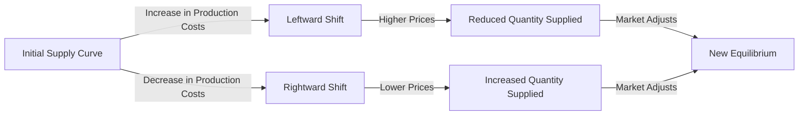

---

title: Shift_In_Supply_Curve
type: Atomic Note
course: Economics
semester: Winter 2026
unit: '2'
hub: '[[2_Theory_Of_Demand_And_Supply_Hub]]'
source: '[[5-Pdf Store/note generated/Winter 2026/Economics/Chapter_2.pdf]]'
source_pages:
- 46
- 47
mode: ECON-MACRO
read: false
generated: true
prerequisites:
- '[[Ceteris_Paribus]]'
- '[[Change_In_Technology]]'

---


# 1. Mental Model

Imagine you run a lemonade stand. The number of cups of lemonade you can make depends on how much sugar and lemons you have. If you get more sugar and lemons, you can make more lemonade. This is like a **supply curve** that shifts to the right, meaning you can sell more lemonade at each price. If a storm destroys your lemons, you can make less lemonade, and your supply curve shifts to the left.

# 2. Economic Theory

A [[Shift_In_Supply_Curve]] occurs when the quantity supplied of a good or service changes at each price level, causing the supply curve to shift either to the right (increase in supply) or to the left (decrease in supply). This happens due to changes in [[Ceteris_Paribus]] conditions such as [[Change_In_Technology]], production costs, prices of related goods, expectations, and the number of suppliers. The underlying mechanism is that a change in any of these factors alters the production decisions of firms, leading to a change in the quantity supplied at each price level. For instance, an improvement in [[Change_In_Technology]] can increase productivity, allowing firms to produce more at a lower cost, which shifts the supply curve to the right. The supply function can be represented as $Q_s = f(P, T, C, E, N)$, where $Q_s$ is the quantity supplied, $P$ is the price of the good, $T$ is [[Change_In_Technology]], $C$ is production costs, $E$ is expectations, and $N$ is the number of suppliers.

# 3. Market Failures

The concept of a [[Shift_In_Supply_Curve]] has limitations, particularly when dealing with [[Market_Equilibrium]] disruptions. For example, if there's an unexpected [[Shift_In_Supply_Curve]] to the left due to a natural disaster, it can lead to a [[Surplus_And_Shortage]] situation, causing prices to rise. However, if consumers' expectations are not aligned with the new supply conditions, it can lead to inefficiencies in the market. Additionally, the assumption of [[Ceteris_Paribus]] may not hold in reality, as changes in one factor may be accompanied by changes in others, affecting the supply curve's position. Furthermore, the concept assumes that firms have perfect knowledge of market conditions, which is rarely the case. The [[Effects_Of_Shift_In_Demand_And_Supply]] analysis can help mitigate these limitations by considering the interactions between demand and supply curves.

# 4. Economic Model



This Mermaid flowchart illustrates how changes in production costs can shift the supply curve. An increase in production costs shifts the supply curve to the left, indicating a reduced quantity supplied at each price level. Conversely, a decrease in production costs shifts the supply curve to the right, indicating an increased quantity supplied at each price level.

## 5. Walkthrough

Here's a 5-step technical walkthrough of how a shift in the supply curve operates in Industrial Manufacturing & Robotics:

1. **Initial State**: Suppose a manufacturing firm produces 100 units of a product at a cost of $10 per unit and sells it at $15 per unit. The initial supply curve is represented by the equation Qs = 100 + 5P, where Qs is the quantity supplied and P is the price.

2. **Change in Production Costs**: Due to an increase in raw material costs, the firm's production cost increases to $12 per unit. This change alters the firm's production decisions.

3. **Leftward Shift**: The increased production cost reduces the firm's profit margin, leading to a decrease in the quantity supplied at each price level. The new supply curve shifts to the left, represented by Qs = 80 + 5P.

4. **Intermediate State**: At the original price of $15, the firm now supplies 80 units (Qs = 80 + 5*15) instead of 100 units. This reduction in quantity supplied leads to a shortage in the market.

5. **New Equilibrium**: As the market adjusts to the new supply curve, the price increases to $16. With the new supply curve Qs = 80 + 5P, the firm supplies 80 + 5*16 = 120 units, but at a higher price. The market reaches a new equilibrium, where the quantity supplied equals the quantity demanded at the higher price.

---

## 6. The Proving Grounds

```interactive-quiz
[
  {
    "id": "q1",
    "type": "mcq",
    "difficulty": "L1",
    "question": "Error generating question.",
    "answer": "N/A"
  },
  {
    "id": "q2",
    "type": "true_false",
    "difficulty": "L1",
    "question": "Error generating question.",
    "answer": "N/A"
  },
  {
    "id": "q3",
    "type": "synthesis",
    "difficulty": "L1",
    "question": "Error generating question.",
    "answer": "N/A"
  },
  {
    "id": "q4",
    "type": "trace",
    "difficulty": "L1",
    "question": "Error generating question.",
    "answer": "N/A"
  },
  {
    "id": "q5",
    "type": "order",
    "difficulty": "L1",
    "question": "Error generating question.",
    "answer": "N/A"
  }
]
```