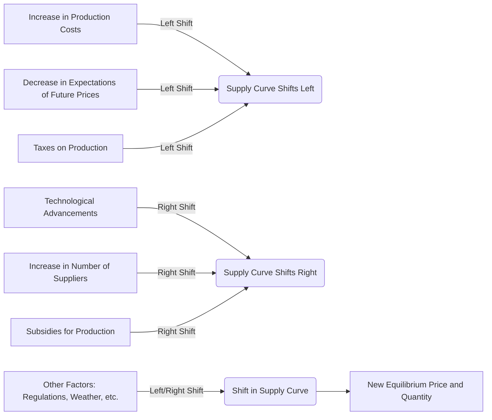

---

title: Shift_In_Supply_Curve
course: Economics
unit: '2'
semester: Winter 2026
mode: ECON-MICRO
type: atomic_note
hub: '[[2_Theory_Of_Demand_And_Supply_Hub]]'
source: '[[5-Pdf Store/note generated/Winter 2026/Economics/Chapter_2.pdf]]'
date: '2026-05-08'
prerequisites:
- '[[Ceteris_Paribus]]'
- '[[Change_In_Technology]]'
- '[[Theory_Of_Demand]]'
- '[[Change_In_Demand]]'
- '[[Market_Equilibrium]]'
source_pages:
- 46
- 47
generated: true

---


## 1. Mental Model

Imagine you have a lemonade stand, and you're making lemonade to sell to people walking by. One day, your friend gives you a super cool, really fast lemonade-making machine that helps you make a lot more lemonade in just a few minutes. Before, you could only make 10 cups of lemonade in an hour, but now you can make 20 cups in the same time! This means you can sell more lemonade at the same price, or even sell it for a little cheaper. This is like a "shift to the right" in the supply curve - you're now willing to sell more lemonade at every price. But, if one day, a big storm comes and knocks down your lemonade stand, and you have to spend money to fix it, you might not be able to make as much lemonade as before. This would be like a "shift to the left" in the supply curve - you're now willing to sell less lemonade at every price. So, when something makes it easier or cheaper to make something (like the lemonade machine), the supply curve shifts to the right, and when something makes it harder or more expensive (like the storm), it shifts to the left!

## 2. Micro Theory

The concept of a shift in the supply curve is a fundamental idea in microeconomics, which examines the behavior of firms and the markets in which they operate. A shift in the supply curve occurs when there is a change in the quantity of a good or service that producers are willing and able to supply at each price level, ceteris paribus [[Ceteris_Paribus]]. This change is typically represented by a movement of the entire supply curve to the left or right.

The supply curve, in its basic form, represents the relationship between the price of a good and the quantity supplied by producers. This relationship is often described by the supply function, which can be influenced by various factors including production costs, technology, and expectations about future market conditions. A shift in the supply curve implies that at any given price, producers are now willing to supply a different quantity of the good than they were before.

There are several key factors that can cause a shift in the supply curve. A change in technology [[Change_In_Technology]] that makes production more efficient can lead to a decrease in production costs, thereby increasing the quantity supplied at each price level and causing the supply curve to shift to the right. Conversely, an increase in production costs, perhaps due to higher wages or raw material prices, can reduce the quantity supplied at each price level, shifting the supply curve to the left.

Expectations about future prices can also influence supply. If producers expect the price of their good to rise in the future, they may choose to supply less now and hold their product in inventory, shifting the current supply curve to the left. Similarly, if producers expect prices to fall, they may increase supply now, shifting the curve to the right.

The number of suppliers in a market can also cause a shift in the supply curve. An increase in the number of suppliers, perhaps due to new firms entering the market, can increase the total quantity supplied at each price level, shifting the supply curve to the right. A decrease in the number of suppliers, due to firms exiting the market, can shift the supply curve to the left.

Government policies, including taxes, subsidies, and regulations, can also affect the supply curve. A tax on production can increase costs and shift the supply curve to the left, while a subsidy can decrease costs and shift the curve to the right.

The concept of a shift in the supply curve is closely related to the [[Theory_Of_Demand]], particularly how changes in supply, in conjunction with changes in demand [[Change_In_Demand]], affect market equilibrium [[Market_Equilibrium]]. When the supply curve shifts, it can lead to a new equilibrium price and quantity in the market. For instance, if demand remains constant but the supply curve shifts to the right, the equilibrium price will fall, and the equilibrium quantity will rise.

Understanding shifts in the supply curve is essential for analyzing the impacts of various economic events and policy changes on markets. It helps in predicting how changes in external factors can influence market outcomes, such as prices and quantities traded. This analysis is critical for both businesses, which need to adapt their production and pricing strategies, and policymakers, who must consider the effects of their decisions on market equilibrium and the welfare of consumers and producers.

The elasticity of supply [[Elasticity_Of_Supply]], which measures how responsive the quantity supplied is to changes in the price or other influential factors, can also be affected by the factors causing shifts in the supply curve. For example, if a technological advancement makes production more flexible, the supply may become more elastic, meaning suppliers can adjust their quantity supplied more easily in response to price changes.

In conclusion, a shift in the supply curve is a critical concept in microeconomics that reflects changes in the quantity supplied of a good at each price level, due to factors such as changes in technology, production costs, expectations, and the number of suppliers. Understanding these shifts and their causes is essential for analyzing market behavior and the effects of economic and policy changes on market equilibrium and the distribution of resources.

## 3. Limitations & Edge Cases

The concept of a shift in the supply curve assumes that changes in supply are caused by factors other than price, such as changes in production costs, technology, or expectations, which can be limiting as it doesn't account for situations where price itself influences supply, like with supply curves that are not infinitely elastic. Moreover, in the real world, supply decisions can be impacted by factors like government interventions, seasonality, and external shocks, which may not always result in a simple parallel shift of the supply curve. Additionally, the assumption of a ceteris paribus condition can be problematic, as changes in one variable may be accompanied by changes in others, making it challenging to isolate the effect of a single factor on the supply curve. Furthermore, the concept also assumes that firms have perfect knowledge and can adjust production instantaneously, which is rarely the case, and that supply responses are symmetrical, which may not hold true in situations where firms face capacity constraints or irreversibility of investment decisions.

## 4. Market Graph

## Shift In Supply Curve



A shift in the supply curve occurs due to various factors such as changes in production costs, technology, expectations, and number of suppliers, leading to an increase or decrease in the quantity supplied at each price level. This shift can result in a new equilibrium price and quantity in the market, influencing the overall market outcome.

## 5. Walkthrough

## Step 1: Identify Initial Supply Curve

The initial supply curve represents the relationship between the price of a good and the quantity supplied before any change occurs. For example, if at a price of $5, producers are willing to supply 100 units of a good.

## Step 2: Determine the Cause of the Shift

According to the source text, causes for shifts in the supply curve include changes in production costs, technology, and expectations about future market conditions. For instance, an improvement in technology can decrease production costs.

## 3: Analyze the Direction of the Shift

If an improvement in technology decreases production costs, producers are willing to supply more of the good at each price level. This change causes the entire supply curve to shift to the right. Conversely, if production costs increase, the supply curve shifts to the left.

## 4: Calculate the New Quantity Supplied

Assuming the improvement in technology causes the supply curve to shift to the right and at the price of $5, producers are now willing to supply 150 units (an increase from 100 units).

## 5: Graphical Representation

On a graph, the original supply curve (S1) intersects the price axis at $5 and the quantity axis at 100 units. After the shift, the new supply curve (S2) intersects the same price axis at $5 but at a quantity of 150 units, illustrating the rightward shift of the supply curve.

---

## Review & Practice

```interactive-quiz

[
  {
    "type": "mcq",
    "difficulty": "L1",
    "question": "What is the primary effect on the supply curve when there is an improvement in production technology that reduces costs?",
    "options": {
      "A": "The supply curve shifts to the left and becomes more elastic",
      "B": "The supply curve shifts to the right",
      "C": "The supply curve shifts to the left",
      "D": "The supply curve remains unchanged"
    },
    "answer": "B",
    "explanation": "An improvement in production technology that reduces costs leads to an increase in the quantity supplied at each price level. This is because firms can now produce more efficiently and at a lower cost, making it profitable to supply more at any given price. As a result, the supply curve shifts to the right, indicating that at any given price, producers are now willing to supply a greater quantity of the good. This can be represented as $Q_s = f(P, Tech)$, where an improvement in $Tech$ increases $Q_s$ for any given $P$, thus shifting the supply curve to the right."
  },
  {
    "type": "fill_in",
    "difficulty": "L2",
    "question": "Fill in the blank.",
    "textWithBlanks": "The Blank curve represents the relationship between the price of a good and the quantity supplied by producers, and a shift in this curve occurs when there is a change in the quantity of a good or service that producers are willing and able to supply at each price level.",
    "answer": [
      "supply"
    ],
    "explanation": "The supply curve is a graphical representation of the relationship between the price of a good and the quantity supplied by producers. It is typically upward sloping, indicating that as the price of the good increases, producers are willing to supply more of it. A shift in the supply curve occurs when there is a change in the quantity of a good or service that producers are willing and able to supply at each price level, ceteris paribus. This can be caused by various factors such as changes in production costs, technology, expectations about future market conditions, and government policies. Mathematically, this can be represented as $Q_s = f(P, C, T, E)$, where $Q_s$ is the quantity supplied, $P$ is the price of the good, $C$ is the production cost, $T$ is the technology level, and $E$ is the expectations about future market conditions. A shift in the supply curve can be represented as $\\Delta Q_s = \frac{\\partial Q_s}{\\partial C} \\Delta C + \frac{\\partial Q_s}{\\partial T} \\Delta T + \frac{\\partial Q_s}{\\partial E} \\Delta E$."
  },
  {
    "type": "debug",
    "difficulty": "L2",
    "question": "Find the bug in the following supply function: $Q_s = 100 + 2P - 3T + 5W$, where $Q_s$ is the quantity supplied, $P$ is the price of the good, $T$ is the technology index, and $W$ is the wage rate.",
    "content": "The supply function $Q_s = 100 + 2P - 3T + 5W$ is given. Suppose the technology index $T$ increases by 1 unit and the wage rate $W$ decreases by 1 unit. What is the effect on the quantity supplied?",
    "answer": "The increase in technology index $T$ by 1 unit decreases the quantity supplied by 3 units, and the decrease in wage rate $W$ by 1 unit increases the quantity supplied by 5 units. However, the bug in the function is that the coefficient of $W$ should be negative, as an increase in wage rate increases production costs and decreases the quantity supplied.",
    "required_keywords": [
      "supply curve shift",
      "technology index",
      "wage rate"
    ],
    "explanation": "The correct supply function should be $Q_s = 100 + 2P - 3T - 5W$. The term $-5W$ represents the negative effect of an increase in wage rate on the quantity supplied. With the given function, a decrease in $W$ by 1 unit would incorrectly increase $Q_s$, when in fact, it should decrease $Q_s$ if $W$'s coefficient were negative. The corrected effect is that an increase in $T$ by 1 unit decreases $Q_s$ by 3 units and a decrease in $W$ by 1 unit decreases $Q_s$ by 5 units, assuming the corrected function $Q_s = 100 + 2P - 3T - 5W$."
  },
  {
    "type": "trace",
    "difficulty": "L2",
    "question": "What is the exact output on the supply curve when a technological innovation reduces production costs by 15%, assuming an initial supply function Qs = 100 + 10P and a demand function Qd = 200 - 5P?",
    "content": "The initial supply function is Qs = 100 + 10P. A 15% reduction in production costs can be represented as a change in the supply function to Qs' = 115 + 10P, assuming the cost reduction directly translates to an increase in the quantity supplied at each price level. To find the new equilibrium, we set Qs' = Qd: 115 + 10P = 200 - 5P.",
    "answer": "P = 5, Q = 150",
    "explanation": "The mechanism behind a shift in the supply curve due to technological innovation can be understood through the lens of microeconomic theory. The supply function Qs = 100 + 10P represents the relationship between the price of a good and the quantity supplied before the innovation. A technological innovation that reduces production costs by 15% effectively increases the quantity supplied at each price level. This can be represented by adjusting the supply function to Qs' = 115 + 10P, assuming the reduction in costs directly translates to an increase in supply.\n\nLaTeX representation of the supply and demand equilibrium:\n\n$$ Qs' = Qd $$\n\n$$ 115 + 10P = 200 - 5P $$\n\nSolving for $P$:\n\n$$ 15P = 85 $$\n\n$$ P = \\frac{85}{15} $$\n\n$$ P \\approx 5.67 $$\n\nThe equilibrium quantity $Q$ can then be found by substituting $P$ back into either the supply or demand equation."
  }
]

```