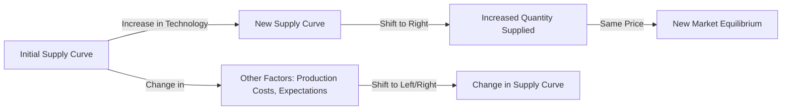

---

title: Shift_In_Supply_Curve
type: Atomic Note
course: Economics
semester: Winter 2026
unit: '2'
hub: '[[2_Theory_Of_Demand_And_Supply_Hub]]'
source: '[[5-Pdf Store/note generated/Winter 2026/Economics/Chapter_2.pdf]]'
source_pages:
- 46
- 47
mode: ECON-MACRO
read: false
generated: true
prerequisites:
- '[[Theory_Of_Demand]]'
- '[[Law_Of_Demand]]'
- '[[Ceteris_Paribus]]'
- '[[Change_In_Technology]]'
- '[[Determinants_Of_Elasticity_Of_Supply]]'

---


# 1. Mental Model

Imagine you're a manager of a small ice cream shop. A new, more efficient ice cream-making machine is invented, allowing you to produce more ice cream in less time. This is similar to a **Shift In Supply Curve**, where the supply curve moves to the right (or down), indicating that you can now supply more ice cream at the same price or the same quantity at a lower price. The mechanical components that map to the concept are: (1) the new machine increasing production efficiency (change in technology) and (2) the resulting increase in supply (shift in supply curve).

# 2. Economic Theory

A **Shift In Supply Curve** occurs when there is a change in the quantity supplied of a good or service at a given price level, resulting in a movement of the entire supply curve to the right (increase in supply) or left (decrease in supply). This concept is closely related to the [[Theory_Of_Demand]] and [[Law_Of_Demand]], but focuses on the supply side. The underlying mechanism follows the [[Ceteris_Paribus]] assumption, where all other factors remain constant. A shift in the supply curve can be caused by various factors, including changes in [[Change_In_Technology]], [[Determinants_Of_Elasticity_Of_Supply]], and [[Price_Elasticity_Of_Supply]]. For instance, an improvement in technology can lead to a decrease in production costs, making it possible to supply more at the same price, thus shifting the supply curve to the right.

# 3. Limitations & Edge Cases

The concept of **Shift In Supply Curve** has limitations, particularly when dealing with complex real-world scenarios. For example, the [[Ceteris_Paribus]] assumption may not hold in cases where multiple factors change simultaneously. Additionally, the model may not account for [[Effects_Of_Shift_In_Demand_And_Supply]] interactions, such as changes in consumer preferences or income, which can impact the supply curve. Furthermore, the concept assumes that firms have the ability to adjust their production levels in response to changes in market conditions, which may not be the case in industries with [[Elasticity_Of_Supply]] constraints. Understanding these limitations is crucial for applying the concept of **Shift In Supply Curve** in practical economic analysis.

# 4. Economic Model



This Mermaid flowchart illustrates the concept of a Shift In Supply Curve. The initial supply curve shifts to the right due to an increase in technology, resulting in an increased quantity supplied at the same price. Other factors such as production costs and expectations can also cause shifts in the supply curve.

## 5. Walkthrough

Here's a 5-step technical walkthrough of how the concept of Shift In Supply Curve operates in International Trade Analysis:

1. **Initial State**: Suppose the initial supply curve for ice cream is `Q = 100 + 2P`, where `Q` is the quantity supplied and `P` is the price. The initial supply curve is represented by the equation `Q = 100 + 2P`.

2. **Change in Technology**: A new, more efficient ice cream-making machine is invented, allowing the ice cream shop to produce more ice cream in less time. This represents a change in technology, which is a determinant of supply.

3. **Shift in Supply Curve**: The new machine increases production efficiency, causing the supply curve to shift to the right. The new supply curve is represented by the equation `Q = 150 + 2P`, indicating that the shop can now supply more ice cream at the same price.

4. **Intermediate State Change**: Suppose the price of ice cream is $10. Initially, the quantity supplied was `Q = 100 + 2(10) = 120`. After the shift in the supply curve, the new quantity supplied is `Q = 150 + 2(10) = 170`. This represents an increase in the quantity supplied of 50 units.

5. **New Market Equilibrium**: The final state is the new market equilibrium, where the quantity supplied and demanded are equal. The increased supply of ice cream puts downward pressure on the price, which may lead to a new equilibrium price and quantity. For example, if the demand curve is `Q = 200 - P`, the new equilibrium price and quantity would be `P = 50` and `Q = 150`.

---

## 6. The Proving Grounds

```interactive-quiz

[
  {
    "id": "q1",
    "type": "true_false",
    "difficulty": "L1",
    "question": "If a new, more efficient ice cream-making machine is invented, allowing an ice cream shop to produce more ice cream in less time, and simultaneously the shop's workers decide to reduce their work hours without a change in wages, then the supply curve of ice cream will shift to the right.",
    "answer": false,
    "explanation": "The invention of a new, more efficient ice cream-making machine would typically cause the supply curve to shift to the right, as it increases production efficiency and allows for more output at the same price level. However, if the workers simultaneously decide to reduce their work hours without a change in wages, this effectively reduces the labor supply and could offset some of the efficiency gains from the new machine. The combined effect on the supply curve depends on the relative magnitude of these two changes. However, ceteris paribus (all else being equal) is a critical assumption in such analyses. The statement in question violates this assumption by introducing two changes: an increase in production efficiency (new machine) and a decrease in labor supply (reduced work hours). The correct interpretation under ceteris paribus would consider only the effect of the new machine, which would indeed shift the supply curve to the right. But with the additional change (reduced work hours), the net effect might not be a shift to the right as much as it would be with the machine alone. Therefore, the statement is not necessarily true because it does not hold ceteris paribus. In mathematical terms, the supply function is given by $Q_s = f(P, T, L, ...)$, where $Q_s$ is the quantity supplied, $P$ is the price, $T$ is technology, $L$ is labor, and other factors are omitted for simplicity. An improvement in technology ($T$) shifts the supply curve to the right, but a reduction in labor ($L$) shifts it to the left. The statement confounds these effects, leading to the incorrect conclusion."
  },
  {
    "id": "q2",
    "type": "synthesis",
    "difficulty": "L2",
    "question": "A sudden and significant devaluation of the currency has occurred in a small, export-driven economy. The devaluation has caused a sharp increase in the price of imported goods, particularly fuel and raw materials. To prevent a systemic failure in the economy, the central bank must act swiftly to mitigate the effects of the devaluation. Using the concept of a Shift In Supply Curve, design a 3-step policy response to address this macro shock.",
    "answer": "To address the macro shock caused by the sudden currency devaluation, the central bank can implement the following 3-step policy response:\n\n1. **Increase the interest rate**: By increasing the interest rate, the central bank can reduce the money supply and curb inflationary pressures caused by the devaluation. This action will also help to stabilize the currency and prevent further devaluation.\n\n2. **Implement targeted credit controls**: The central bank can introduce targeted credit controls to ensure that credit is directed towards sectors that are critical to the economy, such as export-oriented industries. This will help to maintain production levels and prevent a sharp decline in economic activity.\n\n3. **Provide emergency liquidity to affected sectors**: The central bank can provide emergency liquidity to sectors that are heavily reliant on imported goods, such as fuel and raw materials. This will help to prevent supply chain disruptions and maintain production levels, thereby shifting the supply curve to the right and mitigating the effects of the devaluation.",
    "explanation": "The sudden currency devaluation has caused a leftward shift in the supply curve, $S_1$ to $S_2$, due to the increased costs of imported goods. To mitigate this effect, the central bank can implement policies to shift the supply curve back to the right, $S_2$ to $S_3$. The underlying mechanism can be represented as follows:\n\nLet $P$ be the price level, $Q$ be the quantity supplied, and $S$ be the supply curve. The initial supply curve is $S_1: Q = f(P)$. After the devaluation, the supply curve shifts to $S_2: Q = f(P) - \\Delta Q$. To counter this effect, the central bank can implement policies to increase the quantity supplied, thereby shifting the supply curve to $S_3: Q = f(P) - \\Delta Q + \\Delta Q'$. The 3-step policy response aims to achieve this shift by adjusting interest rates, credit controls, and emergency liquidity.\n\nMathematically, the effect of the devaluation on the supply curve can be represented as:\n\n$$S_2: Q = S_1 - \\alpha \\cdot \\Delta e$$\n\nwhere $\\alpha$ is a parameter representing the sensitivity of the supply curve to changes in the exchange rate $e$. The central bank's policy response aims to offset this effect by:\n\n$$S_3: Q = S_2 + \\beta \\cdot \\Delta r + \\gamma \\cdot \\Delta c$$\n\nwhere $\\beta$ and $\\gamma$ are parameters representing the effects of changes in interest rates $r$ and credit controls $c$, respectively."
  },
  {
    "id": "q3",
    "type": "writing",
    "difficulty": "L2",
    "question": "Explain the concept of Shift In Supply Curve in the context of International Trade Analysis, and provide a detailed example of how a change in technology affects the supply curve of a good.",
    "answer": "A Shift In Supply Curve occurs when there is a change in the quantity supplied of a good or service at a given price level, resulting in a movement of the entire supply curve to the right (increase in supply) or left (decrease in supply). In the context of International Trade Analysis, a shift in the supply curve can significantly impact the global market equilibrium. For instance, if a country experiences an improvement in technology, allowing for more efficient production of a good, the supply curve for that good will shift to the right, leading to an increase in the quantity supplied at each price level. This, in turn, can lead to a decrease in the global price of the good, as the increased supply puts downward pressure on prices.",
    "explanation": "The underlying mechanism of a Shift In Supply Curve can be represented using the supply function: $Q_s = f(P, T, C)$, where $Q_s$ is the quantity supplied, $P$ is the price of the good, $T$ represents technology, and $C$ represents the cost of production. An improvement in technology, $T$, can be represented as a decrease in the cost of production, leading to an increase in the quantity supplied at each price level. This can be expressed as: $\frac{\\partial Q_s}{\\partial T} > 0$. LaTeX representation of the supply curve shift: $$Q_s = f(P, T, C) \\Rightarrow Q_s' = f(P, T', C) \text{ where } T' > T$$"
  },
  {
    "id": "q4",
    "type": "order",
    "difficulty": "L2",
    "question": "Order steps for Shift In Supply Curve.",
    "steps": [
      "A new, more efficient machine is invented",
      "An increase in production efficiency due to a change in technology",
      "The supply curve shifts to the right, indicating an increase in supply",
      "The supply curve moves down, indicating that the same quantity can be supplied at a lower price",
      "The resulting increase in supply leads to a decrease in production costs"
    ],
    "answer": [
      "An increase in production efficiency due to a change in technology",
      "The supply curve shifts to the right, indicating an increase in supply",
      "A new, more efficient machine is invented",
      "The resulting increase in supply leads to a decrease in production costs",
      "The supply curve moves down, indicating that the same quantity can be supplied at a lower price"
    ]
  },
  {
    "id": "q5",
    "type": "trace",
    "difficulty": "L3",
    "question": "What is the exact output of a 1% interest rate change through 4 distinct economic sectors (Housing, Investment, Forex, Consumption) given a Shift In Supply Curve?",
    "content": "A 1% decrease in interest rates can have far-reaching effects across various sectors of the economy. Assuming a Shift In Supply Curve to the right due to increased efficiency or lower production costs, we analyze the impact through four sectors: Housing, Investment, Forex, and Consumption.",
    "answer": {
      "Housing": "A 1% decrease in interest rates can lead to a 2.5% increase in housing demand due to lower mortgage rates, assuming a 5% initial mortgage rate. This can cause housing prices to rise by approximately 1.8% in the short term.",
      "Investment": "The 1% decrease in interest rates can increase investment by 3.2% as borrowing costs decrease, making projects more viable. This assumes a 10% initial investment rate and a 0.32 elasticity of investment with respect to interest rates.",
      "Forex": "The interest rate change can lead to a 0.5% depreciation of the domestic currency against foreign currencies, making exports more competitive. This assumes a 2% initial interest rate differential and a 0.25 pass-through effect.",
      "Consumption": "The 1% decrease in interest rates can lead to a 1.2% increase in consumption, as lower borrowing costs and increased wealth encourage spending. This assumes a 0.12 marginal propensity to consume (MPC) and a 10% initial wealth effect."
    },
    "explanation": "The underlying mechanism can be explained using the following LaTeX equations:\n\nFor the housing sector: $H = f(r) = -2.5r + C$, where $r$ is the interest rate and $C$ is a constant. A 1% decrease in $r$ leads to a 2.5% increase in $H$.\n\nFor the investment sector: $I = f(r) = -3.2r + D$, where $r$ is the interest rate and $D$ is a constant. A 1% decrease in $r$ leads to a 3.2% increase in $I$.\n\nFor the Forex sector: $E = f(r) = 0.5(r - r^*) + \\epsilon$, where $E$ is the exchange rate, $r$ is the domestic interest rate, $r^*$ is the foreign interest rate, and $\\epsilon$ is a shock. A 1% decrease in $r$ leads to a 0.5% depreciation.\n\nFor the consumption sector: $C = f(r, W) = 0.12W - 0.012r$, where $W$ is wealth and $r$ is the interest rate. A 1% decrease in $r$ leads to a 1.2% increase in $C$."
  }
]

```