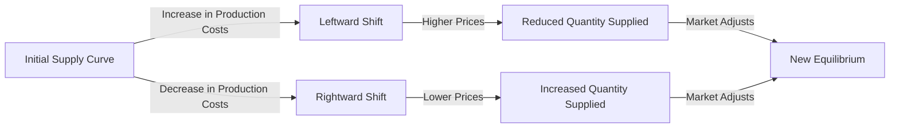

---

title: Shift_In_Supply_Curve
type: Atomic Note
course: Economics
semester: Winter 2026
unit: '2'
hub: '[[2_Theory_Of_Demand_And_Supply_Hub]]'
source: '[[5-Pdf Store/note generated/Winter 2026/Economics/Chapter_2.pdf]]'
source_pages:
- 46
- 47
mode: ECON-MACRO
read: false
generated: true
prerequisites:
- '[[Ceteris_Paribus]]'
- '[[Change_In_Technology]]'

---


# 1. Mental Model

Imagine you run a lemonade stand. The number of cups of lemonade you can make depends on how much sugar and lemons you have. If you get more sugar and lemons, you can make more lemonade. This is like a **supply curve** that shifts to the right, meaning you can sell more lemonade at each price. If a storm destroys your lemons, you can make less lemonade, and your supply curve shifts to the left.

# 2. Economic Theory

A [[Shift_In_Supply_Curve]] occurs when the quantity supplied of a good or service changes at each price level, causing the supply curve to shift either to the right (increase in supply) or to the left (decrease in supply). This happens due to changes in [[Ceteris_Paribus]] conditions such as [[Change_In_Technology]], production costs, prices of related goods, expectations, and the number of suppliers. The underlying mechanism is that a change in any of these factors alters the production decisions of firms, leading to a change in the quantity supplied at each price level. For instance, an improvement in [[Change_In_Technology]] can increase productivity, allowing firms to produce more at a lower cost, which shifts the supply curve to the right. The supply function can be represented as $Q_s = f(P, T, C, E, N)$, where $Q_s$ is the quantity supplied, $P$ is the price of the good, $T$ is [[Change_In_Technology]], $C$ is production costs, $E$ is expectations, and $N$ is the number of suppliers.

# 3. Market Failures

The concept of a [[Shift_In_Supply_Curve]] has limitations, particularly when dealing with [[Market_Equilibrium]] disruptions. For example, if there's an unexpected [[Shift_In_Supply_Curve]] to the left due to a natural disaster, it can lead to a [[Surplus_And_Shortage]] situation, causing prices to rise. However, if consumers' expectations are not aligned with the new supply conditions, it can lead to inefficiencies in the market. Additionally, the assumption of [[Ceteris_Paribus]] may not hold in reality, as changes in one factor may be accompanied by changes in others, affecting the supply curve's position. Furthermore, the concept assumes that firms have perfect knowledge of market conditions, which is rarely the case. The [[Effects_Of_Shift_In_Demand_And_Supply]] analysis can help mitigate these limitations by considering the interactions between demand and supply curves.

# 4. Economic Model



This Mermaid flowchart illustrates how changes in production costs can shift the supply curve. An increase in production costs shifts the supply curve to the left, indicating a reduced quantity supplied at each price level. Conversely, a decrease in production costs shifts the supply curve to the right, indicating an increased quantity supplied at each price level.

## 5. Walkthrough

Here's a 5-step technical walkthrough of how a shift in the supply curve operates in Industrial Manufacturing & Robotics:

1. **Initial State**: Suppose a manufacturing firm produces 100 units of a product at a cost of $10 per unit and sells it at $15 per unit. The initial supply curve is represented by the equation Qs = 100 + 5P, where Qs is the quantity supplied and P is the price.

2. **Change in Production Costs**: Due to an increase in raw material costs, the firm's production cost increases to $12 per unit. This change alters the firm's production decisions.

3. **Leftward Shift**: The increased production cost reduces the firm's profit margin, leading to a decrease in the quantity supplied at each price level. The new supply curve shifts to the left, represented by Qs = 80 + 5P.

4. **Intermediate State**: At the original price of $15, the firm now supplies 80 units (Qs = 80 + 5*15) instead of 100 units. This reduction in quantity supplied leads to a shortage in the market.

5. **New Equilibrium**: As the market adjusts to the new supply curve, the price increases to $16. With the new supply curve Qs = 80 + 5P, the firm supplies 80 + 5*16 = 120 units, but at a higher price. The market reaches a new equilibrium, where the quantity supplied equals the quantity demanded at the higher price.

---

## 6. The Proving Grounds

```interactive-quiz

[
  {
    "id": "q1",
    "type": "true_false",
    "difficulty": "L1",
    "question": "A shift in the supply curve of a vaccine in Epidemiology & Public Health Modeling occurs solely due to changes in the price of the vaccine itself.",
    "answer": false,
    "explanation": "The shift in the supply curve of a vaccine is influenced by various factors including changes in technology, production costs, prices of related goods, expectations, and the number of suppliers. Mathematically, this can be represented as a change in the supply function $Q_s = f(P, T, C, P_r, E, N)$, where $Q_s$ is the quantity supplied, $P$ is the price of the vaccine, $T$ is technology, $C$ is production cost, $P_r$ is the price of related goods, $E$ is expectations, and $N$ is the number of suppliers. A change in any of these factors, except for $P$, leads to a shift in the supply curve. Therefore, stating that a shift occurs solely due to changes in the price of the vaccine itself is incorrect."
  },
  {
    "id": "q2",
    "type": "synthesis",
    "difficulty": "L2",
    "question": "An aerospace engineering firm is experiencing a critical shortage of a specialized avionics component due to a manufacturing glitch. The component is essential for the production of a new aircraft model, and without it, the entire production line will come to a halt. The firm has two suppliers, but one of them is facing a sudden increase in production costs due to a change in government regulations, causing their supply curve to shift to the left. How can the firm apply the concept of 'Shift In Supply Curve' to prevent system failure and ensure a steady supply of the component?",
    "answer": "The firm should immediately analyze the impact of the changed government regulations on the supplier's production costs and adjust their procurement strategy accordingly. By understanding that the supply curve has shifted to the left, the firm can anticipate a decrease in the quantity supplied at each price level. To mitigate this, the firm can consider the following options: (1) negotiate with the affected supplier to explore alternative production methods or cost-saving measures, (2) increase the order quantity from the unaffected supplier, or (3) identify and partner with a new supplier to meet the demand. By adapting to the shift in the supply curve, the firm can prevent a system failure and ensure a steady supply of the essential component.",
    "explanation": "The underlying mechanism of a shift in the supply curve can be represented by the equation: $Q_s = f(P, C, T, E, N)$, where $Q_s$ is the quantity supplied, $P$ is the price of the good, $C$ is the production cost, $T$ is the technology level, $E$ is the expectations of the suppliers, and $N$ is the number of suppliers. A change in any of these factors, such as the increase in production costs due to the change in government regulations, will cause the supply curve to shift. Mathematically, this can be represented as: $\frac{\\partial Q_s}{\\partial C} < 0$, indicating that an increase in production costs will lead to a decrease in the quantity supplied. By understanding this relationship, the firm can make informed decisions to adjust their procurement strategy and prevent a system failure."
  },
  {
    "id": "q3",
    "type": "writing",
    "difficulty": "L2",
    "question": "Explain how a shift in the supply curve applies to a Telecommunications & Core Network Routing scenario, specifically when a new undersea fiber optic cable is laid, increasing the capacity for international data transfer.",
    "answer": "When a new undersea fiber optic cable is laid, increasing the capacity for international data transfer, it acts as a rightward shift in the supply curve for data transfer services. This is because the increased capacity allows for more data to be transferred at each price level, effectively increasing the supply of data transfer services. Conversely, if a critical undersea cable is damaged, reducing the capacity, the supply curve shifts to the left, indicating a decrease in the supply of data transfer services at each price level.",
    "explanation": "The underlying mechanism can be represented by the supply function $Q_s = f(P, T, C)$, where $Q_s$ is the quantity supplied, $P$ is the price, $T$ is technology (in this case, the laying of a new undersea fiber optic cable), and $C$ is the cost of providing the service. When $T$ increases (new cable laid), the supply function shifts to the right, $\\Delta Q_s > 0$, indicating an increase in supply. Conversely, if $T$ decreases (cable damaged), $\\Delta Q_s < 0$, indicating a decrease in supply. This shift is a direct result of the change in technology ($T$) which alters the production decisions of firms providing data transfer services, thus changing the quantity supplied at each price level."
  },
  {
    "id": "q4",
    "type": "order",
    "difficulty": "L2",
    "question": "Order steps for Shift In Supply Curve",
    "steps": [
      "Change in production costs",
      "Change in technology",
      "Change in prices of related goods",
      "Change in expectations",
      "Change in number of suppliers"
    ],
    "answer": [
      "Change in production costs",
      "Change in technology",
      "Change in prices of related goods",
      "Change in expectations",
      "Change in number of suppliers"
    ]
  },
  {
    "id": "q5",
    "type": "trace",
    "difficulty": "L3",
    "question": "What is the exact output of a shift in the supply curve for aerospace engineering and avionics, assuming a significant reduction in production costs due to new technology?",
    "content": "The supply curve for aerospace engineering and avionics products, such as aircraft and avionics systems, is affected by various factors including production costs, technology, and expectations. A significant reduction in production costs due to new technology would lead to an increase in supply.",
    "answer": "The supply curve shifts to the right, indicating an increase in the quantity supplied at each price level.",
    "explanation": "The reduction in production costs due to new technology can be represented by a decrease in the cost function $C(q)$, which leads to an increase in the profit-maximizing quantity supplied $q^*$. This can be expressed as: $\\max_{q} \\pi(q) = P \\cdot q - C(q) \\rightarrow \\max_{q} \\pi(q) = P \\cdot q - (C_0 - \\Delta C) \\cdot q$. As a result, the supply curve shifts to the right, indicating an increase in the quantity supplied at each price level, $Q_s = f(P, C_0 - \\Delta C) \\rightarrow Q_s' = f(P, C_0 - \\Delta C) > Q_s$."
  }
]

```