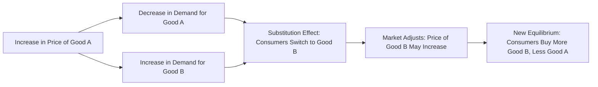

---

title: Substitute_Goods
type: Atomic Note
course: Economics
semester: Winter 2026
unit: '2'
hub: "[[2_Theory_Of_Demand_And_Supply_Hub]]"
source: "[[5-Pdf Store/note generated/Winter 2026/Economics/Chapter_2.pdf]]"
source_pages:
- 15
mode: ECON-MACRO
read: false
generated: true
prerequisites:
- "[[Determinants_Of_Demand]]"

---

# 1. Mental Model

Imagine you're at a school cafeteria and you want a sandwich. You have two options: a turkey sandwich or a ham sandwich. Both satisfy your hunger, but they're different. If the turkey sandwich is expensive, you might choose the ham sandwich instead. The ham sandwich is like a substitute for the turkey sandwich. In this analogy, the mechanical components are: (1) the desire for a sandwich (satisfying hunger) and (2) the choice between two options (turkey or ham sandwich) based on price. 

# 2. Economic Theory

[[Substitute_Goods]] are goods or services that can satisfy the same consumer desire or need, making them interchangeable in the eyes of the consumer. The underlying mechanism of [[Substitute_Goods]] is rooted in the [[Theory_Of_Demand]] and specifically influenced by the [[Cross_Price_Elasticity]] of demand, which measures how the demand for one good responds to a change in the price of another good. When the price of one good increases, the demand for its [[Substitute_Goods]] tends to increase, assuming [[Ceteris_Paribus]] (all other factors remain constant). This relationship is a key aspect of the [[Law_Of_Demand]], which states that, ceteris paribus, as the price of a good increases, the quantity demanded decreases. The [[Demand_Schedule]] and [[Demand_Curve]] for a good can shift due to changes in the price of [[Substitute_Goods]], illustrating the [[Market_Demand]] dynamics. 

# 3. Market Failures

The concept of [[Substitute_Goods]] can be limited by assuming perfect information and ignoring [[Market_Equilibrium]] disruptions. In reality, consumers may not always have perfect knowledge of all available substitutes, and [[Price_Elasticity_Of_Demand]] can vary significantly across different goods. Moreover, the presence of [[Substitute_Goods]] can lead to [[Surplus_And_Shortage]] situations if suppliers fail to adjust production in response to changes in demand. Additionally, external factors such as changes in consumer preferences or [[Change_In_Technology]] can affect the availability and desirability of substitutes, further complicating the analysis within the framework of [[Market_Demand_Curve]] and [[Effects_Of_Shift_In_Demand_And_Supply]].

# 4. Economic Model



This flowchart illustrates the relationship between substitute goods and how a change in the price of one good affects the demand for its substitute. The model assumes that consumers will substitute one good for another if the price of the original good increases.

## 5. Walkthrough

Here's a 5-step technical walkthrough of how the concept of substitute goods operates:

1. **Initial State**: Suppose the price of a turkey sandwich is $5, and the price of a ham sandwich is $4.50. Consumers buy 100 turkey sandwiches and 50 ham sandwiches per day.

2. **Price Increase**: The price of the turkey sandwich increases to $6. 

3. **Demand Response**: As a result, the demand for turkey sandwiches decreases to 70 (due to the law of demand), and the demand for ham sandwiches increases to 80, as consumers substitute the more expensive turkey sandwich with the ham sandwich.

4. **Market Adjustment**: As demand for ham sandwiches increases, their price may rise to $5, assuming suppliers respond to the increased demand.

5. **New Equilibrium**: In the new equilibrium, consumers buy 70 turkey sandwiches and 80 ham sandwiches per day. The increase in price of the turkey sandwich led to an increase in demand for the substitute good (ham sandwich), illustrating the substitution effect.

---

## 6. The Proving Grounds

```interactive-quiz

[
  {
    "id": "q1",
    "type": "true_false",
    "difficulty": "L1",
    "question": "A critical failure point of 'Substitute Goods' within Industrial Manufacturing & Robotics is that an increase in the price of one good will always lead to a decrease in demand for its substitute good.",
    "answer": false,
    "explanation": "The concept of substitute goods in industrial manufacturing and robotics relies heavily on the theory of demand and cross-price elasticity. The statement that an increase in the price of one good will always lead to a decrease in demand for its substitute good is not accurate. The actual relationship depends on the cross-price elasticity of demand, which can be positive (if the goods are substitutes) or negative (if the goods are complements). For substitutes, an increase in the price of one good can lead to an increase in demand for the other substitute good, not a decrease. This is represented by the equation: $E_{ij} = \\frac{\\% \\Delta Q_i}{\\% \\Delta P_j}$, where $E_{ij}$ is the cross-price elasticity of demand, $\\% \\Delta Q_i$ is the percentage change in quantity demanded of good $i$, and $\\% \\Delta P_j$ is the percentage change in price of good $j$. If $E_{ij} > 0$, the goods are substitutes."
  },
  {
    "id": "q2",
    "type": "synthesis",
    "difficulty": "L2",
    "question": "Error generating question.",
    "answer": "N/A"
  },
  {
    "id": "q3",
    "type": "writing",
    "difficulty": "L2",
    "question": "Explain how the concept of substitute goods applies to bioinformatics and genomic sequencing, particularly in the context of choosing between different software tools or methods for data analysis.",
    "answer": "In bioinformatics and genomic sequencing, substitute goods refer to different software tools or methods that can be used to achieve the same analytical goal, such as genome assembly or gene expression analysis. For instance, if one tool for genome assembly becomes too expensive or computationally intensive, researchers may opt for a substitute tool that offers similar performance at a lower cost or with greater efficiency. This substitutability is influenced by factors such as the cross-price elasticity of demand, where an increase in the 'price' (cost or complexity) of one tool leads to an increase in demand for its substitute.",
    "explanation": "The concept of substitute goods in bioinformatics and genomic sequencing can be understood through the lens of economic theory, particularly the theory of demand and cross-price elasticity. Let $Q_d$ be the demand for a particular bioinformatics tool, $P$ be its price, and $P_s$ be the price of a substitute tool. The demand for the tool can be represented as $Q_d = f(P, P_s)$. When the price of the substitute tool $P_s$ decreases, the demand for the original tool $Q_d$ decreases, illustrating a positive cross-price elasticity of demand, $\frac{\\partial Q_d}{\\partial P_s} > 0$. This relationship highlights the substitutability between different tools in bioinformatics and genomic sequencing, where researchers can switch between tools based on their relative costs and benefits."
  },
  {
    "id": "q4",
    "type": "order",
    "difficulty": "L2",
    "question": "Order steps for Substitute Goods causal chain.",
    "steps": [
      "Increase in Price of One Good",
      "Rise in Demand for Substitute Good",
      "Adjustment in Consumer Preferences",
      "Change in Market Equilibrium"
    ],
    "answer": [
      "Increase in Price of One Good",
      "Rise in Demand for Substitute Good",
      "Adjustment in Consumer Preferences",
      "Change in Market Equilibrium"
    ]
  },
  {
    "id": "q5",
    "type": "trace",
    "difficulty": "L3",
    "question": "What is the exact output for Substitute Goods in Aerospace Engineering & Avionics?",
    "content": "In Aerospace Engineering & Avionics, substitute goods refer to interchangeable components or systems that can satisfy the same functional requirements. For instance, in aircraft design, two different materials with similar properties (e.g., aluminum and carbon fiber) can serve as substitutes for each other in constructing aircraft structures.",
    "answer": "The demand for one material (e.g., aluminum) is influenced by the price of its substitute (e.g., carbon fiber). If the price of carbon fiber decreases, the demand for aluminum may decrease as manufacturers opt for the cheaper substitute. This relationship is described by the cross-price elasticity of demand, which is calculated as: $\\frac{\\% \\Delta Q_d}{\\% \\Delta P_s}$, where $Q_d$ is the quantity demanded of the original good (aluminum) and $P_s$ is the price of the substitute good (carbon fiber).",
    "explanation": "The underlying mechanism of substitute goods in Aerospace Engineering & Avionics can be explained using the theory of demand and cross-price elasticity. Let's denote the quantity demanded of aluminum as $Q_d = f(P_d, P_s, I)$, where $P_d$ is the price of aluminum, $P_s$ is the price of carbon fiber, and $I$ is the income of manufacturers. The cross-price elasticity of demand for aluminum with respect to the price of carbon fiber is given by: $\\epsilon_{Q_d, P_s} = \\frac{\\partial Q_d}{\\partial P_s} \\cdot \\frac{P_s}{Q_d}$. If $\\epsilon_{Q_d, P_s} > 0$, then aluminum and carbon fiber are substitutes. A decrease in $P_s$ (price of carbon fiber) leads to an increase in $Q_d$ (demand for aluminum's substitute), illustrating the substitution effect."
  }
]

```