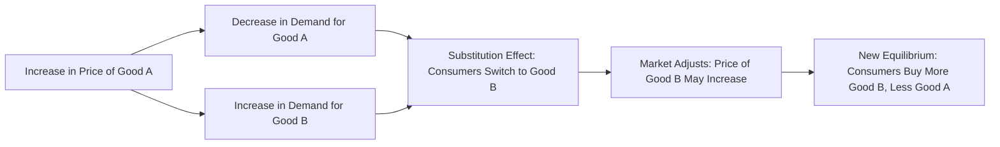

---

title: Substitute_Goods
type: Atomic Note
course: Economics
semester: Winter 2026
unit: '2'
hub: "[[2_Theory_Of_Demand_And_Supply_Hub]]"
source: "[[5-Pdf Store/note generated/Winter 2026/Economics/Chapter_2.pdf]]"
source_pages:
- 15
mode: ECON-MACRO
read: false
generated: true
prerequisites:
- "[[Determinants_Of_Demand]]"

---

# 1. Mental Model

Imagine you're at a school cafeteria and you want a sandwich. You have two options: a turkey sandwich or a ham sandwich. Both satisfy your hunger, but they're different. If the turkey sandwich is expensive, you might choose the ham sandwich instead. The ham sandwich is like a substitute for the turkey sandwich. In this analogy, the mechanical components are: (1) the desire for a sandwich (satisfying hunger) and (2) the choice between two options (turkey or ham sandwich) based on price. 

# 2. Economic Theory

[[Substitute_Goods]] are goods or services that can satisfy the same consumer desire or need, making them interchangeable in the eyes of the consumer. The underlying mechanism of [[Substitute_Goods]] is rooted in the [[Theory_Of_Demand]] and specifically influenced by the [[Cross_Price_Elasticity]] of demand, which measures how the demand for one good responds to a change in the price of another good. When the price of one good increases, the demand for its [[Substitute_Goods]] tends to increase, assuming [[Ceteris_Paribus]] (all other factors remain constant). This relationship is a key aspect of the [[Law_Of_Demand]], which states that, ceteris paribus, as the price of a good increases, the quantity demanded decreases. The [[Demand_Schedule]] and [[Demand_Curve]] for a good can shift due to changes in the price of [[Substitute_Goods]], illustrating the [[Market_Demand]] dynamics. 

# 3. Market Failures

The concept of [[Substitute_Goods]] can be limited by assuming perfect information and ignoring [[Market_Equilibrium]] disruptions. In reality, consumers may not always have perfect knowledge of all available substitutes, and [[Price_Elasticity_Of_Demand]] can vary significantly across different goods. Moreover, the presence of [[Substitute_Goods]] can lead to [[Surplus_And_Shortage]] situations if suppliers fail to adjust production in response to changes in demand. Additionally, external factors such as changes in consumer preferences or [[Change_In_Technology]] can affect the availability and desirability of substitutes, further complicating the analysis within the framework of [[Market_Demand_Curve]] and [[Effects_Of_Shift_In_Demand_And_Supply]].

# 4. Economic Model



This flowchart illustrates the relationship between substitute goods and how a change in the price of one good affects the demand for its substitute. The model assumes that consumers will substitute one good for another if the price of the original good increases.

## 5. Walkthrough

Here's a 5-step technical walkthrough of how the concept of substitute goods operates:

1. **Initial State**: Suppose the price of a turkey sandwich is $5, and the price of a ham sandwich is $4.50. Consumers buy 100 turkey sandwiches and 50 ham sandwiches per day.

2. **Price Increase**: The price of the turkey sandwich increases to $6. 

3. **Demand Response**: As a result, the demand for turkey sandwiches decreases to 70 (due to the law of demand), and the demand for ham sandwiches increases to 80, as consumers substitute the more expensive turkey sandwich with the ham sandwich.

4. **Market Adjustment**: As demand for ham sandwiches increases, their price may rise to $5, assuming suppliers respond to the increased demand.

5. **New Equilibrium**: In the new equilibrium, consumers buy 70 turkey sandwiches and 80 ham sandwiches per day. The increase in price of the turkey sandwich led to an increase in demand for the substitute good (ham sandwich), illustrating the substitution effect.

---

## 6. The Proving Grounds

```interactive-quiz
[
  {
    "id": "q1",
    "type": "mcq",
    "difficulty": "L1",
    "question": "Error generating question.",
    "answer": "N/A"
  },
  {
    "id": "q2",
    "type": "true_false",
    "difficulty": "L1",
    "question": "Error generating question.",
    "answer": "N/A"
  },
  {
    "id": "q3",
    "type": "synthesis",
    "difficulty": "L1",
    "question": "Error generating question.",
    "answer": "N/A"
  },
  {
    "id": "q4",
    "type": "trace",
    "difficulty": "L1",
    "question": "Error generating question.",
    "answer": "N/A"
  },
  {
    "id": "q5",
    "type": "order",
    "difficulty": "L1",
    "question": "Error generating question.",
    "answer": "N/A"
  }
]
```