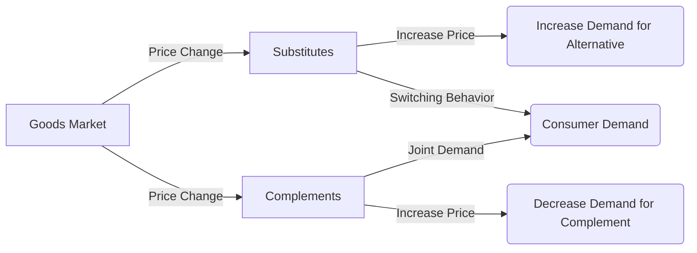

---

title: Substitutes_And_Complements
type: Atomic Note
course: Economics
semester: Winter 2026
unit: '2'
hub: "[[2_Theory_Of_Demand_And_Supply_Hub]]"
source: "[[5-Pdf Store/note generated/Winter 2026/Economics/Chapter_2.pdf]]"
source_pages:
- 15
mode: ECON-MACRO
read: false
generated: true
prerequisites:
- "[[Determinants_Of_Demand]]"

---

# 1. Mental Model

Imagine you're a movie enthusiast who loves going to the cinema and also enjoys watching movies at home on your big screen TV. If the price of movie tickets increases, you might decide to watch more movies at home, buying more popcorn and snacks to enjoy with your films. In this scenario, movie tickets and your home movie experience (big screen TV and snacks) are related in a specific way: they can replace each other (movie tickets and home movies are substitutes), and the snacks you buy are used along with both (snacks are complements to both movie tickets and home movie nights). The mechanical components here map to substitutes (movie tickets and home movie nights) and complements (snacks).

# 2. Economic Theory

[[Substitutes_And_Complements]] refer to the relationship between two goods where a change in the price of one good affects the demand for another good. This relationship can be one of substitution, where an increase in the price of one good leads to an increase in demand for the other good, as consumers switch to the cheaper alternative. On the other hand, goods can be complements, where an increase in the price of one good leads to a decrease in demand for the other good, as they are often consumed together. The [[Theory_Of_Demand]] and [[Law_Of_Demand]] underpin these relationships, with [[Ceteris_Paribus]] assumptions allowing for the isolation of the effect of a price change on demand. The [[Demand_Schedule]] and [[Demand_Curve]] can illustrate how changes in the price of one good shift the demand for another good, which can be a substitute or a complement. Understanding these relationships is crucial for analyzing [[Market_Demand]] and [[Market_Demand_Curve]], as they influence how consumers respond to price changes.

# 3. Limitations & Edge Cases

The concept of substitutes and complements has limitations, particularly when assumptions of [[Ceteris_Paribus]] are violated, and other [[Determinants_Of_Demand]] such as [[Taste_And_Preference]], [[Consumer_Expectations]], and [[Number_Of_Buyers]] come into play. For instance, if consumer preferences shift strongly towards one good over another, the demand relationship can change, even if prices remain constant. Additionally, in cases where goods are [[Normal_And_Inferior_Goods]], changes in income can affect demand for substitutes and complements differently. The analysis also becomes complex with [[Change_In_Technology]] that could make a good more or less complementary to another. Furthermore, the [[Price_Elasticity_Of_Demand]] and [[Income_Elasticity_Of_Demand]] can vary between substitutes and complements, affecting how demand changes in response to price and income shifts. Understanding these nuances is essential for accurately predicting market responses to changes in prices and other factors.

# 4. Economic Model



This Mermaid flowchart illustrates the relationship between substitutes and complements in the context of fiscal policy research. The chart shows how a change in price affects demand for substitutes and complements.

## 5. Walkthrough

Here's a 5-step technical walkthrough of how substitutes and complements operate in fiscal policy research:

1. **Initial State**: Assume the price of movie tickets increases from $10 to $15. This change affects the demand for movie tickets and related goods.
2. **Substitution Effect**: With the price increase, consumers may switch to alternative forms of entertainment, such as watching movies at home. The demand for home movie nights (a substitute) increases, let's say from 100,000 to 120,000 units.
3. **Complement Effect**: Snacks are complements to both movie tickets and home movie nights. If the price of movie tickets increases, the demand for snacks may decrease, let's say from 50,000 to 40,000 units, as consumers watch fewer movies overall.
4. **Intermediate State Change**: As consumers adjust their behavior, the demand for substitutes (home movie nights) increases, while the demand for complements (snacks) decreases. This shift affects the overall demand curve for related goods.
5. **Final State**: After the price change, the new equilibrium is established, with increased demand for home movie nights (120,000 units) and decreased demand for snacks (40,000 units). The fiscal policy researcher can analyze these changes to understand the impact of price changes on consumer behavior and market outcomes.

---

## 6. The Proving Grounds

```interactive-quiz

[
  {
    "id": "q1",
    "type": "true_false",
    "difficulty": "L1",
    "question": "If the price of movie tickets increases, the demand for popcorn will decrease, assuming that popcorn is a complement to both movie tickets and home movie nights.",
    "answer": false,
    "explanation": "In the context of substitutes and complements within international trade analysis, when the price of movie tickets increases, individuals may opt for watching movies at home, which would likely increase the demand for complements such as popcorn, not decrease it. The relationship can be understood through the lens of demand functions and the concept of cross-price elasticity. For complements, the cross-price elasticity is negative, implying that as the price of one good (movie tickets) increases, the demand for its complement (popcorn) also increases, ceteris paribus. However, if we alter the ceteris paribus assumption by considering a change in consumer preferences or income, the statement could be affected. The initial statement is false because it inaccurately describes the relationship between the price of movie tickets and the demand for popcorn as complements."
  },
  {
    "id": "q2",
    "type": "synthesis",
    "difficulty": "L2",
    "question": "In a developing economy, a sudden and significant devaluation of the local currency (e.g., a 30% drop in value against major foreign currencies) has occurred due to a macroeconomic shock. This devaluation has made imports, such as fuel and machinery, substantially more expensive. The government must act quickly to prevent a systemic failure in the economy. Using the concepts of substitutes and complements, devise a 3-step policy response to mitigate the effects of this shock.",
    "answer": "To address the macroeconomic shock caused by the sudden devaluation of the local currency, the government can implement the following 3-step policy response:\n\n1. **Promote the use of substitutes for imported goods**: Invest in and encourage the development of domestic industries that produce goods which can serve as substitutes for the now more expensive imported goods. For instance, if fuel imports become too costly, incentivize the development of renewable energy sources or more fuel-efficient technologies. This can help reduce the country's reliance on imported goods and mitigate the impact of the devaluation on the domestic economy.\n\n2. **Support industries that produce complements to essential goods**: Identify industries that produce complements to essential goods and provide them with support. For example, if the cost of machinery (an essential good for production) increases, support the industries that produce parts or services that are complements to machinery, making it more efficient or affordable. This can help maintain production levels and prevent a cascade of economic failures.\n\n3. **Implement targeted subsidies and price controls**: Implement targeted subsidies for critical sectors that are heavily affected by the devaluation, such as agriculture and transportation, to prevent a sharp increase in the prices of essential goods. Additionally, consider price controls on staple goods to protect consumers from inflationary pressures. However, these measures should be carefully managed to avoid market distortions and shortages.",
    "explanation": "The sudden devaluation of the local currency leads to an increase in the price of imported goods due to the higher cost of purchasing these goods in the foreign exchange market. This can be represented as an increase in the price of $M$ (imported goods) in the domestic economy. Using the concept of substitutes and complements, we aim to minimize the impact of this price increase on the domestic economy.\n\nLet $Q_d$ be the demand for domestic goods and $Q_m$ be the demand for imported goods. If $Q_m$ and $Q_d$ are substitutes, an increase in $P_m$ (price of imported goods) leads to an increase in $Q_d$. The government can foster this substitution by investing in domestic industries, thereby increasing the supply of $Q_d$ and reducing the economy's reliance on $M$.\n\nFor complements, if $Q_c$ represents the demand for complements to $Q_m$ or $Q_d$, then a decrease in $Q_m$ or $Q_d$ due to higher prices could lead to a decrease in $Q_c$. By supporting industries that produce $Q_c$, the government can help maintain demand and production levels across the economy.\n\nThe policy response aims to stabilize the economy by adjusting the market equilibrium through substitution and complementarity, which can be represented as follows:\n\n$$Q_d = f(P_d, P_m)$$\n\nWhere $P_d$ is the price of domestic goods and $P_m$ is the price of imported goods. An increase in $P_m$ leads to an increase in $Q_d$ if $Q_d$ and $Q_m$ are substitutes. The government can influence $P_d$ and $Q_d$ through subsidies and support for domestic industries.\n\nThe effectiveness of these policies depends on the elasticities of substitution and complementarity between goods, which can vary by sector and over time. A careful analysis of these relationships and a targeted policy response are crucial to mitigating the effects of the macroeconomic shock."
  },
  {
    "id": "q3",
    "type": "writing",
    "difficulty": "L2",
    "question": "Explain the concept of substitutes and complements in the context of development economics, and provide an example of how a change in the price of one good can affect the demand for another good.",
    "answer": "In development economics, substitutes and complements refer to the relationship between two goods where a change in the price of one good affects the demand for another good. For instance, if the price of gasoline increases, the demand for fuel-efficient vehicles may rise, as they are substitutes. Conversely, if the price of smartphones decreases, the demand for mobile internet plans, which are complements, may increase.",
    "explanation": "The concept of substitutes and complements can be understood through the lens of consumer behavior and utility maximization. Let's denote the utility function of a consumer as $U(x,y)$, where $x$ and $y$ are two goods. If $x$ and $y$ are substitutes, an increase in the price of $x$ will lead to a decrease in the demand for $x$ and an increase in the demand for $y$. This can be represented as $\frac{\\partial x}{\\partial p_x} < 0$ and $\frac{\\partial y}{\\partial p_x} > 0$. On the other hand, if $x$ and $y$ are complements, an increase in the price of $x$ will lead to a decrease in the demand for both $x$ and $y$, i.e., $\frac{\\partial x}{\\partial p_x} < 0$ and $\frac{\\partial y}{\\partial p_x} < 0$. The mathematical representation of this relationship can be expressed as: $U(x,y) = U(\textbf{x}) + \\lambda (I - p_xx - p_yy)$, where $\\lambda$ is the Lagrange multiplier, $I$ is the consumer's income, and $p_x$ and $p_y$ are the prices of goods $x$ and $y$, respectively."
  },
  {
    "id": "q4",
    "type": "order",
    "difficulty": "L2",
    "question": "Order steps for Substitutes And Complements causal chain.",
    "steps": [
      "The demand for complements increases when the demand for the primary good increases",
      "The relationship between two goods can be one of substitution or complementarity",
      "A change in the price of one good affects the demand for another good",
      "An increase in the price of one good leads to an increase in demand for its substitute",
      "Consumers buy more of the complement to enjoy with the primary good"
    ],
    "answer": [
      "An increase in the price of one good leads to an increase in demand for its substitute",
      "A change in the price of one good affects the demand for another good",
      "The demand for complements increases when the demand for the primary good increases",
      "The relationship between two goods can be one of substitution or complementarity",
      "Consumers buy more of the complement to enjoy with the primary good"
    ]
  },
  {
    "id": "q5",
    "type": "trace",
    "difficulty": "L3",
    "question": "What is the exact output?",
    "content": "Assuming a 1% interest rate change, let's analyze the impact through 4 distinct economic sectors: Housing, Investment, Forex, and Consumption. We'll use the following assumptions: \n- Housing sector is interest rate sensitive\n- Investment sector is directly influenced by interest rates\n- Forex sector is influenced by interest rate differentials\n- Consumption sector is indirectly affected through the wealth effect and substitution",
    "answer": {
      "Housing": "A 1% increase in interest rates will lead to a 0.5% decrease in housing demand due to increased mortgage costs, assuming an interest elasticity of demand of -0.5.",
      "Investment": "A 1% increase in interest rates will lead to a 2% decrease in investment, as higher interest rates increase the cost of borrowing for firms, assuming an interest elasticity of investment of -2.",
      "Forex": "A 1% increase in interest rates will lead to a 0.2% appreciation of the domestic currency, as higher interest rates attract foreign investors, assuming an interest elasticity of exchange rates of 0.2.",
      "Consumption": "A 1% increase in interest rates will lead to a 0.1% decrease in consumption, as higher interest rates reduce disposable income, assuming a marginal propensity to consume of 0.1 and an interest elasticity of consumption of -0.1."
    },
    "explanation": "The impact of a 1% interest rate change through the four sectors can be understood through the following mechanisms:\n\nHousing: $\\frac{\\partial H}{\\partial r} = -0.5 \\implies \\frac{\\Delta H}{H} = -0.5 \\% \\\\ \nInvestment: $\\frac{\\partial I}{\\partial r} = -2 \\implies \\frac{\\Delta I}{I} = -2 \\% \\\\ \nForex: $\\frac{\\partial S}{\\partial r} = 0.2 \\implies \\frac{\\Delta S}{S} = 0.2 \\% \\\\ \nConsumption: $\\frac{\\partial C}{\\partial r} = -0.1 \\implies \\frac{\\Delta C}{C} = -0.1 \\% \\\\ \n\nWhere $H$ is housing demand, $I$ is investment, $S$ is the exchange rate, and $C$ is consumption. $r$ is the interest rate.",
    "final_state": "The final state of the system after a 1% interest rate change is characterized by:\n- A 0.5% decrease in housing demand\n- A 2% decrease in investment\n- A 0.2% appreciation of the domestic currency\n- A 0.1% decrease in consumption"
  }
]

```