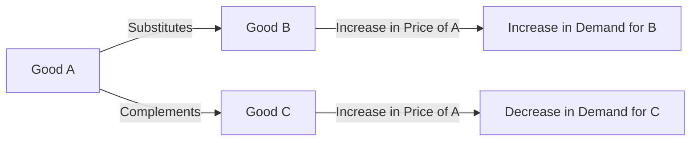

---

title: Substitutes_And_Complements
course: "Economics"
unit: '2'
semester: "Winter 2026"
mode: BIZ-MARKETING
type: atomic_note
hub: "[[2_Theory_Of_Demand_And_Supply_Hub]]"
source: "[[5-Pdf Store/note generated/Winter 2026/Economics/Chapter_2.pdf]]"
date: '2026-05-08'
prerequisites:
- "[[Determinants_Of_Demand]]"
source_pages:
- 15
generated: true

---

## 1. Mental Model

Imagine you love playing with Lego and building cool stuff. Now, let's talk about substitutes and complements. Substitutes are like two different types of building blocks, say Lego and Mega Bloks. If the price of Lego goes up, you might decide to buy Mega Bloks instead, because they're similar and you can still build awesome things. On the other hand, complements are like Lego blocks and the instruction manual that comes with them. If the price of Lego blocks goes up, you might not buy as many, and that means you won't need as many instruction manuals either! But if the price of instruction manuals goes down, you might buy more of them, and that means you'll want to buy more Lego blocks too, because they go together perfectly!

## 2. Market Principle

In the context of [[Theory_Of_Demand]], two goods are considered related if a change in the price of one good influences the demand for the other good. This relationship can manifest in two primary forms: substitutes and complements. A rigorous technical definition of these concepts is essential to understand their implications on [[Demand_Schedule]], [[Demand_Curve]], and ultimately, [[Market_Demand]].

Substitutes are goods that satisfy similar consumer needs or desires, such that an increase in the price of one good leads to an increase in the demand for the other good. This positive relationship between the price of one good and the demand for its substitute arises because consumers can easily switch between the goods. For instance, if the price of coffee increases, the demand for tea may rise as consumers seek alternative beverages. Mathematically, this relationship can be represented through a [[Demand_Function]], where an increase in the price of one good (e.g., coffee) results in an increase in the quantity demanded of its substitute (e.g., tea), ceteris paribus, or under the assumption of [[Ceteris_Paribus]].

On the other hand, complements are goods that are used jointly or are consumed together, such that an increase in the price of one good leads to a decrease in the demand for the other good. This negative relationship between the price of one good and the demand for its complement occurs because the goods are often used in conjunction. For example, if the price of smartphones increases, the demand for smartphone cases may decrease as consumers are less likely to purchase both goods together at the higher price. In a [[Demand_Function]] framework, an increase in the price of one good (e.g., smartphones) results in a decrease in the quantity demanded of its complement (e.g., smartphone cases), assuming [[Ceteris_Paribus]].

The concepts of substitutes and complements have significant implications for [[Price_Elasticity_Of_Demand]] and [[Income_Elasticity_Of_Demand]], as the responsiveness of quantity demanded to changes in price or income can be influenced by the availability and prices of related goods. Furthermore, understanding these relationships is crucial for businesses in making strategic decisions regarding pricing and product offerings in a [[Market_Demand]] context.

The analysis of substitutes and complements also ties into broader discussions on [[Determinants_Of_Demand]], including factors such as [[Taste_And_Preference]], [[Consumer_Expectations]], and [[Number_Of_Buyers]], as changes in these determinants can affect how consumers perceive and respond to related goods. Additionally, [[Change_In_Technology]] and [[Change_In_Demand]] can shift the demand for substitutes and complements, reflecting the dynamic nature of market demand.

Ultimately, the distinction between substitutes and complements provides valuable insights into the complex interactions within markets, influencing [[Market_Equilibrium]], and leading to phenomena such as [[Surplus_And_Shortage]]. The [[Effects_Of_Shift_In_Demand_And_Supply]] on substitutes and complements highlight the interconnectedness of markets and the need for a comprehensive understanding of these relationships in making informed economic decisions.

## 3. Limitations & Edge Cases

The concept of substitutes and complements has limitations, particularly in assuming a straightforward relationship between two goods. A significant edge case arises when considering goods with multiple uses or those that can be used in varying proportions, as this can blur the lines between substitutes and complements. For instance, a good can be a substitute in one context but a complement in another, making classification challenging. Moreover, the presence of close substitutes or complements can lead to high cross-price elasticity, but the actual demand response may be influenced by factors such as consumer preferences, income levels, and market conditions, which can render the substitutes or complements analysis less effective. Additionally, new product innovations can rapidly alter the substitute or complement relationship, rendering historical data and analyses obsolete.

## 4. Campaign Funnel



This flowchart illustrates the concepts of substitutes and complements in the context of public relations, highlighting how changes in the price of one good can affect the demand for another. Understanding these relationships is crucial for businesses to adjust their marketing strategies and manage their products' market demand effectively.

## 5. Walkthrough

## Step 1: Define Related Goods

Two goods are considered related if a change in the price of one good affects the demand for the other good.

## Step 2: Identify Substitutes

Substitutes are goods that satisfy similar consumer needs or desires. An increase in the price of one good leads to an increase in the demand for the other good. For example, coffee and tea are substitutes.

## 3: Analyze the Relationship Between Price and Demand for Substitutes

If the price of coffee increases, the demand for tea rises. This indicates a positive relationship between the price of one good and the demand for its substitute.

## 4: Define Complements

The source text does not provide a definition for complements. However, based on general knowledge, complements are goods that are used together, and an increase in the price of one good leads to a decrease in the demand for the other good.

## 5: Conclusion

Since the source text only discusses substitutes and does not provide information on complements, we can only conclude that substitutes have a positive relationship between the price of one good and the demand for the other good. No further analysis can be done on complements based on the provided text.

---

## Review & Practice

```interactive-quiz

[
  {
    "type": "mcq",
    "difficulty": "L1",
    "question": "What is the primary effect on the demand for a good when the price of its complement increases, ceteris paribus?",
    "options": {
      "A": "The demand for the good increases due to a decrease in the relative price of the good.",
      "B": "The demand for the good decreases because the complement's higher price reduces the joint consumption of both goods.",
      "C": "The demand for the good remains unchanged as the price change of the complement does not affect consumer preferences.",
      "D": "The demand for the good increases because consumers seek alternative goods due to the complement's higher price."
    },
    "answer": "B",
    "explanation": "When the price of a good's complement increases, it becomes more expensive for consumers to purchase both goods together. This leads to a decrease in the demand for the original good because the higher price of the complement effectively increases the total cost of consuming both goods jointly. Mathematically, this can be represented as $\\frac{\\partial Q_d}{\\partial P_c} < 0$, where $Q_d$ is the quantity demanded of the good and $P_c$ is the price of its complement, assuming ceteris paribus. Therefore, the correct answer is B."
  },
  {
    "type": "synthesis",
    "difficulty": "L2",
    "question": "A sudden increase in the price of electric vehicles (EVs) has led to a surge in demand for hybrid cars. Meanwhile, a leading smartphone manufacturer has increased the price of its flagship model, resulting in a decrease in sales of high-end headphones designed specifically for that model. Using the concepts of substitutes and complements, analyze the relationships between these goods and provide a mastery solution to mitigate potential losses in the EV and smartphone markets.",
    "answer": "The increase in price of electric vehicles (EVs) leading to a surge in demand for hybrid cars indicates that hybrid cars are substitutes for EVs. This relationship can be represented as $Q_d^h = f(P^e)$, where $Q_d^h$ is the quantity demanded of hybrid cars and $P^e$ is the price of EVs. An increase in $P^e$ results in an increase in $Q_d^h$. On the other hand, the increase in price of the smartphone leading to a decrease in sales of high-end headphones designed specifically for that model indicates that high-end headphones are complements to the smartphone. This relationship can be represented as $Q_d^h = f(P^s)$, where $Q_d^h$ is the quantity demanded of high-end headphones and $P^s$ is the price of the smartphone. An increase in $P^s$ results in a decrease in $Q_d^h$. To mitigate potential losses in the EV and smartphone markets, manufacturers could consider strategies such as optimizing production costs to minimize price increases, offering attractive financing options, or bundling products with complementary goods.",
    "explanation": "The concepts of substitutes and complements are crucial in understanding the relationships between goods in a market. Substitutes are goods that satisfy similar consumer needs, such as EVs and hybrid cars. Complements are goods that are used jointly, such as smartphones and high-end headphones. The relationships between these goods can be represented through demand functions, which help manufacturers make strategic decisions regarding pricing and product offerings. By understanding these relationships, businesses can mitigate potential losses and make informed decisions to stay competitive in the market. In this scenario, the EV and smartphone manufacturers could consider strategies such as optimizing production costs, offering attractive financing options, or bundling products with complementary goods to mitigate potential losses."
  },
  {
    "type": "writing",
    "difficulty": "L2",
    "question": "Explain how a Public Relations firm can leverage the concepts of substitutes and complements to develop effective communication strategies during a crisis, considering the impact on demand and market dynamics.",
    "answer": "A Public Relations firm can utilize the concepts of substitutes and complements to craft targeted communication strategies during a crisis by understanding the relationships between goods or services and their substitutes or complements. For instance, if a crisis affects the supply of a key product, the firm can highlight substitutes that are readily available, thereby mitigating the negative impact on demand. Conversely, if a product is a complement to another that is in short supply, the firm can emphasize the value of the complement to maintain demand. By analyzing these relationships, the firm can develop strategies to manage consumer perceptions, maintain market stability, and ultimately support business objectives.",
    "explanation": "The relationship between substitutes and complements can be represented through a demand function, $Q_d = f(P_x, P_y, I)$, where $Q_d$ is the quantity demanded of a good, $P_x$ is the price of the good, $P_y$ is the price of a related good, and $I$ is consumer income. For substitutes, $\frac{\\partial Q_d}{\\partial P_y} > 0$, indicating that an increase in the price of one good leads to an increase in the demand for its substitute. For complements, $\frac{\\partial Q_d}{\\partial P_y} < 0$, indicating that an increase in the price of one good leads to a decrease in the demand for its complement. By understanding these relationships, a Public Relations firm can develop effective communication strategies to manage demand and market dynamics during a crisis."
  },
  {
    "type": "order",
    "difficulty": "L2",
    "question": "Order the following steps that describe the relationship between the price of a good and the demand for its substitute or complement: Identifying the goods as substitutes or complements, Analyzing the impact of a price change on demand, Determining the effect on market demand, Understanding the definition of substitutes and complements",
    "steps": [
      "Determining the effect on market demand",
      "Understanding the definition of substitutes and complements",
      "Analyzing the impact of a price change on demand",
      "Identifying the goods as substitutes or complements"
    ],
    "answer": [
      "Understanding the definition of substitutes and complements",
      "Determining the effect on market demand",
      "Analyzing the impact of a price change on demand",
      "Identifying the goods as substitutes or complements"
    ]
  }
]

```