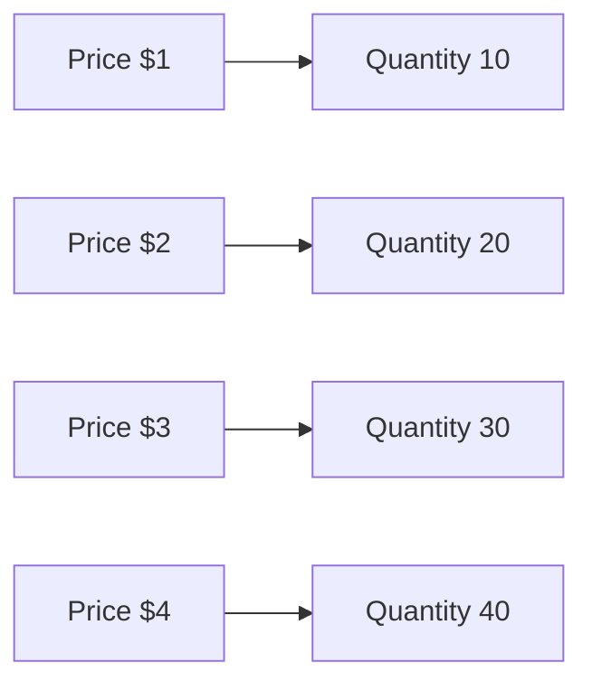

---

title: Supply_Schedule
type: Atomic Note
course: Economics
semester: Winter 2026
unit: '2'
hub: "[[2_Basics_Of_Economics_Hub]]"
source: "[[Chapter_2.pdf]]"
source_pages:
- 38
mode: ECON-MACRO
read: false
generated: true
prerequisites:
- "[[Law_Of_Supply]]"

---

# 1. Mental Model

Imagine you have a lemonade stand, and you want to know how many cups of lemonade you are willing to sell at different prices. A supply schedule is like a table that lists the different prices of lemonade and how many cups you are willing to sell at each price. It's a plan of how much lemonade you will sell at different prices.

# 2. Economic Theory

A supply schedule is a table that shows the quantity of a good or service that producers are willing and able to supply at different price levels, [[Ceteris_Paribus]]. It is a key concept in the [[Theory_Of_Supply]] and is often represented graphically as a [[Supply_Curve]]. The supply schedule is typically upward-sloping, meaning that as the price increases, the quantity supplied also increases.

## 3. Economic Model



## 4. Walkthrough

* The supply schedule starts with a price point, for example, P1 at $1.
* At this price point, the quantity of lemonade supplied is 10 cups, represented by Q1.
* As the price increases to P2 at $2, the quantity supplied increases to 20 cups, represented by Q2.
* This process continues, showing that as the price increases, the quantity supplied also increases.

## 5. Market Failures

The concept of a supply schedule can fail when there are changes in factors other than price, such as technology or input costs, which can shift the entire supply curve. Additionally, if there are government interventions, such as taxes or subsidies, it can alter the supply schedule. Another pitfall is assuming that the supply schedule is always linear, when in reality it may be non-linear.

---

## 6. The Proving Grounds

```interactive-quiz

[
  {
    "id": "q1",
    "type": "true_false",
    "difficulty": "L1",
    "question": "A supply schedule lists the quantity of a good or service that producers are willing and able to supply at different price levels, assuming all other factors remain constant.",
    "answer": true,
    "explanation": "A supply schedule is a table that shows the quantity of a good or service that producers are willing and able to supply at different price levels, ceteris paribus (assuming all other factors remain constant). This concept is rooted in the Theory of Supply, which analyzes how producers' behavior changes in response to price changes, while keeping other factors constant. The assumption of ceteris paribus is crucial as it allows economists to isolate the effect of price changes on the quantity supplied, providing a clear understanding of the supply-side dynamics."
  },
  {
    "id": "q2",
    "type": "synthesis",
    "difficulty": "L2",
    "question": "Maria has a lemonade stand and wants to create a supply schedule for her lemonade. She has a limited number of cups and wants to maximize her profits. At a price of $0.50 per cup, she is willing to sell 10 cups. At a price of $1.00 per cup, she is willing to sell 20 cups. At a price of $1.50 per cup, she is willing to sell 30 cups. However, if the price drops to $0.25 per cup, she is only willing to sell 5 cups. Create a supply schedule for Maria's lemonade stand and explain the underlying mechanism that drives her decisions.",
    "answer": "The supply schedule for Maria's lemonade stand is as follows:\n\n| Price per Cup | Quantity Supplied |\n| --- | --- |\n| $0.25 | 5 |\n| $0.50 | 10 |\n| $1.00 | 20 |\n| $1.50 | 30 |\n\nThe underlying mechanism that drives Maria's decisions is the law of supply, which states that as the price of a good increases, the quantity supplied also increases, ceteris paribus. This is because higher prices make it more profitable for Maria to sell lemonade, incentivizing her to produce and sell more. Conversely, lower prices reduce her profitability, leading her to reduce the quantity supplied.",
    "explanation": "The supply schedule is a table that shows the quantity of lemonade that Maria is willing and able to supply at different price levels. The law of supply drives her decisions, as higher prices increase her willingness to supply more lemonade, while lower prices decrease her willingness to supply. The ceteris paribus assumption is crucial, as it implies that other factors, such as the cost of production, remain constant. In this case, Maria's cost of production is assumed to be constant, and the change in quantity supplied is solely driven by the change in price."
  },
  {
    "id": "q3",
    "type": "writing",
    "difficulty": "L3",
    "question": "Explain the concept of a supply schedule and how it relates to the quantity of a good or service that producers are willing and able to supply at different price levels.",
    "answer": "A supply schedule is a table that lists the quantity of a good or service that producers are willing and able to supply at different price levels, assuming all other factors remain constant. It shows the relationship between the price of a good or service and the quantity that producers are willing to supply. The schedule typically shows that as the price increases, the quantity supplied also increases. The supply schedule is a key concept in the theory of supply and is often used to analyze the behavior of producers in a market.",
    "explanation": "The underlying mechanism of a supply schedule is based on the law of supply, which states that as the price of a good or service increases, the quantity supplied also increases, ceteris paribus. This is because higher prices make it more profitable for producers to produce and sell the good or service, incentivizing them to increase production. The supply schedule takes into account the producers' willingness and ability to supply the good or service at different price levels, and it is typically upward sloping, meaning that as the price increases, the quantity supplied also increases."
  }
]

```