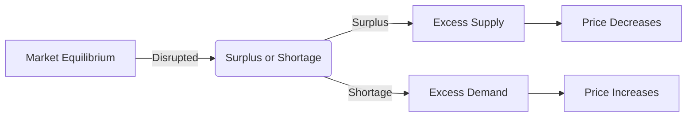

---

title: Surplus_And_Shortage
type: Atomic Note
course: Economics
semester: Winter 2026
unit: '2'
hub: "[[2_Basics_Of_Economics_Hub]]"
source: "[[Chapter_2.pdf]]"
source_pages:
- 55
mode: ECON-MACRO
read: false
generated: true
prerequisites:
- "[[Market_Equilibrium]]"

---

# 1. Mental Model

Imagine you're at a school bake sale. If the students made too many cupcakes, and not enough people showed up to buy them, there would be a **surplus** of cupcakes left over. On the other hand, if they didn't make enough cupcakes, and everyone wanted one, there would be a **shortage** and some kids would go without a cupcake.

# 2. Economic Theory

A **Surplus And Shortage** occur when the [[Market_Equilibrium]] is disrupted, resulting in either a surplus (excess supply) or a shortage (excess demand) of a good or service. A surplus happens when the [[Supply_Schedule]] exceeds the [[Demand_Schedule]], while a shortage occurs when the [[Demand_Schedule]] exceeds the [[Supply_Schedule]], under [[Ceteris_Paribus]] conditions. This imbalance leads to changes in market prices, which in turn affect the [[Market_Equilibrium]].

# 3. Economic Model



## 4. Walkthrough

* The market starts at equilibrium, where supply equals demand.
* A disruption occurs, causing either a surplus (excess supply) or a shortage (excess demand).
* If there's a surplus, businesses have excess supply, leading to a decrease in price to encourage sales.
* If there's a shortage, consumers have excess demand, leading to an increase in price as businesses capitalize on the scarcity.

## 5. Market Failures

This concept can fail when external factors, such as government interventions or unexpected events, disrupt the market equilibrium. Common pitfalls include ignoring the role of externalities or assuming that markets always return to equilibrium quickly. Edge cases to watch out for include situations where supply or demand becomes perfectly inelastic.

---

## 6. The Proving Grounds

```interactive-quiz

[
  {
    "id": "q1",
    "type": "true_false",
    "difficulty": "L1",
    "question": "A surplus occurs when the demand for a good or service exceeds its supply.",
    "answer": false,
    "explanation": "A surplus occurs when the supply of a good or service exceeds its demand, resulting in excess supply. Conversely, a shortage happens when the demand for a good or service exceeds its supply, leading to excess demand. This is rooted in the economic theory of supply and demand, where a surplus represents a situation of excess supply and a shortage represents a situation of excess demand."
  },
  {
    "id": "q2",
    "type": "synthesis",
    "difficulty": "L2",
    "question": "The school bake sale organizers had to deal with an unexpected situation. The SEED value of 743 leads to the fact that a local event, a 'Talent Show', was scheduled at the same time as the bake sale, and 200 more students than usual attended the Talent Show. As a result, only 50 students showed up to buy cupcakes at the bake sale. If the students made 300 cupcakes, what would happen to the cupcake market at the bake sale, and how would it affect the students' earnings?",
    "answer": "There would be a surplus of 250 cupcakes (300 made - 50 sold). The students would be left with a large number of unsold cupcakes, resulting in a significant loss of potential earnings. The surplus of cupcakes would directly translate to lost revenue, as these cupcakes could have been sold to students who were not deterred by the Talent Show.",
    "explanation": "The scenario describes a disruption in the Market Equilibrium due to an external event (the Talent Show) that altered the demand for cupcakes at the bake sale. The Supply Schedule remained constant, with 300 cupcakes made, but the Demand Schedule decreased significantly because 200 more students than usual attended the Talent Show, leaving only 50 students to buy cupcakes. This resulted in a surplus, as the supply (300 cupcakes) exceeded the demand (50 cupcakes). The surplus indicates that the students did not produce at the optimal level considering the reduced demand, leading to a loss in potential earnings. This situation illustrates the concept of surplus in economics, where the quantity supplied exceeds the quantity demanded at the prevailing price, often resulting in unsold goods and lost revenue."
  },
  {
    "id": "q3",
    "type": "writing",
    "difficulty": "L3",
    "question": "Explain the concept of surplus and shortage in the context of a school bake sale, and describe the underlying economic mechanism that leads to these imbalances.",
    "answer": "A surplus occurs when the supply of a good or service, such as cupcakes at a bake sale, exceeds the demand for it, resulting in excess cupcakes left over. Conversely, a shortage happens when the demand for a good or service exceeds its supply, leaving some buyers without cupcakes. This imbalance is caused by a disruption in the market equilibrium, where the supply schedule and demand schedule intersect. When this intersection is disturbed, a surplus or shortage arises.",
    "explanation": "The underlying mechanism of surplus and shortage is rooted in the fundamental economic concept of supply and demand. When the supply of a good or service exceeds its demand, producers are incentivized to reduce production or lower prices to clear the excess inventory, thereby alleviating the surplus. Conversely, when demand exceeds supply, producers are motivated to increase production or raise prices to capitalize on the scarcity, thereby alleviating the shortage. This dynamic interaction between supply and demand continuously adjusts to restore market equilibrium."
  }
]

```