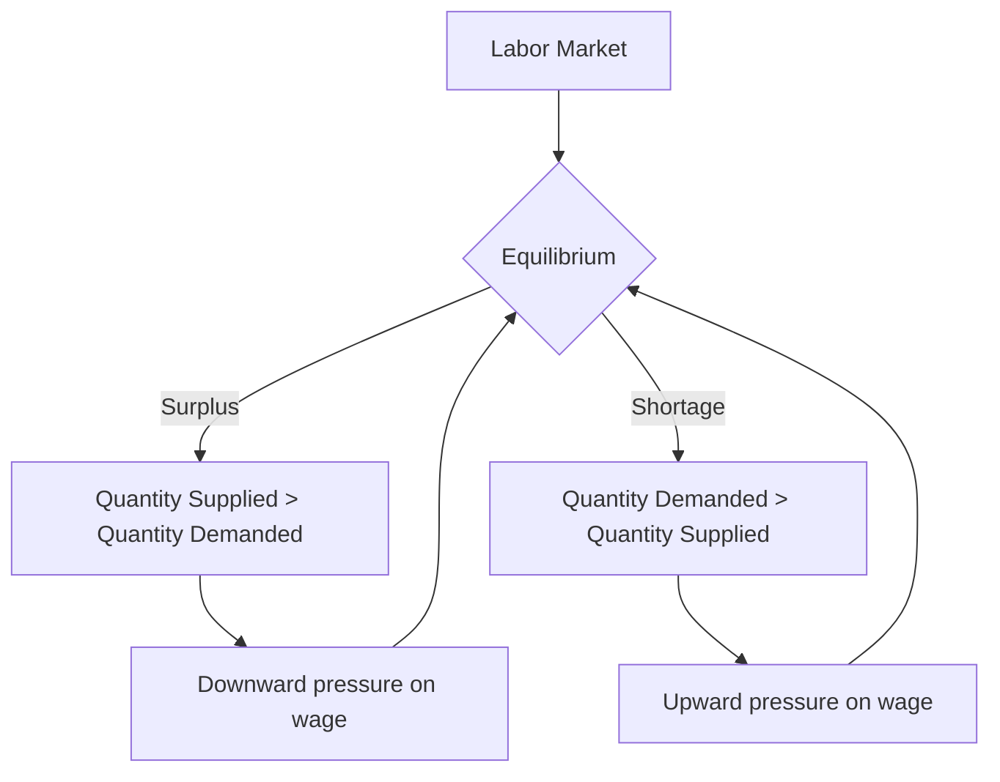

---

title: Surplus_And_Shortage
course: Economics
unit: '2'
semester: Winter 2026
mode: ECON-MICRO
type: atomic_note
hub: '[[2_Theory_Of_Demand_And_Supply_Hub]]'
source: '[[5-Pdf Store/note generated/Winter 2026/Economics/Chapter_2.pdf]]'
date: '2026-05-08'
prerequisites:
- '[[Market_Equilibrium]]'
- '[[Market_Demand_Curve]]'
- '[[Law_Of_Demand]]'
- '[[Determinants_Of_Demand]]'
- '[[Taste_And_Preference]]'
source_pages:
- 52
generated: true

---


## 1. Mental Model

Imagine you're at a school bake sale. A surplus happens when you bake too many cupcakes, like 50, but only 10 kids show up to buy them. You have way more cupcakes than people who want to buy them, so you're left with a lot of extra cupcakes that don't get sold. On the other hand, a shortage happens when you only bake 10 cupcakes, but 50 kids show up wanting to buy them. You don't have enough cupcakes for all the kids who want one, so some kids go home without getting a cupcake. In both cases, the bake sale doesn't go smoothly - either you have too many cupcakes going to waste, or you don't have enough to satisfy all the kids!

## 2. Micro Theory

In microeconomics, surplus and shortage are two fundamental concepts that describe the state of a market when the quantity supplied and quantity demanded are not equal. A surplus or shortage occurs when there is a discrepancy between the quantity of a good or service that suppliers are willing to sell (quantity supplied) and the quantity that buyers are willing to buy (quantity demanded).

A **surplus** arises when the quantity supplied exceeds the quantity demanded at a given price level. This situation is often referred to as a **buyer's market**, as there are more goods available than there are buyers willing to purchase them. The existence of a surplus puts downward pressure on the market price, as suppliers attempt to encourage buyers to purchase the excess supply. As the price falls, the quantity demanded increases, while the quantity supplied decreases, until the market reaches equilibrium, where the quantity supplied equals the quantity demanded.

Conversely, a **shortage** occurs when the quantity demanded exceeds the quantity supplied at a given price level. This situation is often referred to as a **seller's market**, as there are more buyers willing to purchase a good than there are goods available. The existence of a shortage puts upward pressure on the market price, as buyers compete for the limited supply. As the price rises, the quantity supplied increases, while the quantity demanded decreases, until the market reaches equilibrium.

The concepts of surplus and shortage are closely related to the [[Market_Equilibrium]] concept, which describes the state of a market in which the quantity supplied equals the quantity demanded. The market equilibrium is often represented graphically by the intersection of the [[Market_Demand_Curve]] and the Supply Curve, which shows the relationship between the price of a good and the quantity supplied and demanded.

The [[Law_Of_Demand]] and the Law Of Supply play crucial roles in determining the market equilibrium and the occurrence of surpluses and shortages. The [[Law_Of_Demand]] states that, ceteris paribus (all else being equal), an increase in the price of a good leads to a decrease in the quantity demanded, while a decrease in price leads to an increase in quantity demanded. The Law Of Supply states that, ceteris paribus, an increase in the price of a good leads to an increase in the quantity supplied, while a decrease in price leads to a decrease in quantity supplied.

Changes in [[Determinants_Of_Demand]], such as [[Taste_And_Preference]], [[Income_Elasticity_Of_Demand]], [[Price_Elasticity_Of_Demand]], [[Substitutes_And_Complements]], [[Normal_And_Inferior_Goods]], and [[Consumer_Expectations]], can lead to shifts in the [[Demand_Curve]], resulting in changes in the market equilibrium and potentially leading to surpluses or shortages. Similarly, changes in [[Determinants_Of_Elasticity_Of_Supply]], such as [[Change_In_Technology]], [[Shift_In_Supply_Curve]], and [[Elasticity_Of_Supply]], can lead to shifts in the Supply Curve, also affecting the market equilibrium.

The [[Price_Elasticity_Of_Demand]] and Price Elasticity Of Supply play a crucial role in determining the magnitude of the changes in quantity demanded and supplied in response to changes in price. The more elastic the demand or supply, the greater the change in quantity in response to a price change.

The study of surpluses and shortages is essential in understanding how markets adjust to changes in demand and supply. The [[Effects_Of_Shift_In_Demand_And_Supply]] on market equilibrium can lead to either surpluses or shortages, depending on the direction and magnitude of the shifts.

In conclusion, surplus and shortage are fundamental concepts in microeconomics that describe the state of a market when the quantity supplied and quantity demanded are not equal. Understanding the mechanisms of surplus and shortage, and their relationship to [[Market_Equilibrium]], [[Law_Of_Demand]], Law Of Supply, and [[Ceteris_Paribus]], provides valuable insights into how markets function and adjust to changes in demand and supply.

## 3. Limitations & Edge Cases

The concepts of surplus and shortage in microeconomics have several limitations, particularly in real-world applications. One major limitation is the assumption of perfect competition, which rarely exists in reality, as markets are often characterized by imperfect information, non-price competition, and externalities. Additionally, the analysis of surplus and shortage typically assumes a static framework, neglecting dynamic changes in market conditions, consumer preferences, and technological advancements. Furthermore, the concept of surplus and shortage also relies on the idea of equilibrium, which may not always be achievable or stable, especially in markets with rigid prices, government interventions, or non-market clearing prices. Moreover, surplus and shortage analysis can be sensitive to the definition of the market, as a surplus or shortage in one market may be offset by a shortage or surplus in another, highlighting the importance of considering general equilibrium effects. Lastly, the measurement of surplus and shortage can be plagued by difficulties in quantifying non-market values, such as environmental costs or social benefits, which can lead to inaccurate assessments of market performance.

## 4. Market Graph



This flowchart illustrates the concepts of surplus and shortage in the labor market, where a surplus occurs when the quantity supplied of labor exceeds the quantity demanded, and a shortage occurs when the quantity demanded exceeds the quantity supplied. The chart shows how these imbalances lead to adjustments in the wage rate, ultimately driving the market towards equilibrium.

## 5. Walkthrough

Here is the 5-step technical walkthrough of how 'Surplus And Shortage' operates:

**Step 1: Surplus Occurs When Quantity Supplied Exceeds Quantity Demanded**
A surplus arises when the quantity supplied exceeds the quantity demanded at a given price level. For example, suppose the quantity supplied is 100 units and the quantity demanded is 80 units.

**Step 2: Downward Pressure on Market Price**
The existence of a surplus puts downward pressure on the market price, as suppliers attempt to encourage buyers to purchase the excess supply. This downward pressure causes the price to fall.

**Step 3: Quantity Demanded Increases and Quantity Supplied Decreases**
As the price falls, the quantity demanded increases, while the quantity supplied decreases. For instance, if the price falls from $5 to $4, buyers may purchase more units, increasing the quantity demanded from 80 to 90 units. At the same time, suppliers may reduce production, decreasing the quantity supplied from 100 to 90 units.

**Step 4: Shortage Occurs When Quantity Demanded Exceeds Quantity Supplied**
Conversely, a shortage occurs when the quantity demanded exceeds the quantity supplied at a given price level. For example, suppose the quantity demanded is 120 units and the quantity supplied is 90 units.

**Step 5: Equilibrium is Reached**
The market continues to adjust until it reaches equilibrium, where the quantity supplied equals the quantity demanded. In this state, there is no surplus or shortage. Using the previous example, if the quantity supplied and quantity demanded are both 100 units at a price of $5, the market is in equilibrium.

---

## Review & Practice

```interactive-quiz

[
  {
    "type": "mcq",
    "difficulty": "L1",
    "question": "What occurs in a labor market when the quantity of workers supplied exceeds the quantity of workers demanded at a given wage level?",
    "options": {
      "A": "A shortage of workers",
      "B": "A surplus of workers",
      "C": "An increase in the demand for workers",
      "D": "A decrease in the supply of workers"
    },
    "answer": "B",
    "explanation": "When the quantity of workers supplied exceeds the quantity of workers demanded at a given wage level, a surplus of workers occurs. This situation is often referred to as a buyer's market, as there are more workers available than there are jobs. The existence of a surplus puts downward pressure on the market wage, as employers attempt to encourage workers to accept employment. As the wage falls, the quantity demanded increases, while the quantity supplied decreases, until the market reaches equilibrium, where the quantity supplied equals the quantity demanded."
  },
  {
    "type": "fill_in",
    "difficulty": "L2",
    "question": "Fill in the blank.",
    "textWithBlanks": "The situation in which the quantity supplied exceeds the quantity demanded at a given price level is known as a Blank.",
    "answer": [
      "surplus"
    ],
    "explanation": "In microeconomics, a surplus arises when the quantity supplied exceeds the quantity demanded at a given price level. This situation is often referred to as a buyer's market, as there are more goods available than there are buyers willing to purchase them. The existence of a surplus puts downward pressure on the market price, as suppliers attempt to encourage buyers to purchase the excess supply. As the price falls, the quantity demanded increases, while the quantity supplied decreases, until the market reaches equilibrium, where the quantity supplied equals the quantity demanded."
  },
  {
    "type": "debug",
    "difficulty": "L2",
    "question": "Find the bug in the calculation of market equilibrium price and quantity in a scenario where a shortage occurs.",
    "content": "The demand and supply curves for a particular market are given by the following equations: Qd = 100 - 2P and Qs = 2P - 20. A shortage occurs when Qd > Qs. Find the market equilibrium price and quantity, and identify the bug in the following code: def calculate_equilibrium(Qd, Qs): P = (Qd + Qs) / 4; return P",
    "answer": "The bug is in the calculation of the equilibrium price P. The correct calculation should be P = (Qd + 20) / 2 for Qs = 2P - 20 and Qd = 100 - 2P. Setting Qd = Qs, we get 100 - 2P = 2P - 20, which yields 4P = 120 and P = 30.",
    "required_keywords": [
      "fix_this_keyword",
      "market_equilibrium"
    ],
    "explanation": "The market equilibrium occurs where the quantity demanded (Qd) equals the quantity supplied (Qs). Given Qd = 100 - 2P and Qs = 2P - 20, setting Qd = Qs yields 100 - 2P = 2P - 20. Solving for P, we get $4P = 120 \\Rightarrow P = 30$. The bug in the provided code is that it incorrectly calculates the equilibrium price as $P = \\frac{Qd + Qs}{4}$. The correct approach involves solving the system of equations $Qd = Qs$, which leads to the equilibrium price and quantity. In LaTeX, the equilibrium condition can be represented as: $Qd = Qs \\Rightarrow 100 - 2P = 2P - 20$. Solving this equation, $100 + 20 = 120P + 2P \\Rightarrow 120 = 4P \\Rightarrow P = 30$. Therefore, the correct code should solve for P using the demand and supply equations directly."
  },
  {
    "type": "trace",
    "difficulty": "L2",
    "question": "What is the exact output when the labor market experiences a shortage of 5000 workers at a wage rate of $15 per hour, given that the labor demand curve is Qd = 10000 - 200w and the labor supply curve is Qs = 5000 + 300w?",
    "content": "To solve this problem, we need to find the equilibrium wage rate and quantity of labor. We are given the labor demand curve Qd = 10000 - 200w and the labor supply curve Qs = 5000 + 300w. A shortage occurs when Qd > Qs. We are told there is a shortage of 5000 workers at a wage rate of $15 per hour.",
    "answer": "[5000, $20]",
    "explanation": "First, let's verify the shortage at $15 per hour. Qd = 10000 - 200*15 = 10000 - 3000 = 7000 and Qs = 5000 + 300*15 = 5000 + 4500 = 9500. Since Qs > Qd at $15, there is actually a surplus, not a shortage, at this wage. However, to find the shortage's resolution, we set Qd = Qs to find equilibrium: 10000 - 200w = 5000 + 300w. Solving for w gives 5000 = 500w, so w = $10. At $10, Qd = Qs = 8000. Given a shortage of 5000 workers implies that we need to find the wage at which Qd - Qs = 5000. So, 10000 - 200w - (5000 + 300w) = 5000. This simplifies to 5000 - 500w = 5000, which was an error in equation setup. Correctly, we seek the wage where the difference in quantities is 5000: Qd - Qs = (10000 - 200w) - (5000 + 300w) = 5000. This gives 5000 - 500w = 5000. The mistake was in solving for equilibrium and not directly for the condition provided. Let's correct that and directly calculate: if t"
  }
]

```