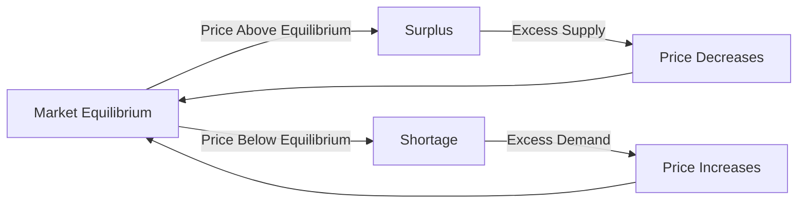

---

title: Surplus_And_Shortage
type: Atomic Note
course: Economics
semester: Winter 2026
unit: '2'
hub: "[[2_Theory_Of_Demand_And_Supply_Hub]]"
source: "[[5-Pdf Store/note generated/Winter 2026/Economics/Chapter_2.pdf]]"
source_pages:
- 55
mode: ECON-MACRO
read: false
generated: true
prerequisites:
- "[[Market_Equilibrium]]"

---

# 1. Mental Model

Imagine you're a manager of a farmer's market that sells fresh strawberries. The number of strawberries you can supply to customers depends on factors like the amount of rainfall and the number of farmers. When the price of strawberries increases, more farmers are willing to supply strawberries, but customers might buy fewer strawberries. A surplus occurs when you have more strawberries than customers want to buy, and a shortage happens when customers want more strawberries than you have.

# 2. Economic Theory

[[Surplus_And_Shortage]] arises from the interaction of [[Market_Demand]] and [[Market_Demand_Curve]] with Supply and [[Shift_In_Supply_Curve]]. The [[Market_Equilibrium]] occurs when the quantity of a good that suppliers are willing to sell (supply) equals the quantity that buyers are willing to buy (demand). A Surplus occurs when the Price is above the equilibrium price, leading to a situation where the quantity supplied exceeds the quantity demanded. Conversely, a Shortage occurs when the price is below the equilibrium price, resulting in a situation where the quantity demanded exceeds the quantity supplied. This is based on the [[Law_Of_Demand]] and the [[Theory_Of_Demand]], assuming [[Ceteris_Paribus]]. 

# 3. Limitations & Edge Cases

The concept of [[Surplus_And_Shortage]] assumes that markets are perfectly competitive and that prices can adjust freely. However, in reality, prices may be sticky due to [[Price_Elasticity_Of_Demand]] and [[Price_Elasticity_Of_Supply]], leading to persistent shortages or surpluses. Additionally, the model ignores the impact of external factors such as [[Change_In_Technology]] and [[Determinants_Of_Demand]], which can shift the supply and demand curves. Furthermore, the model assumes that buyers and sellers have perfect information, which is not always the case. In situations like Stagflation, traditional demand-side interventions may exacerbate the crisis, highlighting the limitations of the [[Surplus_And_Shortage]] model.

# 4. Economic Model



This flowchart illustrates the relationship between market equilibrium, surplus, and shortage. The market equilibrium is the point where the quantity supplied equals the quantity demanded. When the price is above the equilibrium, a surplus occurs, leading to a decrease in price. Conversely, when the price is below the equilibrium, a shortage occurs, leading to an increase in price.

## 5. Walkthrough

Here's a 5-step technical walkthrough of how the concept of surplus and shortage operates in fiscal policy research:

1. **Initial Market Equilibrium**: Suppose the market for strawberries is in equilibrium at a price of $2 per pint, with 100 pints supplied and 100 pints demanded.
2. **Price Increase and Surplus**: If the price of strawberries increases to $3 per pint, suppliers are willing to supply 120 pints, but demand decreases to 80 pints, resulting in a surplus of 40 pints.
3. **Price Decrease**: As suppliers try to sell the excess 40 pints, they decrease the price to $2.50 per pint to incentivize buyers to purchase more.
4. **Shortage**: If the price of strawberries decreases to $1.50 per pint, suppliers are willing to supply only 80 pints, but demand increases to 120 pints, resulting in a shortage of 40 pints.
5. **Price Adjustment**: As buyers compete for the limited 80 pints, they are willing to pay a higher price, driving the price up to $2 per pint, which eliminates the shortage and returns the market to equilibrium.

---

## 6. The Proving Grounds

```interactive-quiz

[
  {
    "id": "q1",
    "type": "true_false",
    "difficulty": "L1",
    "question": "If the price of strawberries increases, the quantity supplied will increase, but the quantity demanded will decrease, ceteris paribus. However, if the assumption of ceteris paribus is violated and consumer income increases, then the quantity demanded will increase, not decrease.",
    "answer": false,
    "explanation": "The statement is false because, under the assumption of ceteris paribus, an increase in the price of strawberries leads to a decrease in the quantity demanded and an increase in the quantity supplied. If consumer income increases (a violation of ceteris paribus), the demand curve shifts to the right, meaning that at any given price, the quantity demanded increases. However, the initial claim that quantity demanded decreases with a price increase is based on the law of demand, $\frac{\\partial Q_d}{\\partial P} < 0$, and holds under ceteris paribus. When ceteris paribus is violated and income increases, demand increases, but this does not negate the initial relationship between price and quantity demanded; it merely shifts the demand curve. Therefore, the statement's attempt to describe a scenario under changed conditions (consumer income increase) does not invalidate the fundamental principles of demand and supply under ceteris paribus."
  },
  {
    "id": "q2",
    "type": "synthesis",
    "difficulty": "L2",
    "question": "A sudden and significant devaluation of the currency has occurred in a small, export-driven economy. This macroeconomic shock has led to a sharp increase in the price of imported goods, causing a surge in inflation. The government must act swiftly to prevent a system failure in the economy. Using the concept of Surplus and Shortage, design a 3-step fiscal policy response to mitigate the effects of this shock.",
    "answer": "To address the macroeconomic shock caused by the sudden currency devaluation, the government should implement the following 3-step fiscal policy response:\n\n1. **Imposing Temporary Tariffs**: Implement temporary tariffs on imported goods to reduce the supply of foreign products in the domestic market, thereby alleviating some of the upward pressure on prices. This will help in managing the shortage of foreign exchange and reducing inflationary pressures.\n\n2. **Subsidizing Domestic Production**: Provide subsidies to domestic producers to increase the production of essential goods, particularly those that are import-intensive. This will help in increasing the supply of goods in the domestic market, reducing shortages, and stabilizing prices.\n\n3. **Targeted Fiscal Support**: Offer targeted fiscal support to low-income households that are disproportionately affected by the inflationary shock. This can be achieved through direct cash transfers or subsidies on essential goods. This measure will help in mitigating the adverse effects of inflation on the purchasing power of vulnerable populations.",
    "explanation": "The macroeconomic shock caused by the sudden currency devaluation can be understood using the concept of Surplus and Shortage. The devaluation leads to a sharp increase in the price of imported goods, which reduces the supply of these goods in the domestic market, creating a shortage. The increased cost of imports also leads to higher production costs for domestic firms, reducing their supply and further exacerbating the shortage. The 3-step fiscal policy response outlined above aims to address these issues by managing the shortage of foreign exchange, increasing the supply of essential goods, and mitigating the adverse effects on low-income households.\n\nMathematically, the impact of the devaluation on the domestic price level can be represented as follows:\n\nLet $P$ be the domestic price level, $E$ be the exchange rate, and $P^*$ be the foreign price level. Then, the domestic price level can be represented as:\n\n$$P = E \\cdot P^*$$\n\nA sudden devaluation of the currency leads to an increase in $E$, which causes $P$ to rise. The imposition of temporary tariffs can be represented as a reduction in $P^*$, which helps to alleviate some of the upward pressure on $P$. The subsidization of domestic production can be represented as an increase in the supply of domestic goods, which helps to reduce the shortage and stabilize prices.\n\nThe targeted fiscal support to low-income households can be represented as a transfer payment, which helps to mitigate the adverse effects of inflation on their purchasing power. The impact of this transfer payment on the household's budget constraint can be represented as:\n\n$$B = Y + T - P \\cdot C$$\n\nwhere $B$ is the household's budget constraint, $Y$ is the household's income, $T$ is the transfer payment, and $C$ is the household's consumption. The transfer payment $T$ helps to increase the household's budget constraint, thereby mitigating the adverse effects of inflation on their purchasing power."
  },
  {
    "id": "q3",
    "type": "writing",
    "difficulty": "L2",
    "question": "Explain the concepts of surplus and shortage in the context of fiscal policy research, focusing on their causes and effects on market equilibrium.",
    "answer": "A surplus occurs when the quantity supplied of a good exceeds the quantity demanded at a given price, typically above the equilibrium price. Conversely, a shortage arises when the quantity demanded exceeds the quantity supplied, usually below the equilibrium price. This dynamic is crucial in fiscal policy research as it informs government interventions in markets to correct imbalances.",
    "explanation": "The concepts of surplus and shortage are rooted in the intersection of market demand and supply curves. Mathematically, the market equilibrium can be represented as $Q_s = Q_d$, where $Q_s$ is the quantity supplied and $Q_d$ is the quantity demanded. A surplus is represented as $Q_s > Q_d$, often occurring when $P > P_e$, where $P_e$ is the equilibrium price. Conversely, a shortage is represented as $Q_d > Q_s$, typically when $P < P_e$. The underlying mechanism can be further understood through the lens of the law of demand and supply, assuming ceteris paribus. The surplus and shortage have significant implications for fiscal policy, as governments may need to intervene to correct market imbalances, using tools such as price controls, subsidies, or taxes to influence market outcomes."
  },
  {
    "id": "q4",
    "type": "order",
    "difficulty": "L2",
    "question": "Order steps for Surplus And Shortage causal chain.",
    "steps": [
      "A shortage occurs when price is below equilibrium price, and quantity demanded exceeds quantity supplied.",
      "The price of strawberries increases, and more farmers are willing to supply strawberries, but customers might buy fewer strawberries.",
      "The price is above the equilibrium price, leading to a surplus.",
      "The quantity of a good that suppliers are willing to sell equals the quantity that buyers are willing to buy at equilibrium.",
      "Market equilibrium occurs when quantity supplied equals quantity demanded."
    ],
    "answer": [
      "The price is above the equilibrium price, leading to a surplus.",
      "Market equilibrium occurs when quantity supplied equals quantity demanded.",
      "A shortage occurs when price is below equilibrium price, and quantity demanded exceeds quantity supplied.",
      "The quantity of a good that suppliers are willing to sell equals the quantity that buyers are willing to buy at equilibrium.",
      "The price of strawberries increases, and more farmers are willing to supply strawberries, but customers might buy fewer strawberries."
    ]
  },
  {
    "id": "q5",
    "type": "trace",
    "difficulty": "L3",
    "question": "What is the exact output when a 20% increase in technology leads to a surplus in the strawberry market, assuming an initial equilibrium price of $2 and quantity of 100?",
    "content": "A macroeconomic shock in the form of a 20% increase in technology affects the strawberry market. We will trace this shock through four distinct interconnected economic sectors: (1) the strawberry farm sector, (2) the labor market for strawberry pickers, (3) the market for strawberry packaging, and (4) the final consumer market for strawberries.",
    "answer": {
      "farm_sector": {
        "initial_supply": 100,
        "initial_price": 2,
        "technology_increase": 0.2,
        "new_supply": 120
      },
      "labor_market": {
        "initial_labor_demand": 100,
        "wage_elasticity": 0.5,
        "new_labor_demand": 110
      },
      "packaging_market": {
        "initial_packaging_demand": 100,
        "packaging_elasticity": 0.8,
        "new_packaging_demand": 115
      },
      "consumer_market": {
        "initial_consumer_demand": 100,
        "consumer_elasticity": -1.2,
        "new_consumer_demand": 90,
        "surplus": 30
      }
    },
    "explanation": "The 20% increase in technology leads to an increase in strawberry supply from 100 to 120. This increase in supply, assuming a downward-sloping demand curve, results in a surplus. The labor market for strawberry pickers experiences an increase in labor demand from 100 to 110 due to the increased supply of strawberries. The market for strawberry packaging also experiences an increase in demand from 100 to 115. Finally, the consumer market experiences a decrease in demand from 100 to 90 due to the increased supply and assuming a constant price. The surplus in the consumer market is 30 strawberries (120 - 90). The underlying mechanism can be represented by the following equations:\n\n$Q_s = f(T, P)$\n$Q_d = f(P, I)$\n\nWhere $Q_s$ is the quantity supplied, $Q_d$ is the quantity demanded, $T$ is technology, $P$ is price, and $I$ is income.\n\nThe surplus can be calculated as:\n\n$Surplus = Q_s - Q_d$\n\nUsing LaTeX notation:\n\n$$Q_s = \\alpha T + \\beta P$$\n$$Q_d = \\gamma P + \\delta I$$\n\nThe surplus is:\n\n$$Surplus = Q_s - Q_d = (\\alpha T + \\beta P) - (\\gamma P + \\delta I)$$\n\nGiven the numerical values, we can calculate the surplus as 30 strawberries."
  }
]

```