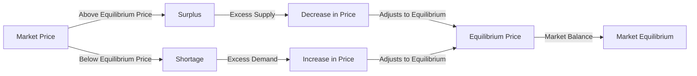

---

title: Surplus_And_Shortage
type: Atomic Note
course: Economics
semester: Winter 2026
unit: '2'
hub: '[[2_Theory_Of_Demand_And_Supply_Hub]]'
source: '[[5-Pdf Store/note generated/Winter 2026/Economics/Chapter_2.pdf]]'
source_pages:
- 52
- 55
mode: ECON-MACRO
read: false
generated: true
prerequisites:
- '[[Market_Demand]]'
- '[[Market_Equilibrium]]'
- '[[Ceteris_Paribus]]'
- '[[Determinants_Of_Demand]]'
- '[[Determinants_Of_Elasticity_Of_Supply]]'

---


# 1. Mental Model

Imagine you're at a school bake sale. The number of cupcakes you have to sell represents the [[Market_Supply]]. The number of cupcakes that students want to buy represents the [[Market_Demand]]. A surplus happens when you have more cupcakes than students want to buy, meaning some cupcakes remain unsold. A shortage occurs when you don't have enough cupcakes for all the students who want to buy them, leaving some students without cupcakes.

# 2. Economic Theory

[[Surplus_And_Shortage]] refer to the market conditions that arise when the [[Market_Demand]] for a good or service does not equal its [[Market_Supply]]. A [[Surplus]] occurs when the [[Market_Supply]] exceeds the [[Market_Demand]], resulting in excess supply. This happens when the [[Market_Price]] is above the [[Equilibrium_Price]], leading to a decrease in the quantity demanded and an increase in the quantity supplied. Conversely, a [[Shortage]] occurs when the [[Market_Demand]] exceeds the [[Market_Supply]], resulting in excess demand. This happens when the [[Market_Price]] is below the [[Equilibrium_Price]], leading to an increase in the quantity demanded and a decrease in the quantity supplied. The [[Market_Equilibrium]] is achieved when the [[Market_Demand]] equals the [[Market_Supply]], and there is no surplus or shortage.

# 3. Limitations & Edge Cases

The concept of [[Surplus_And_Shortage]] assumes [[Ceteris_Paribus]], meaning that all other factors remain constant. However, in reality, changes in [[Determinants_Of_Demand]] and [[Determinants_Of_Elasticity_Of_Supply]] can affect the market equilibrium. For instance, an increase in [[Consumer_Expectations]] about future prices can lead to a sudden increase in demand, causing a shortage. Similarly, a change in [[Taste_And_Preference]] can lead to a decrease in demand, causing a surplus. Additionally, the concept of [[Surplus_And_Shortage]] may not apply in situations where there are [[Substitutes_And_Complements]] or [[Normal_And_Inferior_Goods]], as these factors can influence the market demand and supply.

# 4. Economic Model



This flowchart illustrates how market price deviations from the equilibrium price lead to surplus or shortage conditions, which in turn drive price adjustments towards market equilibrium.

## 5. Walkthrough

Here's a 5-step technical walkthrough of how the concept of Surplus and Shortage operates in Fiscal Policy Research:

1. **Initial Market Condition**: Assume the market for a particular good has a demand curve of $Q_D = 100 - 2P$ and a supply curve of $Q_S = 2P - 20$, where $P$ is the price and $Q$ is the quantity.

2. **Surplus Condition**: If the market price is set at $P = 40$, then $Q_D = 100 - 2(40) = 20$ and $Q_S = 2(40) - 20 = 60$. This results in a surplus of $60 - 20 = 40$ units because $Q_S > Q_D$.

3. **Price Adjustment**: The presence of a surplus puts downward pressure on the market price. As the price decreases, the quantity demanded increases, and the quantity supplied decreases.

4. **Shortage Condition**: Conversely, if the market price is set at $P = 20$, then $Q_D = 100 - 2(20) = 60$ and $Q_S = 2(20) - 20 = 20$. This results in a shortage of $60 - 20 = 40$ units because $Q_D > Q_S$.

5. **Equilibrium Achievement**: The market adjusts to equilibrium where $Q_D = Q_S$. Setting $100 - 2P = 2P - 20$, we solve for $P$ to find $4P = 120$ or $P = 30$. At $P = 30$, $Q_D = Q_S = 40$. This equilibrium price and quantity balance the market, eliminating surplus and shortage conditions.

---

## 6. The Proving Grounds

```interactive-quiz

[
  {
    "id": "q1",
    "type": "true_false",
    "difficulty": "L1",
    "question": "If the government imposes a tax on a good, causing its market price to rise, and assuming ceteris paribus, the quantity supplied of the good will decrease.",
    "answer": false,
    "explanation": "When the market price of a good rises due to a tax imposed by the government, the quantity supplied of the good will actually increase, not decrease, assuming ceteris paribus. This is because a higher market price makes the good more profitable for producers, incentivizing them to supply more. The ceteris paribus assumption means that we hold all other factors constant, such as production costs and technology. In this scenario, the increase in market price due to the tax leads to an increase in the quantity supplied, as producers are willing to supply more at the higher price. Mathematically, this can be represented as $Q_s = f(P)$, where $Q_s$ is the quantity supplied and $P$ is the market price. If $P$ increases, then $Q_s$ will also increase, ceteris paribus."
  },
  {
    "id": "q2",
    "type": "synthesis",
    "difficulty": "L2",
    "question": "The country of Azura, a major exporter of electronics, faces a sudden and significant devaluation of its currency, the Azuran Peso (AP). This devaluation makes Azuran electronics cheaper for foreign buyers but also increases the cost of importing raw materials and intermediate goods necessary for electronics production. As a result, the Azuran electronics industry faces a potential shortage of critical components. The government must act quickly to prevent a systemic failure in the industry. Using the concepts of surplus and shortage, devise a 3-step policy response to mitigate the impact of the currency devaluation on the Azuran electronics industry.",
    "answer": "To address the challenges posed by the sudden devaluation of the Azuran Peso, the government of Azura should implement the following 3-step policy response:\n\n1. **Subsidize Raw Material Imports**: The government should provide subsidies to electronics manufacturers to offset the increased cost of importing raw materials and intermediate goods. This will help maintain the supply of critical components, preventing a shortage that could halt production. The subsidy can be calculated as the difference between the pre-devaluation cost of imports and the current cost, ensuring that manufacturers can continue to procure necessary inputs at a manageable cost.\n\n2. **Encourage Domestic Production of Critical Components**: Azura should invest in domestic industries that produce critical components for the electronics sector. By providing targeted incentives, such as tax breaks, low-interest loans, or investment in infrastructure, the government can stimulate domestic production. This approach not only helps mitigate the immediate shortage but also reduces dependence on imports in the long term, enhancing the industry's resilience to future shocks.\n\n3. **Implement Price Controls and Export Incentives**: To manage the surplus of electronics that may arise due to increased competitiveness in foreign markets and to ensure that domestic consumers are not adversely affected, the government could implement temporary price controls. Additionally, offering export incentives to manufacturers can help them capitalize on the devaluation by increasing their market share abroad. This can include rebates on taxes paid, additional export financing, or support for marketing and distribution in foreign markets.",
    "explanation": "The devaluation of the Azuran Peso leads to a decrease in the price of Azuran electronics in foreign markets, potentially increasing demand. However, it also increases the cost of importing raw materials, which could lead to a shortage of critical components for production. The policy response aims to address both the supply and demand sides of the market.\n\nMathematically, the impact of devaluation on the price of exports ($P_x$) and the cost of imports ($P_m$) can be represented as:\n\n$P_x' = P_x \\cdot e$\n$P_m' = P_m \\cdot e$\n\nwhere $e$ is the exchange rate (number of foreign currency units per Azuran Peso). A devaluation implies an increase in $e$, making $P_x'$ cheaper for foreigners and $P_m'$ more expensive for Azurans.\n\nThe subsidy to manufacturers can be represented as:\n\n$S = Q \\cdot (P_m' - P_m)$\n\nwhere $Q$ is the quantity of imports. This subsidy helps maintain production by offsetting the increased cost of imports.\n\nThe investment in domestic production of critical components aims to increase the supply of these components, shifting the supply curve to the right and reducing the shortage.\n\nPrice controls can be represented as:\n\n$P_c \\leq P_x'$\n\nwhere $P_c$ is the controlled price. This ensures that the increased competitiveness does not lead to domestic shortages or excessive price increases.\n\nExport incentives can be seen as a reduction in the effective tax rate or an increase in the price received by exporters, further increasing the quantity supplied to foreign markets."
  },
  {
    "id": "q3",
    "type": "writing",
    "difficulty": "L2",
    "question": "Explain the concept of surplus and shortage in a development economics scenario, and provide a technical analysis of the underlying mechanisms.",
    "answer": "In a development economics context, a surplus occurs when the market supply of a good or service exceeds its market demand, resulting in excess supply. Conversely, a shortage arises when market demand exceeds market supply, leading to a decrease in the quantity supplied and an increase in the quantity demanded. The equilibrium price and quantity are determined by the intersection of the supply and demand curves, where the quantity supplied equals the quantity demanded. Mathematically, this can be represented as $Q_s = Q_d$, where $Q_s$ is the quantity supplied and $Q_d$ is the quantity demanded. When the market price is above the equilibrium price, a surplus occurs, and when it is below, a shortage occurs.",
    "explanation": "The underlying mechanism of surplus and shortage can be explained using the LaTeX representation of the supply and demand curves: $Q_s = S(p)$ and $Q_d = D(p)$, where $p$ is the market price. The equilibrium price and quantity are determined by the intersection of these curves: $S(p) = D(p)$. Using the concept of elasticity, the change in quantity supplied and demanded can be represented as $\frac{\\partial Q_s}{\\partial p} = S'(p)$ and $\frac{\\partial Q_d}{\\partial p} = D'(p)$. The stability of the equilibrium can be analyzed using the Walrasian auctioneer mechanism, which ensures that the market converges to the equilibrium price and quantity."
  },
  {
    "id": "q4",
    "type": "order",
    "difficulty": "L2",
    "question": "Order steps for Surplus And Shortage.",
    "steps": [
      "A surplus occurs when Market_Supply exceeds Market_Demand",
      "Market_Demand exceeds Market_Supply",
      "Decrease in quantity demanded and increase in quantity supplied",
      "Market_Price is above the Equilibrium_Price",
      "A shortage occurs when Market_Demand exceeds Market_Supply"
    ],
    "answer": [
      "Market_Price is above the Equilibrium_Price",
      "A surplus occurs when Market_Supply exceeds Market_Demand",
      "Market_Demand exceeds Market_Supply",
      "A shortage occurs when Market_Demand exceeds Market_Supply",
      "Decrease in quantity demanded and increase in quantity supplied"
    ]
  },
  {
    "id": "q5",
    "type": "trace",
    "difficulty": "L3",
    "question": "What is the exact output after tracing the impact of a 1% interest rate change through 4 distinct economic sectors (Housing, Investment, Forex, Consumption)?",
    "content": "To analyze the impact of a 1% interest rate change on the economy through the sectors of Housing, Investment, Forex, and Consumption, we use the following assumptions and models:\n\n1. **Housing Sector**: A change in interest rates affects mortgage rates, which in turn affect housing demand. The elasticity of housing demand to interest rates can be represented by a simple linear model: $H_d = -100r + 1000$, where $H_d$ is the demand for housing and $r$ is the interest rate in percentage.\n\n2. **Investment Sector**: Investment is negatively related to interest rates because higher interest rates increase the cost of borrowing. We can model this relationship as: $I = -200r + 2000$, where $I$ is the investment.\n\n3. **Forex Sector**: The impact on Forex can be complex, but a common approach is to consider the effect of interest rates on exchange rates. A higher interest rate attracts foreign investors, increasing demand for the currency. We simplify this as: $EX = 50r + 1000$, where $EX$ is the exchange rate.\n\n4. **Consumption Sector**: Consumption is less directly affected by interest rates but can be influenced through savings and borrowing costs. A simple model could be: $C = -50r + 5000$, where $C$ is consumption.\n\nGiven these models, let's calculate the impact of a 1% change in interest rates from 2% to 3%.\n\n### Initial State (at 2% interest rate):\n- Housing Demand: $H_d = -100(2) + 1000 = 800$\n- Investment: $I = -200(2) + 2000 = 1800$\n- Exchange Rate: $EX = 50(2) + 1000 = 1100$\n- Consumption: $C = -50(2) + 5000 = 4900$\n\n### Final State (at 3% interest rate):\n- Housing Demand: $H_d = -100(3) + 1000 = 700$\n- Investment: $I = -200(3) + 2000 = 1600$\n- Exchange Rate: $EX = 50(3) + 1000 = 1150$\n- Consumption: $C = -50(3) + 5000 = 4850$\n\nThe changes are as follows:\n- Housing Demand: $700 - 800 = -100$\n- Investment: $1600 - 1800 = -200$\n- Exchange Rate: $1150 - 1100 = 50$\n- Consumption: $4850 - 4900 = -50$",
    "answer": "The exact output after tracing the impact of a 1% interest rate change through the 4 distinct economic sectors is:\n\n- Housing Demand: 700\n- Investment: 1600\n- Exchange Rate: 1150\n- Consumption: 4850",
    "explanation": "The mechanism underlying these changes can be explained using basic economic principles and LaTeX representations:\n\n1. **Housing Demand Change**: $\\Delta H_d = -100 \\Delta r$\n2. **Investment Change**: $\\Delta I = -200 \\Delta r$\n3. **Exchange Rate Change**: $\\Delta EX = 50 \\Delta r$\n4. **Consumption Change**: $\\Delta C = -50 \\Delta r$\n\nFor a 1% increase in interest rates ($\\Delta r = 1$), these equations show the direct impact on each sector. The negative sign indicates a decrease in demand or value with an increase in interest rates, while a positive sign indicates an increase."
  }
]

```