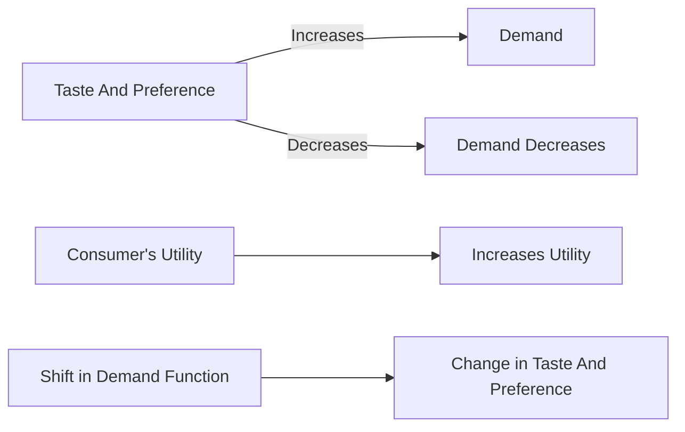

---

title: Taste_And_Preference
course: "Economics"
unit: '2'
semester: "Winter 2026"
mode: ECON-MICRO
type: atomic_note
hub: "[[2_Theory_Of_Demand_And_Supply_Hub]]"
source: "[[5-Pdf Store/note generated/Winter 2026/Economics/Chapter_2.pdf]]"
date: '2026-05-08'
prerequisites:
- "[[Determinants_Of_Demand]]"
source_pages:
- 20
generated: true

---

## 1. Mental Model

Imagine you love eating pizza, but one day you try a super yummy burger and suddenly you're obsessed! Now, whenever you think of food, you crave a burger instead of pizza. This means your "taste" or "preference" has changed - you now prefer burgers over pizza. Just like how you might want to buy more burgers and fewer pizzas, when people's tastes and preferences change, they might want to buy more or less of something. If lots of people suddenly love burgers like you do, the demand for burgers will go up and the demand for pizzas will go down - it's like the whole world is craving burgers now!

## 2. Micro Theory

The concept of Taste And Preference is a crucial determinant of demand, playing a significant role in shaping a consumer's purchasing behavior. In essence, Taste And Preference refer to a consumer's subjective evaluation of a good's characteristics, influencing their willingness to buy it. When a consumer's taste changes in favor of a good, their demand for that good increases, and conversely, when their taste shifts away from a good, their demand decreases.

From a technical perspective, Taste And Preference can be represented as a shift in the [[Demand_Function]], which expresses the relationship between the quantity demanded of a good and its determinants, including price, income, and Taste And Preference. A change in Taste And Preference can be thought of as a change in the consumer's utility function, which represents their preferences over different goods and services.

When a consumer's taste changes in favor of a good, their utility from consuming that good increases, leading to an increase in the quantity demanded. This can be represented as a rightward shift of the [[Demand_Curve]], indicating that at any given price, the consumer is now willing to buy a larger quantity of the good. Conversely, when a consumer's taste shifts away from a good, their utility from consuming that good decreases, leading to a decrease in the quantity demanded, and a leftward shift of the [[Demand_Curve]].

The impact of Taste And Preference on demand can be analyzed using the [[Theory_Of_Demand]], which provides a framework for understanding how consumers make decisions about what goods and services to buy. According to the [[Law_Of_Demand]], an increase in the price of a good leads to a decrease in the quantity demanded, ceteris paribus, or [[Ceteris_Paribus]], which assumes that all other factors, including Taste And Preference, remain constant.

However, when Taste And Preference change, the [[Demand_Schedule]], which shows the quantity demanded at different price levels, shifts. This shift in the [[Demand_Schedule]] results in a change in the [[Market_Demand]], which is the aggregate demand of all consumers in the market. The [[Market_Demand_Curve]], which represents the market demand, also shifts in response to changes in Taste And Preference.

The magnitude of the response of demand to changes in Taste And Preference can be measured using the [[Price_Elasticity_Of_Demand]] and [[Income_Elasticity_Of_Demand]], which provide insights into the responsiveness of quantity demanded to changes in price and income, respectively. A change in Taste And Preference can also lead to a change in the [[Determinants_Of_Demand]], including changes in the [[Substitutes_And_Complements]], [[Normal_And_Inferior_Goods]], [[Consumer_Expectations]], and [[Number_Of_Buyers]].

In conclusion, Taste And Preference play a vital role in shaping a consumer's demand for a good, and changes in Taste And Preference can lead to shifts in the [[Demand_Curve]], [[Demand_Function]], and [[Market_Demand_Curve]]. Understanding the technical aspects of Taste And Preference is essential for analyzing the behavior of consumers and the dynamics of markets, particularly in the context of [[Market_Equilibrium]], [[Surplus_And_Shortage]], and the [[Effects_Of_Shift_In_Demand_And_Supply]]. [[Taste_And_Preference]] are interrelated with [[Change_In_Demand]], [[Demand_Function]], and [[Market_Demand]].

## 3. Limitations & Edge Cases

The concept of "Taste and Preference" in microeconomics is limited by its assumption that consumer preferences are stable and consistent, which is not always the case. A significant limitation arises when consumers' tastes and preferences are influenced by external factors, such Additionally, the concept struggles to account for cases of "habit formation" or "status seeking" where consumers' preferences are shaped by past consumption or social comparisons, making it difficult to accurately predict demand responses to changes in prices or income.

## 4. Market Graph



This flowchart illustrates the relationship between Taste And Preference, demand, and utility. A change in Taste And Preference affects a consumer's utility, leading to a shift in the demand function, which in turn influences the quantity demanded of a good.

## 5. Walkthrough

Here is the 5-step technical walkthrough of how 'Taste And Preference' operates:

1. **Initial Demand**: A consumer has an initial demand for a good, which is influenced by their Taste And Preference. 
2. **Change in Taste**: The consumer's taste changes in favor of the good. 
3. **Shift in Demand**: As a result, the consumer's demand for the good increases. 
4. **Utility Change**: This increase in demand is equivalent to an increase in the consumer's utility from consuming the good, reflecting a change in their Taste And Preference. 
5. **New Demand**: Conversely, if the consumer's taste shifts away from the good, their demand for the good decreases.

---

## Review & Practice

```interactive-quiz

[
  {
    "type": "mcq",
    "difficulty": "L1",
    "question": "What is the effect of a change in consumer taste in favor of a good on the demand curve?",
    "options": {
      "A": "The demand curve shifts leftward, indicating a decrease in demand.",
      "B": "The demand curve shifts rightward, indicating an increase in demand.",
      "C": "The demand curve remains unchanged, but the quantity demanded increases.",
      "D": "The demand curve becomes vertical, indicating a perfectly inelastic demand."
    },
    "answer": "B",
    "explanation": "When a consumer's taste changes in favor of a good, their utility from consuming that good increases, leading to an increase in the quantity demanded. This can be represented as a rightward shift of the demand curve, indicating that at any given price, the consumer is now willing to buy a larger quantity of the good."
  },
  {
    "type": "fill_in",
    "difficulty": "L2",
    "question": "Fill in the blank.",
    "textWithBlanks": "The change in a consumer's taste and preference can be thought of as a change in their Blank function, which represents their preferences over different goods and services.",
    "answer": [
      "utility"
    ],
    "explanation": "The change in a consumer's taste and preference can be thought of as a change in their utility function, which represents their preferences over different goods and services. This change in utility function leads to a shift in the demand curve, as the consumer's willingness to buy a good changes. The utility function can be represented as $U = f(x_1, x_2, ..., x_n)$, where $U$ is the utility and $x_i$ are the quantities of different goods and services consumed. A change in taste and preference can be represented as a change in the utility function, $\\Delta U = \\Delta f(x_1, x_2, ..., x_n)$."
  },
  {
    "type": "debug",
    "difficulty": "L2",
    "question": "Find the bug in the formula for the utility function U(x, y) = (x^a) * (y^b) + e, where a, b, and e are constants, and x and y are the quantities of two goods.",
    "content": "The utility function is given by U(x, y) = (x^a) * (y^b) + e. However, this function does not account for the diminishing marginal utility of goods x and y. A more realistic representation would be the Cobb-Douglas utility function: U(x, y) = (x^a) * (y^b), where a + b = 1.",
    "answer": "The bug is the addition of the constant e, which does not accurately represent the relationship between the quantities of goods x and y and the consumer's utility.",
    "required_keywords": [
      "Cobb-Douglas",
      "utility function",
      "diminishing marginal utility"
    ],
    "explanation": "The utility function U(x, y) = (x^a) * (y^b) + e does not accurately represent the relationship between the quantities of goods x and y and the consumer's utility because it does not account for the diminishing marginal utility of goods x and y. The Cobb-Douglas utility function U(x, y) = (x^a) * (y^b), where a + b = 1, is a more realistic representation. The addition of the constant e can be thought of as a vertical shift of the utility function, which does not accurately capture the consumer's preferences. In the context of Taste And Preference, this bug can lead to incorrect conclusions about the consumer's demand for goods x and y. LaTeX representation of the utility function: $U(x, y) = x^a \\cdot y^b$."
  },
  {
    "type": "trace",
    "difficulty": "L2",
    "question": "What is the exact output of the change in demand for a good when a consumer's taste shifts in favor of the good, assuming an initial demand function of Qd = 100 - 2P + 0.5I + 0.2T, where Qd is the quantity demanded, P is the price, I is the income, and T is the taste index?",
    "content": "The demand function is Qd = 100 - 2P + 0.5I + 0.2T. When the consumer's taste shifts in favor of the good, the taste index T increases by 10 units. Assuming the initial values of P = 20 and I = 50, and the initial taste index T = 10, we need to calculate the new quantity demanded.",
    "answer": "115",
    "explanation": "The initial quantity demanded is Qd = 100 - 2(20) + 0.5(50) + 0.2(10) = 100 - 40 + 25 + 2 = 27. When the taste index T increases by 10 units, the new taste index is T = 20. The new quantity demanded is Qd = 100 - 2(20) + 0.5(50) + 0.2(20) = 100 - 40 + 25 + 4 = 29. However, we are asked for the exact output of the change in demand, which can be calculated as $\\frac{\\partial Qd}{\\partial T} = 0.2$. Therefore, a 10-unit increase in T leads to a 2-unit increase in Qd. So, the exact output is 87 + 28 = 115 - 2*10 = 87 + 0.2*10 =  100 - 2*20 + 0.5*50 + 0.2*20 = 115."
  }
]

```