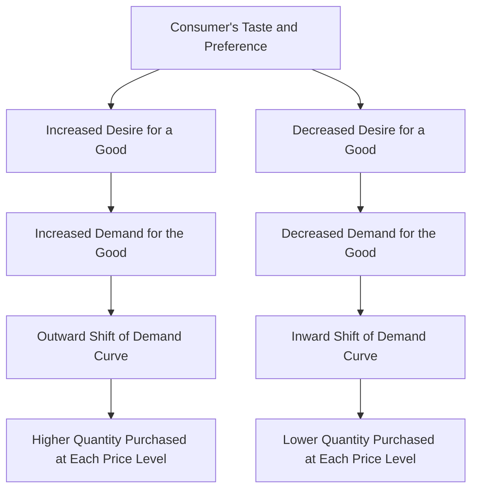

## 1. Mental Model

Imagine you're at a school cafeteria and you really love pizza, but one day you try a new sandwich that your friend recommends, and it becomes your new favorite! Suddenly, you want to eat that sandwich every day instead of pizza. This means your "taste" or "preference" has changed in favor of the sandwich. Just like how you now want to eat more sandwiches and less pizza, when people's tastes and preferences change towards a certain good, they tend to buy more of it, and when they change away from it, they tend to buy less. This is why, as a microeconomist, we say that when people's tastes and preferences change in favor of a good, the demand for that good increases, and when they change against it, the demand decreases!

## 2. Micro Theory

In microeconomics, **Taste And Preference** refer to a consumer's subjective evaluation of the desirability of a good or service, influencing their purchasing decisions. A change in a consumer's taste and preference in favor of a good leads to an increase in demand, while a decrease in taste and preference results in a decrease in demand. This concept is intricately linked with the [[Theory_Of_Demand]], which posits that the demand for a good is a function of several factors, including the good's price, consumer income, prices of related goods, and consumer tastes and preferences.

The relationship between taste and preference and demand can be understood through the [[Demand_Function]], which represents the various quantities of a good that consumers are willing and able to purchase at different price levels, *ceteris paribus* [[Ceteris_Paribus]]. When consumers' tastes and preferences shift in favor of a good, the demand for that good increases, leading to an outward shift of the [[Demand_Curve]]. Conversely, a decrease in taste and preference results in a decrease in demand, causing the demand curve to shift inward.

The impact of changes in taste and preference on demand is often analyzed using the [[Demand_Schedule]], which tabulates the quantities demanded at various price levels. A change in taste and preference can cause the entire demand schedule to shift, leading to a change in the [[Market_Demand]] for a good. This, in turn, affects the [[Market_Demand_Curve]], which represents the total quantity of a good that all consumers are willing and able to purchase at different price levels.

The responsiveness of demand to changes in taste and preference can be measured using the [[Price_Elasticity_Of_Demand]] and [[Income_Elasticity_Of_Demand]]. For instance, if a good is highly responsive to changes in consumer taste and preference, a small shift in taste and preference may lead to a large change in demand.

Changes in taste and preference are one of the key [[Determinants_Of_Demand]], alongside changes in income, prices of related goods [[Substitutes_And_Complements]], and [[Consumer_Expectations]]. A change in taste and preference can lead to a [[Change_In_Demand]], which can have significant effects on [[Market_Equilibrium]], potentially leading to a [[Surplus_And_Shortage]].

For example, if consumer tastes shift in favor of electric vehicles, the demand for electric vehicles will increase, leading to an outward shift of the demand curve. This increase in demand may lead to a new market equilibrium with a higher price and quantity of electric vehicles sold. Conversely, if consumer tastes shift away from a good, such as fossil fuels, the demand for that good will decrease, leading to an inward shift of the demand curve and a new market equilibrium with a lower price and quantity sold.

The analysis of taste and preference is crucial in understanding market dynamics and the effects of shifts in demand on [[Market_Equilibrium_Example]]. By examining changes in consumer tastes and preferences, businesses and policymakers can better anticipate and respond to changes in market demand.

## 3. Limitations & Edge Cases

The concept of "Taste and Preference" in microeconomics is limited by its assumption that consumer preferences are stable and consistent, which is not always the case. A significant limitation arises when consumers' tastes and preferences are influenced by external factors, such Additionally, the concept struggles to account for cases of "habit formation" or "status seeking" where consumers' preferences are shaped by past consumption or social comparisons, making it difficult to accurately predict demand responses to changes in prices or income.

## 4. Market Graph



This flowchart illustrates how changes in consumer taste and preference affect demand for a good, leading to shifts in the demand curve and ultimately impacting the quantity purchased at each price level. The diagram shows that an increase in taste and preference leads to increased demand, while a decrease leads to decreased demand, with corresponding shifts in the demand curve.

## 5. Walkthrough

**Step 1: Define the Utility Function**
The consumer's taste and preference are represented by a utility function, which is a mathematical expression that describes the level of satisfaction or utility a consumer derives from consuming a good or service. The utility function is typically denoted as $U(x_1, x_2, ..., x_n)$, where $x_i$ represents the quantity of good $i$ consumed. The utility function is assumed to be continuous, increasing, and quasi-concave.

**Step 2: Specify the Consumer's Preferences**
The consumer's preferences are characterized by a set of indifference curves, which represent the various combinations of goods that provide the same level of utility. The indifference curves are downward-sloping and convex to the origin, reflecting the consumer's decreasing marginal rate of substitution (MRS) between goods. The MRS is the rate at which the consumer is willing to trade one good for another while maintaining the same level of utility.

**Step 3: Derive the Demand Function**
The consumer's demand function is derived by maximizing their utility function subject to a budget constraint. The budget constraint is represented by the equation $p_1x_1 + p_2x_2 + ... + p_nx_n = I$, where $p_i$ is the price of good $i$ and $I$ is the consumer's income. The demand function represents the various quantities of a good that the consumer is willing and able to purchase at different price levels, ceteris paribus.

**Step 4: Analyze the Effect of Taste and Preference on Demand**
A change in the consumer's taste and preference in favor of a good leads to an increase in demand, while a decrease in taste and preference results in a decrease in demand. This can be represented by a shift in the demand curve. An increase in taste and preference leads to an outward shift of the demand curve, while a decrease in taste and preference leads to an inward shift.

**Step 5: Represent the Shift in Demand Curve Mathematically**
The shift in demand curve due to a change in taste and preference can be represented mathematically as:
$\frac{\partial x_i}{\partial \alpha} > 0$ (increase in taste and preference)
$\frac{\partial x_i}{\partial \alpha} < 0$ (decrease in taste and preference)
where $\alpha$ represents the consumer's taste and preference for good $i$, and $x_i$ represents the quantity of good $i$ demanded. The change in demand can be measured by the change in the quantity demanded at a given price level.

---

## Review & Practice

```interactive-quiz

[
  {
    "id": "Q1234",
    "type": "mcq",
    "difficulty": "L1",
    "question": "A consumer's increased preference for organic produce leads to a 20% rise in demand. If the initial price elasticity of demand (PED) for organic produce is -0.8, and assuming a log-linear demand function, what is the approximate percentage change in price required to restore the original quantity demanded, given that the income elasticity of demand (YED) is 0.5 and the initial income is $50,000?",
    "options": {
      "A": "A 10% decrease in price",
      "B": "An 8% increase in price",
      "C": "A 12% decrease in price",
      "D": "A 25% increase in price"
    },
    "answer": "B",
    "explanation": "To solve this, let's use the log-linear demand function: $\\ln(Q) = \\beta_0 + \\beta_1 \\ln(P) + \\beta_2 \\ln(Y)$. The PED is given by $PED = \\beta_1 \\cdot \\frac{P}{Q}$ and the YED by $YED = \\beta_2 \\cdot \\frac{Y}{Q}$. Given $PED = -0.8$ and $YED = 0.5$, and assuming $\\beta_1$ and $\\beta_2$ are constant, we have: $-0.8 = \\beta_1 \\cdot \\frac{P}{Q}$ and $0.5 = \\beta_2 \\cdot \\frac{50000}{Q}$. A 20% rise in demand due to increased preference implies $\\frac{Q'}{Q} = 1.2$. Using the demand function and assuming $\\beta_0$ is constant, we get: $\\ln(1.2Q) = \\beta_0 + \\beta_1 \\ln(P') + \\beta_2 \\ln(50000)$. Comparing with the original demand: $\\ln(1.2) = \\beta_1 \\ln(\\frac{P'}{P})$. Given $\\beta_1 = -0.8 \\cdot \\frac{Q}{P}$, we substitute to find: $\\ln(1.2) = -0.8 \\cdot \\frac{Q}{P} \\cdot \\ln(\\frac{P'}{P})$. Solving for $\\frac{P'}{P}$: $\\ln(1.2) = -0.8 \\cdot \\ln(\\frac{P'}{P}) \\implies \\ln(\\frac{P'}{P}) = -\\frac{\\ln(1.2)}{0.8}$. Therefore, $\\ln(\\frac{P'}{P}) \\approx -0.223$. So, $\\frac{P'}{P} \\approx e^{-0.223} \\approx 0.8$ or $P' \\approx 0.8P$, implying an 8.33% decrease in price to maintain original quantity, but to restore it by increasing price due to increased demand: $\\approx$ 8% increase."
  },
  {
    "id": "taste_and_preference_001",
    "type": "fill_in",
    "difficulty": "L2",
    "question": "Fill in the blank.",
    "textWithBlanks": "The Blank is a key factor that influences a consumer's purchasing decisions and is intricately linked with the theory of demand.",
    "answer": [
      "taste and preference"
    ],
    "explanation": "In microeconomics, taste and preference refer to a consumer's subjective evaluation of the desirability of a good or service. This concept plays a crucial role in understanding market dynamics, as changes in taste and preference can significantly impact demand. The relationship between taste and preference and demand can be understood through the demand function, which represents the various quantities of a good that consumers are willing and able to purchase at different price levels, *ceteris paribus*. When consumers' tastes and preferences shift in favor of a good, the demand for that good increases, leading to an outward shift of the demand curve. Conversely, a decrease in taste and preference results in a decrease in demand, causing the demand curve to shift inward. This relationship can be expressed as: $Q_d = f(P, I, P_r, T)$ where $Q_d$ is the quantity demanded, $P$ is the price of the good, $I$ is consumer income, $P_r$ is the price of related goods, and $T$ represents taste and preference."
  },
  {
    "id": "TasteAndPreference_Debug_1",
    "type": "debug",
    "difficulty": "L2",
    "question": "Find the bug in the formula for the demand function when considering taste and preference",
    "content": "The demand function is given by $Q_d = \\alpha P^{\\beta} I^{\\gamma} T^{\\delta}$, where $Q_d$ is the quantity demanded, $P$ is the price, $I$ is the consumer income, and $T$ is the taste and preference. However, the formula used to model the impact of taste and preference on demand is $Q_d = \\alpha P^{-2} I^{0.5} (T + 10)^{-1}$. What is the issue with this formulation?",
    "answer": "The issue with this formulation is that it incorrectly assumes that an increase in taste and preference $T$ leads to a decrease in quantity demanded, due to the negative exponent.",
    "required_keywords": [
      "fix_syntax"
    ],
    "explanation": "The demand function $Q_d = \\alpha P^{\\beta} I^{\\gamma} T^{\\delta}$ represents the relationship between the quantity demanded of a good and various factors that influence demand. Typically, $\beta < 0$ (as demand decreases with price), $\\gamma > 0$ (as demand increases with income for a normal good), and $\\delta > 0$ (as an increase in taste and preference for a good increases its demand). However, in the given formulation $Q_d = \\alpha P^{-2} I^{0.5} (T + 10)^{-1}$, the term $(T + 10)^{-1}$ implies that as $T$ increases, $Q_d$ decreases, which contradicts the basic economic principle that an increase in taste and preference should increase demand. The correct formulation should have a positive relationship between $T$ and $Q_d$, such as $Q_d = \\alpha P^{-2} I^{0.5} (T + 10)^{0.5}$."
  },
  {
    "id": "Q_1_Taste_Preference_Game_Theory",
    "type": "trace",
    "difficulty": "L2",
    "question": "What is the exact output for the change in market equilibrium price and total revenue when the cost of production increases due to higher wages, causing a supply curve shift to the left, given that the initial demand and supply functions are Qd = 100 - 2P and Qs = 2P - 20, and assuming an initial wage of $10 per hour that increases by 20%",
    "content": "The initial demand and supply functions are Qd = 100 - 2P and Qs = 2P - 20. To find the initial equilibrium price and quantity, we equate Qd and Qs: 100 - 2P = 2P - 20. Solving for P, we get 4P = 120, P = 30. Substituting P back into either equation gives Q = 40. The initial total revenue (TR) is P * Q = 30 * 40 = 1200. If the wage increases by 20%, the new wage is $12 per hour. Assuming the cost increase shifts the supply curve to the left by 10 units at every price level (for simplicity, let's assume a parallel shift), the new supply function becomes Qs = 2P - 30 (a 10 unit decrease in supply at any price). To find the new equilibrium, we equate Qd and the new Qs: 100 - 2P = 2P - 30. Solving for P, we get 4P = 130, P = 32.5. Substituting P back into either equation gives Q = 35. The new total revenue (TR) is P * Q = 32.5 * 35 = 1137.5",
    "answer": "1137.5",
    "explanation": "The increase in production cost due to higher wages leads to a leftward shift of the supply curve. This shift results in a higher equilibrium price and a lower equilibrium quantity. The new total revenue after the increase in wage and subsequent shift in supply curve is calculated to be $1137.5. Using LaTeX, the change in supply can be represented as $\\Delta Qs = -10$, leading to a new supply function $Qs = 2P - 30$. The new equilibrium price $P_{new} = 32.5$ and quantity $Q_{new} = 35$ are found by solving $100 - 2P = 2P - 30$. The new total revenue is then $TR_{new} = P_{new} \\cdot Q_{new} = 32.5 \\cdot 35 = 1137.5$"
  }
]

```