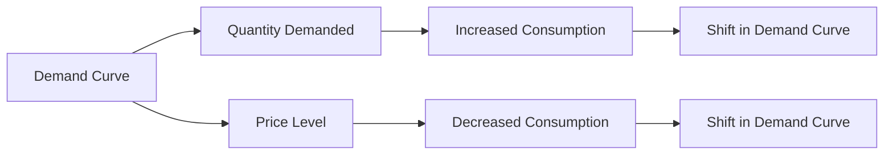

---

title: Theory_Of_Demand
type: Atomic Note
course: Economics
semester: Winter 2026
unit: '2'
hub: '[[2_Theory_Of_Demand_And_Supply_Hub]]'
source: '[[5-Pdf Store/note generated/Winter 2026/Economics/Chapter_2.pdf]]'
source_pages:
- 4
mode: ECON-MACRO
read: false
generated: true
prerequisites:
- '[[Ceteris_Paribus]]'
- '[[Demand_Schedule]]'
- '[[Demand_Curve]]'
- '[[Law_Of_Demand]]'
- '[[Price_Elasticity_Of_Demand]]'

---


# 1. Mental Model

Imagine you're at a school bake sale. The number of cupcakes you want to buy depends on their price. If they're very cheap, you might buy more, but if they're expensive, you might buy fewer or none at all. This is similar to how the Theory of Demand works: when prices go down, people usually want to buy more of something, and when prices go up, they want to buy less. The Theory of Demand is like a rule that explains how people decide to buy more or less of a product based on its price.

# 2. Economic Theory

The [[Theory_Of_Demand]] describes the relationship between the quantity demanded of a good and its price, assuming [[Ceteris_Paribus]], or that all other factors remain constant. This relationship is often represented by the [[Demand_Schedule]], which shows the quantities demanded at various price levels, and graphically depicted by the [[Demand_Curve]], which slopes downward, indicating that as the price of a good decreases, the quantity demanded increases, and vice versa. The underlying mechanism is based on the [[Law_Of_Demand]], which states that, ceteris paribus, the quantity demanded of a good is inversely related to its price. This inverse relationship is due to the [[Price_Elasticity_Of_Demand]], which measures how responsive the quantity demanded is to a change in price. The [[Demand_Function]] represents the relationship between the quantity demanded and its determinants, including price, [[Income_Elasticity_Of_Demand]], and [[Cross_Price_Elasticity]]. 

# 3. Market Failures

The [[Theory_Of_Demand]] has limitations, particularly when dealing with [[Inferior_Goods]] or [[Giffen_Goods]], where the [[Law_Of_Demand]] does not hold because the quantity demanded increases with price. Additionally, the assumption of [[Ceteris_Paribus]] often does not hold in real-world scenarios, where changes in [[Determinants_Of_Demand]], such as consumer preferences, income, or prices of [[Substitute_Goods]] and [[Complementary_Goods]], can shift the [[Demand_Curve]]. The theory also does not account for externalities or information asymmetry, which can lead to market failures and deviations from the predicted demand behavior. Furthermore, in situations like [[Market_Equilibrium]] disruptions or during [[Surplus_And_Shortage]] events, the [[Theory_Of_Demand]] may not accurately predict market outcomes without considering [[Effects_Of_Shift_In_Demand_And_Supply]].

# 4. Economic Model



This Mermaid flowchart illustrates the Theory of Demand, showing how the demand curve affects quantity demanded and price level, leading to changes in consumption patterns. The demand curve is a graphical representation of the relationship between the price of a good and the quantity demanded. 

## 5. Walkthrough

Here's a 5-step technical walkthrough of how the Theory of Demand operates:

1. **Initial Demand**: Assume the price of a product is $10, and the quantity demanded is 100 units. The demand curve shows an inverse relationship between price and quantity demanded.

2. **Price Change**: The price of the product decreases to $8. According to the Law of Demand, this decrease in price leads to an increase in the quantity demanded.

3. **Quantity Adjustment**: The quantity demanded increases to 120 units as consumers respond to the lower price by buying more of the product.

4. **Demand Curve Shift**: If other factors such as income or preferences change, the demand curve shifts. For example, if consumer income increases, the demand curve shifts to the right, indicating that at each price level, consumers are willing to buy more.

5. **New Equilibrium**: The market reaches a new equilibrium at a price of $8 and a quantity demanded of 120 units. This new equilibrium reflects the updated relationship between price and quantity demanded, as influenced by the Theory of Demand.

---

## 6. The Proving Grounds

```interactive-quiz
[
  {
    "id": "q1",
    "type": "mcq",
    "difficulty": "L1",
    "question": "Error generating question.",
    "answer": "N/A"
  },
  {
    "id": "q2",
    "type": "true_false",
    "difficulty": "L1",
    "question": "Error generating question.",
    "answer": "N/A"
  },
  {
    "id": "q3",
    "type": "synthesis",
    "difficulty": "L1",
    "question": "Error generating question.",
    "answer": "N/A"
  },
  {
    "id": "q4",
    "type": "trace",
    "difficulty": "L1",
    "question": "Error generating question.",
    "answer": "N/A"
  },
  {
    "id": "q5",
    "type": "order",
    "difficulty": "L1",
    "question": "Error generating question.",
    "answer": "N/A"
  }
]
```