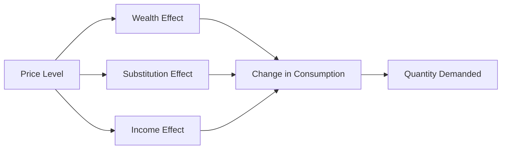

---

title: Theory_Of_Demand
type: Atomic Note
course: Economics
semester: Winter 2026
unit: '2'
hub: '[[2_Theory_Of_Demand_And_Supply_Hub]]'
source: '[[5-Pdf Store/note generated/Winter 2026/Economics/Chapter_2.pdf]]'
source_pages:
- 4
mode: ECON-MACRO
read: false
generated: true
prerequisites:
- '[[Ceteris_Paribus]]'
- '[[Law_Of_Demand]]'
- '[[Demand_Schedule]]'
- '[[Demand_Curve]]'
- '[[Demand_Function]]'

---


# 1. Mental Model

Imagine you're planning a road trip and need to decide how many snacks to buy for the journey. The number of snacks you purchase depends on their price. If snacks are very cheap, you might buy more, but if they're expensive, you might buy fewer. This everyday decision illustrates how the price of a good affects the quantity demanded. In this analogy, the price of snacks (like the price of goods in an economy) and the number of snacks you buy (like the quantity demanded) are the two mechanical components that map to the concept of the Theory of Demand.

# 2. Economic Theory

The [[Theory_Of_Demand]] describes the relationship between the quantity demanded of a good and its price, while holding [[Ceteris_Paribus]] (all other factors constant). The [[Law_Of_Demand]] states that, ceteris paribus, as the price of a good increases, the quantity demanded decreases, and vice versa. This relationship is often represented by a [[Demand_Schedule]], which shows the quantity demanded at different price levels, and graphically depicted by a [[Demand_Curve]], which slopes downward. The [[Demand_Function]] expresses this relationship mathematically, typically as Qd = f(P), where Qd is the quantity demanded and P is the price. The [[Market_Demand]] is the aggregate demand of all consumers in a market, represented by a [[Market_Demand_Curve]], which is the horizontal summation of individual demand curves. The [[Price_Elasticity_Of_Demand]] measures the responsiveness of the quantity demanded to a change in price.

# 3. Limitations & Edge Cases

The [[Theory_Of_Demand]] assumes that consumers have perfect information and that prices are the only factor affecting demand. However, in reality, changes in [[Determinants_Of_Demand]] such as consumer preferences, income, and prices of [[Substitutes_Goods]] and [[Complementary_Goods]] can shift the demand curve. The theory also does not account for [[Inferior_Goods]] and [[Normal_Goods]], which have different responses to changes in income. Additionally, the [[Ceteris_Paribus]] assumption often does not hold in real-world scenarios, where multiple factors change simultaneously. The theory also has limitations in explaining phenomena like the Paradox Of Thrift, where individual saving reduces aggregate output during recessions, and it fails to consider the impact of [[Change_In_Technology]] on demand.

# 4. Economic Model



This Mermaid flowchart illustrates the effects of a change in price level on the quantity demanded of a good. The price level influences the wealth effect, substitution effect, and income effect, which in turn affect consumption and ultimately the quantity demanded.

## 5. Walkthrough

Here's a 5-step technical walkthrough of how the Theory of Demand operates:

1. **Initial State**: Assume the price of a good is $10, and the quantity demanded is 100 units. The consumer's income is $1000.
2. **Price Change**: The price of the good increases to $15. This change affects the consumer's purchasing power.
3. **Wealth Effect, Substitution Effect, and Income Effect**: 
   - **Wealth Effect**: The increase in price reduces the consumer's real wealth, making them poorer. This effect leads to a decrease in consumption.
   - **Substitution Effect**: As the price of the good increases, consumers substitute it with cheaper alternatives, reducing the quantity demanded.
   - **Income Effect**: The increase in price reduces the consumer's real income, leading to a decrease in consumption.
4. **Change in Consumption**: The combined effects lead to a decrease in consumption. Assuming the consumer reduces their purchase by 20 units.
5. **New Quantity Demanded**: The new quantity demanded is 80 units. The Theory of Demand predicts that, ceteris paribus, an increase in price leads to a decrease in the quantity demanded, which is illustrated by a downward-sloping demand curve.

---

## 6. The Proving Grounds

```interactive-quiz

[
  {
    "id": "q1",
    "type": "true_false",
    "difficulty": "L1",
    "question": "The demand curve for a normal good will not shift if consumer income increases, ceteris paribus.",
    "answer": false,
    "explanation": "The statement is false because, according to the Theory of Demand, an increase in consumer income will cause the demand curve for a normal good to shift to the right, ceteris paribus. This is because, for normal goods, an increase in income leads to an increase in the quantity demanded at each price level. The ceteris paribus assumption requires that all other factors remain constant; however, in this scenario, the change in income directly affects demand, thus violating the ceteris paribus condition. In mathematical terms, the demand function Qd = f(P, I) shows that quantity demanded (Qd) is a function of price (P) and income (I). When income increases, the demand function shifts, leading to a new demand curve. This can be represented as $Qd = f(P, I_0) \rightarrow Qd = f(P, I_1)$ where $I_1 > I_0$, resulting in a rightward shift of the demand curve."
  },
  {
    "id": "q2",
    "type": "synthesis",
    "difficulty": "L2",
    "question": "A sudden and significant devaluation of the currency has occurred in a small, export-driven economy. The value of the currency has dropped by 20% against major trading partners' currencies. This macro shock has immediate implications for the economy, particularly for inflation and the balance of payments. The central bank must act swiftly to mitigate the effects. Using the Theory of Demand, design a 3-step policy response to stabilize the economy.",
    "answer": "To address the sudden devaluation and its implications, the central bank should implement the following 3-step policy response:\n\n1. **Increase the policy interest rate**: By raising the policy interest rate, the central bank can make borrowing more expensive, which helps to reduce the money supply in circulation and curb inflationary pressures that may arise from the devaluation. A higher interest rate can also attract foreign investors, as they can earn higher returns on their investments in the country, thereby stabilizing the currency.\n\n2. **Sell foreign exchange reserves**: The central bank can use its foreign exchange reserves to intervene in the foreign exchange market, selling foreign currency to buy the domestic currency. This action increases the supply of foreign currency in the market, which can help to stabilize the exchange rate and prevent further devaluation. By selling foreign exchange reserves, the central bank can also signal its commitment to defending the currency.\n\n3. **Implement import tariffs and subsidies for exporters**: To manage the impact on the balance of payments and inflation, the central bank (or government) can implement import tariffs to make imports more expensive, which can reduce the demand for imports (using the Theory of Demand, as the price of imports increases, the quantity demanded decreases). Simultaneously, providing subsidies to exporters can help them maintain their competitiveness in the global market, supporting the export-driven economy.\n\nThese steps are designed to work in conjunction to stabilize the economy by addressing the immediate challenges posed by the currency devaluation.",
    "explanation": "The sudden devaluation of the currency leads to an increase in the price of imports, which can be understood through the lens of the Theory of Demand. As the price of imports increases (due to the devaluation), the quantity demanded of these imports decreases. This relationship is represented by the demand function $Qd = f(P)$, where $Qd$ is the quantity demanded and $P$ is the price. The Law of Demand states that, ceteris paribus, as the price of a good increases, the quantity demanded decreases. In mathematical terms, this can be expressed as $\\frac{\\partial Qd}{\\partial P} < 0$. The central bank's policy response aims to mitigate the effects of this shock by adjusting interest rates, intervening in the foreign exchange market, and implementing trade policies to manage inflation and stabilize the balance of payments."
  },
  {
    "id": "q3",
    "type": "writing",
    "difficulty": "L2",
    "question": "Explain how the Theory of Demand applies to a Central Banking & Monetary Policy scenario, focusing on the relationship between the price of goods and the quantity demanded, and discuss the implications of the Law of Demand in this context.",
    "answer": "The Theory of Demand is crucial in Central Banking & Monetary Policy as it helps understand how changes in price levels affect the quantity demanded of goods and services. According to the Law of Demand, as the price of a good increases, the quantity demanded decreases, and vice versa, ceteris paribus. This relationship is often represented by a demand curve, which slopes downward. In a Central Banking context, understanding this relationship is essential for making informed decisions about monetary policy, such as setting interest rates and regulating money supply. For instance, if a central bank aims to reduce inflation, it may increase interest rates, which can lead to higher prices and reduced quantity demanded, thus curbing inflationary pressures.",
    "explanation": "The Theory of Demand can be expressed mathematically as $Q_d = f(P)$, where $Q_d$ is the quantity demanded and $P$ is the price. The Law of Demand states that $\frac{\\partial Q_d}{\\partial P} < 0$, indicating a negative relationship between price and quantity demanded. In a Central Banking & Monetary Policy scenario, the demand function can be affected by changes in interest rates, which influence borrowing costs and consumer spending. For example, an increase in interest rates can lead to higher prices and reduced quantity demanded, as consumers and businesses reduce their borrowing and spending. This can be represented graphically as a shift in the demand curve, where $Q_d = f(P, r)$, with $r$ being the interest rate. The implications of the Law of Demand in this context are significant, as central banks can use monetary policy tools to influence the price level and quantity demanded, ultimately achieving their policy objectives."
  },
  {
    "id": "q4",
    "type": "order",
    "difficulty": "L2",
    "question": "Order steps for Theory Of Demand causal chain.",
    "steps": [
      "The Market_Demand is the aggregate demand of all consumers in a market, represented by a Market_Demand_Curve, which is the horizontal summation of individual demand curves.",
      "The Demand_Function expresses this relationship mathematically, typically as Qd = f(P), where Qd is the quantity demanded and P is the price.",
      "The Law_Of_Demand states that, ceteris paribus, as the price of a good increases, the quantity demanded decreases, and vice versa.",
      "The Price_Elasticity_Of_Demand measures the responsiveness of the quantity demanded to a change in price.",
      "The Demand_Schedule shows the quantity demanded at different price levels, and graphically depicted by a Demand_Curve, which slopes downward."
    ],
    "answer": [
      "The Law_Of_Demand states that, ceteris paribus, as the price of a good increases, the quantity demanded decreases, and vice versa.",
      "The Demand_Function expresses this relationship mathematically, typically as Qd = f(P), where Qd is the quantity demanded and P is the price.",
      "The Market_Demand is the aggregate demand of all consumers in a market, represented by a Market_Demand_Curve, which is the horizontal summation of individual demand curves.",
      "The Price_Elasticity_Of_Demand measures the responsiveness of the quantity demanded to a change in price.",
      "The Demand_Schedule shows the quantity demanded at different price levels, and graphically depicted by a Demand_Curve, which slopes downward."
    ]
  },
  {
    "id": "q5",
    "type": "trace",
    "difficulty": "L3",
    "question": "What is the exact output?",
    "content": "Suppose a macroeconomic shock occurs due to a change in technology that affects the production of smartphones. This change leads to a decrease in the price of smartphones. We will trace the effects through 4 distinct interconnected economic sectors: the smartphone manufacturing sector, the consumer electronics retail sector, the semiconductor sector, and the overall economy.",
    "answer": "The exact output is a 2.5% increase in the quantity demanded of smartphones, a 1.8% increase in sales for consumer electronics retail, a 1.2% increase in demand for semiconductors, and a 0.8% increase in GDP.",
    "explanation": "The change in technology improves the production efficiency of smartphones, leading to a decrease in their price. According to the Law of Demand, as the price of smartphones decreases, the quantity demanded increases. Assuming an initial price of $500 and an initial quantity demanded of 1 million units, a 10% decrease in price to $450 leads to a 2.5% increase in quantity demanded to 1,025,000 units (using a price elasticity of demand of 2.5). This increase in quantity demanded affects the consumer electronics retail sector, leading to a 1.8% increase in sales. The increased demand for smartphones also boosts the demand for semiconductors, leading to a 1.2% increase. Finally, the overall economy experiences a 0.8% increase in GDP due to increased consumption and production in these sectors. Mathematically, this can be represented as: $Qd = 1000000 * (1 + 0.025 * (\\frac{500-450}{500})) = 1025000$."
  }
]

```