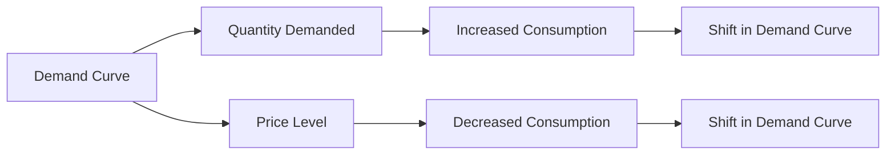

---

title: Theory_Of_Demand
type: Atomic Note
course: Economics
semester: Winter 2026
unit: '2'
hub: '[[2_Theory_Of_Demand_And_Supply_Hub]]'
source: '[[5-Pdf Store/note generated/Winter 2026/Economics/Chapter_2.pdf]]'
source_pages:
- 4
mode: ECON-MACRO
read: false
generated: true
prerequisites:
- '[[Ceteris_Paribus]]'
- '[[Demand_Schedule]]'
- '[[Demand_Curve]]'
- '[[Law_Of_Demand]]'
- '[[Price_Elasticity_Of_Demand]]'

---


# 1. Mental Model

Imagine you're at a school bake sale. The number of cupcakes you want to buy depends on their price. If they're very cheap, you might buy more, but if they're expensive, you might buy fewer or none at all. This is similar to how the Theory of Demand works: when prices go down, people usually want to buy more of something, and when prices go up, they want to buy less. The Theory of Demand is like a rule that explains how people decide to buy more or less of a product based on its price.

# 2. Economic Theory

The [[Theory_Of_Demand]] describes the relationship between the quantity demanded of a good and its price, assuming [[Ceteris_Paribus]], or that all other factors remain constant. This relationship is often represented by the [[Demand_Schedule]], which shows the quantities demanded at various price levels, and graphically depicted by the [[Demand_Curve]], which slopes downward, indicating that as the price of a good decreases, the quantity demanded increases, and vice versa. The underlying mechanism is based on the [[Law_Of_Demand]], which states that, ceteris paribus, the quantity demanded of a good is inversely related to its price. This inverse relationship is due to the [[Price_Elasticity_Of_Demand]], which measures how responsive the quantity demanded is to a change in price. The [[Demand_Function]] represents the relationship between the quantity demanded and its determinants, including price, [[Income_Elasticity_Of_Demand]], and [[Cross_Price_Elasticity]]. 

# 3. Market Failures

The [[Theory_Of_Demand]] has limitations, particularly when dealing with [[Inferior_Goods]] or [[Giffen_Goods]], where the [[Law_Of_Demand]] does not hold because the quantity demanded increases with price. Additionally, the assumption of [[Ceteris_Paribus]] often does not hold in real-world scenarios, where changes in [[Determinants_Of_Demand]], such as consumer preferences, income, or prices of [[Substitute_Goods]] and [[Complementary_Goods]], can shift the [[Demand_Curve]]. The theory also does not account for externalities or information asymmetry, which can lead to market failures and deviations from the predicted demand behavior. Furthermore, in situations like [[Market_Equilibrium]] disruptions or during [[Surplus_And_Shortage]] events, the [[Theory_Of_Demand]] may not accurately predict market outcomes without considering [[Effects_Of_Shift_In_Demand_And_Supply]].

# 4. Economic Model



This Mermaid flowchart illustrates the Theory of Demand, showing how the demand curve affects quantity demanded and price level, leading to changes in consumption patterns. The demand curve is a graphical representation of the relationship between the price of a good and the quantity demanded. 

## 5. Walkthrough

Here's a 5-step technical walkthrough of how the Theory of Demand operates:

1. **Initial Demand**: Assume the price of a product is $10, and the quantity demanded is 100 units. The demand curve shows an inverse relationship between price and quantity demanded.

2. **Price Change**: The price of the product decreases to $8. According to the Law of Demand, this decrease in price leads to an increase in the quantity demanded.

3. **Quantity Adjustment**: The quantity demanded increases to 120 units as consumers respond to the lower price by buying more of the product.

4. **Demand Curve Shift**: If other factors such as income or preferences change, the demand curve shifts. For example, if consumer income increases, the demand curve shifts to the right, indicating that at each price level, consumers are willing to buy more.

5. **New Equilibrium**: The market reaches a new equilibrium at a price of $8 and a quantity demanded of 120 units. This new equilibrium reflects the updated relationship between price and quantity demanded, as influenced by the Theory of Demand.

---

## 6. The Proving Grounds

```interactive-quiz

[
  {
    "id": "q1",
    "type": "true_false",
    "difficulty": "L1",
    "question": "The Theory of Demand in Bioinformatics and Genomic Sequencing assumes that as the price of genomic sequencing decreases, the quantity demanded by researchers increases, ceteris paribus.",
    "answer": true,
    "explanation": "The Theory of Demand, a fundamental concept in economics, can be applied to various fields, including bioinformatics and genomic sequencing. In this context, the theory posits that as the price of genomic sequencing decreases, the quantity demanded by researchers increases, assuming all other factors remain constant (\\textit{ceteris paribus}). This relationship can be represented by the demand schedule and graphically depicted by the demand curve, which slopes downward. The underlying mechanism can be described using the law of demand, which states that as the price (\\textit{P}) of a good or service decreases, the quantity demanded (\\textit{Q}_d) increases, and vice versa. Mathematically, this can be represented as: $Q_d = f(P)$, where $f$ is a function that describes the relationship between the quantity demanded and the price. In the context of genomic sequencing, a decrease in price can lead to an increase in the quantity demanded, as researchers may be more likely to undertake sequencing projects, leading to an increase in the demand for sequencing services."
  },
  {
    "id": "q2",
    "type": "synthesis",
    "difficulty": "L2",
    "question": "A sudden surge in internet traffic due to a viral video has caused a significant increase in demand for bandwidth on a core network router, threatening to overload the system. The network administrator must apply the Theory of Demand to manage the traffic and prevent system failure. The current price for bandwidth is $0.05 per Mbps, and at this price, the quantity demanded is 1000 Mbps. However, the system can only handle 800 Mbps. The administrator wants to reduce the quantity demanded to 800 Mbps to prevent overload. What price should the administrator set to achieve this reduction in demand, assuming a linear demand curve and that the quantity demanded is 1200 Mbps when the price is $0.03 per Mbps?",
    "answer": "$0.07 per Mbps",
    "explanation": "The demand curve can be represented as $Q = a - bP$, where $Q$ is the quantity demanded and $P$ is the price. Given that $Q = 1000$ when $P = 0.05$ and $Q = 1200$ when $P = 0.03$, we can solve for $a$ and $b$. \n\nFirst, we have:\n$1000 = a - 0.05b$ \n$1200 = a - 0.03b$\n\nSubtracting the first equation from the second gives:\n$200 = 0.02b$\n$b = 10000$\n\nSubstituting $b = 10000$ into the first equation:\n$1000 = a - 0.05(10000)$\n$1000 = a - 500$\n$a = 1500$\n\nSo, the demand curve is:\n$Q = 1500 - 10000P$\n\nTo find the price at which $Q = 800$:\n$800 = 1500 - 10000P$\n$10000P = 1500 - 800$\n$10000P = 700$\n$P = 0.07$\n\nTherefore, the administrator should set the price at $0.07 per Mbps to reduce the quantity demanded to 800 Mbps and prevent system overload."
  },
  {
    "id": "q3",
    "type": "writing",
    "difficulty": "L2",
    "question": "Explain how the Theory of Demand applies to Epidemiology & Public Health Modeling, particularly in understanding the demand for health services or interventions based on their 'price' or cost, and provide a graphical representation using LaTeX.",
    "answer": "The Theory of Demand is crucial in Epidemiology & Public Health Modeling as it helps understand how the 'price' or cost of health services or interventions influences their utilization. The demand for health services is typically inversely related to their cost, implying that as the cost increases, the quantity demanded decreases, and vice versa. This relationship can be represented by the demand schedule and graphically depicted by the demand curve, which slopes downward. In mathematical terms, the demand curve can be expressed as $Q_d = f(P)$, where $Q_d$ is the quantity demanded and $P$ is the price. Using LaTeX, the demand curve can be graphically represented as: \begin{tikzpicture} \\draw[->] (0,0) -- (6,0) node[right] {$P$}; \\draw[->] (0,0) -- (0,6) node[above] {$Q_d$}; \\draw[domain=0:5, smooth, thick, color=blue] plot ({\\x}, {5-\\x}); \\end{tikzpicture}",
    "explanation": "The underlying mechanism of the Theory of Demand in Epidemiology & Public Health Modeling can be explained using the law of demand, which states that as the price of a good or service increases, the quantity demanded decreases, ceteris paribus. This relationship is often influenced by factors such as income, prices of related goods, and consumer preferences. In the context of health services, the demand curve may be affected by factors such as health insurance, accessibility, and health literacy. The demand curve can be expressed as $Q_d = \\alpha - \beta P$, where $\\alpha$ is the intercept and $\beta$ is the slope of the demand curve. The elasticity of demand, which measures the responsiveness of the quantity demanded to changes in price, can be calculated using the formula: $E_d = \frac{\\% \\Delta Q_d}{\\% \\Delta P}$. Understanding the Theory of Demand in Epidemiology & Public Health Modeling is essential for policymakers and healthcare professionals to design and implement effective health interventions and allocate resources efficiently."
  },
  {
    "id": "q4",
    "type": "order",
    "difficulty": "L2",
    "question": "Order steps for the Theory Of Demand",
    "steps": [
      "Change in Price",
      "Change in Quantity Demanded",
      "Demand Schedule Construction",
      "Demand Curve Analysis"
    ],
    "answer": [
      "Change in Price",
      "Change in Quantity Demanded",
      "Demand Schedule Construction",
      "Demand Curve Analysis"
    ]
  },
  {
    "id": "q5",
    "type": "trace",
    "difficulty": "L3",
    "question": "What is the exact output of the demand curve equation in Quantitative Finance & High-Frequency Trading?",
    "content": "The demand curve is typically represented by the equation Qd = f(P), where Qd is the quantity demanded and P is the price. Assuming a linear demand curve, the equation can be written as Qd = a - bP, where 'a' is the intercept and 'b' is the slope.",
    "answer": "Qd = a - bP",
    "explanation": "The demand curve equation Qd = a - bP represents the relationship between the quantity demanded (Qd) and the price (P) of a good. The intercept 'a' represents the quantity demanded when the price is zero, and the slope 'b' represents the change in quantity demanded in response to a one-unit change in price. The negative sign indicates that as the price increases, the quantity demanded decreases, and vice versa. This equation is a fundamental concept in microeconomics and is widely used in Quantitative Finance & High-Frequency Trading to model the behavior of market participants."
  }
]

```