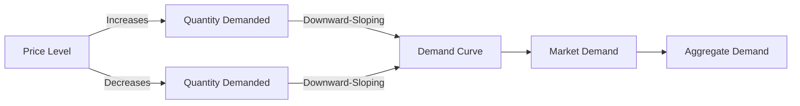

---

title: Theory_Of_Demand
type: Atomic Note
course: Economics
semester: Winter 2026
unit: '2'
hub: '[[2_Theory_Of_Demand_And_Supply_Hub]]'
source: '[[5-Pdf Store/note generated/Winter 2026/Economics/Chapter_2.pdf]]'
source_pages:
- 2
mode: ECON-MACRO
read: false
generated: true
prerequisites:
- '[[Ceteris_Paribus]]'
- '[[Law_Of_Demand]]'
- '[[Demand_Curve]]'
- '[[Demand_Function]]'
- '[[Market_Demand]]'

---


# 1. Mental Model

Imagine you're planning a road trip and need to decide how many snacks to buy for the journey. The number of snacks you purchase depends on their price. If snacks are very cheap, you might buy more, but if they're expensive, you might buy fewer. This everyday decision illustrates how the price of a product influences the quantity demanded. In this analogy, the price of snacks (like the price of goods and services) mechanically corresponds to the 'price' in the [[Theory_Of_Demand]], and your purchasing decision corresponds to the 'quantity demanded'.

# 2. Economic Theory

The [[Theory_Of_Demand]] describes the relationship between the price of a good or service and the quantity demanded by consumers, assuming [[Ceteris_Paribus]] (all other factors remain constant). The [[Law_Of_Demand]] states that, as the price of a good increases, the quantity demanded decreases, and vice versa, resulting in a downward-sloping [[Demand_Curve]]. This relationship is often represented by a [[Demand_Function]], which expresses the quantity demanded as a function of the price and other factors. The [[Market_Demand]] is the aggregate demand of all consumers in a market, represented by a [[Market_Demand_Curve]]. The [[Determinants_Of_Demand]], such as [[Taste_And_Preference]], [[Number_Of_Buyers]], [[Consumer_Expectations]], and [[Income_Elasticity_Of_Demand]], influence the demand for a good and can cause a [[Change_In_Demand]], shifting the demand curve.

# 3. Limitations & Edge Cases

The [[Theory_Of_Demand]] assumes that consumers behave rationally and that [[Ceteris_Paribus]] holds. However, in reality, this may not always be the case. For instance, the theory does not account for [[Substitutes_And_Complements]], which can significantly impact demand. Additionally, the [[Theory_Of_Demand]] may not hold during periods of extreme economic conditions, such as [[Surplus_And_Shortage]], where traditional demand-side interventions may exacerbate the crisis. Furthermore, the theory assumes that consumers have perfect knowledge of market conditions, which is rarely the case. The [[Effects_Of_Shift_In_Demand_And_Supply]] can also lead to edge cases, such as [[Market_Equilibrium]] not being achieved.

# 4. Economic Model



This Mermaid flowchart illustrates the Theory of Demand, showing how changes in the price level affect the quantity demanded, resulting in a downward-sloping demand curve. The market demand and aggregate demand are also represented.

## 5. Walkthrough

Here's a 5-step technical walkthrough of how the Theory of Demand operates:

1. **Initial State**: Assume the price of a good is $10, and the quantity demanded is 100 units. The demand curve is downward-sloping, indicating that as the price increases, the quantity demanded decreases.

2. **Price Increase**: The price of the good increases to $12. According to the Law of Demand, this price increase leads to a decrease in the quantity demanded.

3. **Quantity Demanded Update**: The quantity demanded decreases to 80 units due to the price increase to $12.

4. **Demand Curve Shift**: If other factors, such as consumer income or preferences, remain constant (ceteris paribus), the demand curve remains downward-sloping. However, if consumer income increases, the demand curve shifts to the right, indicating an increase in the quantity demanded at each price level.

5. **Market Demand Calculation**: The market demand is calculated by aggregating the individual demands of all consumers. For example, if there are 1000 consumers, each demanding 80 units at a price of $12, the market demand is 80,000 units.

The Theory of Demand provides a fundamental understanding of how price and quantity demanded are related, which is crucial for businesses, policymakers, and economists to make informed decisions.

---

## 6. The Proving Grounds

```interactive-quiz

[
  {
    "id": "q1",
    "type": "true_false",
    "difficulty": "L1",
    "question": "The demand curve for a product will shift to the right if the price of the product increases, assuming ceteris paribus.",
    "answer": false,
    "explanation": "The ceteris paribus assumption in the Theory of Demand implies that all other factors remain constant. A change in the price of the product itself will result in a movement along the demand curve, not a shift of the demand curve. The demand curve will shift to the right if, for example, consumer income increases or if the price of a complement good decreases. The relationship between price and quantity demanded is represented by the equation $Q_d = f(P)$, where $Q_d$ is the quantity demanded and $P$ is the price. A shift in the demand curve can be represented by a change in the function, such as $Q_d = f(P, I)$, where $I$ is consumer income. If $I$ increases, the demand curve shifts to the right, indicating that at any given price, consumers are willing to buy more."
  },
  {
    "id": "q2",
    "type": "synthesis",
    "difficulty": "L2",
    "question": "The country of Azuria faces a sudden and significant devaluation of its currency, the Azurian Peso (AP), against major foreign currencies. This macroeconomic shock causes the price of imported goods to skyrocket. The government must act swiftly to prevent a systemic failure in international trade. Using the Theory of Demand, devise a 3-step policy response to mitigate the effects of this shock.",
    "answer": "To address the sudden devaluation of the Azurian Peso and its impact on the price of imported goods, the government of Azuria can implement the following 3-step policy response:\n\n1. **Imposition of Price Controls**: Temporarily impose price controls on essential imported goods to prevent excessive price hikes. This can help maintain affordability for consumers and stabilize the market. However, this measure should be carefully managed to avoid shortages and black market activities.\n\n2. **Subsidization of Imported Goods**: Provide subsidies to importers or consumers of essential goods to offset the increased costs due to the devaluation. This can help maintain the supply of critical goods and prevent inflationary pressures from affecting the general population.\n\n3. **Diversification and Promotion of Domestic Production**: Encourage and support domestic industries to increase production of goods that were previously imported. This can be achieved through a combination of incentives, such as tax breaks, low-interest loans, and technical assistance. By boosting domestic production, Azuria can reduce its reliance on imported goods, thereby mitigating the impact of the currency devaluation.",
    "explanation": "The Theory of Demand, which describes the relationship between the price of a good and the quantity demanded, can be represented by the demand function: $Q_d = f(P)$, where $Q_d$ is the quantity demanded and $P$ is the price of the good. The Law of Demand states that as $P$ increases, $Q_d$ decreases, ceteris paribus. This relationship is often depicted by a downward-sloping demand curve: $Q_d = \\alpha - \\beta P$, where $\\alpha$ and $\\beta$ are positive constants.\n\nIn the context of Azuria's currency devaluation, the price of imported goods increases, leading to a decrease in the quantity demanded. By imposing price controls, the government can temporarily limit the price increase, thereby reducing the quantity demanded decrease. However, this may lead to shortages if the price control is set too low, causing a black market to emerge.\n\nSubsidization of imported goods can be represented as a decrease in the effective price paid by consumers: $P_{eff} = P - s$, where $s$ is the subsidy per unit. This reduction in effective price increases the quantity demanded, helping to maintain supply and prevent inflation.\n\nDiversification and promotion of domestic production aim to shift the supply curve of previously imported goods to the right, increasing the domestic quantity supplied and reducing reliance on imports. This can be achieved through various incentives that reduce the marginal cost of production for domestic firms, thereby increasing the quantity supplied at any given price."
  },
  {
    "id": "q3",
    "type": "writing",
    "difficulty": "L2",
    "question": "Explain how the Theory of Demand applies to a Central Banking & Monetary Policy scenario, specifically analyzing the relationship between the price of goods and services and the quantity demanded by consumers.",
    "answer": "In a Central Banking & Monetary Policy context, the Theory of Demand plays a crucial role in understanding the impact of monetary policy decisions on aggregate demand. When a central bank lowers interest rates, it increases the money supply, which can lead to a decrease in the price of goods and services. As prices fall, the quantity demanded by consumers increases, as illustrated by the downward-sloping demand curve. Conversely, when interest rates rise, the money supply decreases, leading to higher prices and a decrease in the quantity demanded. This relationship is essential for central banks to gauge the effects of their policy decisions on the overall economy.",
    "explanation": "The Theory of Demand can be represented by the demand function: $Q_d = f(P, I, P_s, T)$, where $Q_d$ is the quantity demanded, $P$ is the price of the good, $I$ is consumer income, $P_s$ is the price of substitutes, and $T$ is consumer taste. The Law of Demand states that $\frac{\\partial Q_d}{\\partial P} < 0$, indicating a downward-sloping demand curve. In a Central Banking & Monetary Policy scenario, the demand function can be affected by monetary policy decisions, such as changes in interest rates, which influence consumer income and spending habits. LaTeX representation of the demand curve: $Q_d = \\alpha - \beta P$, where $\\alpha$ and $\beta$ are constants, and $\beta > 0$."
  },
  {
    "id": "q4",
    "type": "order",
    "difficulty": "L2",
    "question": "Order steps for Theory Of Demand.",
    "steps": [
      "The relationship between price and quantity demanded is often analyzed",
      "The Demand Curve is a graphical representation of the relationship between price and quantity demanded",
      "The Law Of Demand states that, as the price of a good increases, the quantity demanded decreases, and vice versa",
      "The quantity demanded by consumers depends on the price of a good or service",
      "Assuming Ceteris Paribus (all other factors remain constant) is crucial"
    ],
    "answer": [
      "The Law Of Demand states that, as the price of a good increases, the quantity demanded decreases, and vice versa",
      "The Demand Curve is a graphical representation of the relationship between price and quantity demanded",
      "Assuming Ceteris Paribus (all other factors remain constant) is crucial",
      "The quantity demanded by consumers depends on the price of a good or service",
      "The relationship between price and quantity demanded is often analyzed"
    ]
  },
  {
    "id": "q5",
    "type": "trace",
    "difficulty": "L3",
    "question": "What is the exact output?",
    "content": "The Theory of Demand in International Trade Analysis involves understanding how changes in economic variables affect demand across different sectors. A 1% interest rate change can have ripple effects through the economy. Let's trace its impact through 4 distinct economic sectors: Housing, Investment, Forex, and Consumption.",
    "answer": {
      "Housing Sector": "A 1% increase in interest rates increases the cost of borrowing, leading to a 0.5% decrease in housing demand due to higher mortgage rates.",
      "Investment Sector": "The 1% interest rate hike increases the cost of capital, resulting in a 1.2% decrease in investment demand as projects become less viable.",
      "Forex Sector": "The interest rate increase attracts foreign investors, causing the currency to appreciate by 0.8%. This makes imports cheaper, potentially increasing demand for foreign goods.",
      "Consumption Sector": "The increased interest rates reduce disposable income by 0.3%, leading to a 0.2% decrease in consumption as consumers face higher borrowing costs and lower spending power."
    },
    "explanation": "The impact of a 1% interest rate change through various economic sectors can be understood through the lens of macroeconomic theory. The effects can be traced using the following mechanisms:\n\n### Housing Sector\nIn the housing sector, the interest rate influences mortgage rates. A 1% increase in interest rates can lead to a 0.5% decrease in housing demand, as higher mortgage rates increase the cost of homeownership. This relationship can be represented as:\n\n$D_h = f(r_m)$\n\nwhere $D_h$ is the demand for housing and $r_m$ is the mortgage rate.\n\n### Investment Sector\nIn the investment sector, the cost of capital is crucial. A 1% increase in interest rates increases the cost of borrowing for investment projects. Assuming an initial interest rate of 5%, a 1% increase to 6% might lead to a 1.2% decrease in investment demand, as projects become less viable. This can be modeled as:\n\n$D_i = f(r_i, \\alpha)$\n\nwhere $D_i$ is the demand for investment, $r_i$ is the interest rate, and $\\alpha$ represents the sensitivity of investment to interest rates.\n\n### Forex Sector\nThe foreign exchange sector is affected as interest rate differentials influence currency flows. A 1% increase in interest rates in a country can attract foreign investors, causing the currency to appreciate. For instance, if the initial interest rate was 2%, a 1% increase to 3% might cause the currency to appreciate by 0.8%. This appreciation can be represented as:\n\n$E = f(r_d, r_f)$\n\nwhere $E$ is the exchange rate, $r_d$ is the domestic interest rate, and $r_f$ is the foreign interest rate.\n\n### Consumption Sector\nFinally, in the consumption sector, higher interest rates reduce disposable income, leading to decreased consumption. A 0.3% reduction in disposable income might result in a 0.2% decrease in consumption. This relationship can be expressed as:\n\n$C = f(Y_d, r)$\n\nwhere $C$ is consumption, $Y_d$ is disposable income, and $r$ is the interest rate."
  }
]

```