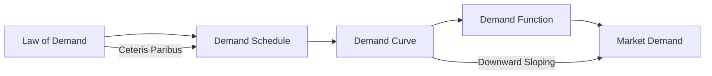

---

title: Theory_Of_Demand
course: Economics
unit: '2'
semester: Winter 2026
mode: ECON-MICRO
type: atomic_note
hub: '[[2_Theory_Of_Demand_And_Supply_Hub]]'
source: '[[5-Pdf Store/note generated/Winter 2026/Economics/Chapter_2.pdf]]'
date: '2026-05-08'
prerequisites:
- '[[Ceteris_Paribus]]'
- '[[Law_Of_Demand]]'
- '[[Demand_Schedule]]'
- '[[Demand_Curve]]'
- '[[Demand_Function]]'
source_pages:
- 2
generated: true

---


## 1. Mental Model

Imagine you're at a candy store and your favorite lollipops are on sale for $1 each. You really want 5 of them, but if the store owner suddenly says, "Oops, I'm feeling generous, I'll give you 5 lollipops for 50 cents each!" You'd probably want even more than 5, right? But now imagine the store owner says, "Actually, I'm not feeling so generous, 5 lollipops will cost you $5 each!" You'd probably want fewer than 5. That's kind of like the theory of demand. When the price of something (like lollipops) goes down, people want more of it, and when the price goes up, people want less of it. This is called the law of demand, and it helps us understand how people make choices about what to buy when prices change.

## 2. Micro Theory

The Theory Of Demand is a fundamental concept in microeconomics that examines the relationship between the quantity demanded of a good or service and its price, while holding all other influencing factors constant, as per the [[Ceteris_Paribus]] assumption. This theory is built on the [[Law_Of_Demand]], which states that, ceteris paribus, as the price of a good or service increases, the quantity demanded decreases, and vice versa. 

The demand for a good or service can be represented by a [[Demand_Schedule]], which is a table that shows the quantity demanded at various price levels. When graphically illustrated, the demand schedule becomes a [[Demand_Curve]], typically downward sloping, indicating that as price increases, quantity demanded decreases. The demand curve can be expressed as a [[Demand_Function]], which mathematically represents the relationship between the quantity demanded and its determinants, primarily the price of the good.

The [[Market_Demand]] refers to the total quantity of a good or service that all consumers are willing and able to buy at various price levels. The graphical representation of market demand is the [[Market_Demand_Curve]], which is the horizontal summation of individual demand curves. 

The responsiveness of the quantity demanded to changes in price is meaOther elasticities, such as [[Income_Elasticity_Of_Demand]], which measures the responsiveness of quantity demanded to changes in consumers' income, provide further insights into consumer behavior.

The [[Determinants_Of_Demand]] include factors other than price that influence the quantity demanded, such as [[Substitutes_And_Complements]], [[Normal_And_Inferior_Goods]], [[Consumer_Expectations]], [[Number_Of_Buyers]], and [[Taste_And_Preference]]. A change in any of these determinants leads to a [[Change_In_Demand]], which is graphically represented as a shift in the demand curve.

The interplay between demand and supply in a market leads to the establishment of [[Market_Equilibrium]], where the quantity demanded equals the quantity supplied. When the quantity demanded exceeds the quantity supplied, a Surplus And Shortage|shortage occurs, and when the quantity supplied exceeds the quantity demanded, a surplus occurs. 

Understanding the Theory Of Demand, along with the [[Change_In_Technology]] and [[Shift_In_Supply_Curve]], and their effects on market equilibrium through the [[Effects_Of_Shift_In_Demand_And_Supply]], provides valuable insights into how markets operate and how changes in market conditions affect prices and quantities of goods and services exchanged.

Moreover, the supply side of the market, which includes the [[Elasticity_Of_Supply]] and its [[Price_Elasticity_Of_Supply_Formula]], as well as the [[Determinants_Of_Elasticity_Of_Supply]], plays a crucial role in determining market outcomes. The dynamics between demand and supply forces shape the market prices and quantities, underscoring the importance of the Theory Of Demand in economic analysis.

## 3. Limitations & Edge Cases

The Theory of Demand has several limitations, particularly in its assumptions of rational consumer behavior and the ceteris paribus condition, which assumes that all other factors affecting demand remain constant. In reality, consumers may not always act rationally, and factors such as advertising, consumer preferences, and income distribution can influence demand. Additionally, the theory assumes that goods are homogeneous, which may not hold true for differentiated products. Furthermore, the theory does not account for the presence of inferior goods, Giffen goods, or Veblen goods, which can exhibit unusual demand behavior. Moreover, the theory is also limited in its ability to explain demand in situations where there are supply chain disruptions, market power imbalances, or external shocks, which can lead to deviations from the law of demand. Overall, while the Theory of Demand provides a useful framework for understanding the relationship between price and quantity demanded, it has limitations in capturing the complexities of real-world markets.

## 4. Market Graph



The provided Mermaid flowchart illustrates the key components of the Theory of Demand, starting with the Law of Demand and leading to the Market Demand, with intermediate steps including the Demand Schedule, Demand Curve, and Demand Function. The flowchart highlights the critical assumption of Ceteris Paribus and the characteristic downward-sloping nature of the Demand Curve.

## 5. Walkthrough

Here is a 5-step technical walkthrough of the Theory of Demand:

**Step 1: Establish the Demand Schedule**
The demand schedule is a table that shows the quantity demanded at various price levels. For example, assume a demand schedule for a good is:

| Price | Quantity Demanded |
| --- | --- |
| $5  | 10 units         |
| $4  | 12 units         |
| $3  | 15 units         |

**Step 2: Derive the Demand Curve**
When graphically illustrated, the demand schedule becomes a demand curve. The demand curve is typically downward sloping, indicating that as price increases, quantity demanded decreases.

**Step 3: Apply the Law of Demand**
The Law of Demand states that, ceteris paribus, as the price of a good or service increases, the quantity demanded decreases, and vice versa. For instance, using the demand schedule above, when the price increases from $4 to $5, the quantity demanded decreases from 12 units to 10 units.

**Step 4: Express the Demand Function**
The demand curve can be expressed as a demand function, which mathematically represents the relationship between the quantity demanded and its determinants, primarily the price of the good. Although a specific demand function is not provided, it can be represented as Qd = f(P), where Qd is the quantity demanded and P is the price.

**Step 5: Consider Market Demand**
The market demand refers to the total quantity demanded of a good or service in the market. This concept is essential in understanding the overall demand for a product, but specific numbers or examples are not provided in the source text to calculate market demand.

---

## Review & Practice

```interactive-quiz

[
  {
    "type": "mcq",
    "difficulty": "L1",
    "question": "What is the primary relationship described by the Law of Demand in the Theory of Demand?",
    "options": {
      "A": "As the price of a good increases, the quantity supplied also increases.",
      "B": "As the price of a good increases, the quantity demanded decreases, ceteris paribus.",
      "C": "As consumer income increases, the quantity demanded of a good decreases.",
      "D": "As the price of a good decreases, the quantity supplied also decreases."
    },
    "answer": "B",
    "explanation": "The Law of Demand states that, ceteris paribus (all other things being equal), as the price of a good or service increases, the quantity demanded decreases, and vice versa. This inverse relationship between price and quantity demanded is a fundamental principle in microeconomics and is graphically represented by a downward-sloping demand curve. The correct answer, option B, accurately reflects this relationship. Mathematically, this can be represented as $Q_d = f(P)$, where $Q_d$ is the quantity demanded and $P$ is the price, with the function exhibiting a negative slope, i.e., $\frac{\\partial Q_d}{\\partial P} < 0$. This concept is crucial in understanding consumer behavior and market dynamics."
  },
  {
    "type": "fill_in",
    "difficulty": "L2",
    "question": "Fill in the blank.",
    "textWithBlanks": "The Blank is a table that shows the quantity demanded at various price levels.",
    "answer": [
      "Demand Schedule"
    ],
    "explanation": "The demand for a good or service can be represented by a demand schedule, which is a table that shows the quantity demanded at various price levels. When graphically illustrated, the demand schedule becomes a demand curve, typically downward sloping, indicating that as price increases, quantity demanded decreases. The demand curve can be expressed as a demand function, which mathematically represents the relationship between the quantity demanded and its determinants, primarily the price of the good."
  },
  {
    "type": "debug",
    "difficulty": "L2",
    "question": "Find the bug in the demand function: $Q_d = 100 - 2P + 0.5I$, where $Q_d$ is the quantity demanded, $P$ is the price of the good, and $I$ is the consumer's income.",
    "content": "The demand function provided is $Q_d = 100 - 2P + 0.5I$. However, the coefficient of income $I$ seems suspiciously low.",
    "answer": "The bug is in the coefficient of $I$. For a normal good, we expect the quantity demanded to increase with income. However, the given coefficient of $0.5$ seems too low and might not accurately reflect the responsiveness of quantity demanded to changes in income.",
    "required_keywords": [
      "demand_function",
      "income_elasticity"
    ],
    "explanation": "The demand function is given by $Q_d = 100 - 2P + 0.5I$. The income elasticity of demand is given by $\\eta_I = \\frac{\\partial Q_d}{\\partial I} \\cdot \\frac{I}{Q_d} = 0.5 \\cdot \\frac{I}{Q_d}$. For a normal good, $\\eta_I > 0$. However, if $I$ is very large, $\\eta_I$ might become very small, indicating that the quantity demanded is not very responsive to changes in income. A more realistic value for the coefficient of $I$ would be a value that ensures $\\eta_I$ is within a reasonable range, e.g., $0.5 < \\eta_I < 2$. Assuming $I = 1000$ and $Q_d = 500$, we get $\\eta_I = 0.5 \\cdot \\frac{1000}{500} = 1$, which seems reasonable. However, if we assume $I = 10000$, we get $\\eta_I = 0.5 \\cdot \\frac{10000}{500} = 10$, which might be too high. Therefore, the bug is not necessarily in the value $0.5$ itself but in the fact that it might not be universally applicable across different income levels."
  },
  {
    "type": "trace",
    "difficulty": "L2",
    "question": "What is the exact output of the change in quantity demanded of a normal good when consumer income increases by 10% and the income elasticity of demand is 0.8?",
    "content": "The income elasticity of demand is given by the formula: $E_I = \\frac{\\% \\Delta Q_d}{\\% \\Delta I}$, where $E_I$ is the income elasticity of demand, $\\% \\Delta Q_d$ is the percentage change in quantity demanded, and $\\% \\Delta I$ is the percentage change in income. Given that $E_I = 0.8$ and $\\% \\Delta I = 10\\%$, we can solve for $\\% \\Delta Q_d$.",
    "answer": "8%",
    "explanation": "The increase in consumer income leads to an increase in the quantity demanded of a normal good, as reflected by the positive income elasticity of demand. The calculation shows that for every 10% increase in income, the quantity demanded increases by 8%."
  }
]

```