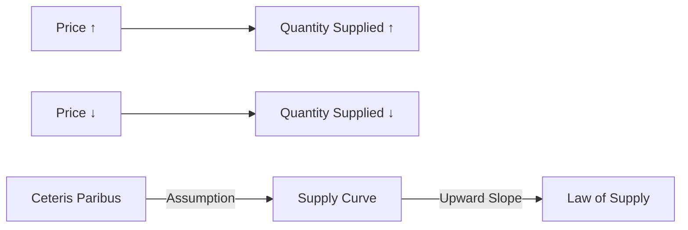

---

title: Theory_Of_Supply
type: Atomic Note
course: Economics
semester: Winter 2026
unit: '2'
hub: '[[2_Theory_Of_Demand_And_Supply_Hub]]'
source: '[[5-Pdf Store/note generated/Winter 2026/Economics/Chapter_2.pdf]]'
source_pages:
- 37
mode: ECON-MACRO
read: false
generated: true
prerequisites:
- '[[Ceteris_Paribus]]'
- '[[Law_Of_Supply]]'
- '[[Supply_Schedule]]'

---


# 1. Mental Model

Imagine you have a lemonade stand. When the price of lemonade is high, you're more willing to make a lot of lemonade because you can earn more money. But if the price is low, you might not want to make as much lemonade because you won't earn as much.

# 2. Economic Theory

The [[Theory_Of_Supply]] states that there is a positive relationship between the price of a good and the quantity supplied, [[Ceteris_Paribus]]. This is often referred to as the [[Law_Of_Supply]], which is graphically represented by a [[Supply_Curve]] that slopes upward. The [[Supply_Schedule]] shows the quantity supplied at different price levels.

## 3. Economic Model



## 4. Walkthrough

* The model starts with an increase in price (A), which leads to an increase in the quantity supplied (B) according to the Law of Supply.
* Conversely, a decrease in price (C) results in a decrease in the quantity supplied (D).
* The assumption of ceteris paribus (E) is crucial, meaning all other factors remain constant, which allows us to graph the supply curve (F).
* The supply curve (F) has an upward slope (G), illustrating the positive relationship between price and quantity supplied.

## 5. Market Failures

The Theory of Supply may fail in cases where external factors, such as government subsidies or technological changes, influence production costs and alter the supply curve. Additionally, the assumption of ceteris paribus may not hold in real-world scenarios, leading to deviations from the predicted supply behavior. Edge cases, like supply shocks or changes in expectations, can also affect the accuracy of the model.

---

## 6. The Proving Grounds

```interactive-quiz

[
  {
    "id": "q1",
    "type": "true_false",
    "difficulty": "L1",
    "question": "The Theory of Supply suggests that as the price of a good increases, the quantity supplied decreases.",
    "answer": false,
    "explanation": "The Theory of Supply, also known as the Law of Supply, states that there is a positive relationship between the price of a good and the quantity supplied, ceteris paribus. This means that as the price of a good increases, producers are incentivized to supply more of it, leading to an increase in the quantity supplied. The graphical representation of this relationship is a supply curve that slopes upward. Therefore, the statement that the quantity supplied decreases as the price of a good increases is false."
  },
  {
    "id": "q2",
    "type": "synthesis",
    "difficulty": "L2",
    "question": "A severe storm is forecasted to hit the area where your lemonade stand is located, and the price of lemons increases by 50% due to the storm. However, you expect the storm to bring a large crowd of people seeking refreshments. Using the Theory of Supply, how will you adjust the quantity of lemonade supplied, assuming the selling price of lemonade remains constant?",
    "answer": "I will decrease the quantity of lemonade supplied.",
    "explanation": "According to the Theory of Supply, an increase in the price of an input (in this case, lemons) will lead to a decrease in the quantity supplied of the good (lemonade), ceteris paribus. Although the forecasted storm is expected to bring a large crowd of people seeking refreshments, which might suggest increasing the quantity supplied, the increase in the price of lemons (a key input) will make it more costly to produce lemonade. This increased cost will reduce the willingness to supply lemonade at the given price. Therefore, despite the potential for higher demand, the increase in the price of lemons will cause an upward shift in the supply curve's intercept, effectively reducing the quantity supplied at the constant selling price of lemonade."
  },
  {
    "id": "q3",
    "type": "writing",
    "difficulty": "L3",
    "question": "Explain the concept of diminishing marginal returns in the context of the Theory of Supply",
    "answer": "The Theory of Supply states that as the price of a good increases, the quantity supplied also increases, but at a certain point, the rate of increase in quantity supplied slows down due to diminishing marginal returns. This occurs because as production increases, the marginal cost of producing one more unit also increases, making it less profitable to produce additional units. As a result, suppliers will only produce up to a point where the marginal revenue equals the marginal cost. The point at which diminishing marginal returns sets in varies depending on the supplier's production capabilities and technology.",
    "explanation": "The underlying mechanism driving the Theory of Supply is the concept of opportunity cost and the behavior of firms in response to changes in market prices. When the price of a good increases, firms are incentivized to produce more, as they can earn higher revenues. However, as production increases, firms face increasing marginal costs, such as higher labor costs, raw material costs, or equipment costs. This leads to diminishing marginal returns, where the additional output generated by an additional unit of input decreases. Suppliers will continue to produce until the marginal revenue from selling an additional unit equals the marginal cost of producing that unit."
  }
]

```