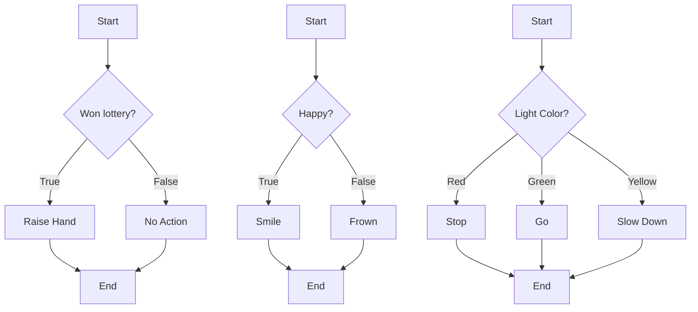

# Definition
Before proceeding, ensure you master [[Control_Structures_Overview]] and [[Sequence_Control_Structure]].
The "selection control structure," also known as a decision structure, allows a program to make choices and execute different blocks of code based on whether a specified condition is true or false. It introduces non-linear execution paths, enabling programs to respond dynamically to varying inputs or states. The main types include single selection (`if`), double selection (`if-else`), and multiple selection (`switch`). A simpler analogy is a fork in the road: you evaluate a sign (condition), and based on what it says, you choose one path over another.

# The Mental Model
Imagine you're getting ready for the day and need to decide what to wear based on the weather.
*   **Single Selection (`if`):** "IF it's raining, THEN take an umbrella." (You only do something if the condition is true.)
*   **Double Selection (`if-else`):** "IF you're happy, THEN smile. ELSE, frown." (You do one thing if true, another if false – one or the other.)
*   **Multiple Selection (`switch`):** "IF the traffic light is red, THEN stop. IF green, THEN go. IF yellow, THEN slow down." (You choose from several distinct options based on a single condition.)
These decision points are how your program makes smart choices, rather than blindly following a fixed path.


```text
// Scenario 1: Visualizing Single Selection (if)
// Output:
// (Flowchart for "Won lottery?")
// Start -> {Won lottery?}
//   If True -> Raise Hand -> End
//   If False -> No Action -> End
// This visual shows a choice with an action only for 'True'.

// Scenario 2: Visualizing Double Selection (if-else)
// Output:
// (Flowchart for "Happy?")
// Start -> {Happy?}
//   If True -> Smile -> End
//   If False -> Frown -> End
// This visual shows two mutually exclusive paths.

// Scenario 3: Visualizing Multiple Selection (switch)
// Output:
// (Flowchart for "Light Color?")
// Start -> {Light Color?}
//   If Red -> Stop -> End
//   If Green -> Go -> End
//   If Yellow -> Slow Down -> End
// This visual shows multiple distinct choices based on an input.
```
*Note: This `flowchart TD` demonstrates single, double, and multiple selection patterns, illustrating how program flow diverges based on conditions.*

# Context & Framework
### Where do Users Get Stuck?: Mapping Decision Points
The selection control structure introduces explicit decision points into a program's flow. It allows the program to evaluate a `condition` and, based on the outcome (true or false), execute a specific block of code while skipping others. This is critical for creating programs that can adapt to different data, user inputs, or environmental factors.
*   **Single Selection (`if`):** Represents a point where an action is taken *only if* a condition is met (e.g., "If the student passed, then print 'Excellent!'").
*   **Double Selection (`if-else`):** Provides two mutually exclusive paths; one block of code is executed if the condition is true, and a different block if it's false (e.g., "If it's morning, say 'Good Morning,' else say 'Good Day'").
*   **Multiple Selection (`switch`):** Handles scenarios with more than two options, allowing selection from a list of predefined cases (e.g., "Based on the user's menu choice, perform Option A, Option B, or Option C").
These structures are indispensable for injecting intelligence and responsiveness into software.

# The Mastery Deep Dive
### `if` Statement: Conditional Execution
The `if` statement is the most basic form of selection. It allows a block of code to be executed *conditionally*. The program evaluates a Boolean expression (which results in either true or false). If the expression is true, the code block immediately following the `if` statement is executed. If the expression is false, that code block is completely skipped, and the program continues with the instructions after the `if` block. This provides a simple mechanism for implementing optional actions based on a specific criterion.

### `if-else` Statement: Binary Choice
The `if-else` statement provides a binary choice. It also evaluates a Boolean expression. If the expression is true, the code block associated with the `if` part is executed, and the `else` part is skipped. Conversely, if the expression is false, the `if` part is skipped, and the code block associated with the `else` part is executed. This ensures that one of two distinct code paths is always followed, making it ideal for scenarios where a program needs to choose between two mutually exclusive actions based on a condition (e.g., passing vs. failing, positive vs. negative).

### `switch` Statement: Multi-Way Branching
The `switch` statement (or equivalent multi-way branching constructs in various languages) is designed for scenarios where a program needs to make a choice among **multiple distinct options** based on the value of a single variable or expression. Instead of a series of nested `if-else if` statements, `switch` provides a cleaner, more readable structure. It evaluates an expression, then compares its value against several predefined `case` labels. When a match is found, the code block associated with that `case` is executed. A `default` case is typically available to handle situations where no other `case` matches. This is particularly useful for menu-driven applications or handling different types of events.

# Constraints & Limitations
### Logical Errors in Conditions
The primary constraint and source of errors in selection control structures are **logical errors in the conditions themselves**. If the Boolean expression used in an `if`, `if-else`, or `switch` statement is incorrectly formulated, the program will make the wrong decisions. This can lead to unexpected behavior, incorrect outputs, or security vulnerabilities, even if the program is syntactically correct. Common pitfalls include:
*   Using assignment (`=`) instead of comparison (`==`) operators.
*   Incorrectly combining conditions with `AND` or `OR`.
*   Failing to account for all possible scenarios (missing an `else` or `default` case).
*   Off-by-one errors or boundary condition issues.
These logical flaws can be difficult to debug because the program runs without crashing, but simply produces incorrect results due to flawed decision-making.

# Significance & Application
Selection control structures are absolutely vital for creating intelligent and responsive software. They enable programs to adapt to varying data, handle user interactions, and implement complex business rules. Academically, they are a core component of teaching conditional logic and algorithmic decision-making. In real-world applications, they are ubiquitous:
*   **User authentication:** `if` username and password are correct.
*   **Data validation:** `if` input is valid, `else` show error.
*   **Game logic:** `if` player health is zero, `then` end game.
*   **Traffic control:** `switch` on light color.
Mastery of selection structures is fundamental to building dynamic, interactive, and robust software systems.

# The Worked Example
This example demonstrates the single, double, and multiple selection control structures using pseudocode and Python for a simple grading system.

**Objective:** Assign a letter grade based on a numerical score, and determine if the student passed or failed.

1.  **Algorithm (Pseudocode using Selection):**

```text
    // Selection Control Structure Example: Grading System

    1.  GET student_score

    // Double Selection (Pass/Fail)
    2.  IF student_score >= 60 THEN
        DISPLAY "Student Passed!"
    ELSE
        DISPLAY "Student Failed."
    END IF

    // Multiple Selection (Letter Grade)
    3.  SWITCH student_score / 10 (integer division)
        CASE 10: // Scores 100
            DISPLAY "Grade: A+"
        CASE 9:  // Scores 90-99
            DISPLAY "Grade: A"
        CASE 8:  // Scores 80-89
            DISPLAY "Grade: B"
        CASE 7:  // Scores 70-79
            DISPLAY "Grade: C"
        CASE 6:  // Scores 60-69
            DISPLAY "Grade: D"
        DEFAULT: // Scores 0-59 (including negatives, though not explicitly handled)
            DISPLAY "Grade: F"
    END SWITCH
```
```text
    // Scenario 1: student_score = 85
    // Output:
    // Student Passed!
    // Grade: B

    // Scenario 2: student_score = 52
    // Output:
    // Student Failed.
    // Grade: F

    // Scenario 3: student_score = 99
    // Output:
    // Student Passed!
    // Grade: A
```
    *Note: This pseudocode uses `IF-ELSE` for pass/fail and `SWITCH` for letter grades, illustrating different selection types.*

2.  **Program (Python Implementation - Note: Python uses `if/elif/else` for multi-way branching, not `switch`):**

```python
    # Python Program demonstrating Selection Control Structures

    score_str = input("Enter student score (0-100): ")
    student_score = int(score_str)

    # Double Selection (Pass/Fail)
    if student_score >= 60:
        print("Student Passed!")
    else:
        print("Student Failed.")

    # Multiple Selection (Letter Grade using if/elif/else structure)
    if student_score >= 90:
        print("Grade: A")
    elif student_score >= 80:
        print("Grade: B")
    elif student_score >= 70:
        print("Grade: C")
    elif student_score >= 60:
        print("Grade: D")
    else:
        print("Grade: F")
```
```text
    // Scenario 1: User enters 85
    // Output:
    // Enter student score (0-100): 85
    // Student Passed!
    // Grade: B

    // Scenario 2: User enters 52
    // Output:
    // Enter student score (0-100): 52
    // Student Failed.
    // Grade: F

    // Scenario 3: User enters 99
    // Output:
    // Enter student score (0-100): 99
    // Student Passed!
    // Grade: A
```
    *Note: The Python code uses `if-else` for binary selection and chained `if-elif-else` for multi-way branching (Python's equivalent to a `switch` statement).*

**Analysis:**
*   **Double Selection (`if-else`):** The pass/fail check explicitly directs the program down one of two paths based on `student_score >= 60`.
*   **Multiple Selection (`if-elif-else` chain):** For letter grades, the program makes a series of sequential decisions. As soon as a condition (e.g., `student_score >= 90`) is true, its corresponding block is executed, and the rest of the `elif`/`else` chain is skipped. This effectively achieves multi-way branching.

This example highlights how selection structures introduce decision-making capabilities, allowing programs to exhibit conditional behavior and respond intelligently to varying data.

# The Proving Ground
*Test your mastery. Cover the solutions below to test yourself first.*

### Level 1: The Sanity Check (Verification)
**The Question:** In a programming context, what is the primary purpose of a selection control structure?
> **Solution:** The primary purpose of a selection control structure is to **allow a program to make choices**, executing different blocks of code based on whether a specified condition is true or false.

### Level 2: The Crucible (Mastery & Edge Cases)
**The Scenario:** A new programmer is writing code for a system that controls access to a secure facility. The system needs to check if an employee's access card is valid (`card_valid = True`) AND if their security clearance level is sufficiently high (`clearance_level >= 5`). The programmer writes an `if` statement to grant access: `if card_valid or clearance_level >= 5: grant_access()`. Explain why this code is logically flawed for a secure facility and what type of error this represents within a selection control structure.
> **Solution:** This code is logically flawed for a secure facility because it uses the `or` operator instead of the `and` operator.
>
> This represents a **logical error in the condition** within a selection control structure. The `or` operator means that access will be granted if *either* the `card_valid` is true *or* `clearance_level >= 5` is true. For a secure facility, both conditions must be true simultaneously (the card must be valid, AND the clearance must be sufficient). If an employee has a valid card but insufficient clearance (e.g., `clearance_level = 3`), the `or` condition would still evaluate to `True` (`True or False` is `True`), incorrectly granting access. The correct condition should be `if card_valid and clearance_level >= 5: grant_access()`.

# Key Takeaways
*   Selection structures (if, if-else, switch) enable programs to make choices and execute code conditionally based on conditions.
*   They introduce non-linear execution paths, allowing dynamic responses to inputs.
*   Logical errors in conditions are a common pitfall, leading to incorrect decision-making.

# Knowledge Graph Connections
| Concept                     | Connection / Relationship                                                                   |
| :
-------------------------- | :
------------------------------------------------------------------------------------------ |
| [[Control_Structures_Overview]] | Selection is one of the three fundamental types of control structures.                       |
| [[Sequence_Control_Structure]] | Selection structures contain sequences of instructions within their conditional blocks.     |
| [[Repetition_Control_Structure]] | Selection is often used inside repetition structures to make decisions within loops.        |
| [[Algorithms_and_Programs]] | Algorithms use selection to define branching logic based on various scenarios.              |
---