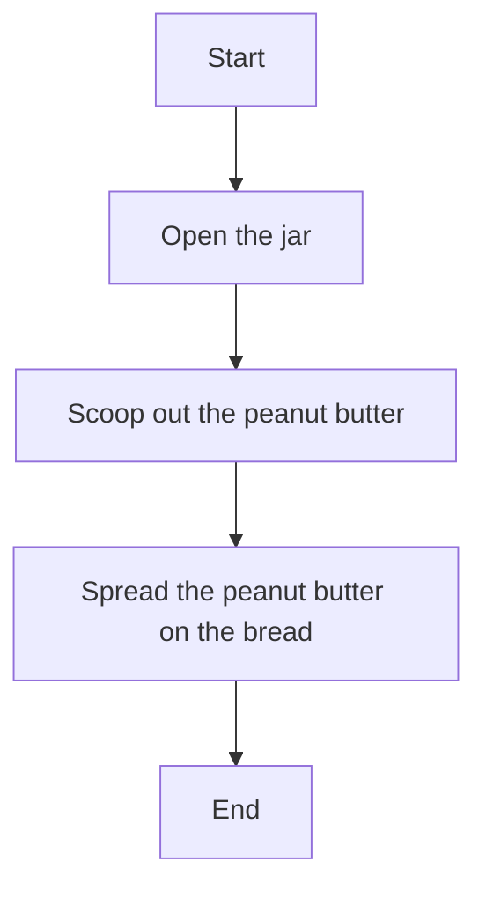

# Definition
Before proceeding, ensure you master [[Control_Structures_Overview]] and [[Selection_Control_Structure]].
The "sequence control structure" is the most fundamental and default way instructions are executed in a computer program. It dictates that instructions are performed one after another, in the exact linear order in which they are written, from top to bottom. This simple, straightforward flow forms the basis for all other control structures, as even complex programs ultimately execute individual steps in sequence. A simpler analogy is a checklist: you complete item 1, then item 2, then item 3, without skipping or repeating any steps.

# The Mental Model
Imagine you're following a recipe to make a sandwich:
1.  Open the jar of peanut butter.
2.  Scoop out the peanut butter.
3.  Spread the peanut butter on the bread.
Each step happens in that precise order. You wouldn't spread the peanut butter before scooping it out, or scoop it out before opening the jar. This unbroken, linear progression of tasks is exactly how the "sequence control structure" works in a program. It's the default, predictable flow of instructions.


```text
// Scenario 1: Visualizing a sequential process
// Output:
// (A visual representation of the flowchart showing the steps.)
// Start -> Open the jar -> Scoop out the peanut butter -> Spread the peanut butter on the bread -> End.
// This visual confirms the linear flow of operations.

// Scenario 2: Describing the direct execution path.
// Output:
// The process begins, then the 'Open the jar' instruction is executed.
// Immediately after, 'Scoop out the peanut butter' is executed.
// Finally, 'Spread the peanut butter on the bread' is executed before the process ends.
```
*Note: This `flowchart TD` visually represents a simple sequence of actions, where each step follows directly from the previous one.*

# Context & Framework
### Where do Users Get Stuck?: The Linear Path
The sequence control structure defines the most basic and intuitive flow of a program: instructions are executed one after another, in a straightforward, linear order. This means that after one instruction is completed, the program proceeds immediately to the next one, without any branching, skipping, or repetition, unless explicitly directed otherwise by other control structures. This linear path is fundamental for any series of operations that must occur in a specific, predetermined order. It ensures predictability and forms the bedrock upon which more complex decision-making and looping logic are constructed. Without the underlying sequential execution, no program could function.

# The Mastery Deep Dive
### The Uninterrupted Flow of Instructions
The sequence control structure ensures an **uninterrupted, ordered flow of instructions**. When a program encounters a series of sequential statements, it executes the first statement, then the second, then the third, and so on, until all statements in that sequence have been completed. There are no jumps, no conditions to evaluate, and no repetitions involved in a pure sequence. Each instruction is atomic within its context, and its completion triggers the execution of the next instruction in line. This deterministic behavior makes sequential blocks easy to understand and predict, as their outcome is solely dependent on the initial state and the operations performed in the given order.

### Foundational for All Algorithms
Despite its simplicity, the sequence control structure is absolutely **foundational for all algorithms and programs**. Even within highly complex programs that employ extensive selection and repetition, individual operations or small blocks of code are always executed in a sequence. For instance, inside an `if` block, instructions execute sequentially. Inside a `for` loop, the body of the loop executes its statements sequentially in each iteration. It is the default mode of operation for a CPU, which fetches, decodes, and executes instructions one by one. Understanding this basic flow is paramount because all other control structures essentially modify or direct this inherent sequential execution.

# Constraints & Limitations
### Lack of Adaptability and Decision-Making
The primary constraint of relying solely on the sequence control structure is its **complete lack of adaptability and decision-making capability**. A purely sequential program cannot respond to different inputs, handle varying scenarios, or repeat tasks based on conditions. Its execution path is fixed and predetermined. This makes it unsuitable for any real-world problem that requires dynamic behavior, such as processing user input, searching for data, or handling errors. Without the ability to branch or loop, a program would be extremely rigid and limited to very specific, unchanging tasks, necessitating a new program for every minor variation in input or logic.

# Significance & Application
The sequence control structure is ubiquitous and forms the silent foundation of every computer program. Although rarely highlighted explicitly in complex code, it is implicitly present in every block of instructions that are executed one after another. It is crucial for initial setup (e.g., variable declarations, initial assignments), simple calculations, and input/output operations. Academically, it is the first concept taught when introducing program flow. In application, any series of non-conditional, non-repetitive steps (like initializing variables, performing a direct calculation, or printing a final result) relies on sequence. Its simplicity ensures that basic, linear tasks are performed reliably.

# The Worked Example
This example demonstrates the sequence control structure using a simple calculation in pseudocode and then in Python.

**Objective:** Calculate the final price of an item given its base price and a fixed shipping fee, then display the total.

1.  **Algorithm (Pseudocode using Sequence):**

```text
    // Sequence Control Structure Example

    1.  SET item_price = 25.00        // First instruction
    2.  SET shipping_fee = 5.50       // Second instruction
    3.  SET total_price = item_price + shipping_fee // Third instruction
    4.  DISPLAY "Item price: ", item_price
    5.  DISPLAY "Shipping fee: ", shipping_fee
    6.  DISPLAY "Total price: ", total_price // Final instruction
```
```text
    // Scenario 1: Executing the sequence
    // Output:
    // Item price: 25.0
    // Shipping fee: 5.5
    // Total price: 30.5
```
    *Note: Each instruction is executed in the order it appears, without any deviation.*

2.  **Program (Python Implementation):**

```python
    # Python Program demonstrating Sequence Control Structure

    # First instruction: Assign item price
    item_price = 25.00

    # Second instruction: Assign shipping fee
    shipping_fee = 5.50

    # Third instruction: Calculate total price
    total_price = item_price + shipping_fee

    # Fourth instruction: Display item price
    print(f"Item price: ${item_price:.2f}")

    # Fifth instruction: Display shipping fee
    print(f"Shipping fee: ${shipping_fee:.2f}")

    # Sixth instruction: Display total price
    print(f"Total price: ${total_price:.2f}")
```
```text
    // Scenario 1: Running the Python script
    // Output:
    // Item price: $25.00
    // Shipping fee: $5.50
    // Total price: $30.50
```
    *Note: The Python code executes each line strictly from top to bottom, demonstrating the sequence structure.*

**Analysis:**
In both the pseudocode and Python examples, every single instruction is executed in the exact order it is written. There are no `if` conditions to check, no `while` loops to repeat. The program simply proceeds from one step to the next, illustrating the fundamental **sequence control structure**. If you were to change the order of, say, calculating `total_price` before assigning `shipping_fee`, the program would either error or produce an incorrect result, highlighting the importance of the predefined sequence.

# The Proving Ground
*Test your mastery. Cover the solutions below to test yourself first.*

### Level 1: The Sanity Check (Verification)
**The Question:** Describe the behavior of a program that exclusively uses the sequence control structure.
> **Solution:** A program exclusively using the sequence control structure will **execute instructions one after another, in the exact linear order** in which they are written, from top to bottom, without any branching, skipping, or repetition.

### Level 2: The Crucible (Mastery & Edge Cases)
**The Scenario:** A robotic arm is programmed to perform a series of operations: 1) pick up a red block, 2) move it to a conveyor belt, 3) place it on the belt. If the programmer accidentally swaps step 1 and step 2 in the code, leading to the robot trying to move a block before picking it up, what fundamental control structure principle has been violated? Explain why this leads to a failure in this specific context.
> **Solution:** The **sequence control structure** principle has been violated.
>
> This leads to a failure because the sequence structure dictates that instructions are executed in a strict, linear order. By swapping steps 1 and 2, the program would instruct the robot to **"move a block to a conveyor belt" (step 2) *before* it has executed "pick up a red block" (step 1)**. Logically, the robot cannot move a block it has not yet picked up. The physical world's constraints (you can't move what you don't hold) directly expose the error in the program's sequential logic, leading to an immediate failure or error in the robot's operation, as it attempts an impossible action. The dependency of step 2 on the successful completion of step 1 makes their order in the sequence absolutely critical.

# Key Takeaways
*   The sequence control structure executes instructions one after another in linear order, from top to bottom.
*   It is the fundamental and default flow of all programs, forming the basis for more complex logic.
*   Its primary constraint is a lack of adaptability and decision-making, as its execution path is fixed.

# Knowledge Graph Connections
| Concept                     | Connection / Relationship                                                                   |
| :
-------------------------- | :
------------------------------------------------------------------------------------------ |
| [[Control_Structures_Overview]] | Sequence is one of the three fundamental types of control structures.                       |
| [[Selection_Control_Structure]] | Sequence is often combined with selection to create conditional execution paths.            |
| [[Repetition_Control_Structure]] | Sequence of instructions is executed within each iteration of a repetition structure.       |
| [[Algorithms_and_Programs]] | Algorithms break down problems into sequential steps, which are implemented via sequence control. |
---