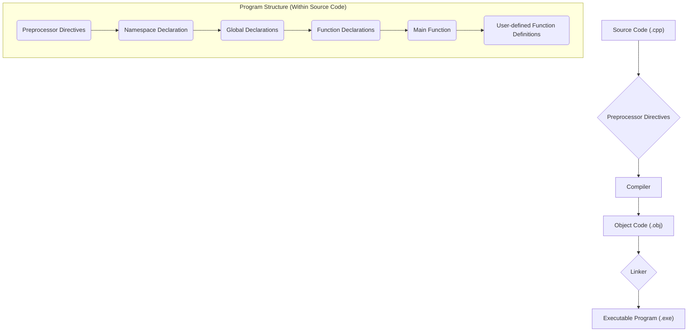

# Definition
Before proceeding, ensure you have a general understanding of the Compilation_Process.

The General Structure of a C++ Program refers to the standardized organization of code elements that allows the program to be compiled and executed correctly. It is a hierarchical arrangement, much like the blueprint of a building, where each section (preprocessor directives, `main` function, user-defined functions, etc.) plays a specific role in the overall functionality and flow. This structure ensures that the compiler can understand and process the code in a predictable manner, transforming human-readable instructions into machine-executable form.

# The Mental Model
Imagine a C++ program as a carefully choreographed **assembly line**. At the very beginning, you have "Instructions for the Foreman" (Preprocessor Directives) that set up the environment. Then, the "Main Control Panel" (`main` function) dictates the primary sequence of operations. Along the way, there are specialized "Workstations" (User-defined Functions) that perform specific tasks when called upon. Throughout the entire process, "Sticky Notes" (Comments) are used for internal communication, and "Structural Brackets" (Braces) define distinct work zones, while "Individual Commands" (Statements) are the precise actions taken at each step.


```text
// Scenario 1: Overall Compilation and Execution Flow
// Output:
// (A visual representation showing Source Code progressing through Preprocessor Directives, Compiler, Object Code, Linker, to an Executable Program.)
// This illustrates the high-level process from human-readable code to a runnable application.

// Scenario 2: Internal Structure Sequence
// Output:
// (A visual representation of the internal source code structure, from Preprocessor Directives down to User-defined Function Definitions.)
// This highlights the typical order of elements within the .cpp file itself.
```
*Note: This `flowchart TD` illustrates the high-level compilation and linking process, as well as the typical structural components within a C++ source file. The elements are logically connected to show the flow.*

# Context & Framework
### Opening the Hood: What's Inside?
A C++ program's structure can be broken down into six core components, much like dissecting a machine to understand its parts:
1.  **Preprocessor Directives:** Instructions starting with `#` (e.g., `#include <iostream>`) that tell the compiler to perform tasks *before* actual compilation, such as including header files.
2.  **Namespace Declaration:** `using namespace std;` brings elements from a specific namespace (like `std` for standard library components) into the current scope, simplifying code.
3.  **Global Declarations (optional):** Variables or functions declared outside any function, making them accessible throughout the entire program.
4.  **Function Declarations (Prototypes):** Inform the compiler about the existence, return type, name, and parameters of functions defined later in the code.
5.  **Main Function (`int main()`):** The **entry point** of every C++ program. Execution always begins here. It returns an integer (typically `0` for success) to the operating system.
6.  **User-defined Function Definitions:** The actual implementation of functions declared earlier or directly defined after `main`. These perform specific tasks and can be called from `main` or other functions.
Understanding these parts is crucial for writing well-organized and functional C++ code.

# The Mastery Deep Dive
### How the Parts Talk to Each Other
The various parts of a C++ program structure communicate in a specific sequence. The **preprocessor directives** act first, modifying the source code before it even reaches the compiler. For instance, `#include <iostream>` effectively copies the contents of `iostream` into your file, making standard input/output functions available. The **`main` function** then serves as the central orchestrator, making calls to **user-defined functions**. This communication is managed by **function prototypes**, which ensure that `main` (or any other function) knows how to call another function, even if the definition of that function appears later in the file. **Namespace declarations** simplify this communication by allowing direct access to standard library components (like `cout` and `cin`) without needing to prefix them with `std::`. This structured dialogue ensures all components work together seamlessly.

### The Translator: From "Lego" to "Jargon"
The simple "Lego" analogy of program components translates directly to formal C++ jargon:
*   "Instructions for the Foreman" become **Preprocessor Directives**.
*   "Main Control Panel" is the **`main` function**.
*   "Specialized Workstations" are **User-defined Functions**.
*   "Sticky Notes" are **Comments**.
*   "Structural Brackets" are **Braces** (`{}`).
*   "Individual Commands" are **Statements** (ending with `;`).
This translation is critical for moving from an intuitive understanding to the precise terminology required for technical discussions and exam settings.

# Constraints & Limitations
### The Engineering Trade-off
While a structured approach is beneficial, deeply nested function calls or excessive global variables can introduce complexities. For instance, **global declarations** can lead to side effects, where a variable's value can be unpredictably altered by any part of the program, making debugging difficult. Similarly, over-reliance on a single, monolithic `main` function that attempts to do too much can obscure program flow and make maintenance a nightmare. The engineering trade-off lies in balancing modularity and encapsulation (using smaller, focused functions and local variables) against the perceived simplicity of a more direct, but potentially less maintainable, structure.

# Significance & Application
A clear understanding of C++ program structure is foundational for writing any non-trivial program. It allows developers to organize code logically, enhance readability, and facilitate collaboration in larger projects. This structure is universally applied, whether you're developing a simple command-line utility, a complex operating system kernel, or a high-performance game engine. Adhering to this structure ensures code is maintainable, scalable, and understandable to other developers. Deviations from this standard often lead to disorganized, buggy, and hard-to-debug software.

# The Worked Example
This example demonstrates a complete C++ program incorporating various structural elements.

```cpp
```cpp
// 1. Preprocessor Directive: Includes the input/output stream library
#include <iostream>

// 2. Namespace Declaration: Allows direct use of names like cout and cin
using namespace std;

// 3. Global Declaration (optional): A global variable
int global_data = 20;

// 4. Function Declaration (Prototype): Informs the compiler about the 'add' function
int add(int a, int b);

// 5. Main Function: The program's entry point
int main() {
    // Local variable declarations
    int num1 = 10;
    int num2 = 5;
    int sum_result;

    // Statement: Output to console using stream insertion operator
    cout << "Global data: " << global_data << endl;

    // Function call
    sum_result = add(num1, num2);

    // Another statement
    cout << "Sum of " << num1 << " and " << num2 << " is: " << sum_result << endl;

    return 0; // Indicates successful program termination
}

// 6. User-defined Function Definition: Implementation of the 'add' function
int add(int a, int b) {
    return a + b;
}
```
```text
// Scenario 1: Standard execution flow
// Output:
// Global data: 20
// Sum of 10 and 5 is: 15
// This shows the sequential execution from main, using global data and calling a user-defined function.

// Scenario 2: What if we remove 'using namespace std;'?
// (Conceptual output, not direct code modification output)
// This would result in compilation errors like "error: 'cout' was not declared in this scope".
// The fix would be to explicitly use 'std::cout' and 'std::endl'.
// This demonstrates the role of namespace declarations in simplifying standard library usage.
```
*Note: This C++ code illustrates the typical structure of a program, including **preprocessor directives**, **namespace declaration**, **global variables**, **function prototypes**, the **`main` function**, and a **user-defined function definition**.*

# The Proving Ground
*Test your mastery. Cover the solutions below to test yourself first.*

### Level 1: The Sanity Check (Verification)
**The Question:** What are the six fundamental components that constitute the general structure of a C++ program?
> **Solution:** The six fundamental components are: Preprocessor Directives, Namespace Declaration, Global Declarations (optional), Function Declarations (Prototypes), Main Function, and User-defined Function Definitions.

### Level 2: The Crucible (Mastery & Edge Cases)
**The Scenario:** You are given a C++ program where a custom function `calculateArea()` is defined *before* its declaration (prototype) but is called from `main`. The program compiles without errors.
**The Challenge:** Explain why this scenario, which seems to violate the "declaration before use" principle, might still compile successfully.
> **Solution:** This scenario compiles successfully because if a function is *defined* before it is *called* (even if the call is in `main`), its definition implicitly acts as its declaration (prototype). The compiler encounters the full function definition before it sees the call from `main`, thus knowing its signature. This adheres to the "declaration before use" principle in practice, even without an explicit prototype.

# Key Takeaways
*   C++ programs follow a **structured format** including preprocessor directives, namespace declarations, global declarations, function prototypes, `main` function, and user-defined functions.
*   The **`main` function** is the mandatory entry point where program execution begins.
*   Each structural component plays a **specific role** in organizing code, enhancing readability, and ensuring proper compilation and execution.

# Knowledge Graph Connections
| Concept                     | Connection / Relationship                                                                                                 |
| :
-------------------------- | :
-------------------------------------------------------------------------------------------------------------------------- |
| [[Preprocessor_Directives]] | Preprocessor directives are the initial component in the general structure of a C++ program.                                |
| [[Main_Function]]           | The `main` function is the mandatory entry point for every C++ program.                                                   |
| [[Comments_in_C++]]         | Comments are ignored by the compiler but are vital for explaining the purpose and logic of parts of a C++ program.        |
| [[Braces_and_Statements]]   | Braces define code blocks, and statements are individual instructions terminated by a semicolon.                            |
| [[Case_Sensitivity_and_Whitespace]] | C++ is case-sensitive and largely ignores whitespace, which affects how identifiers and code elements are interpreted. |
---