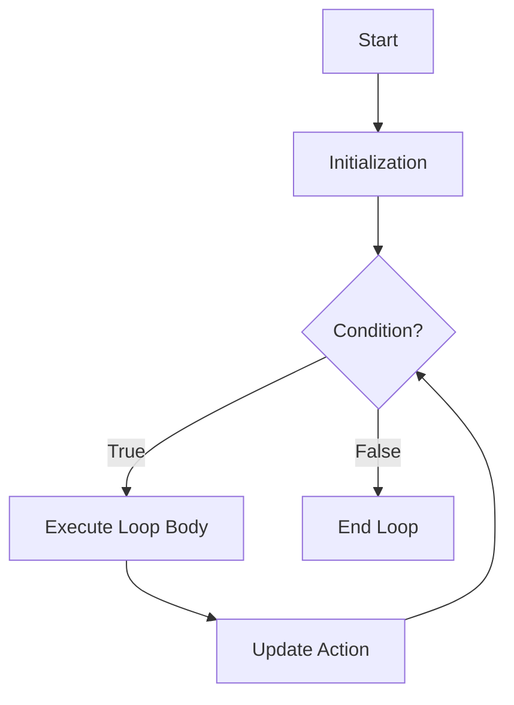

# Definition
Before proceeding, ensure you master [[Loop_Statements]] and [[While_Loop]].
The `for` loop in C++ is a powerful iteration statement designed for situations where the number of iterations is known or can be determined before the loop begins. It compactly integrates the three essential components of a loop—initialization, condition, and update—into a single line. This makes it particularly suitable for "counting" loops, where a counter variable controls the repetition. It's like a timed exercise: "For 10 minutes, do squats; every 30 seconds, increase intensity."

# The Mental Model
Imagine a production line assembly. The instruction is "Assemble `Item 1` to `Item 100`." The `for` loop automates this: it sets up the `starting item` (initialization), checks `if there are more items to assemble` (condition), and then `moves to the next item` (update) after each assembly step. This all happens in a very structured, predictable way.


*Note: This `flowchart TD` illustrates the structured execution flow of a `for` loop. It begins with initialization, then repeatedly checks a condition, executes the body, and performs an update action until the condition becomes false, after which the loop terminates.*

# Context & Framework
### Follow the Ball: A Slow-Motion Trace
The execution of a `for` loop proceeds in a very specific sequence. First, the `Init_Action` (initialization) is executed *only once* at the very beginning of the loop. Then, *before each iteration*, the `Bool_Exp` (boolean condition) is evaluated. If it's `true`, the `Body_Statement` (the loop body) is executed. After the `Body_Statement` completes, the `Update_Action` is performed. This cycle of (condition -> body -> update) continues until the `Bool_Exp` evaluates to `false`, at which point the loop terminates, and execution proceeds to the statement immediately following the `for` loop. This integrated structure makes the `for` loop a very efficient choice for definite iteration.

# The Mastery Deep Dive
### The Exploded View
The `for` loop consolidates initialization, condition, and update into a single, compact header: `for (Init_Action; Bool_Exp; Update_Action)`. The `Init_Action` typically declares and initializes a loop counter. The `Bool_Exp` dictates how long the loop continues. The `Update_Action` modifies the loop counter to eventually terminate the loop. The `Body_Statement` (or compound block) is executed repeatedly. This integrated structure makes the `for` loop particularly strong for tasks where the number of repetitions is known in advance, providing a clear and self-contained definition of the loop's control.

### Component Interactions
The three components in the `for` loop header (`Init_Action`, `Bool_Exp`, `Update_Action`) work in tight conjunction. `Init_Action` establishes the starting point. `Bool_Exp` acts as the gate, controlling entry into each iteration. `Update_Action` ensures progress toward the termination condition. Crucially, if the `Bool_Exp` is `false` from the outset, the loop body will *never* execute, and the `Update_Action` will also never be performed. This direct, ordered interaction ensures predictable iteration and makes the `for` loop highly robust for tasks involving definite iteration.

# Constraints & Limitations
### The Engineering Trade-off
While `for` loops are excellent for definite iteration, their structured nature can be less flexible than `while` loops for scenarios where the termination condition is highly dynamic and doesn't easily map to a counter-based update (e.g., waiting for specific user input or reading a file until an end-of-file marker). Attempting to force complex, non-counter-based logic into the `for` loop header can make the code less readable. The trade-off is between the `for` loop's conciseness for simple, known iterations and the `while` loop's greater adaptability for indefinite, condition-driven iterations.

# Significance & Application
`for` loops are widely applied in C++ for tasks that involve a predetermined number of repetitions:
*   **Array Traversal:** Iterating through elements of an array or collection.
*   **Counting Operations:** Executing a block of code a specific number of times.
*   **Generating Patterns:** Printing rows and columns in matrices or graphical patterns.
*   **Summations/Averages:** Calculating sums or averages over a fixed range of numbers.
*   **Fixed-Size Processing:** Performing operations on a known quantity of items.
Their integrated structure makes them the go-to choice for clear, definite, and countable iterations.

# The Worked Example
This example demonstrates a C++ program using a `for` loop to print the first 5 natural numbers. It highlights the initialization, condition, and update parts of the loop.

```cpp
#include <iostream> // Include the iostream library for input and output operations

int main() {
    // For loop to print numbers from 1 to 5
    // Init_Action: int i = 1; (initializes loop counter 'i' to 1)
    // Bool_Exp:    i <= 5;    (loop continues as long as 'i' is less than or equal to 5)
    // Update_Action: i++ ;    (increments 'i' by 1 after each iteration)
    for (int i = 1; i <= 5; i++) {
        std::cout << "Number: " << i << std::endl; // Loop Body: prints the current value of 'i'
    }
    std::cout << "For loop finished." << std::endl;

    // --- Scenario 2: Counting down ---
    std::cout << "\nCounting down from 5 to 1:" << std::endl;
    for (int j = 5; j >= 1; j--) { // Init: j=5, Condition: j>=1, Update: j--
        std::cout << "Number: " << j << std::endl;
    }
    std::cout << "Countdown finished." << std::endl;

    return 0; // Indicate successful program execution
}
```
```text
// Scenario 1: Counting up from 1 to 5
// Output:
// Number: 1
// Number: 2
// Number: 3
// Number: 4
// Number: 5
// For loop finished.

// Scenario 2: Counting down from 5 to 1
// Output:
// Counting down from 5 to 1:
// Number: 5
// Number: 4
// Number: 3
// Number: 2
// Number: 1
// Countdown finished.
```
*Note: This code demonstrates typical `for` loop usage for both ascending and descending counts. The integrated initialization, condition, and update within the loop header make it ideal for definite iteration, printing each number in sequence until the condition is no longer met.*

# The Proving Ground
*Test your mastery. Cover the solutions below to test yourself first.*

### Level 1: The Sanity Check (Verification)
**The Component Check:** What are the three main components typically found within the parentheses of a `for` loop's definition, and what is the role of each?
> **Solution:** The three main components are:
> 1.  **Initialization Action:** Executed once at the beginning to set up a loop control variable (e.g., `int i = 0;`).
> 2.  **Boolean Expression (Condition):** Evaluated before each iteration; if `true`, the loop continues; if `false`, it terminates (e.g., `i < 10;`).
> 3.  **Update Action:** Executed after each iteration of the loop body to modify the loop control variable, moving towards the termination condition (e.g., `i++;`).

### Level 2: The Crucible (Mastery & Edge Cases)
**The Broken System:** A developer wants to display a list of product IDs from `product_ids` array, skipping the first element (at index 0). They wrote: `for (int i = 0; i < num_products; i++) { if (i == 0) continue; std::cout << product_ids[i] << std::endl; }`. Explain why this code is inefficient for its stated purpose, even if it produces the correct output. Propose a more efficient `for` loop structure to achieve the same result.
> **Solution:** This code is inefficient because it unnecessarily performs a comparison (`if (i == 0)`) and executes the `continue` statement on the very first iteration, only to skip the actual desired action. While it produces the correct output (skipping `product_ids[0]`), it wastes a small amount of processing time on the conditional check and the `continue` operation for an iteration that is inherently known to be skipped.
>
> A more efficient `for` loop structure would directly start the loop counter from `1`, thereby avoiding the unnecessary check for `i == 0` entirely:
>
> --- START_CODE:cpp ---
> // More efficient for loop to skip the first element (index 0)
> int product_ids[] = {101, 102, 103, 104, 105};
> int num_products = 5;
>
> for (int i = 1; i < num_products; i++) { // Start 'i' directly from 1
>     std::cout << "Product ID: " << product_ids[i] << std::endl;
> }
> --- END_CODE:cpp ---
> This revised loop starts `i` at 1, directly accessing `product_ids[1]` in the first iteration, and correctly iterates up to `product_ids[num_products - 1]`, achieving the exact same result without the overhead of the `if (i == 0) continue;` check. (Related to `A.1.4.2.a. The "Fairness Doctrine"` and `A.1.4.4. Factual & Semantic Accuracy`)

# Key Takeaways
*   The `for` loop provides a highly structured and concise way to implement definite iteration, combining initialization, condition, and update into a single header.
*   It is the preferred choice when the number of iterations is known in advance or easily calculable, such as for counting, array traversal, and pattern generation.
*   Optimizing `for` loops involves ensuring that initialization and conditions are set to execute only the necessary iterations, avoiding redundant checks or operations.

# Knowledge Graph Connections
| Concept                     | Connection / Relationship                                                                   |
| :
-------------------------- | :
------------------------------------------------------------------------------------------ |
| [[Loop_Statements]]         | `for` is one of the three primary types of loop statements, optimized for counting.         |
| [[While_Loop]]              | Can often be converted to a `for` loop, especially when iteration count is definite.        |
| [[Continue_Statement]]      | Often used within `for` loops to skip specific iterations based on a condition.             |
| [[Nested_Loops]]            | Commonly implemented using `for` loops to process multi-dimensional data or patterns.       |
| [[Loop_Pitfalls]]           | Susceptible to off-by-one errors if initialization or boundary conditions are incorrect.    |
---