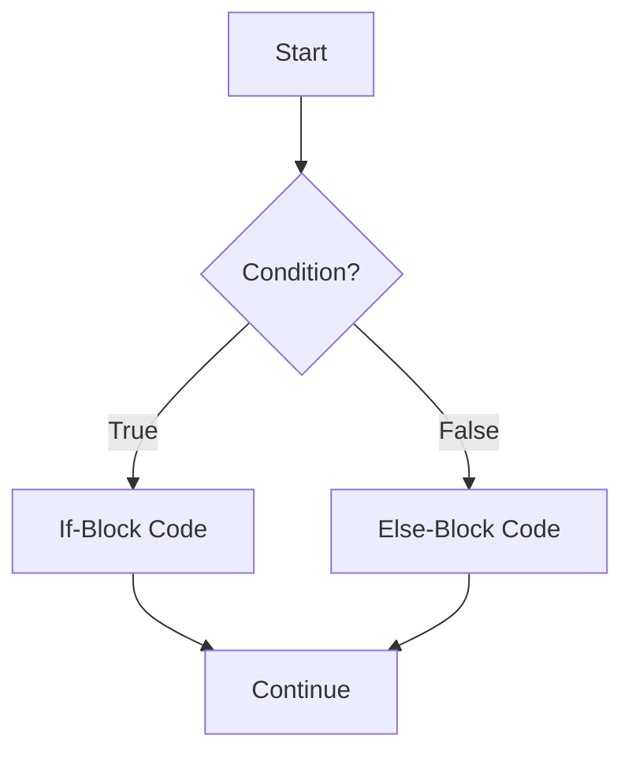

# Definition
Before proceeding, ensure you master [[Branching_Statements]] and Boolean_Logic.
An `if-else` statement is a fundamental branching construct in C++ that allows a program to execute one block of code if a specified boolean expression (condition) evaluates to `true`, and an alternative block of code if the condition evaluates to `false`. It provides a binary choice, acting as a gateway to different execution paths. A simpler way to think about it is like a simple fork in the road with a decision point: "If the path is clear, go left; else, go right."

# The Mental Model
Imagine you're at a vending machine trying to buy a drink. The machine checks: "Is there enough money inserted?"
*   **If** `(money_inserted >= price)`, the machine dispenses the drink.
*   **Else**, it displays an "Insufficient funds" message.
This two-way decision is exactly what an `if-else` statement does: it executes one specific action or another, based on a single condition.


```text
// Scenario 1: Condition is True
// Output:
// (A visual representation of the flowchart showing the decision process and paths.)
// Start -> Condition? (True) -> If-Block Code -> Continue.
// This trace demonstrates the execution path when the condition evaluates to true.

// Scenario 2: Condition is False
// Output:
// Start -> Condition? (False) -> Else-Block Code -> Continue.
// This trace demonstrates the execution path when the condition evaluates to false, taking the alternative branch.
```
*Note: This `flowchart` illustrates the basic execution flow of an `if-else` statement, showing how the program chooses between two paths based on a condition.*

# Context & Framework
### Opening the Hood: What's Inside?
An `if-else` statement is composed of a few core elements:
1.  **`if` keyword:** Initiates the conditional block.
2.  **Boolean Expression (Condition):** Enclosed in parentheses `()`, this expression is evaluated to either `true` or `false`.
3.  **`if` block (or `yes_statement`):** The code that executes immediately after the `if` condition if the boolean expression is `true`. This can be a single statement or a `Compound_Statements` enclosed in curly braces `{}`.
4.  **`else` keyword (optional):** Introduces the alternative block.
5.  **`else` block (or `no_statement`):** The code that executes immediately after the `else` keyword if the boolean expression is `false`. This can also be a single statement or a compound statement.
The presence of the `else` clause provides a guaranteed alternative action, ensuring the program always takes one of two defined paths.

# The Mastery Deep Dive
### How the Parts Talk to Each Other
The execution of an `if-else` statement is a straightforward, sequential process:
1.  The program encounters the `if` keyword and immediately evaluates the boolean expression provided within its parentheses.
2.  If the result of this evaluation is `true`, the statements within the `if` block are executed. After the `if` block completes, the program **skips** the `else` block (if it exists) and continues execution from the statement immediately following the entire `if-else` structure.
3.  If the result of the boolean expression evaluation is `false`, the statements within the `if` block are **skipped**. The program then checks for an `else` keyword. If an `else` block exists, the statements within it are executed. After the `else` block completes, the program continues execution from the statement immediately following the entire `if-else` structure.
This mechanism ensures that **only one** of the two possible branches is ever executed for a given condition.

### The Translator: From "Lego" to "Jargon"
The simple idea of "doing one thing or another based on a decision" translates directly into the formal C++ syntax:
*   "If this condition is met, then perform this action." becomes `if (condition) { /* action_true */ }`.
*   "Otherwise, perform this alternative action." becomes `else { /* action_false */ }`.
The `condition` is any expression that yields a boolean value (true/false), and `action_true`/`action_false` represent any valid C++ statement or a `Compound_Statements`. This clear mapping ensures precise control over program flow based on logical evaluations.

# Constraints & Limitations
A key limitation and common pitfall of `if-else` statements arises when managing multiple statements within a branch without `Compound_Statements`. If curly braces `{}` are omitted, only the single statement immediately following the `if` or `else` is considered part of that branch. Any subsequent statements will execute unconditionally, regardless of the boolean expression's outcome. This can lead to subtle logical errors. Additionally, for scenarios requiring more than two distinct paths, a simple `if-else` becomes cumbersome, necessitating `Multiway_If_Else` or `Switch_Statement`.

# Significance & Application
The `if-else` statement is the most fundamental construct for implementing conditional logic in programming. It is used everywhere, from basic input validation (e.g., "if user entered valid number") and error checking ("if file exists") to complex decision trees in AI algorithms. It allows programs to adapt their behavior dynamically, making them interactive and responsive to varying data and circumstances. Mastering `if-else` is crucial for writing any program that requires decision-making capabilities.

# The Worked Example
Consider the common example of calculating an employee's gross pay, where overtime (hours greater than 40) is paid at 1.5 times the regular rate.

```cpp
```cpp
#include <iostream>

int main() {
    double rate = 15.0; // Hourly pay rate
    int hrs = 45;       // Hours worked
    double grossPay;    // Variable to store calculated gross pay

    // if-else statement to determine pay based on hours worked
    if (hrs > 40) {
        // Calculate pay for hours up to 40 at regular rate
        grossPay = rate * 40;
        // Add overtime pay (hours over 40 at 1.5 times the rate)
        grossPay = grossPay + (1.5 * rate * (hrs - 40));
        std::cout << "Calculated gross pay with overtime.\n";
    } else {
        // Calculate pay for regular hours (40 or less)
        grossPay = rate * hrs;
        std::cout << "Calculated gross pay for regular hours.\n";
    }

    std::cout << "Employee's gross pay: $" << grossPay << std::endl;

    return 0;
}
```
```text
// Scenario 1: Employee works overtime (45 hours).
// Output:
// Calculated gross pay with overtime.
// Employee's gross pay: $787.5
// Explanation: The condition 'hrs > 40' (45 > 40) is true, so the 'if' block executes, calculating base pay + overtime.

// Scenario 2: Employee works regular hours (35 hours).
// Input (conceptual change for demonstration): hrs = 35
// Output:
// Calculated gross pay for regular hours.
// Employee's gross pay: $525
// Explanation: The condition 'hrs > 40' (35 > 40) is false, so the 'else' block executes, calculating pay at the regular rate.
```
*Note: This C++ program uses an `if-else` statement to correctly calculate gross pay, applying overtime rules only when the condition `hrs > 40` is met.*

# The Proving Ground
*Test your mastery. Cover the solutions below to test yourself first.*

### Level 1: The Sanity Check (Verification)
**The Question:** Describe the two distinct outcomes that can result from the evaluation of the boolean expression in an `if-else` statement.
> **Solution:** If the boolean expression evaluates to `true`, the code block immediately following the `if` statement is executed. If it evaluates to `false`, the code block immediately following the `else` statement (if present) is executed.

### Level 2: The Crucible (Mastery & Edge Cases)
**The Scenario:** You are given an `if-else` statement: `int x = 10; if (x > 5) cout << "Greater"; else cout << "Not Greater";`. If you remove the `else` clause entirely, `int x = 10; if (x > 5) cout << "Greater"; cout << "Always Runs";`.
(a) Predict the output of the original `if-else` statement for `x = 3` and `x = 10`.
(b) Predict the output of the modified `if` statement (without `else`) for `x = 3` and `x = 10`, and explain why it differs from the `if-else` scenario.
> **Solution:**
> (a) Original `if-else`:
> *   For `x = 3`: Output: `Not Greater` (condition `3 > 5` is false, `else` block executes).
> *   For `x = 10`: Output: `Greater` (condition `10 > 5` is true, `if` block executes, `else` is skipped).
> (b) Modified `if` (without `else`):
> *   For `x = 3`: Output: `Always Runs` (condition `3 > 5` is false, `if` block is skipped. `cout << "Always Runs";` is outside the `if`'s scope and always executes).
> *   For `x = 10`: Output: `GreaterAlways Runs` (condition `10 > 5` is true, `if` block executes. `cout << "Always Runs";` is outside the `if`'s scope and always executes).
> The difference is that without an `else` clause, there is no alternative path for `false` conditions, and any statements immediately after a single-statement `if` block execute unconditionally.

# Key Takeaways
*   The `if-else` statement provides a binary choice, executing one block of code if a condition is `true` and another if it's `false`.
*   The boolean expression within the `if` statement determines the execution path, ensuring only one of the two branches runs.
*   Correct use of `Compound_Statements` (curly braces `{}`) is vital when more than one statement is part of an `if` or `else` branch to avoid logical errors.

# Knowledge Graph Connections
| Concept                           | Connection / Relationship                                                                   |
| :
-------------------------------- | :
------------------------------------------------------------------------------------------ |
| [[Branching_Statements]]          | The `if-else` statement is a primary type of branching statement.                           |
| [[Assignment_vs_Equality_Operator]] | Confusing `=` and `==` is a common pitfall in `if-else` conditions.                     |
| [[Compound_Statements]]           | Multiple statements in an `if-else` branch require compound statements to be treated as a single block. |
| [[Multiway_If_Else]]              | `if-else` can be extended into a multi-way structure (`else if`) for more than two choices. |
| [[Nested_If_Else]]                | `if-else` statements can be nested within each other to handle complex, hierarchical conditions. |
| Optional_Else                 | The `else` part of an `if-else` statement is optional, allowing for conditional execution without an alternative. |
| Boolean_Logic                 | `if-else` statements critically depend on boolean logic to evaluate conditions.             |
---