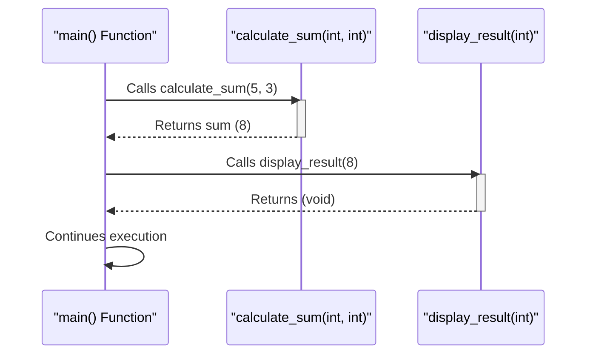

# Definition
Before proceeding, ensure you master [[Functions_C++]] because understanding function calls is essential to comprehend how individual functions contribute to the overall program execution.
A function call is the process of invoking a function to execute the code defined within its body. When a function is called, the program's execution flow temporarily transfers from the calling function to the called function. Once the called function completes its task (either by reaching its `return` statement or the end of its body), execution returns to the exact point in the calling function immediately after the call. A simpler analogy is like pressing a button on a vending machine: you initiate an action (function call), the machine (function) performs its internal operations (execution), and then it provides a product (return value) or simply finishes its process, and you can continue with your day.

# The Mental Model
Imagine you're navigating a large building (your program). When you need to go to a specific office (a function), you temporarily leave your current location (the calling function), walk to that office, complete your task there, and then return to resume exactly where you left off. The "function call" is like the act of deciding to go to that office, and "execution" is the work you do while you're there.


```text
// Scenario 1: Basic Function Call Flow
// Output:
// (A visual representation of the sequence diagram showing the flow:
// 1. `main()` calls `calculate_sum(5, 3)`.
// 2. `calculate_sum` activates, performs its task.
// 3. `calculate_sum` returns the sum `8` to `main()`.
// 4. `main()` then calls `display_result(8)`.
// 5. `display_result` activates, performs its task.
// 6. `display_result` returns (as it's void) to `main()`.
// 7. `main()` continues its execution.)
// This diagram illustrates the sequence of interactions and control transfers between functions.
```
*Note: This `sequenceDiagram` visualizes the typical flow of control from the `main` function to `calculate_sum` and `display_result`, illustrating how execution temporarily shifts and then returns.*

# Context & Framework
### Follow the Ball: A Slow-Motion Trace
When a function is called, the program's execution does a precise dance: it temporarily halts the current function's operations, stores its current state (on the call stack), and then jumps to the starting point of the called function. The arguments passed during the call are typically copied (for pass by value) or referenced (for pass by reference) to the called function's parameters. Once the called function has executed all its statements and reaches a `return` statement (or its closing brace for `void` functions), the stored state of the calling function is restored, and execution resumes from the exact line where the function call was made. This seamless "pause and resume" mechanism is fundamental to modular program flow.

# The Mastery Deep Dive
### The Call Stack
At the heart of function call and execution is the **call stack**. This specialized region of memory is used by the program to manage the sequence of active function calls. Whenever a function is called, a "stack frame" is pushed onto the call stack. This frame contains vital information such as the function's local variables, its parameters, and the return address (the memory location in the calling function where execution should resume). When a function completes, its stack frame is popped off, and control reverts to the function whose frame is now at the top of the stack. This stack-based mechanism ensures that functions can be called and returned from in a predictable, nested manner, even with recursive calls.

### Control Transfer
The transfer of control during a function call is a precise operation. When the program encounters a function call, it first evaluates any arguments that need to be passed. Then, it saves the current execution context of the calling function (including the address of the next instruction to execute). Finally, control "jumps" to the first instruction of the called function's body. Once the called function finishes, the saved return address is used to jump back, resuming the calling function's execution from precisely where it left off. This mechanism, facilitated by the call stack, allows functions to operate as independent units while contributing to a unified program flow.

### The Reality Check: Theory vs. Real Life
While the theory of function calls suggests a seamless transfer of control, in real-life systems, there's always a slight **overhead** associated with each function call. This overhead includes the time taken to push a new stack frame onto the call stack, copy arguments (for call by value), jump to the function's starting address, and then pop the stack frame and jump back. For very small functions that are called frequently, this overhead can sometimes become significant, potentially impacting performance. Modern compilers often employ optimizations (like inlining) to mitigate this, but understanding this underlying cost helps in designing efficient modular programs, especially in performance-critical applications.

# Constraints & Limitations
### The "Infinite Loop" Trap
A critical trap related to function execution, especially with recursive functions, is the "Infinite Loop" (or infinite recursion). This occurs when a function calls itself, directly or indirectly, without ever reaching a termination condition (a base case). Without a base case, the function continuously calls itself, pushing more and more stack frames onto the call stack. Eventually, this consumes all available stack memory, leading to a "stack overflow" error, which typically causes the program to crash. This highlights the absolute necessity of carefully designing termination conditions for any function that might call itself.

# Significance & Application
Understanding function call and execution is fundamental to debugging, performance optimization, and grasping the overall control flow of any C++ program. It's crucial for correctly interpreting program behavior, especially in complex applications with multiple interacting functions, event-driven architectures, or concurrent programming. Developers rely on this knowledge to predict how data and control will move through their code, ensuring logical correctness and efficient resource utilization.

# The Worked Example
This example illustrates a multi-level function call, demonstrating how execution flows from `main` to `first_function`, and then `first_function` calls `second_function`, with each returning control sequentially.

```cpp
#include <iostream>

// Function prototype for second_function
void second_function(int val);

// Function prototype for first_function
void first_function(int data);

int main() {
    std::cout << "Main: Starting program." << std::endl;
    first_function(10); // Main calls first_function
    std::cout << "Main: Program finished." << std::endl;
    return 0;
}

// Definition of first_function
void first_function(int data) {
    std::cout << "First Function: Received data = " << data << std::endl;
    second_function(data * 2); // first_function calls second_function
    std::cout << "First Function: Resuming after second_function call." << std::endl;
}

// Definition of second_function
void second_function(int val) {
    std::cout << "Second Function: Received value = " << val << std::endl;
    std::cout << "Second Function: Performing task." << std::endl;
    // No explicit return statement for void, implicit return at end
}
```
```text
// Scenario 1: Multi-level function call execution
// Output:
// Main: Starting program.
// First Function: Received data = 10
// Second Function: Received value = 20
// Second Function: Performing task.
// First Function: Resuming after second_function call.
// Main: Program finished.
// Explanation: Execution starts in `main`, passes to `first_function`, then `second_function`, then returns back up the chain.

// Scenario 2: Error in understanding call stack (conceptual)
// If one incorrectly assumes `second_function` returns directly to `main`,
// they would miss the `First Function: Resuming...` output, indicating a misunderstanding
// of the sequential return process on the call stack.
```
*Note: This C++ code provides a clear trace of execution, showing the sequential invocation of `main`, `first_function`, and `second_function`, and the return of control back up the call chain.*

# The Proving Ground
*Test your mastery. Cover the solutions below to test yourself first.*

### Level 1: The Sanity Check (Verification)
**The Follow the Ball:** Describe the immediate effect on program execution when a function call is encountered.
> **Solution:** When a function call is encountered, the program's execution temporarily transfers from the calling function to the called function, and execution in the calling function is paused.

### Level 2: The Crucible (Mastery & Edge Cases)
**The Reality Check:** You're analyzing a program where `main()` calls `funcA()`, and `funcA()` then calls `funcB()`. If `funcB()` enters an infinite loop, what will eventually happen to the program, and why?
> **Solution:** The program will eventually crash due to a stack overflow. This occurs because `funcB()` continuously calls itself (implicitly or explicitly in an infinite loop context), causing new stack frames to be pushed onto the call stack without ever being popped off. The call stack will eventually exhaust its allocated memory, leading to a fatal error.

# Key Takeaways
*   A function call transfers execution control to the called function, pausing the caller.
*   Execution resumes in the caller at the point of the call after the called function completes.
*   The call stack is crucial for managing nested function calls and ensuring correct return points.

# Knowledge Graph Connections
| Concept                     | Connection / Relationship                                                                   |
| :
-------------------------- | :
------------------------------------------------------------------------------------------ |
| [[Functions_C++]]           | Function calls are how C++ functions are invoked to execute their code.                     |
| [[Function_Prototypes]]     | Prototypes provide the compiler with information to validate function calls.                |
| [[Function_Definition]]     | The function's body is executed when a function is called.                                  |
| [[Return_Statement_C++]]    | The `return` statement signals the completion of a function call and returns control.       |
| [[Recursion_Concepts]]      | Recursion is a special case of function call where a function calls itself.                 |
---