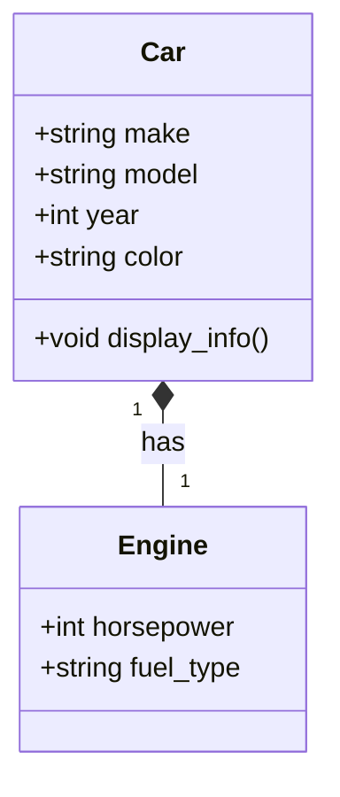

# Definition
Before proceeding, ensure you master Data_Structures and Variables_And_Data_Types because `struct`s fundamentally allow you to create custom, composite data structures from existing variables, acting as building blocks for more complex data organization.
A `struct` (short for structure) in C++ is a **user-defined data type** that allows you to group different types of related data items under a single name. It's essentially a blueprint for creating objects that can hold diverse pieces of information. A simpler way to think about it is like a filing cabinet: instead of having loose papers (individual variables) scattered around, a `struct` provides a designated folder where all related documents (data members) are neatly organized together. This makes it easier to manage and refer to a collection of related data as one coherent unit.

# The Mental Model
Imagine you're trying to describe a car. You wouldn't just list its color, year, and model as separate, unconnected pieces of information. Instead, you'd think of it as a single "car" entity with these attributes. A `struct` works similarly: it lets you define a "Car" type that encapsulates its `color`, `year`, and `model` together.


```text
// Scenario 1: A conceptual representation of a Car
// Output:
// (A visual representation of the class diagram showing a Car class with its attributes and a method,
// and its composition relationship with an Engine class.)
// This diagram visually organizes the attributes (make, model, year, color) and a behavior (display_info)
// associated with a 'Car', and how a Car 'has' an Engine. It represents how a struct logically groups related data.
```
*Note: This `classDiagram` illustrates how data (attributes) and even related components (like Engine) can be conceptually grouped together, similar to how a `struct` aggregates data members.*

# Context & Framework
### Opening the Hood: What's Inside?
At its core, a `struct` acts as a container. Inside this container, you define various "members," which are essentially variables of different data types (e.g., `int`, `double`, `string`, or even other `struct`s). Each member occupies its own memory space within the `struct` instance. When you create an object (an instance) of a `struct`, you're allocating memory for all of its defined members at once, under a single, unified name. This allows for logical grouping and efficient handling of related data.

# The Mastery Deep Dive
### How the Parts Talk to Each Other
Accessing the individual data members within a `struct` instance is straightforward using the **dot operator (`.`)**. If you have a `struct` instance named `myCar` and it has a member `model`, you would access it as `myCar.model`. For pointers to `struct`s, you use the **arrow operator (`->`)**. For example, if `carPtr` is a pointer to a `Car` `struct`, `carPtr->model` would access the `model` member. This clear syntax ensures that you can manipulate each piece of data independently while still recognizing its association with the larger `struct` unit.

### The Translator: From "Lego" to "Jargon"
Imagine building with LEGOs: each brick is an individual variable (like an `int` or `char`). A `struct` is like a pre-designed LEGO model that groups specific bricks together to form a recognizable object, such as a "House" model composed of "Wall" bricks, "Roof" bricks, and "Window" bricks. In C++ jargon, `struct`s allow us to create **composite data types** by aggregating **heterogeneous data members**. This elevates our programming from dealing with individual pieces of data to managing complex, real-world entities.

### The "Vulnerable vs. Secure" Pattern
While `struct`s provide a powerful way to group data, they inherently offer public access to all their members by default. This means any part of your code can directly read or modify a `struct`'s members.
```cpp
#include <iostream>
#include <string>

// Vulnerable struct design: direct public access
struct BankAccount {
    int account_number;
    double balance; // SECURITY RISK: direct modification possible
    std::string owner_name;
};

// Main function demonstrating potential vulnerability
int main() {
    BankAccount myAccount = {12345, 1000.0, "Alice"};

    std::cout << "Initial balance: " << myAccount.balance << std::endl;

    // Potential unauthorized modification - no checks
    myAccount.balance -= 5000.0; // Directly altering balance without validation

    std::cout << "Modified balance: " << myAccount.balance << std::endl;

    return 0;
}
```
```text
// Scenario 1: Initial balance
// Output:
// Initial balance: 1000
// Modified balance: -4000
// This illustrates how direct public access to `balance` allows it to be modified to a negative value without any validation, representing a security risk.
```
This direct access can be a **SECURITY RISK** if not managed carefully, as it bypasses any potential validation logic you might want to implement (e.g., ensuring a bank account balance doesn't go negative). For more robust and secure designs, classes (which offer default private access and methods for controlled access) are often preferred when behavior and data need to be tightly coupled with enforced integrity rules.

# Constraints & Limitations
The primary constraint of `struct`s, particularly in comparison to classes, is their default public member access. While convenient for simple data aggregation, this can lead to issues in larger, more complex systems where data integrity and encapsulation are paramount. Without explicit access control, it's easier to inadvertently corrupt data or violate business rules. Furthermore, `struct`s, by themselves, don't directly support advanced object-oriented features like inheritance or polymorphism without explicit design patterns, though C++ `struct`s are almost identical to `class`es except for default access.

# Significance & Application
`struct`s are foundational in C++ for defining custom data types, especially when the primary concern is merely grouping data. They are widely used in low-level programming, system programming, and whenever simple data records are needed (e.g., representing coordinates, dates, or small configuration settings). Their direct access and lack of overhead make them efficient for performance-critical applications. They are also essential building blocks for more complex data structures like linked lists, trees, and hash tables, where nodes often comprise `struct`s to hold data and pointers.

# The Worked Example
Let's define a `struct` to represent a student's basic information and demonstrate how to create instances, initialize them, and access their members.

```cpp
#include <iostream>
#include <string>

// Define a struct for Student information
struct Student {
    int id;                 // Student ID number
    std::string name;       // Student's full name
    double gpa;             // Grade Point Average
    bool is_enrolled;       // Enrollment status
};

int main() {
    // Create an instance of the Student struct
    Student student1;

    // Initialize the members of student1 using the dot operator
    student1.id = 1001;
    student1.name = "Alice Smith";
    student1.gpa = 3.85;
    student1.is_enrolled = true;

    // Access and print the information for student1
    std::cout << "Student 1 Information:" << std::endl;
    std::cout << "ID: " << student1.id << std::endl;
    std::cout << "Name: " << student1.name << std::endl;
    std::cout << "GPA: " << student1.gpa << std::endl;
    std::cout << "Enrolled: " << (student1.is_enrolled ? "Yes" : "No") << std::endl;
    std::cout << std::endl;

    // Create another instance and initialize using initializer list (C++11 and later)
    Student student2 = {1002, "Bob Johnson", 3.10, false};

    // Access and print the information for student2
    std::cout << "Student 2 Information:" << std::endl;
    std::cout << "ID: " << student2.id << std::endl;
    std::cout << "Name: " << student2.name << std::endl;
    std::cout << "GPA: " << student2.gpa << std::endl;
    std::cout << "Enrolled: " << (student2.is_enrolled ? "Yes" : "No") << std::endl;

    return 0;
}
```
```text
// Scenario 1: Demonstrating struct initialization and member access
// Output:
// Student 1 Information:
// ID: 1001
// Name: Alice Smith
// GPA: 3.85
// Enrolled: Yes
//
// Student 2 Information:
// ID: 1002
// Name: Bob Johnson
// GPA: 3.1
// Enrolled: No
```
This example clearly shows how to define a `Student` `struct`, create two different `Student` objects, assign values to their respective members using the dot operator, and then retrieve and print those values. This illustrates the fundamental mechanics of working with structures in C++.

# The Proving Ground
*Test your mastery. Cover the solutions below to test yourself first.*

### Level 1: The Sanity Check (Verification)
**The Component Check:** What is the fundamental difference in purpose between a C++ `struct` and a standalone `int` variable? Provide a brief example to illustrate.
> **Solution:** A `struct` is a user-defined **composite** data type that groups **multiple, possibly heterogeneous** data items under a single name, representing a single logical entity. An `int` variable is a **primitive** data type that stores a single integer value.
> Example: `struct Point { int x; int y; };` groups two integers (`x`, `y`) into one `Point` entity, whereas `int score;` is a single integer.

### Level 2: The Crucible (Mastery & Edge Cases)
**The Broken System:** You are debugging a C++ program and encounter the following `struct` and function. The program compiles, but when `displayInfo` is called with `ptr_book`, it crashes. Explain *why* it crashes and provide a corrected version of the `main` function to prevent the crash, without changing the `Book` `struct` definition or the `displayInfo` function signature.
```cpp
#include <iostream>
#include <string>

struct Book {
    std::string title;
    std::string author;
    int publication_year;
};

void displayInfo(Book* book_ptr) {
    std::cout << "Title: " << book_ptr->title << std::endl;
    std::cout << "Author: " << book_ptr->author << std::endl;
    std::cout << "Year: " << book_ptr->publication_year << std::endl;
}

int main() {
    Book* ptr_book = nullptr; // Pointer not initialized to a valid Book object
    displayInfo(ptr_book); // Dereferencing a nullptr causes a crash
    return 0;
}
```
```text
// Scenario 1: Program execution (problematic code)
// Output:
// Program crashes with a segmentation fault or access violation error.

// Scenario 2: Explanation of crash
// The program crashes because `ptr_book` is initialized to `nullptr`. When `displayInfo(ptr_book)` is called, the function attempts to dereference this `nullptr` (`book_ptr->title`, `book_ptr->author`, etc.) to access the members of a `Book` object. Dereferencing a null pointer leads to undefined behavior, which commonly manifests as a program crash or segmentation fault, as it tries to access memory it doesn't own.
```
> **Solution:** The crash occurs because `ptr_book` is a null pointer, and `displayInfo` attempts to dereference it. You cannot access members through a null pointer.
>
> **Corrected `main` function:**
> --- START_CODE:cpp ---
> #include <iostream>
> #include <string>
>
> struct Book {
>     std::string title;
>     std::string author;
>     int publication_year;
> };
>
> void displayInfo(Book* book_ptr) {
>     if (book_ptr == nullptr) { // Added check for nullptr
>         std::cout << "Error: Book pointer is null." << std::endl;
>         return;
>     }
>     std::cout << "Title: " << book_ptr->title << std::endl;
>     std::cout << "Author: " << book_ptr->author << std::endl;
>     std::cout << "Year: " << book_ptr->publication_year << std::endl;
> }
>
> int main() {
>     Book myBook = {"The Great C++", "Bjarne Stroustrup", 1985}; // Create a valid Book object
>     Book* ptr_book = &myBook; // Point to the valid object
>     displayInfo(ptr_book);
>
>     Book* another_ptr_book = new Book{"Effective C++", "Scott Meyers", 1991}; // Dynamically allocate
>     displayInfo(another_ptr_book);
>     delete another_ptr_book; // Clean up dynamically allocated memory
>
>     // Demonstrate the null pointer check
>     Book* null_book_ptr = nullptr;
>     displayInfo(null_book_ptr);
>
>     return 0;
> }
> --- END_CODE:cpp ---
> --- START_CODE:text ---
> // Scenario 1: Execution of corrected code with valid pointer
> // Output:
> // Title: The Great C++
> // Author: Bjarne Stroustrup
> // Year: 1985
> // Title: Effective C++
> // Author: Scott Meyers
> // Year: 1991
> // Error: Book pointer is null.
> --- END_CODE:text ---
> **Explanation:** The fix involves creating a valid `Book` object (either on the stack like `myBook` or dynamically on the heap using `new`). The pointer `ptr_book` then points to this valid object's memory address. The `displayInfo` function was also slightly modified to include a `nullptr` check, a crucial defensive programming practice to prevent dereferencing invalid pointers, as discussed in the 'How the Parts Talk to Each Other' section regarding pointer usage. This ensures that the program only attempts to access members if the pointer is valid.

# Key Takeaways
*   `struct`s are user-defined composite data types that group related data items of different types under a single name, acting as a blueprint for data organization.
*   Members of a `struct` are accessed using the dot operator (`.`) for instances and the arrow operator (`->`) for pointers to instances, providing a clear mechanism for data manipulation.
*   While efficient for simple data aggregation, the default public access of `struct` members can pose data integrity and security risks, making careful design essential.

# Knowledge Graph Connections
| Concept                     | Connection / Relationship                                                                   |
| :
-------------------------- | :
------------------------------------------------------------------------------------------ |
| Data_Structures         | `struct`s are fundamental building blocks for creating more complex data structures.       |
| Object_Oriented_Programming | `struct`s share similarities with classes and are a foundational concept in OOP.           |
| Memory_Management       | Understanding `struct`s is crucial for managing contiguous memory blocks for composite data. |
---