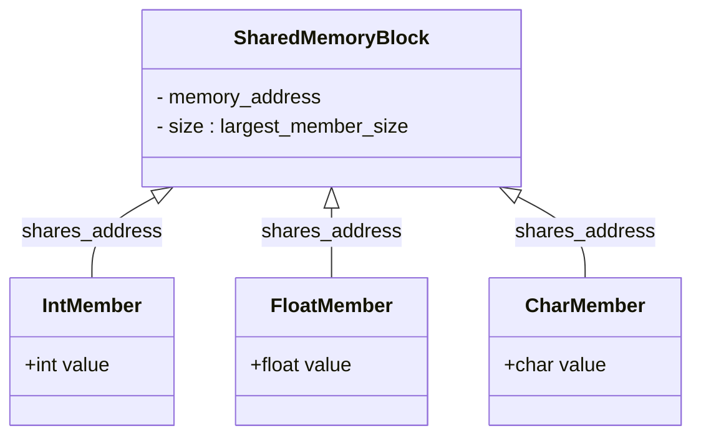

# Definition
Before proceeding, ensure you master Memory_Management and Data_Representation because `union`s directly interact with memory to allow different data types to share the same storage, which requires a deep understanding of how data is laid out and interpreted in memory.
A `union` in C++ is a **user-defined data type** that allows different data types to be stored in the **same memory location**. Unlike a `struct`, where each member has its own distinct memory space, all members of a `union` share the *starting address* of that single memory block. The size of the `union` is determined by its largest member. Think of a `union` like a single locker that can hold either a book, a backpack, or a laptop, but only one item at a time. You can put any of these items in, but if you put a backpack in and then try to retrieve a book, you'll get garbage because the "book" space is now occupied by the backpack's data. This mechanism is primarily used for memory optimization and type punning in specific scenarios.

# The Mental Model
Imagine you have a single whiteboard. You can write either a number, a word, or a simple diagram on it. You can't have all three at once; whatever you write last overwrites what was there before. A `union` is like that whiteboard: it's a single chunk of memory that can *interpret* its contents as one type (e.g., an `int`) or another (e.g., a `float`), but only one interpretation is valid at any given time.


```text
// Scenario 1: Conceptual view of shared memory in a union
// Output:
// (A visual representation of the class diagram showing a SharedMemoryBlock with its address and size,
// and how IntMember, FloatMember, and CharMember all share the same memory_address.)
// This diagram illustrates that all members of a union conceptually point to and utilize the same physical memory space.
```
*Note: This `classDiagram` visually represents how different members of a `union` conceptually point to and occupy the same underlying `SharedMemoryBlock`, highlighting the memory-sharing aspect.*

# Context & Framework
### Opening the Hood: What's Inside?
When you define a `union`, the compiler allocates enough memory to hold the *largest* of its members. All other members will then use this same memory space. For example, if a `union` has an `int` (4 bytes) and a `double` (8 bytes), the `union` itself will be 8 bytes in size. When you assign a value to `union.int_member`, those 4 bytes are written to the beginning of the `union`'s memory. If you then assign a value to `union.double_member`, the full 8 bytes are written, potentially overwriting the `int_member`'s data. This behavior is key to understanding both the efficiency and the potential dangers of `union`s.

# The Mastery Deep Dive
### How the Parts Talk to Each Other
Accessing members of a `union` is syntactically identical to `struct`s: use the **dot operator (`.`)** for direct instances and the **arrow operator (`->`)** for pointers. The crucial distinction lies in the semantics: after writing to one member of a `union`, you must only read from that *same member*. Reading from a different member after writing to another is known as **type punning** and leads to **undefined behavior (UB)** if the types are not layout-compatible (which is typically the case). The `union` itself does not store any information about which member is currently active. It's the programmer's responsibility to keep track of this.

### The Translator: From "Lego" to "Jargon"
Imagine a single universal adapter (the `union`) that can be plugged into different devices (the `int`, `float`, or `char` members), but it can only operate *one device at a time*. You plug it into the `int` slot, it acts like an `int`. You pull it out and plug it into the `float` slot, now it acts like a `float`, overwriting the `int`'s "configuration." The "Jargon" is that `union`s provide **overlapping memory allocation** for **heterogeneous data types**, enabling **memory optimization** and controlled **type punning**, albeit with the significant caveat of **undefined behavior** if an inactive member is read.

### The "Vulnerable vs. Secure" Pattern
Using `union`s carelessly can lead to significant vulnerabilities and bugs due to **undefined behavior**. If you write to one member and then read from another, the interpretation of the bits in memory will be incorrect, potentially leading to garbage values, crashes, or security exploits (e.g., if sensitive data is unintentionally exposed through an incorrect type interpretation).
```cpp
#include <iostream>

union ValueHolder {
    int i;
    float f;
};

int main() {
    ValueHolder vh;

    vh.i = 10; // Write to 'i'
    std::cout << "After vh.i = 10:" << std::endl;
    std::cout << "vh.i: " << vh.i << std::endl;
    // SECURITY RISK / UNDEFINED BEHAVIOR: Reading 'f' when 'i' was active
    std::cout << "vh.f (UNDEFINED BEHAVIOR): " << vh.f << std::endl;

    vh.f = 3.14f; // Write to 'f'
    std::cout << "\nAfter vh.f = 3.14f:" << std::endl;
    // SECURITY RISK / UNDEFINED BEHAVIOR: Reading 'i' when 'f' was active
    std::cout << "vh.i (UNDEFINED BEHAVIOR): " << vh.i << std::endl;
    std::cout << "vh.f: " << vh.f << std::endl;

    return 0;
}
```
```text
// Scenario 1: Program execution (output will vary due to undefined behavior)
// Output (example):
// After vh.i = 10:
// vh.i: 10
// vh.f (UNDEFINED BEHAVIOR): 1.4013e-44 (or some other float representation of the bits of 10)

// After vh.f = 3.14f:
// vh.i (UNDEFINED BEHAVIOR): 1078523331 (or some other int representation of the bits of 3.14f)
// vh.f: 3.14

// The security risk here is that if a union holds sensitive data and an attacker can force the program to read it using an incorrect type,
// they might gain access to raw memory representation that reveals partial information or leads to crashes.
```
A secure pattern for using `union`s involves pairing them with an **`enum` (or `enum class`) as a "tag" or "discriminator"** within a `struct`. This tag explicitly indicates which member of the `union` is currently active, allowing the program to safely access the correct member and avoid undefined behavior. This structured approach helps regain type safety lost by the `union`'s memory-sharing nature.

# Constraints & Limitations
The most significant limitation and danger of `union`s is the **lack of type safety** and the high risk of **undefined behavior**. As mentioned, reading from an inactive member of a `union` (i.e., a member that was not the last one written to) is typically undefined behavior, making `union`s notoriously difficult to debug if misused. They cannot hold objects with non-trivial constructors, destructors, or copy/move assignment operators (like `std::string` or custom classes with complex resource management) without careful manual management or C++11 `union` extensions (`placement new` and explicit destructor calls), making them unsuitable for general-purpose object storage.

# Significance & Application
Despite their dangers, `union`s are powerful tools for specific use cases:
*   **Memory Optimization**: In embedded systems or highly memory-constrained environments, `union`s can save significant memory by allowing different data to share the same storage, especially when only one type is active at a time.
*   **Interfacing with Hardware/Protocols**: They are often used when dealing with hardware registers or network packets where data can be interpreted in multiple ways (e.g., a byte array that can also be seen as an integer).
*   **Variant Types (pre-C++17)**: Before `std::variant` (C++17), `union`s were the primary way to implement a type that could hold one of several possible types, often wrapped in a `struct` with a discriminant `enum` for type tracking.
*   **Type Punning**: Though dangerous, they can be intentionally used for type punning (reinterpreting the bits of one type as another) in specific, carefully controlled low-level scenarios where performance is critical and undefined behavior is explicitly managed.

# The Worked Example
Let's demonstrate a safe and practical use of `union`s by combining it with a `struct` and an `enum` to create a simple `Variant` type that can hold either an `int` or a `float`.

```cpp
#include <iostream>
#include <string>

// Enum to indicate the active type in the union (discriminator)
enum class VariantType {
    INT,
    FLOAT
};

// Union to store either an int or a float in the same memory location
union ValueUnion {
    int i_val;
    float f_val;
};

// Struct to combine the discriminator and the union
struct Variant {
    VariantType type;
    ValueUnion data;

    // Constructors for safe initialization
    Variant(int val) : type(VariantType::INT) {
        data.i_val = val;
    }

    Variant(float val) : type(VariantType::FLOAT) {
        data.f_val = val;
    }

    // Function to safely print the value based on its type
    void print() const {
        switch (type) {
            case VariantType::INT:
                std::cout << "Variant (INT): " << data.i_val << std::endl;
                break;
            case VariantType::FLOAT:
                std::cout << "Variant (FLOAT): " << data.f_val << std::endl;
                break;
            default:
                std::cout << "Variant (UNKNOWN TYPE)" << std::endl;
                break;
        }
    }
};

int main() {
    // Create Variant instances
    Variant var1(10);        // Holds an integer
    Variant var2(3.14f);     // Holds a float

    // Safely print their values
    var1.print();
    var2.print();

    // Demonstrating (unsafe) direct union usage without discriminator (for contrast)
    // ValueUnion bad_union;
    // bad_union.i_val = 200;
    // std::cout << "Unsafe union read (as float): " << bad_union.f_val << std::endl; // Undefined behavior

    return 0;
}
```
```text
// Scenario 1: Program execution demonstrating a safe Variant type using union + enum + struct
// Output:
// Variant (INT): 10
// Variant (FLOAT): 3.14
//
// Explanation:
// The output correctly identifies and prints the stored type and value for each Variant instance.
// This is achieved by the `VariantType type` member in the `Variant` struct acting as a discriminator,
// which is used in the `print()` function's `switch` statement to access the correct member of the `ValueUnion`.
// This prevents undefined behavior by ensuring that the correct member of the union is always read after being written to.
```
This example showcases the secure pattern for using `union`s by embedding them within a `struct` alongside an `enum` discriminator. This approach, similar to `std::variant` from C++17, allows for type-safe manipulation of data stored in shared memory, effectively mitigating the dangers of undefined behavior inherent in raw `union` usage.

# The Proving Ground
*Test your mastery. Cover the solutions below to test yourself first.*

### Level 1: The Sanity Check (Verification)
**The Component Check:** What is the primary difference in memory allocation between a C++ `struct` and a C++ `union`?
> **Solution:** In a `struct`, each member is allocated its own distinct memory space, and the total size of the `struct` is the sum of its members' sizes (plus any padding). In a `union`, all members share the *same memory location*, and the size of the `union` is determined by the size of its largest member.

### Level 2: Competence (Application)
**The Clean Build:** Define a C++ `union` named `ConvertData` that can hold either an `int` (`i`), a `float` (`f`), or a `double` (`d`). Write a program that assigns a `double` value to the `d` member, then prints the value of `i`, `f`, and `d`. Explain why the values of `i` and `f` might appear as "garbage" or unexpected numbers.
```cpp
#include <iostream>

union ConvertData {
    int i;
    float f;
    double d;
};

int main() {
    ConvertData data;

    data.d = 123.456; // Assign a value to the double member

    std::cout << "Assigned data.d = 123.456" << std::endl;
    std::cout << "data.d: " << data.d << std::endl;
    std::cout << "data.i: " << data.i << std::endl; // Reading inactive member (int)
    std::cout << "data.f: " << data.f << std::endl; // Reading inactive member (float)

    return 0;
}
```
```text
// Scenario 1: Program execution (output will vary due to undefined behavior, but patterns will emerge)
// Output (example):
// Assigned data.d = 123.456
// data.d: 123.456
// data.i: -1234567890 (or any garbage integer value)
// data.f: -0.000000 (or any garbage float value)

// Explanation:
// The values for `data.i` and `data.f` will appear as "garbage" or unexpected numbers because after `data.d` was assigned,
// the *entire* memory block of the union (which is sized for a `double`) holds the bit representation of that `double`.
// When `data.i` or `data.f` are accessed, the program attempts to interpret these same bits as an `int` or a `float`, respectively.
// This is known as reading an inactive member, which leads to undefined behavior. The bits representing a double are generally not a valid or meaningful integer or float when directly reinterpreted.
```
> **Solution:** (See code above)
>
> The values of `data.i` and `data.f` will appear as "garbage" or unexpected numbers because when `data.d` (a `double`) is assigned a value, the entire memory block of the `union` is overwritten with the bit representation of that `double`. When `data.i` (an `int`) or `data.f` (a `float`) are then accessed, the program attempts to interpret these same bits as an `int` or a `float`. The bit patterns for a `double` are generally not a valid or meaningful representation for an `int` or a `float` when directly reinterpreted in this way, leading to undefined behavior and unexpected values.

### Level 3: Mastery (The Crucible)
**The Broken System:** You are building a low-level network parser that receives data blocks. Each block starts with a `header` (an `int`) followed by a `payload` that could be an `int` (`msg_id`), a `char` array (`msg_text`), or a `float` (`msg_temp`). You decided to use a `union` for the `payload`. The current implementation lacks a way to determine the active payload type, leading to data corruption and crashes. Redesign the `DataBlock` structure to safely handle the different `payload` types using a combination of `struct`, `enum class`, and `union`, ensuring type safety when accessing payload data. Provide a C++ code snippet that demonstrates sending and receiving a data block with a text message.
```cpp
#include <iostream>
#include <string>
#include <cstring> // For strcpy

// Original problematic union (no discriminator)
union OldPayload {
    int msg_id;
    char msg_text;
    float msg_temp;
};

struct OldDataBlock {
    int header;
    OldPayload payload;
};

// Function to process an old data block (problematic)
void processOldDataBlock(const OldDataBlock& block) {
    // This is inherently unsafe, as we don't know the active type
    std::cout << "Header: " << block.header << ", Payload (as int): " << block.payload.msg_id << std::endl;
}

int main() {
    OldDataBlock block_text = {1, {"Hello Network!"}}; // Initialize as text
    processOldDataBlock(block_text); // Will try to read as int, leading to UB
    return 0;
}
```
```text
// Scenario 1: Program execution (problematic code)
// Output (example - will be garbage due to undefined behavior):
// Header: 1, Payload (as int): 1867623000 (garbage value for "Hello Network!")
//
// Explanation of the problem:
// The `OldDataBlock` struct with `OldPayload` union has no mechanism to identify *which* member of the union is currently active.
// The `processOldDataBlock` function blindly attempts to read `block.payload.msg_id` (an `int`), even when the payload was initialized with `msg_text` (a `char` array).
// This results in undefined behavior, as the bits stored for the `char` array are reinterpreted as an `int`, leading to nonsensical output or a program crash.
```
> **Solution:**
> The critical flaw in the `OldDataBlock` structure is the absence of a mechanism to determine which member of the `OldPayload` union is active. Accessing an inactive member leads to undefined behavior.
>
> **Redesigned `DataBlock` structure:**
> To safely handle different payload types, we combine a `struct`, an `enum class` (as a discriminator), and a `union`. The `enum class` will explicitly track the active type in the `union`.
>
> --- START_CODE:cpp ---
> #include <iostream>
> #include <string>
> #include <cstring> // For strcpy, strlen
>
> // Enum class to indicate the type of data currently stored in the payload
> enum class PayloadType {
>     NONE,
>     INT_MESSAGE,
>     TEXT_MESSAGE,
>     FLOAT_TEMP
> };
>
> // Union to store the actual payload data in shared memory
> union PacketPayload {
>     int msg_id;
>     char msg_text; // Max 49 chars + null terminator
>     float msg_temp;
> };
>
> // Struct to encapsulate the header, the payload type, and the union itself
> struct DataBlock {
>     int header;
>     PayloadType type; // Discriminator: tells us which union member is active
>     PacketPayload payload;
>
>     // Constructor for int messages
>     DataBlock(int h, int id) : header(h), type(PayloadType::INT_MESSAGE) {
>         payload.msg_id = id;
>     }
>
>     // Constructor for text messages
>     DataBlock(int h, const char* text) : header(h), type(PayloadType::TEXT_MESSAGE) {
>         strncpy(payload.msg_text, text, sizeof(payload.msg_text) - 1);
>         payload.msg_text[sizeof(payload.msg_text) - 1] = '\0'; // Ensure null termination
>     }
>
>     // Constructor for float messages
>     DataBlock(int h, float temp) : header(h), type(PayloadType::FLOAT_TEMP) {
>         payload.msg_temp = temp;
>     }
>
>     // Default constructor
>     DataBlock() : header(0), type(PayloadType::NONE) {}
> };
>
> // Function to safely process and print a DataBlock
> void processDataBlock(const DataBlock& block) {
>     std::cout << "Header: " << block.header << ", ";
>     switch (block.type) {
>         case PayloadType::INT_MESSAGE:
>             std::cout << "Type: INT_MESSAGE, Value: " << block.payload.msg_id << std::endl;
>             break;
>         case PayloadType::TEXT_MESSAGE:
>             std::cout << "Type: TEXT_MESSAGE, Value: \"" << block.payload.msg_text << "\"" << std::endl;
>             break;
>         case PayloadType::FLOAT_TEMP:
>             std::cout << "Type: FLOAT_TEMP, Value: " << block.payload.msg_temp << " F" << std::endl;
>             break;
>         case PayloadType::NONE:
>         default:
>             std::cout << "Type: UNKNOWN/NONE" << std::endl;
>             break;
>     }
> }
>
> int main() {
>     // Demonstrate sending and receiving a data block with a text message
>     DataBlock textBlock(101, "Hello from the network interface!");
>     processDataBlock(textBlock);
>
>     // Demonstrate other types
>     DataBlock intBlock(102, 42);
>     processDataBlock(intBlock);
>
>     DataBlock floatBlock(103, 98.6f);
>     processDataBlock(floatBlock);
>
>     return 0;
> }
> --- END_CODE:cpp ---
> --- START_CODE:text ---
> // Scenario 1: Program execution (refactored code)
> // Output:
> // Header: 101, Type: TEXT_MESSAGE, Value: "Hello from the network interface!"
> // Header: 102, Type: INT_MESSAGE, Value: 42
> // Header: 103, Type: FLOAT_TEMP, Value: 98.6 F
> --- END_CODE:text ---
> **Explanation:**
> 1.  **`PayloadType` (enum class):** This `enum class` acts as a **discriminator**, explicitly stating which type of data is currently stored in the `union`. This is crucial for maintaining type safety.
> 2.  **`PacketPayload` (union):** This `union` provides the memory optimization, allowing `msg_id`, `msg_text`, and `msg_temp` to share the same memory space. Its size is determined by the largest member (`msg_text`).
> 3.  **`DataBlock` (struct):** This `struct` brings everything together, containing the `header`, the `type` discriminator, and the `payload` `union`. The constructors ensure that when a `DataBlock` is created, its `type` is correctly set, and the appropriate `union` member is initialized.
> 4.  **`processDataBlock` function:** This function uses the `block.type` (the discriminator) in a `switch` statement to safely determine which member of `block.payload` to access, thus preventing undefined behavior and ensuring correct data interpretation. This pattern ensures that we always read the active member of the `union`.

# Key Takeaways
*   A `union` in C++ allows multiple data members to occupy the same memory location, with its size determined by the largest member, primarily for memory optimization.
*   The primary danger of `union`s is the lack of type safety and the risk of undefined behavior when reading from a member that was not the last one written to.
*   To use `union`s safely and avoid undefined behavior, they should be paired with a discriminator (`enum` or `enum class`) within a `struct`, explicitly indicating which member is currently active.

# Knowledge Graph Connections
| Concept                     | Connection / Relationship                                                                   |
| :
-------------------------- | :
------------------------------------------------------------------------------------------ |
| Memory_Management       | `union`s are a low-level tool for explicit memory optimization by overlapping data storage. |
| Data_Representation     | `union`s can be used to interpret the same block of memory as different data types.          |
| Low_Level_Programming   | `union`s are frequently found in low-level code, such as device drivers or network protocols. |
---