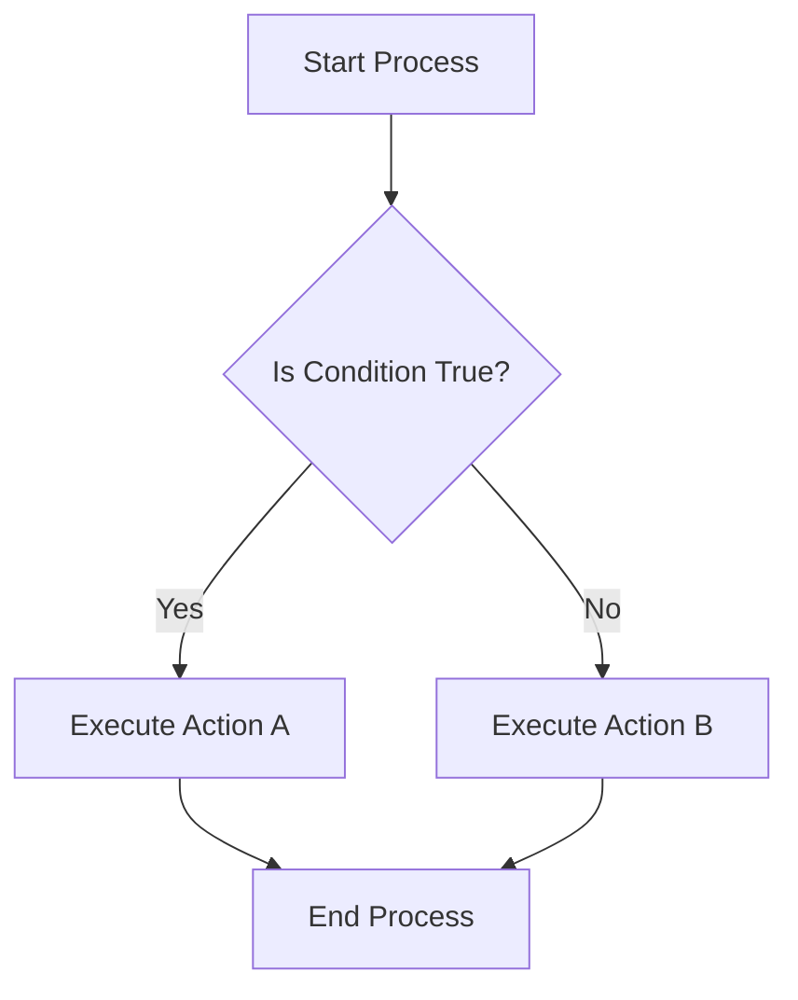
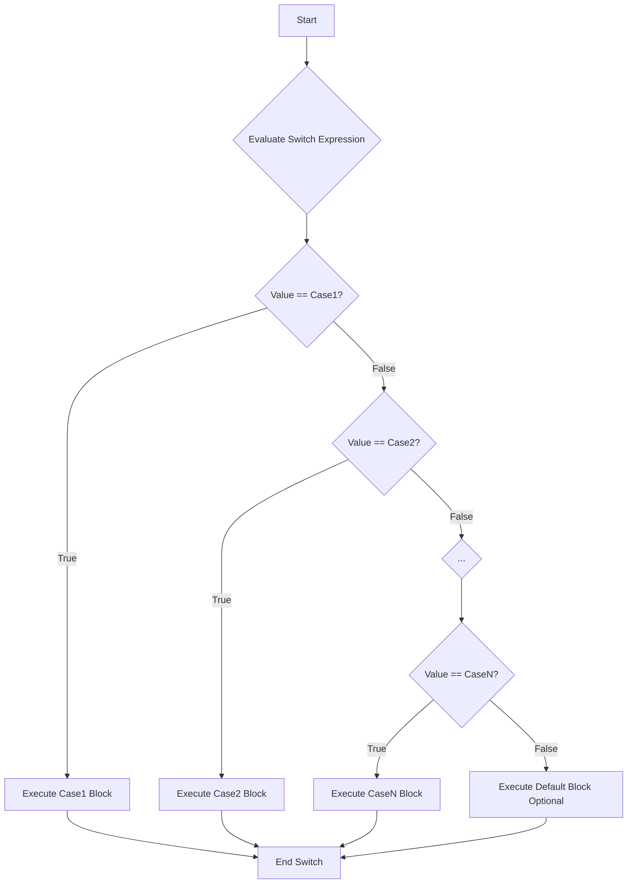
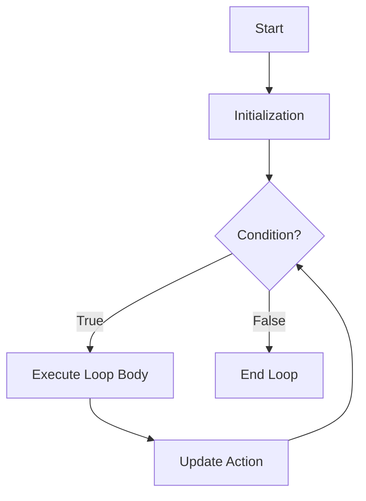
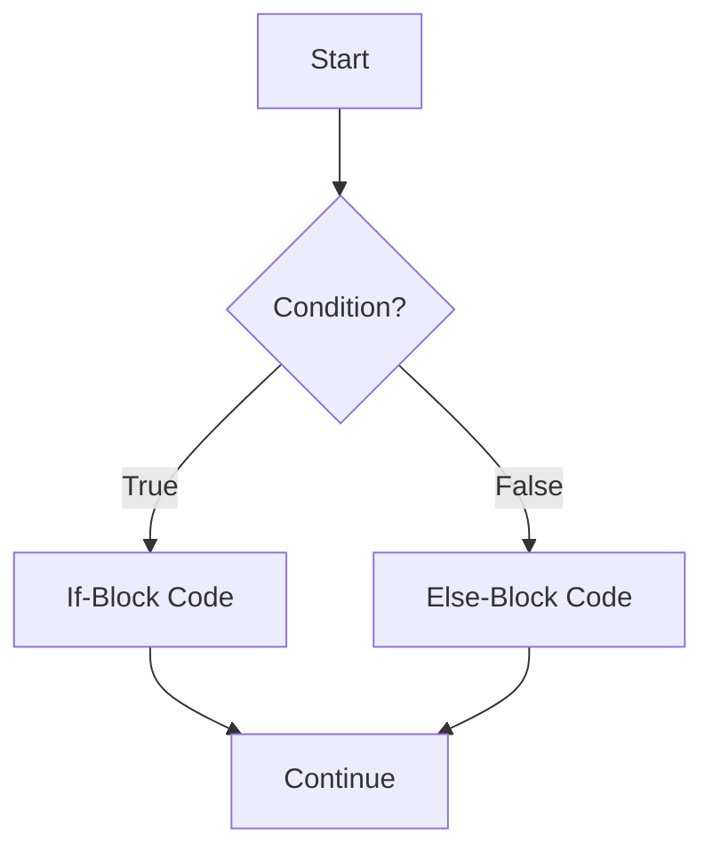
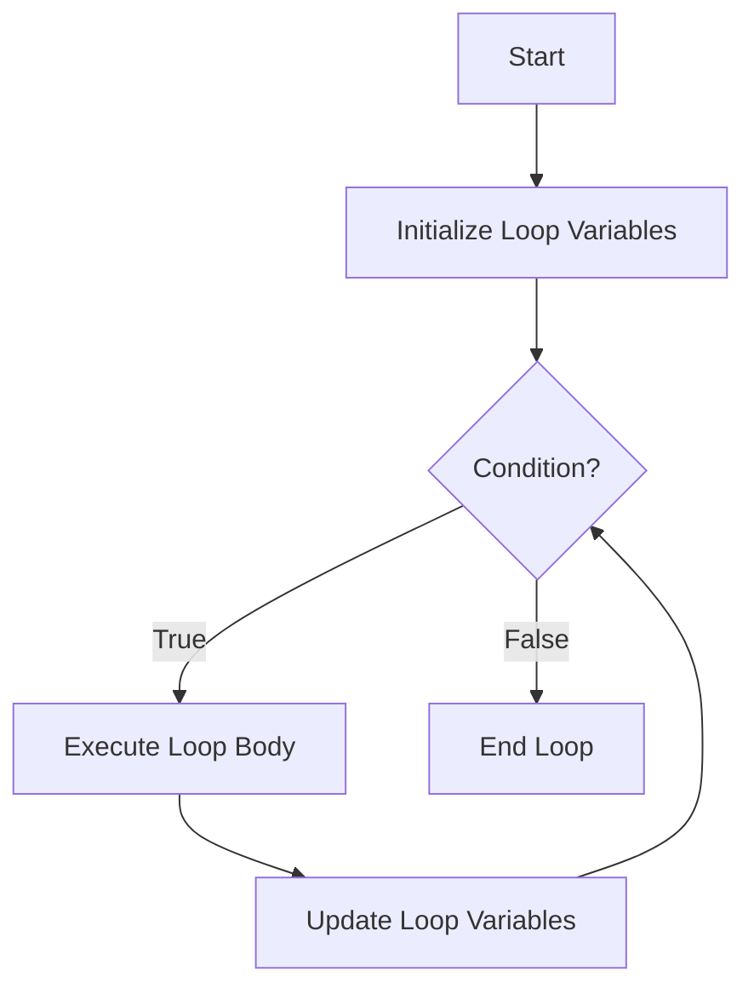

# 3 Control Structure Flow Of Control

Comprehensive resource for 3 Control Structure Flow Of Control.


---

## 3 Control Structure Flow Of Control Hub


## Overview
This unit delves into the foundational concepts of control structures in C++, which dictate the order in which statements are executed. Mastery of these mechanisms, including [[Branching_Statements]] (for decision-making) and [[Loop_Statements]] (for repetition), is crucial for writing programs that can respond dynamically to conditions and efficiently perform repetitive tasks. Without control flow, programs would simply execute linearly, lacking the logic and versatility required for real-world applications. Imagine a chef following a recipe: control structures are like the "if-then" steps (e.g., "if boiling, reduce heat") and "repeat until" instructions (e.g., "stir until thickened"), allowing the chef to adapt to different conditions and achieve the desired outcome.

## Learning Objectives
*   Identify and differentiate between various types of control statements in C++, including branching and looping constructs.
*   Implement `if`, `if-else`, `else-if` ladder, and `switch` statements to create programs that make decisions based on logical conditions.
*   Utilize compound statements (`{}`) effectively to group multiple instructions within conditional and loop blocks.
*   Distinguish between the assignment operator (`=`) and the equality operator (`==`) and avoid common pitfalls related to their misuse.
*   Employ the conditional (ternary) operator as a concise alternative for simple `if-else` expressions.
*   Implement `while`, `do-while`, and `for` loops to execute code repeatedly until specified conditions are met.
*   Differentiate between `while` and `do-while` loops based on when their conditions are evaluated, and select the appropriate loop for a given task.
*   Apply `break` and `continue` statements judiciously to alter the normal flow of control within loops.
*   Design and implement nested loops for complex iterative tasks, such as generating patterns or processing multi-dimensional data.
*   Recognize and avoid common looping pitfalls, including infinite loops and misplaced semicolons.

## Unit Applications & Real-World Relevance
Control structures are the logical backbone of almost every software application. In game development, they determine character actions based on user input or game state (e.g., "if health < 0, then Game Over"). In operating systems, loops manage processes and device interactions, while branching handles system calls and error conditions. For data analysis, loops iterate through datasets to perform calculations, and conditionals filter data based on criteria. Web servers use these structures to handle incoming requests, route them to appropriate services, and generate dynamic content. From simple scripts to complex enterprise systems, the ability to control program flow is fundamental to building intelligent, responsive, and efficient software.

## Active Learning Prompts
*   Consider a scenario where you need to check multiple, mutually exclusive conditions (e.g., a student's grade range). How would you decide between using an `if-else if` ladder and a `switch` statement for this task, and what factors would influence your choice?
*   Imagine you are writing a program that processes user input until a specific sentinel value is entered. Describe how you would implement this using a `while` loop, a `do-while` loop, and a `for` loop, highlighting the strengths and weaknesses of each approach in this context.
*   Design a simple text-based adventure game. Identify at least five distinct situations where you would need to use either a branching statement or a loop to control the game's narrative or character interactions.
*   Reflect on a time you encountered a bug in a program that behaved unexpectedly. How might a misunderstanding of control flow (e.g., an accidental infinite loop or incorrect conditional logic) contribute to such a bug?

## Unit Challenges & Common Misconceptions
A common challenge in mastering control flow lies in accurately formulating boolean expressions for `if` statements and loop conditions. Students often confuse the assignment operator (`=`) with the equality operator (`==`), leading to subtle bugs where conditions always evaluate to true. Another frequent misconception revolves around the `break` and `continue` statements; while powerful, their overuse can lead to "spaghetti code" that is difficult to read and debug. Nested loops also present a challenge, requiring careful attention to indentation and the scope of inner and outer loop variables. Understanding when to use a `while` versus a `do-while` loop is critical, as a `do-while` guarantees at least one execution of its body, which is not always desired.

## Connections
  - [[Branching_Statements]]
    - [[If_Else_Statement]]
      - [[Compound_Block_Statements]]
      - [[Assignment_vs_Equality_Operators]]
      - [[Optional_Else_Clause]]
      - [[Nested_If_Else_Statements]]
        - [[Multiway_If_Else_Statements]]
      - [[Conditional_Operator]]
    - [[Switch_Statement]]
      - [[Break_Statement]]
  - [[Loop_Statements]]
    - [[While_Loop]]
      - [[Do_While_Loop]]
      - [[Loop_Pitfalls]]
    - [[For_Loop]]
      - [[Continue_Statement]]
      - [[Nested_Loops]]

## Next Steps for Deeper Understanding
To deepen your understanding of control structures, explore how they are used in conjunction with functions to build more modular and reusable code. Investigate exception handling mechanisms in C++ (`try-catch` blocks), which provide an alternative structured approach to managing unexpected program flow. Consider researching advanced loop optimization techniques, especially in performance-critical applications. Finally, practice implementing recursive algorithms, which offer an alternative to iteration for certain problem types, and understand the trade-offs between recursion and iterative solutions.

## Possible Questions
[[CS1220_3_Control_Structure_Flow_of_Control_Possible_Questions]]

---

---

## Branching Statements


## Definition
Before proceeding, ensure you master [[Control_Statements_Overview]] and Boolean_Logic.
Branching statements, also known as selection or decision-making statements, are programming constructs that allow a program to execute different blocks of code based on whether a specified condition evaluates to true or false. Instead of proceeding linearly, the program "branches off" to an alternative path. A simpler way to understand it is like encountering a fork in the road: you look at a sign (the condition), and based on what it says, you choose to go left or right.

## The Mental Model
Imagine you are at an airport security checkpoint. The "condition" is whether your bag contains prohibited items. If the condition (prohibited items present) is true, your bag goes down one conveyor belt for further inspection (one branch of execution). If the condition is false, your bag goes down another conveyor belt directly to baggage claim (the other branch). This choice, dictated by a condition, is the essence of a branching statement.


```text
// Scenario 1: Condition is True
// Output:
// (A visual representation of the flowchart showing the decision process and paths.)
// Start Process -> Is Condition True? (Yes) -> Execute Action A -> End Process.
// This path shows the program taking the 'Yes' branch based on the condition.

// Scenario 2: Condition is False
// Output:
// Start Process -> Is Condition True? (No) -> Execute Action B -> End Process.
// This path shows the program taking the 'No' branch, illustrating the alternative execution path.
```
*Note: This `flowchart` visually represents how a program's execution flow can diverge based on a binary decision.*

## Context & Framework
#### The Transformation: Before and After
Branching statements fundamentally alter a program's behavior by making its execution path conditional. Before a branching statement, the program's flow is linear. After it, the program's state and subsequent actions depend entirely on the outcome of the evaluated condition. This introduces dynamism; the same program can produce different results or take different actions with varying inputs, effectively "transforming" its operational path based on real-time data or logic. This ability to adapt is a cornerstone of intelligent software.

## The Mastery Deep Dive
#### Follow the Ball: A Slow-Motion Trace
Consider a simple program that determines if a student passed an exam. The "ball" (program execution) starts. It encounters a branching statement: `if (score >= 50)`.
1.  **Condition Evaluation:** The program evaluates `score >= 50`.
2.  **Path Selection (True):** If the score is 75, `75 >= 50` is true. The program "ball" goes down the `if` branch. It prints "Pass."
3.  **Path Selection (False):** If the score is 40, `40 >= 50` is false. The program "ball" goes down the `else` branch. It prints "Fail."
4.  **Convergence:** Regardless of the path taken, the "ball" eventually converges back to a single point after the branching statement, and the rest of the program continues. This trace shows how a single decision point creates mutually exclusive execution paths.

#### The Reality Check: Theory vs. Real Life
In theory, branching statements are simple true/false decisions. In real-life programming, the complexity arises when conditions involve multiple logical operators (`&&`, `||`, `!`), or when conditions are themselves the result of complex function calls. Performance can be impacted by the cost of evaluating complex conditions, or by cache misses if different branches access widely disparate memory locations. Moreover, security vulnerabilities often stem from inadequate branching logic that fails to properly validate inputs, allowing malicious paths to be exploited. Therefore, while theoretically simple, practical application demands rigor.

## Constraints & Limitations
While powerful, the elegance of branching statements can be lost if not managed carefully. Overly complex boolean expressions can be difficult to read and debug. Furthermore, deeply `nested if-else` structures can lead to code that is hard to follow and modify, a phenomenon often referred to as "arrow code" due to the visual indentation. Unhandled conditions are also a significant constraint; if a program doesn't account for all possible outcomes of a condition, it can lead to unexpected behavior or crashes for edge cases.

## Significance & Application
Branching statements are fundamental to almost every software application. They enable input validation (e.g., "if password is correct, grant access"), error handling (e.g., "if file not found, display error"), and feature toggling (e.g., "if user is premium, unlock feature"). From the simplest calculator distinguishing between addition and subtraction, to sophisticated AI systems making strategic decisions, branching statements are the core mechanism that allows programs to react intelligently and dynamically to varied situations and data.

## The Worked Example
Consider a C++ program that prompts a user for a number and determines if it is positive, negative, or zero. This explicitly demonstrates three distinct branching paths.

```cpp
```cpp
##include <iostream> // For input/output operations

int main() {
    int num; // Declare an integer variable to store the user's number

    // Prompt the user to enter a number
    std::cout << "Enter an integer: ";
    // Read the user's input and store it in 'num'
    std::cin >> num;

    // Start of branching logic:
    // First condition: Check if the number is greater than 0 (positive)
    if (num > 0) {
        std::cout << "The number " << num << " is positive.\n";
    }
    // Else if condition: If the first condition is false, check if the number is less than 0 (negative)
    else if (num < 0) {
        std::cout << "The number " << num << " is negative.\n";
    }
    // Else condition: If neither of the above conditions is true, the number must be 0
    else {
        std::cout << "The number " << num << " is zero.\n";
    }

    return 0; // Indicate successful program execution
}
```
```text
// Scenario 1: User enters a positive number.
// Input:
// 15
// Output:
// Enter an integer: 15
// The number 15 is positive.
// This demonstrates the first 'if' branch being executed.

// Scenario 2: User enters a negative number.
// Input:
// -7
// Output:
// Enter an integer: -7
// The number -7 is negative.
// This demonstrates the 'else if' branch being executed.

// Scenario 3: User enters zero.
// Input:
// 0
// Output:
// Enter an integer: 0
// The number 0 is zero.
// This demonstrates the final 'else' branch being executed.
```
*Note: This C++ program uses `if-else if-else` to illustrate how branching statements allow for three distinct execution paths based on the value of `num`.*

## The Proving Ground
*Test your mastery. Cover the solutions below to test yourself first.*

#### Level 1: The Sanity Check (Verification)
**The Question:** In the context of program flow, what is the fundamental action performed by a branching statement?
> **Solution:** A branching statement allows a program to choose and execute different blocks of code based on whether a given logical condition is true or false.

#### Level 2: The Crucible (Mastery & Edge Cases)
**The Scenario:** You are writing a program to simulate a simple vending machine. The machine offers items A, B, and C. If a user selects 'A', they get a soda. If they select 'B', they get chips. If they select 'C', they get a candy bar. If they select anything else, the machine should display "Invalid selection". Additionally, if the selection is 'A' but the soda dispenser is empty, it should instead offer a water bottle. Describe how you would structure the branching logic to handle all these conditions, including the edge case for soda availability.
> **Solution:** You would typically use a `switch` statement for the primary selection of items A, B, or C, with a `default` case for invalid selections. Inside the `case 'A'` block for soda, you would then use a `nested if-else` statement to check `if (soda_dispenser_empty) { offer_water(); } else { dispense_soda(); }`. This combines a `switch` for main choices with a nested `if-else` for a specific item's sub-condition.

## Key Takeaways
*   Branching statements introduce decision-making into program execution, allowing for alternative code paths based on conditions.
*   They transform linear program flow into dynamic, responsive behavior, enabling adaptation to various inputs and states.
*   Common branching mechanisms include `if-else` structures, `switch` statements, and the `conditional (ternary)` operator.

## Knowledge Graph Connections
| Concept                     | Connection / Relationship                                                                   |
| :
-------------------------- | :
------------------------------------------------------------------------------------------ |
| [[Control_Statements_Overview]] | Branching statements are a fundamental type of control statement.                         |
| [[If_Else_Statement]]       | The `if-else` statement is a primary construct for implementing branching logic.            |
| [[Conditional_Operator]]    | The conditional operator provides a compact syntax for simple branching decisions.          |
| [[Switch_Statement]]        | The `switch` statement offers an alternative way to implement multi-way branching.          |
| Boolean_Logic           | Branching statements rely on boolean logic to evaluate conditions for path selection.       |
---

---

## Loop Statements


## Definition
Before proceeding, ensure you master Flow_Of_Control and Boolean_Expressions.
Loop statements, also known as iteration or repetition statements, are fundamental programming constructs that allow a block of code to be executed repeatedly until a certain logical condition is satisfied. They are essential for tasks that involve processing collections of data, performing calculations multiple times, or waiting for specific events. Instead of writing the same code multiple times, loops provide a concise and efficient way to achieve repetitive computations. Think of it like a recipe instruction: "Stir until thickened" or "Repeat 10 times."

## The Mental Model
Imagine you're painting a fence. The instruction is "Paint a picket." You repeat this instruction over and over until you reach the "end of the fence" (the logical condition is met). Each time you paint a picket, that's one "iteration" of the loop.

```cpp
##include <iostream> // For input/output operations

int main() {
    int count = 0; // Initialization: starting point for our count
    // The while loop repeats its block as long as 'count < 3' is true
    while (count < 3) { // Loop Condition: checks if count is less than 3
        std::cout << "Hi " << count << std::endl; // Loop Body: the code to be repeated
        count++; // Update expression: changes the value of count (moves towards condition being false)
    }
    std::cout << "Loop finished." << std::endl; // Executed after the loop terminates

    // --- Scenario 2: Summing numbers with a for loop ---
    int sum = 0;
    // The for loop combines initialization, condition, and update
    for (int i = 1; i <= 3; i++) {
        sum += i; // Loop Body: adds current 'i' to sum
    }
    std::cout << "Sum of 1 to 3 is: " << sum << std::endl;

    return 0;
}
```
```text
// Scenario 1: while loop
// Output:
// Hi 0
// Hi 1
// Hi 2
// Loop finished.

// Scenario 2: for loop
// Output:
// Sum of 1 to 3 is: 6
```
*Note: This C++ code block provides examples of both `while` and `for` loops, demonstrating how they repeatedly execute a block of code based on a condition. The output shows multiple iterations and the eventual termination of each loop.*

## Context & Framework
#### Opening the Hood: What's Inside?
Loop statements are typically composed of three key elements: an **initialization** action (setting up a counter or starting condition), a **boolean expression** (the condition that must remain `true` for the loop to continue), and an **update action** (modifying the loop's state to eventually make the condition `false`).
*   **`while` loops** are the most flexible, checking the condition *before* each iteration.
*   **`do-while` loops** guarantee at least one execution of the loop body, checking the condition *after* each iteration.
*   **`for` loops** are natural "counting" loops, integrating all three elements (initialization, condition, update) into a single line.
Each loop type offers distinct advantages for different repetitive programming challenges.

## The Mastery Deep Dive
#### The Exploded View
At a low level, a loop functions as a conditional jump. The program enters the loop, executes its body, then checks the loop condition. If `true`, it jumps back to the beginning of the loop body. If `false`, it jumps to the statement immediately following the loop. This cycle of execution and conditional checking is the core mechanism of iteration. The initialization step sets up the loop's state, the update step ensures progress towards termination, and the condition acts as the gatekeeper, controlling whether another iteration occurs. Without the update step, most loops would become infinite.

#### Component Interactions
The three components of a loop (initialization, condition, update) interact in a precise sequence. The `initialization` occurs once before the loop begins. Then, *before each potential iteration*, the `boolean expression` (condition) is evaluated. If `true`, the `loop body` executes. After the `loop body` completes, the `update action` is performed. This cycle (condition -> body -> update) continues until the `boolean expression` evaluates to `false`, at which point the loop terminates, and control passes to the statement following the loop. The `do-while` loop modifies this by executing the body *before* the first condition check.

## Constraints & Limitations
#### The Engineering Trade-off
Loops, while powerful, can introduce performance bottlenecks if not optimized, especially with nested loops or loops that perform heavy computations. Mismanaging loop conditions or update steps can also lead to infinite loops, consuming system resources indefinitely. The choice of loop type (e.g., `for` vs. `while`) often involves a trade-off between conciseness (for loops for simple counting) and flexibility (while loops for complex, condition-driven repetition). Developers must balance the efficiency of repetition with the need for clear, terminable, and performant code.

## Significance & Application
Loop statements are foundational to almost all programming tasks involving repetition:
*   **Data Processing:** Iterating through arrays, lists, or files to process each element.
*   **Calculations:** Performing repetitive mathematical operations (e.g., summing a series, calculating averages).
*   **User Interaction:** Continuously prompting user input until valid data is provided or a quit command is given.
*   **Pattern Generation:** Creating visual patterns or complex data structures.
*   **Game Development:** Updating game states, character positions, or rendering frames repeatedly.
They are indispensable for creating dynamic, efficient, and interactive programs that can handle large amounts of data or perform actions over extended periods.

## The Worked Example
This example demonstrates a C++ program that calculates the sum of the first `N` natural numbers using a `while` loop, where `N` is provided by the user.

```cpp
##include <iostream> // Include the iostream library for input and output operations

int main() {
    int n;     // Variable to store the user-defined upper limit
    int sum = 0; // Initialize sum to 0
    int i = 1;   // Initialization for the loop counter, starting from 1

    std::cout << "Enter a positive integer (N): "; // Prompt the user for input
    std::cin >> n; // Read the integer N from the user

    // Validate input: ensure N is positive
    if (n <= 0) {
        std::cout << "Invalid input. Please enter a positive integer." << std::endl;
        return 1; // Indicate an error
    }

    // While loop: continues as long as 'i' is less than or equal to 'n'
    while (i <= n) { // Loop Condition
        sum = sum + i; // Loop Body: add the current value of 'i' to sum
        i++;           // Update expression: increment 'i' to move towards loop termination
    }

    std::cout << "The sum of the first " << n << " natural numbers is: " << sum << std::endl;

    return 0; // Indicate successful program execution
}
```
```text
// Scenario 1: User enters N = 5
// Output:
// Enter a positive integer (N): 5
// The sum of the first 5 natural numbers is: 15

// Scenario 2: User enters N = 1 (Edge case)
// Output:
// Enter a positive integer (N): 1
// The sum of the first 1 natural numbers is: 1

// Scenario 3: User enters N = -3 (Invalid input)
// Output:
// Enter a positive integer (N): -3
// Invalid input. Please enter a positive integer.
```
*Note: This code demonstrates how a `while` loop is used to perform a repetitive calculation. The loop continues to add numbers until the counter `i` exceeds `n`, illustrating the iterative nature of loops for summing a series.*

## The Proving Ground
*Test your mastery. Cover the solutions below to test yourself first.*

#### Level 1: The Sanity Check (Verification)
**The Component Check:** What is the fundamental purpose of loop statements in C++ programming? Name the three primary types of loops available.
> **Solution:** The fundamental purpose of loop statements in C++ is to execute a block of code repeatedly until a certain logical condition is satisfied. The three primary types of loops are `while`, `do-while`, and `for` loops.

#### Level 2: The Crucible (Mastery & Edge Cases)
**The Broken System:** A junior developer wrote a program that was supposed to count down from 10 to 1, but it runs indefinitely. Identify the potential logical flaw in the loop's condition or update expression that would lead to an infinite loop, without needing to see the specific code.
> **Solution:** A program intended to count down from 10 to 1 but running indefinitely likely has a logical flaw in its **update expression** or a condition that **never becomes false**.
>
> **Potential Flaws:**
> 1.  **Incorrect Update Expression:** If the loop counter is decrementing (e.g., `i--`) but the update expression *increments* it (e.g., `i++`) or does nothing, the counter might never reach the termination condition. For instance, if `i` starts at 10 and the condition is `i >= 1`, but the update is `i++`, `i` will always be `> 1` and never stop.
> 2.  **Missing Update Expression:** If the update expression is entirely absent, the loop counter's value will never change, and if the initial condition is true, it will remain true indefinitely.
> 3.  **Flawed Condition:** The condition might be formulated in a way that is always `true`. For example, `while (true)` or `while (i != 0)` if `i` can never reach `0` due to its update (e.g., `i /= 2` on an odd number repeatedly).
>
> The most common cause for a countdown loop becoming infinite is the counter not decreasing (or decreasing in the wrong direction) towards the termination point. (Related to `A.1.4.2.a. The "Fairness Doctrine"` and `A.1.4.4. Factual & Semantic Accuracy`)

## Key Takeaways
*   Loop statements enable efficient repetition of code blocks, crucial for tasks requiring multiple executions or processing data collections.
*   They are defined by initialization, a boolean condition, and an update action, ensuring controlled progress and eventual termination.
*   Understanding the specific execution flow and appropriate use cases for `while`, `do-while`, and `for` loops is critical for effective and bug-free programming.

## Knowledge Graph Connections
| Concept                     | Connection / Relationship                                                                   |
| :
-------------------------- | :
------------------------------------------------------------------------------------------ |
| Flow_Of_Control         | Loops are a fundamental mechanism for altering the sequential flow of a program.            |
| Boolean_Expressions     | The continuation or termination of a loop is entirely dependent on a boolean expression.    |
| [[While_Loop]]              | A basic loop type that checks its condition before each iteration.                          |
| [[For_Loop]]                | A structured loop that integrates initialization, condition, and update in one line.        |
| [[Do_While_Loop]]           | A loop type that guarantees at least one execution of its body.                             |
| [[Loop_Pitfalls]]           | Common errors associated with loops, such as infinite loops or off-by-one errors.           |
---

---

## Switch Statement


## Definition
Before proceeding, ensure you master [[Branching_Statements]] and Integral_Types.
The `switch` statement in C++ provides a multiway branch that allows a program to execute different blocks of code based on the value of a single controlling expression. It's an efficient and often more readable alternative to a long `if-else if` ladder when you need to compare an integral-type variable (like `int`, `char`, `enum`) against several constant, discrete values. Think of it as a routing station: a package (the controlling expression's value) arrives, and based on its label (a `case` value), it's directed down a specific path.

## The Mental Model
Imagine a receptionist directing visitors. Each visitor has a "purpose" (the controlling expression). The receptionist has a list of "offices" (the `case` labels). If the purpose matches an office, the visitor is directed there. If no match is found, they are directed to a "general inquiries" desk (`default`).


*Note: This `flowchart TD` illustrates the execution flow of a `switch` statement. The switch expression is evaluated, and its value is sequentially compared against each `case` label. The first matching `case` block is executed, and typically `break` statements (not shown in simple flow) are used to exit the switch structure after a match.*

## Context & Framework
#### Follow the Ball: A Slow-Motion Trace
When a `switch` statement is encountered, the controlling expression (an integral expression) is evaluated once. Its value is then compared, in sequence, with the constant values provided in each `case` label. If a match is found, program execution "jumps" to the first statement within that `case` block. Execution then proceeds sequentially through that `case` block and any subsequent `case` blocks (this is known as "fall-through") until a `break` statement is encountered or the end of the `switch` statement is reached. If no `case` label matches, and a `default` label is present, execution jumps to the `default` block. If no `default` is present, the entire `switch` statement is skipped.

## The Mastery Deep Dive
#### The Exploded View
The `switch` statement consists of the `switch` keyword followed by a parenthesized controlling expression, and then a block of code enclosed in curly braces. Inside this block are `case` labels, each with a constant integral value, followed by a colon and the statements to be executed for that case. An optional `default` label provides a fallback for non-matching cases. The controlling expression's value determines the entry point into the `switch` block. Crucially, without `break` statements, execution "falls through" from one `case` to the next, which is often a desired feature (e.g., handling multiple inputs with the same outcome) but can also be a common source of bugs if unintended.

#### Component Interactions
The primary interaction in a `switch` statement is the single evaluation of the controlling expression, whose result acts as the selector. This value is compared against each `case` constant. A direct match directs the flow to that `case`. If `break` is present, it forces an immediate exit from the entire `switch` construct after a `case` block is executed. If `break` is absent, the execution flow continues into subsequent `case` blocks. The `default` case is a special interaction, acting as a final `else` for unmatched conditions. This interplay of expression, cases, and `break` (`default`) provides a powerful and structured multiway decision mechanism.

## Constraints & Limitations
#### The Engineering Trade-off
The `switch` statement is limited in that its controlling expression must evaluate to an integral type (e.g., `int`, `char`, `enum`), and `case` labels must be constant integral expressions. It cannot be used with floating-point numbers, strings directly (though string `if-else if` or `map` could be used), or complex boolean conditions. This makes it less flexible than an `if-else if` ladder, which can use any boolean expression. However, for suitable scenarios (e.g., menu selections, state handling based on discrete values), `switch` statements can be more readable and compilers can often optimize them more effectively than long `if-else if` chains.

## Significance & Application
`switch` statements are widely used in C++ for scenarios involving discrete choices:
*   **Menu-Driven Programs:** Implementing user selection for various options.
*   **State Machines:** Handling different program states based on a state variable.
*   **Command Parsers:** Processing different commands or arguments.
*   **Event Handling:** Responding to different event types.
*   **Grade Calculation (Specific):** Assigning grades based on a specific numerical score (e.g., 90=A, 80=B) rather than ranges.
They provide a clean and organized way to manage multiple conditional paths, especially when the conditions are based on comparing a single value to a set of fixed possibilities.

## The Worked Example
This example demonstrates a C++ program that uses a `switch` statement to implement a simple menu for basic arithmetic operations.

```cpp
##include <iostream> // Include the iostream library for input and output operations

int main() {
    int choice; // Variable to store the user's menu choice
    double num1 = 10.0; // First operand
    double num2 = 5.0;  // Second operand

    std::cout << "Simple Calculator Menu:\n";
    std::cout << "1. Add\n";
    std::cout << "2. Subtract\n";
    std::cout << "3. Multiply\n";
    std::cout << "4. Divide\n";
    std::cout << "Enter your choice (1-4): ";
    std::cin >> choice; // Read the user's choice

    // The switch statement controls execution based on the 'choice' variable
    switch (choice) {
        case 1: // If choice is 1
            std::cout << "Result: " << num1 << " + " << num2 << " = " << (num1 + num2) << std::endl;
            break; // Exit the switch statement
        case 2: // If choice is 2
            std::cout << "Result: " << num1 << " - " << num2 << " = " << (num1 - num2) << std::endl;
            break; // Exit the switch statement
        case 3: // If choice is 3
            std::cout << "Result: " << num1 << " * " << num2 << " = " << (num1 * num2) << std::endl;
            break; // Exit the switch statement
        case 4: // If choice is 4
            // Check for division by zero before performing division
            if (num2 != 0) {
                std::cout << "Result: " << num1 << " / " << num2 << " = " << (num1 / num2) << std::endl;
            } else {
                std::cout << "Error: Division by zero is not allowed." << std::endl;
            }
            break; // Exit the switch statement
        default: // If choice does not match any case
            std::cout << "Invalid choice. Please enter a number between 1 and 4." << std::endl;
            break; // Exit the switch statement
    }

    return 0; // Indicate successful program execution
}
```
```text
// Scenario 1: User enters 1 (Add)
// Output:
// Simple Calculator Menu:
// 1. Add
// 2. Subtract
// 3. Multiply
// 4. Divide
// Enter your choice (1-4): 1
// Result: 10 + 5 = 15

// Scenario 2: User enters 4 (Divide), and num2 = 5.0
// Output:
// Simple Calculator Menu:
// 1. Add
// 2. Subtract
// 3. Multiply
// 4. Divide
// Enter your choice (1-4): 4
// Result: 10 / 5 = 2

// Scenario 3: User enters an invalid choice, e.g., 5
// Output:
// Simple Calculator Menu:
// 1. Add
// 2. Subtract
// 3. Multiply
// 4. Divide
// Enter your choice (1-4): 5
// Invalid choice. Please enter a number between 1 and 4.
```
*Note: This C++ code effectively uses a `switch` statement to direct program flow based on user input, executing a different arithmetic operation for each valid choice. The `break` statements ensure that only the selected case's code is executed.*

## The Proving Ground
*Test your mastery. Cover the solutions below to test yourself first.*

#### Level 1: The Sanity Check (Verification)
**The Component Check:** What is the primary purpose of a `switch` statement in C++, and what type of expression is typically used as its controlling expression?
> **Solution:** The primary purpose of a `switch` statement is to provide a multiway branch, allowing a program to choose between different execution paths based on the value of a single expression. The controlling expression typically evaluates to an integral type (e.g., `int`, `char`, `enum`).

#### Level 2: The Crucible (Mastery & Edge Cases)
**The Broken System:** A menu-driven program uses a `switch` statement to handle user choices (1 for "Save", 2 for "Load", 3 for "Exit"). If the developer forgets to include `break` statements after each `case`, describe the unexpected behavior that would occur if the user selects option 1 ("Save"). Explain why this happens, referring to the "fall-through" mechanism.
> **Solution:** If the user selects option 1 ("Save") and `break` statements are forgotten, the program will exhibit "fall-through" behavior. This means that after executing the code for `case 1`, the program will *continue* to execute the code for `case 2`, then `case 3`, and potentially the `default` case, all sequentially.
>
> For example, if selecting option 1 was intended to just "Save," the program would:
> 1.  Execute the code for "Save".
> 2.  Then, without stopping, it would immediately execute the code for "Load".
> 3.  Then, it would execute the code for "Exit".
> 4.  And finally, if a `default` case was present, it might execute that too, until it reaches the end of the `switch` block.
>
> This happens because the `case` labels in a `switch` statement only indicate *entry points* for execution. Without a `break` statement, the control flow does not automatically exit the `switch` block; it simply "falls through" to the next `case` label and continues executing statements until a `break` is encountered or the `switch` block ends. (Related to `A.1.4.2.a. The "Fairness Doctrine"` and `A.1.4.4. Factual & Semantic Accuracy`)

## Key Takeaways
*   The `switch` statement offers a clear, multiway branching mechanism based on the discrete value of an integral controlling expression.
*   `case` labels serve as entry points, and `break` statements are essential to prevent unintended "fall-through" into subsequent cases.
*   It is particularly effective for menu systems, state handling, and other scenarios where a single variable needs to be compared against a set of constant values.

## Knowledge Graph Connections
| Concept                     | Connection / Relationship                                                                   |
| :
-------------------------- | :
------------------------------------------------------------------------------------------ |
| [[Branching_Statements]]    | `switch` is a specialized form of branching for multiple discrete choices.                  |
| Integral_Types          | The controlling expression of a `switch` statement must evaluate to an integral type.       |
| [[Break_Statement]]         | Crucial for terminating execution within a `switch` statement after a `case` is handled.    |
| [[Multiway_If_Else_Statements]] | Often an alternative to a `switch` statement, especially for non-integral conditions or ranges. |
---

---

## Assignment Vs Equality Operators


## Definition
Before proceeding, ensure you master Boolean_Expressions and Variable_Assignment.
In C++, the `=` symbol is the **assignment operator**, used to assign a value to a variable, while the `==` symbol is the **equality operator**, used to compare two values for equality. These two operators are distinct and serve entirely different purposes, though they are a common source of bugs for new programmers due to their visual similarity. Understanding their precise roles is critical for correct program logic. Think of `=` as saying "make this equal to that" and `==` as asking "is this equal to that?".

## The Mental Model
Imagine you have two containers. The assignment operator `=` is like physically pouring the contents of one container into another, replacing whatever was there before. The equality operator `==` is like holding the two containers side-by-side and asking, "Do these two containers hold the exact same amount/thing?" It's a question, not an action that changes the contents.

```cpp
##include <iostream> // For input/output operations
##include <string>   // For string manipulation

int main() {
    int x = 5; // Assignment: x is given the value 5
    int y = 10; // Assignment: y is given the value 10
    int z; // Declaration of z

    std::cout << "Initial values: x = " << x << ", y = " << y << std::endl;

    // --- DEMONSTRATING ASSIGNMENT OPERATOR (=) ---
    z = x; // Assignment: The value of x (5) is copied into z
    std::cout << "After z = x: x = " << x << ", y = " << y << ", z = " << z << std::endl;
    // x, y remain unchanged, z now holds 5

    x = y; // Assignment: The value of y (10) is copied into x
    std::cout << "After x = y: x = " << x << ", y = " << y << ", z = " << z << std::endl;
    // x now holds 10, y, z remain unchanged

    // --- DEMONSTRATING EQUALITY OPERATOR (==) ---
    // This is typically used in conditional statements
    if (x == y) { // Equality check: Is the value of x equal to the value of y?
        std::cout << "x and y are equal." << std::endl;
    } else {
        std::cout << "x and y are NOT equal." << std::endl;
    }
    // At this point, x is 10, y is 10, so they are equal.

    // Let's change y to be different
    y = 7;
    std::cout << "\nAfter changing y to 7: x = " << x << ", y = " << y << std::endl;
    if (x == y) {
        std::cout << "x and y are equal." << std::endl;
    } else {
        std::cout << "x and y are NOT equal." << std::endl;
    }
    // Now x is 10, y is 7, so they are not equal.

    return 0;
}
```
```text
// Output:
// Initial values: x = 5, y = 10
// After z = x: x = 5, y = 10, z = 5
// After x = y: x = 10, y = 10, z = 5
// x and y are equal.

// After changing y to 7: x = 10, y = 7
// x and y are NOT equal.
```
*Note: This C++ code block clearly distinguishes between the `=` (assignment) operator, which copies values, and the `==` (equality) operator, which performs a comparison. The `if` statements use `==` to determine the program's flow without altering the variables.*

## Context & Framework
#### How to Break It (The Villain's Plan)
One of the most common and insidious bugs in C++ occurs when a programmer mistakenly uses the assignment operator (`=`) where the equality operator (`==`) was intended, especially within the condition of an `if` statement or a loop. The `if (x = 12)` example demonstrates this perfectly: instead of checking if `x` is equal to 12, it *assigns* 12 to `x`. In C++, the result of an assignment operation is the value assigned (in this case, 12). Since any non-zero value is implicitly `true` in a boolean context, the condition `(x = 12)` will always evaluate to `true`, causing the `if` block to execute unconditionally. This subverts the intended logic, leading to unexpected behavior that can be difficult to debug.

## The Mastery Deep Dive
#### The Exploded View
The `=` operator takes the value on its right-hand side and places a copy of it into the variable on its left-hand side. This is a destructive operation for the left-hand side variable, as its previous value is overwritten. In contrast, the `==` operator is a non-destructive comparison. It evaluates to a boolean `true` if the values on both sides are identical, and `false` otherwise. This distinction is critical because assignment changes state, while equality comparison merely queries state. The implicit conversion of non-zero to `true` in C++'s boolean context is the key mechanism that turns an accidental assignment in a conditional statement into a logical bug.

#### Component Interactions
The primary interaction between these operators and control flow occurs within conditional statements (`if`, `while`, `for`). When `==` is used, the boolean result (`true` or `false`) directly dictates the program's path. When `=` is mistakenly used, the *side effect* of the assignment (the value assigned) is what determines the path, often leading to an `always true` condition. This interaction is a classic example of how a small syntactical difference can lead to a drastic semantic change in program behavior, highlighting the importance of precise operator usage and understanding C++'s type conversion rules.

## Constraints & Limitations
#### The Engineering Trade-off
The `=` vs `==` pitfall is a classic example of a "footgun" in C++ – a language feature that, while logical in its design (assignment returns the assigned value), can easily lead to unintended consequences when misused. Modern compilers often issue warnings for assignments found within `if` conditions, but these are warnings, not errors, and can sometimes be overlooked or intentionally suppressed. The trade-off is between the flexibility of C++ (allowing assignment in expressions) and the potential for hard-to-spot logical errors. Programmers must cultivate discipline and rely on good coding practices to avoid this common mistake.

## Significance & Application
The correct use of assignment and equality operators is fundamental to all programming. Without `assignmen`t, variables couldn't store data. Without `equality` checks, programs couldn't make decisions or compare data.
*   **Data Manipulation:** The `=` operator is used extensively for initializing variables, updating values, and passing data between different parts of a program.
*   **Conditional Logic:** The `==` operator is the backbone of decision-making, enabling `if-else` statements, `switch` cases, and loop conditions to control program flow based on data comparisons.
*   **Validation:** Ensuring user input matches expected values, or that certain conditions are met before proceeding.
Their precise and distinct application underpins the entire logic and state management of C++ applications.

## The Worked Example
This example explicitly demonstrates the difference between the assignment operator (`=`) and the equality operator (`==`) in C++, particularly focusing on their behavior within `if` statements.

```cpp
##include <iostream> // Include the iostream library for input and output operations

int main() {
    int a = 10; // Initialize integer variable 'a' with value 10
    int b = 20; // Initialize integer variable 'b' with value 20

    std::cout << "Initial values: a = " << a << ", b = " << b << std::endl;

    // --- Scenario 1: Correct use of Equality Operator (==) ---
    std::cout << "\nScenario 1: Using equality operator (a == 10)" << std::endl;
    if (a == 10) { // Checks if 'a' is equal to 10
        std::cout << "Result: 'a' is indeed 10." << std::endl;
    } else {
        std::cout << "Result: 'a' is NOT 10." << std::endl;
    }
    std::cout << "Value of 'a' after check: " << a << std::endl; // 'a' remains 10

    // --- Scenario 2: Mistake - Using Assignment Operator (=) in if condition ---
    std::cout << "\nScenario 2: Mistake - Using assignment operator (a = 0) in if condition" << std::endl;
    if (a = 0) { // This assigns 0 to 'a', then evaluates 0 (which is false)
        std::cout << "Result: This line will NOT print." << std::endl;
    } else {
        std::cout << "Result: This line WILL print because (a=0) evaluates to false." << std::endl;
    }
    std::cout << "Value of 'a' after mistake: " << a << std::endl; // 'a' is now 0

    // --- Scenario 3: Another mistake - Using Assignment Operator (=) in if condition with non-zero value ---
    std::cout << "\nScenario 3: Another mistake - Using assignment operator (b = 5) in if condition" << std::endl;
    if (b = 5) { // This assigns 5 to 'b', then evaluates 5 (which is true)
        std::cout << "Result: This line WILL print because (b=5) evaluates to true." << std::endl;
    } else {
        std::cout << "Result: This line will NOT print." << std::endl;
    }
    std::cout << "Value of 'b' after mistake: " << b << std::endl; // 'b' is now 5

    return 0; // Indicate successful program execution
}
```
```text
// Output:
// Initial values: a = 10, b = 20

// Scenario 1: Using equality operator (a == 10)
// Result: 'a' is indeed 10.
// Value of 'a' after check: 10

// Scenario 2: Mistake - Using assignment operator (a = 0) in if condition
// Result: This line WILL print because (a=0) evaluates to false.
// Value of 'a' after mistake: 0

// Scenario 3: Another mistake - Using assignment operator (b = 5) in if condition
// Result: This line WILL print because (b=5) evaluates to true.
// Value of 'b' after mistake: 5
```
*Note: This detailed example highlights the critical distinction: `==` compares and returns a boolean without altering variables, while `=` assigns and returns the assigned value, which then dictates the conditional outcome. Misusing `=` for `==` is a common bug.*

## The Proving Ground
*Test your mastery. Cover the solutions below to test yourself first.*

#### Level 1: The Sanity Check (Verification)
**The Variable ID:** Explain the distinct functional difference between the `=` (assignment) and `==` (equality) operators in C++.
> **Solution:** The `=` (assignment) operator is used to store a value into a variable, overwriting any previous value. It is an action that modifies state. The `==` (equality) operator is used to compare two values to determine if they are equal, returning a boolean `true` or `false`. It is a comparison that queries state without modification.

#### Level 2: The Crucible (Mastery & Edge Cases)
**The Broken System:** A C++ function is designed to only allow an operation if a `user_id` matches a `privileged_id`. The developer wrote `if (user_id = privileged_id)` instead of `if (user_id == privileged_id)`. Explain how this bug could lead to a security vulnerability where any user could gain privileged access, regardless of their actual ID, and why it happens.
> **Solution:** This bug would lead to a severe security vulnerability. When `if (user_id = privileged_id)` is executed, it *assigns* the value of `privileged_id` to `user_id`. The result of this assignment (the value of `privileged_id`) is then implicitly converted to a boolean for the `if` condition. If `privileged_id` is a non-zero value (which is common for IDs), this condition will *always* evaluate to `true`. Consequently, the code block intended for privileged users will always execute, effectively granting any user (regardless of their original `user_id`) privileged access. The attacker doesn't even need to know the `privileged_id`; the program itself grants access by the erroneous assignment. The fix requires changing `=` to `==` to perform a genuine comparison: `if (user_id == privileged_id)`. (Related to `A.1.4.2.a. The "Fairness Doctrine"` and `A.1.4.4. Factual & Semantic Accuracy`)

## Key Takeaways
*   The `=` operator assigns a value, while the `==` operator compares for equality; they are fundamentally different in purpose and behavior.
*   Mistakenly using `=` in a conditional context can lead to subtle yet critical bugs, as the assignment operation itself yields a value that is then interpreted as a boolean, often resulting in an unconditionally `true` condition.
*   Understanding this distinction is crucial for writing correct and secure C++ code, as it impacts both program logic and data integrity.

## Knowledge Graph Connections
| Concept                     | Connection / Relationship                                                                   |
| :
-------------------------- | :
------------------------------------------------------------------------------------------ |
| [[If_Else_Statement]]       | The correct use of equality operator is paramount in `if-else` conditions.                  |
| Boolean_Expressions     | The result of `==` is a boolean expression, while `=` yields the assigned value.            |
| Variable_Assignment     | The `=` operator is the core mechanism for variable assignment.                             |
| [[Loop_Pitfalls]]           | Misusing `=` for `==` is a common source of infinite loops or incorrect loop termination.   |
---

---

## Compound Block Statements


## Definition
Before proceeding, ensure you master [[If_Else_Statement]] and Function_Scope.
A compound statement, also known as a block statement, is a group of zero or more statements enclosed within curly braces `{}`. In C++, wherever the syntax expects a single statement, a compound statement can be used to execute multiple statements. This is particularly crucial in `if-else` constructs and loops, where branches or iterations often require more than one action to be performed. Think of it like putting multiple tools into a single toolbox – the toolbox (curly braces) allows you to treat them as one unit.

## The Mental Model
Imagine you have a set of instructions for building a small model. If the instructions say "attach part A" and then "attach part B", but the main guide only lets you perform *one* step at a time for a particular condition, you'd put "attach part A" and "attach part B" into a single, labeled mini-instruction manual. That mini-manual is your compound statement, allowing you to execute both actions as a single logical unit.

```cpp
##include <iostream> // For input/output operations

int main() {
    int score = 85; // Example score
    std::string message; // Variable to store a message

    // This if statement uses a compound block for its 'if' branch
    if (score >= 60) { // Condition check
        // --- START OF COMPOUND STATEMENT ---
        std::cout << "Congratulations!" << std::endl; // First statement
        message = "You passed the exam."; // Second statement
        std::cout << message << std::endl; // Third statement
        // --- END OF COMPOUND STATEMENT ---
    } else {
        // This else statement also uses a compound block
        // --- START OF COMPOUND STATEMENT ---
        std::cout << "Keep trying." << std::endl; // First statement
        message = "You did not pass."; // Second statement
        std::cout << message << std::endl; // Third statement
        // --- END OF COMPOUND STATEMENT ---
    }
    return 0;
}
```
```text
// Scenario 1: score = 85
// Output:
// Congratulations!
// You passed the exam.

// Scenario 2: score = 50
// Output:
// Keep trying.
// You did not pass.
```
*Note: This C++ code block demonstrates how curly braces `{}` are used to group multiple statements into a single compound statement within both the `if` and `else` branches. This allows both branches to perform several actions when their respective conditions are met.*

## Context & Framework
#### How the Parts Talk to Each Other
In C++, control structures like `if`, `else`, `for`, `while`, and `do-while` are designed to execute a single statement (or another control structure) directly after their condition. When more than one statement needs to be executed, a compound statement acts as a wrapper. The `{}` braces define a new scope, meaning variables declared inside a compound statement are local to that block and cease to exist once the block finishes execution. This interaction ensures that multiple actions are treated as an atomic unit for the purpose of conditional or iterative execution, and it also manages variable visibility effectively.

## The Mastery Deep Dive
#### The Exploded View
A compound statement effectively transforms a sequence of individual statements into a single, cohesive unit. This is achieved by the enclosing curly braces `{}`. From the perspective of a control flow construct (like an `if` statement or a loop), this entire block is treated as if it were a single instruction. This mechanism is critical for implementing complex logic where a decision or iteration necessitates multiple operations. Without compound statements, only the very first instruction immediately following a conditional or loop header would be executed, severely limiting the expressive power of control flow.

#### Component Interactions
The interaction is straightforward: the control statement (e.g., `if (condition)`) directs execution to the compound statement. Once entered, each statement within the compound block is executed sequentially, from top to bottom. Upon completion of the last statement inside the block, control returns to the point immediately following the compound statement. This ensures that the entire group of actions is performed as a direct consequence of the controlling condition or iteration, maintaining logical integrity while allowing for multi-step operations.

## Constraints & Limitations
#### The Engineering Trade-off
While essential, compound statements, especially when heavily nested, can contribute to code complexity and reduced readability. Deeply indented code blocks can make it challenging to follow the logical flow, potentially increasing the likelihood of bugs. Best practices often recommend limiting the depth of nesting and aiming for smaller, more focused code blocks or extracting complex logic into separate functions. This trade-off balances the necessity of grouping multiple statements with the desire for clear, maintainable code.

## Significance & Application
Compound statements are fundamental to structured programming in C++. They are indispensable for:
*   **Conditional Execution:** Executing multiple instructions when an `if`, `else if`, or `else` condition is met.
*   **Loop Bodies:** Defining the set of instructions to be repeated in `for`, `while`, and `do-while` loops.
*   **Function Bodies:** Enclosing the entire set of instructions that a function performs.
*   **Local Scope:** Creating new scopes for variables, preventing name collisions and managing memory efficiently.
Their universal application in grouping code makes them a cornerstone of C++ syntax, enabling the construction of complex algorithms from simpler, logically grouped operations.

## The Worked Example
This example demonstrates a C++ program that uses a compound statement within an `if-else` structure to process a bank transaction. If the transaction amount is positive, it adds to the balance and prints a confirmation. If negative, it prints a rejection message.

```cpp
##include <iostream> // Include for input/output operations
##include <iomanip>  // Include for output formatting like std::fixed and std::setprecision

int main() {
    double accountBalance = 1000.0; // Initial account balance
    double transactionAmount = 250.0; // Amount for the transaction

    std::cout << std::fixed << std::setprecision(2); // Set output to fixed-point with 2 decimal places

    std::cout << "Initial Balance: $" << accountBalance << std::endl;
    std::cout << "Transaction Amount: $" << transactionAmount << std::endl;

    // Check if the transaction amount is positive (a deposit)
    if (transactionAmount > 0) {
        // --- START OF COMPOUND STATEMENT for 'if' branch ---
        accountBalance += transactionAmount; // Add transaction amount to balance
        std::cout << "Deposit successful!" << std::endl;
        std::cout << "New Balance: $" << accountBalance << std::endl;
        // --- END OF COMPOUND STATEMENT for 'if' branch ---
    } else {
        // --- START OF COMPOUND STATEMENT for 'else' branch ---
        std::cout << "Invalid transaction: Amount must be positive for deposit." << std::endl;
        std::cout << "Balance remains: $" << accountBalance << std::endl;
        // --- END OF COMPOUND STATEMENT for 'else' branch ---
    }

    transactionAmount = -100.0; // Second scenario: negative transaction amount
    std::cout << "\nAttempting another transaction with amount: $" << transactionAmount << std::endl;

    if (transactionAmount > 0) {
        accountBalance += transactionAmount;
        std::cout << "Deposit successful!" << std::endl;
        std::cout << "New Balance: $" << accountBalance << std::endl;
    } else {
        std::cout << "Invalid transaction: Amount must be positive for deposit." << std::endl;
        std::cout << "Balance remains: $" << accountBalance << std::endl;
    }

    return 0; // Indicate successful program execution
}
```
```text
// Scenario 1: transactionAmount = 250.0
// Output:
// Initial Balance: $1000.00
// Transaction Amount: $250.00
// Deposit successful!
// New Balance: $1250.00
// Attempting another transaction with amount: $-100.00
// Invalid transaction: Amount must be positive for deposit.
// Balance remains: $1250.00

// Scenario 2 (hypothetical, if transactionAmount was initially -50.0):
// Initial Balance: $1000.00
// Transaction Amount: $-50.00
// Invalid transaction: Amount must be positive for deposit.
// Balance remains: $1000.00
// Attempting another transaction with amount: $-100.00
// Invalid transaction: Amount must be positive for deposit.
// Balance remains: $1000.00
```
*Note: This code illustrates how curly braces `{}` create compound statements, allowing multiple actions to be executed as a single logical unit within an `if` or `else` branch. This is essential for scenarios where a single condition necessitates several sequential operations.*

## The Proving Ground
*Test your mastery. Cover the solutions below to test yourself first.*

#### Level 1: The Sanity Check (Verification)
**The Component Check:** What is a compound statement in C++, and when is it necessary to use one?
> **Solution:** A compound statement (or block statement) is a group of zero or more statements enclosed within curly braces `{}`. It is necessary to use one when a control structure (like `if-else`, `for`, `while`) needs to execute more than a single statement as part of its branch or loop body.

#### Level 2: The Crucible (Mastery & Edge Cases)
**The Broken System:** A developer intended to update a `balance` and print a confirmation message only if a `transactionAmount` was positive. Identify why the following code will always print "Transaction processed." even if `transactionAmount` is negative, and how to fix it.

```cpp
    #include <iostream>
    int main() {
        double balance = 100.0;
        double transactionAmount = -50.0;
        if (transactionAmount > 0)
            balance += transactionAmount;
            std::cout << "Transaction processed." << std::endl; // This line is problematic
        return 0;
    }
```
```text
    // Expected output for transactionAmount = -50.0:
    // (Nothing related to transaction processing)

    // Actual output for transactionAmount = -50.0 with the mistake:
    // Transaction processed.
```
> **Solution:** The problem is that the `if` statement, without curly braces, only controls the *single statement* immediately following it: `balance += transactionAmount;`. The line `std::cout << "Transaction processed." << std::endl;` is *not* part of the `if` block; it is an independent statement that will execute unconditionally, regardless of whether `transactionAmount > 0` is true or false. Therefore, even if `transactionAmount` is negative, `balance` will not be updated, but the "Transaction processed." message will still print.
>
> To fix this, a compound statement (curly braces) must be used to group both the `balance` update and the `cout` message under the `if` condition:
```cpp
 #include <iostream>
 int main() {
     double balance = 100.0;
     double transactionAmount = -50.0;
     if (transactionAmount > 0) { // Add opening curly brace
         balance += transactionAmount;
         std::cout << "Transaction processed." << std::endl;
     } // Add closing curly brace
     // Now, if transactionAmount is not positive, nothing inside the block will execute.
     // The program would simply continue from here without printing "Transaction processed."
     return 0;
}
```
> (Related to `A.1.4.2.a. The "Fairness Doctrine"` and `A.1.4.4. Factual & Semantic Accuracy`)

## Key Takeaways
*   Compound statements, denoted by curly braces `{}`, allow multiple individual statements to be treated as a single unit by control flow constructs.
*   They are essential when `if-else` branches or loop bodies require more than one operation to be performed.
*   Misunderstanding their role can lead to logical errors where statements intended to be conditional or iterative are executed unconditionally.

## Knowledge Graph Connections
| Concept                     | Connection / Relationship                                                                   |
| :
-------------------------- | :
------------------------------------------------------------------------------------------ |
| [[If_Else_Statement]]       | Compound statements are frequently used within the `if` and `else` branches.              |
| Function_Scope          | Compound statements define local scopes for variables, similar to function bodies.          |
| [[Loop_Statements]]         | The body of all loop types (`for`, `while`, `do-while`) typically uses compound statements. |
| [[Nested_If_Else_Statements]] | Used extensively in nested control structures to group complex logic.                       |
---

---

## Conditional Operator


## Definition
Before proceeding, ensure you master Boolean_Expressions and [[If_Else_Statement]].
The conditional operator, also known as the ternary operator (`? :`), is a shorthand `if-else` expression in C++ that allows for a compact, single-line conditional assignment or value selection. It takes three operands: a boolean condition, an expression to be evaluated if the condition is `true`, and an expression to be evaluated if the condition is `false`. It's a way to say, "Is this condition true? If so, take the first value; otherwise, take the second value."

## The Mental Model
Imagine you're at a grocery store, choosing between two brands of milk. You have a `condition`: `isBrandA_cheaper?`. If `true`, you pick `BrandA_Milk`. `Else`, you pick `BrandB_Milk`. The conditional operator helps you articulate this choice in one concise thought.

```cpp
##include <iostream> // For input/output operations
##include <string>   // For string manipulation

int main() {
    int num = 7; // Example integer
    std::string parity_message; // To store the result message

    // Using the conditional operator to determine if num is Even or Odd
    // Condition: (num % 2 == 0) -> is num divisible by 2?
    // If true:   "Even"
    // If false:  "Odd"
    parity_message = (num % 2 == 0) ? "Even" : "Odd";
    std::cout << "The number " << num << " is: " << parity_message << std::endl;

    int a = 10; // First integer for comparison
    int b = 5;  // Second integer for comparison
    int max_value; // To store the larger value

    // Using the conditional operator to find the maximum of a and b
    // Condition: (a > b) -> is a greater than b?
    // If true:   a
    // If false:  b
    max_value = (a > b) ? a : b;
    std::cout << "The maximum of " << a << " and " << b << " is: " << max_value << std::endl;

    // Example with side effects (though generally discouraged for readability)
    int x = 4, y = 2;
    // If x is even, calculate (x * y + 10); otherwise, calculate (x / y - 5)
    int r = (x % 2 == 0) ? (x * y + 10) : (x / y - 5);
    std::cout << "Result of complex conditional: " << r << std::endl; // For x=4, y=2 -> (4*2 + 10) = 18

    return 0;
}
```
```text
// Scenario 1: num = 7, a = 10, b = 5, x = 4, y = 2
// Output:
// The number 7 is: Odd
// The maximum of 10 and 5 is: 10
// Result of complex conditional: 18

// Scenario 2 (hypothetical): num = 4, a = 3, b = 8, x = 5, y = 2
// Output (would be if executed with these values):
// The number 4 is: Even
// The maximum of 3 and 8 is: 8
// Result of complex conditional: -3 (from 5 / 2 - 5, integer division 2 - 5 = -3)
```
*Note: This C++ code block showcases the ternary operator (`? :`) in various contexts, demonstrating its use for concise conditional assignments. The conditions are evaluated, and one of two expressions is chosen to provide a value.*

## Context & Framework
#### Follow the Ball: A Slow-Motion Trace
The conditional operator evaluates its first operand, which must be a boolean expression. If this expression is `true`, it then evaluates its second operand (the `true_expression`) and its result becomes the result of the entire conditional operator. If the boolean expression is `false`, it evaluates its third operand (the `false_expression`) and *its* result becomes the result of the entire conditional operator. Crucially, *only one* of `true_expression` or `false_expression` is ever evaluated. This makes it efficient for choosing between two values or expressions based on a condition, flowing directly from the condition's outcome to the selected result.

## The Mastery Deep Dive
#### The Exploded View
The conditional operator `condition ? true_expression : false_expression` is a single expression that yields a value. The `condition` must be of a type that can be implicitly converted to `bool`. The `true_expression` and `false_expression` can be of any type, but they are typically compatible types, as the operator must yield a single result type. If the types are different, C++ applies its usual type promotion rules to find a common type. This construct is powerful because it allows conditional logic directly within expressions, meaning it can be used anywhere a value is expected, like function arguments or variable initializations.

#### Component Interactions
The core interaction is the evaluation of the `condition` first. This `condition` acts as a selector. If `true`, the operator behaves like a proxy for `true_expression`, ignoring `false_expression`. If `false`, it behaves as a proxy for `false_expression`, ignoring `true_expression`. The final result is a single value produced by either `true_expression` or `false_expression`. This makes the operator a pure function for conditional value selection, tightly integrating logic into expression evaluation without requiring full `if-else` blocks.

## Constraints & Limitations
#### The Engineering Trade-off
While offering conciseness, the conditional operator's primary limitation is that its branches must be *expressions* that produce a value. It cannot contain full statements (like declarations or multiple statements without using the comma operator, which is often discouraged for readability within the ternary). Over-reliance on nested conditional operators or complex expressions within them can also severely degrade code readability, negating its benefit of conciseness. Therefore, it's typically best used for simple, binary choices that result in a single value or effect, rather than complex multi-step logic.

## Significance & Application
The conditional operator is particularly useful for:
*   **Conditional Assignment:** Assigning different values to a variable based on a condition (`max = (a > b) ? a : b;`).
*   **Conditional Output:** Printing different messages based on a condition directly within a `cout` statement (`std::cout << (score >= 60 ? "Pass" : "Fail");`).
*   **Function Arguments:** Passing different values to a function based on a condition.
*   **Concise Logic:** Simplifying `if-else` constructs where only a single value needs to be selected or a single, simple action needs to be performed conditionally.
It offers a compact and often more efficient alternative to full `if-else` statements for straightforward conditional expressions.

## The Worked Example
This example demonstrates the conditional operator's usage to determine the larger of two numbers and to check a number's parity (even/odd) in a concise manner.

```cpp
##include <iostream> // Include the iostream library for input and output operations
##include <string>   // Include for using std::string

int main() {
    int num1 = 15; // First number
    int num2 = 8;  // Second number

    std::cout << "Numbers: " << num1 << ", " << num2 << std::endl;

    // Use the conditional operator to find the larger of num1 and num2
    // If num1 > num2 is true, result is num1; otherwise, result is num2.
    int largerValue = (num1 > num2) ? num1 : num2;
    std::cout << "The larger value is: " << largerValue << std::endl;

    // Use the conditional operator to check if num1 is even or odd
    // If num1 % 2 == 0 is true, result is "Even"; otherwise, result is "Odd".
    std::string parityStatus = (num1 % 2 == 0) ? "Even" : "Odd";
    std::cout << num1 << " is an " << parityStatus << " number." << std::endl;

    // --- Scenario 2: Different values ---
    num1 = 4;
    num2 = 20;
    std::cout << "\nNumbers: " << num1 << ", " << num2 << std::endl;
    largerValue = (num1 > num2) ? num1 : num2;
    std::cout << "The larger value is: " << largerValue << std::endl;
    parityStatus = (num1 % 2 == 0) ? "Even" : "Odd";
    std::cout << num1 << " is an " << parityStatus << " number." << std::endl;

    return 0; // Indicate successful program execution
}
```
```text
// Scenario 1: num1 = 15, num2 = 8
// Output:
// Numbers: 15, 8
// The larger value is: 15
// 15 is an Odd number.

// Scenario 2: num1 = 4, num2 = 20
// Output:
// Numbers: 4, 20
// The larger value is: 20
// 4 is an Even number.
```
*Note: This code illustrates how the conditional (ternary) operator provides a concise way to select a value based on a condition. It demonstrates both finding the maximum of two numbers and determining number parity, all within single expressions.*

## The Proving Ground
*Test your mastery. Cover the solutions below to test yourself first.*

#### Level 1: The Sanity Check (Verification)
**The Variable ID:** What is the conditional operator (ternary operator) in C++, and what is its basic syntax?
> **Solution:** The conditional operator, also known as the ternary operator, is a shorthand for an `if-else` expression that evaluates a condition and returns one of two values. Its basic syntax is `condition ? expression_if_true : expression_if_false;`.

#### Level 2: The Crucible (Mastery & Edge Cases)
**The Impossible Case:** The conditional operator is often referred to as a "shorthand `if-else`". While true for expression-based assignments, it has limitations. Describe a scenario where you *cannot* replace a standard `if-else` statement with a conditional operator, even if the `if-else` only has two branches, and explain why.
> **Solution:** You *cannot* replace a standard `if-else` statement with a conditional operator when either the `if` or `else` branch contains **statements that do not produce a value**, such as variable declarations, multiple independent statements that don't yield a single result (without using the comma operator), or `void` function calls that are not meant to be part of an expression.
>
> For example:
> --- START_CODE:cpp ---
> if (condition) {
>     int newVar = 10; // Variable declaration - not an expression
>     std::cout << "Inside if" << std::endl; // Two statements
> } else {
>     someVoidFunction(); // Void function call, doesn't produce a value
>     // ... other statements
> }
> --- END_CODE:cpp ---
>
> The conditional operator `? :` *must* yield a single value as its result. It expects expressions for its second and third operands, not full-fledged statements or blocks of statements that perform actions without producing a value. Attempts to use declarations or multiple unconnected statements within the conditional operator would result in a syntax error because these are not valid expressions that can be returned by the operator. (Related to `A.1.4.2.a. The "Fairness Doctrine"` and `A.1.4.4. Factual & Semantic Accuracy`)

## Key Takeaways
*   The conditional (ternary) operator (`? :`) offers a concise syntax for conditional value selection or assignment, acting as a shorthand `if-else` for expressions.
*   It evaluates a boolean condition and returns the result of either the `true_expression` or the `false_expression`, with only one of these being executed.
*   Its use is best suited for simple, single-value conditional logic, as complex or statement-heavy branches can compromise readability and functionality.

## Knowledge Graph Connections
| Concept                     | Connection / Relationship                                                                   |
| :
-------------------------- | :
------------------------------------------------------------------------------------------ |
| [[If_Else_Statement]]       | The conditional operator is a compact, expression-based alternative to simple `if-else`.    |
| Boolean_Expressions     | Relies on a boolean expression to determine which of the two result expressions to evaluate. |
| Variable_Assignment     | Frequently used to conditionally assign a value to a variable.                              |
| Code_Readability        | Can improve conciseness but may reduce readability if overused with complex expressions.    |
---

---

## Do While Loop


## Definition
Before proceeding, ensure you master [[Loop_Statements]] and [[While_Loop]].
The `do-while` loop is an iteration statement in C++ that repeatedly executes a block of code as long as a specified boolean condition remains `true`. Unlike the `while` loop, it is an "exit-controlled loop," meaning the loop body is executed *at least once* before the condition is evaluated for the first time. The condition is checked *after* each iteration. It's like a bouncer at a club: "Let them in, *then* check their ID." They're already inside before the check happens.

## The Mental Model
Imagine a game where you *must* take one turn. After your turn, the `condition` is "Is the game over?" `Do` take your turn, `while` the game is *not* over. This guarantees you play at least once.

```mermaid
graph TD
    A[Start] --> B[Initialize Loop Variable(s)];
    B --> C[Execute Loop Body (at least once)];
    C --> D[Update Loop Variable(s)];
    D --> E{Condition?};
    E -- True --> C;
    E -- False --> F[End Loop];
```
*Note: This `flowchart TD` illustrates the execution flow of a `do-while` loop. The loop body executes at least once, then variables are updated, and finally, the condition is checked. If true, it repeats; if false, it terminates. This highlights the "exit-controlled" nature of the `do-while` loop, guaranteeing at least one execution.*

## Context & Framework
#### Follow the Ball: A Slow-Motion Trace
Execution of a `do-while` loop always starts by executing the `loop body` (a single statement or a compound block) at least once. After the `loop body` completes, it is crucial that some `update action` occurs within the body to change the state of variables involved in the `condition`. Only then is the boolean `condition` (enclosed in parentheses after the `while` keyword) evaluated. If the `condition` is `true`, control returns to the beginning of the `loop body` for another iteration. If the `condition` is `false`, the loop terminates, and execution proceeds to the statement immediately following the `do-while` loop. Note the semicolon after the `while (condition);` part.

## The Mastery Deep Dive
#### The Exploded View
The `do-while` loop is composed of the `do` keyword, followed by the loop body, then the `while` keyword with its parenthesized boolean expression, and crucially, a semicolon `;` at the very end of the `while (condition);`. The defining characteristic is the guaranteed first execution of the loop body. This makes it a perfect choice for scenarios like menu-driven programs where you always want to display a menu and get input at least once, or input validation loops that need to prompt the user and read data before validating. The primary logic is "perform action, then check if I need to perform it again."

#### Component Interactions
The core interaction in a `do-while` loop is the `loop body` executing *before* the boolean `condition` is first checked. Any initialization for variables used in the condition typically happens before the `do` block. Within the loop body, the necessary `update action` must occur to modify the state that the `condition` relies upon. Once the body and update are complete, the `condition` is evaluated. If `true`, the loop iterates again, repeating the body and update. If `false`, the loop terminates. This ensures that the loop's content is always processed at least once, providing a robust pattern for certain interactive or preparatory tasks.

## Constraints & Limitations
#### The Engineering Trade-off
The `do-while` loop is the least flexible of the three loop types because it always guarantees at least one iteration. This can be a disadvantage if there's a possibility that the loop's logic should *never* execute (e.g., processing an empty data structure, or if an initial condition check might immediately render the loop unnecessary). In such cases, a `while` loop (which is entry-controlled) or a `for` loop is generally preferred. The trade-off involves sacrificing the potential for zero iterations for the guarantee of at least one, which needs to align with the problem's requirements.

## Significance & Application
`do-while` loops are particularly well-suited for situations where:
*   **User Interaction (Guaranteed First Prompt):** Displaying a menu or asking for input at least once, then repeating based on user choice or input validity.
*   **Input Validation:** Prompting the user for input and then validating it, repeating until valid input is received.
*   **Game Loops (Initial Setup):** Ensuring a game frame is rendered or input is processed at least once to start the game.
*   **Password Entry:** Requiring at least one attempt to enter a password before checking it.
Their guarantee of at least one execution makes them valuable for interactive programs and scenarios where a preliminary action is always required.

## The Worked Example
This example demonstrates a C++ program using a `do-while` loop to sum numbers entered by the user. The loop is guaranteed to run at least once to prompt for input, and it continues until the user enters `0`.

```cpp
##include <iostream> // Include the iostream library for input and output operations

int main() {
    int num;     // Variable to store each number entered by the user
    int sum = 0; // Accumulator for the total sum

    std::cout << "Enter numbers to sum (enter 0 to stop):" << std::endl;

    // Do-while loop: guarantees the loop body executes at least once
    do {
        std::cout << "Enter a number: "; // Prompt for input inside the loop
        std::cin >> num;                 // Read the number
        sum += num;                      // Add the number to the sum
    } while (num != 0); // Condition: loop continues as long as 'num' is not 0 (note the semicolon)

    // After the loop, the last entered '0' is also added to the sum, so we subtract it.
    // An alternative is to add 'num' to sum *after* the condition check, before the next iteration.
    // For simplicity of this example, we adjust the sum.
    sum -= num; // Adjust sum by subtracting the final 0 if it was the sentinel.

    std::cout << "Loop ended. Total sum: " << sum << std::endl;

    return 0; // Indicate successful program execution
}
```
```text
// Scenario 1: User enters 10, 5, -2, 0
// Output:
// Enter numbers to sum (enter 0 to stop):
// Enter a number: 10
// Enter a number: 5
// Enter a number: -2
// Enter a number: 0
// Loop ended. Total sum: 13

// Scenario 2: User enters 0 immediately
// Output:
// Enter numbers to sum (enter 0 to stop):
// Enter a number: 0
// Loop ended. Total sum: 0
```
*Note: This code illustrates a `do-while` loop for collecting user input. The prompt and input are guaranteed to occur at least once, demonstrating its use for interactive scenarios where initial action is mandatory, followed by conditional repetition.*

## The Proving Ground
*Test your mastery. Cover the solutions below to test yourself first.*

#### Level 1: The Sanity Check (Verification)
**The Component Check:** What is the key difference in execution between a `do-while` loop and a `while` loop?
> **Solution:** The key difference is when the loop condition is evaluated. A `do-while` loop is an "exit-controlled loop," meaning its body is executed *at least once* before the condition is checked. In contrast, a `while` loop is an "entry-controlled loop," evaluating its condition *before* each iteration, so its body might not execute at all if the condition is initially false.

#### Level 2: The Crucible (Mastery & Edge Cases)
**The Impossible Case:** Describe a scenario where using a `do-while` loop would be an inappropriate choice, and a `while` loop or `for` loop would be significantly better, even if the loop body might execute zero times. Explain why `do-while` is unsuitable in that specific context.
> **Solution:** A `do-while` loop would be an inappropriate choice when the loop body *must not* execute if the initial condition for entering the loop is not met. If there's a possibility that the actions within the loop body are invalid or harmful without first verifying the condition, a `do-while` is unsuitable because it bypasses that initial check.
>
> **Scenario:** Consider iterating through a dynamically allocated array (or `std::vector`) where the pointer might be `nullptr` (or the vector might be empty).
>
> --- START_CODE:cpp ---
> #include <iostream>
> #include <vector>
>
> int main() {
>     std::vector<int>* myVector = nullptr; // A pointer that might be null
>     // (Alternatively, if using std::vector directly: std::vector<int> myVector; // empty vector)
>
>     // Inappropriate use of do-while
>     do {
>         // This line would cause a dereference error (segmentation fault) if myVector is nullptr
>         // Or, if myVector is empty, attempting to access elements like myVector->at(0) would throw an exception
>         std::cout << "Processing first element: " << myVector->at(0) << std::endl;
>         // ... other processing ...
>     } while (myVector != nullptr && !myVector->empty()); // Condition is checked *after* harmful access
>
>     std::cout << "Program finished." << std::endl;
>     return 0;
> }
> --- END_CODE:cpp ---
>
> **Explanation:** If `myVector` is initially `nullptr` (or an empty `std::vector`), the `do-while` loop will attempt to execute its body at least once. Inside the body, `myVector->at(0)` would lead to a segmentation fault (dereferencing a null pointer) or an out-of-range exception, because the condition (`myVector != nullptr`) is only checked *after* the potentially dangerous access.
>
> A `while` loop or `for` loop would be better because they are entry-controlled. They would check `myVector != nullptr` (or `!myVector.empty()`) *before* attempting to execute the loop body, thus preventing the error if the initial condition is not met.
>
> --- START_CODE:cpp ---
> #include <iostream>
> #include <vector>
>
> int main() {
>     std::vector<int> myVector = {1, 2, 3}; // Example vector
>     // Or: std::vector<int> myVector; // An empty vector
>
>     // Appropriate use of while loop
>     while (!myVector.empty()) { // Condition checked BEFORE execution
>         std::cout << "Processing element: " << myVector.back() << std::endl;
>         myVector.pop_back(); // Modify to eventually make condition false
>     }
>
>     std::cout << "Program finished." << std::endl;
>     return 0;
> }
> --- END_CODE:cpp ---
> This ensures that the loop body is only entered if `myVector` is actually not empty. (Related to `A.1.4.2.a. The "Fairness Doctrine"` and `A.1.4.4. Factual & Semantic Accuracy`)

## Key Takeaways
*   The `do-while` loop guarantees at least one execution of its body because its boolean condition is evaluated *after* each iteration (exit-controlled).
*   It is best suited for scenarios where an initial action or input is always required, followed by conditional repetition (e.g., menu systems, input validation).
*   Care must be taken to ensure that the loop body's actions are valid even on the very first execution, as the condition check is delayed.

## Knowledge Graph Connections
| Concept                     | Connection / Relationship                                                                   |
| :
-------------------------- | :
------------------------------------------------------------------------------------------ |
| [[Loop_Statements]]         | `do-while` is one of the three primary types of loop statements.                            |
| [[While_Loop]]              | Contrasts with `while` loop, which is entry-controlled and may execute zero times.          |
| Boolean_Expressions     | The continuation of a `do-while` loop is determined by its boolean expression.              |
| [[Loop_Pitfalls]]           | Can lead to errors if the loop body performs invalid actions on the first guaranteed execution. |
| User_Input              | Often used for interactive programs to ensure at least one prompt for user input.           |
---

---

## For Loop


## Definition
Before proceeding, ensure you master [[Loop_Statements]] and [[While_Loop]].
The `for` loop in C++ is a powerful iteration statement designed for situations where the number of iterations is known or can be determined before the loop begins. It compactly integrates the three essential components of a loop—initialization, condition, and update—into a single line. This makes it particularly suitable for "counting" loops, where a counter variable controls the repetition. It's like a timed exercise: "For 10 minutes, do squats; every 30 seconds, increase intensity."

## The Mental Model
Imagine a production line assembly. The instruction is "Assemble `Item 1` to `Item 100`." The `for` loop automates this: it sets up the `starting item` (initialization), checks `if there are more items to assemble` (condition), and then `moves to the next item` (update) after each assembly step. This all happens in a very structured, predictable way.


*Note: This `flowchart TD` illustrates the structured execution flow of a `for` loop. It begins with initialization, then repeatedly checks a condition, executes the body, and performs an update action until the condition becomes false, after which the loop terminates.*

## Context & Framework
#### Follow the Ball: A Slow-Motion Trace
The execution of a `for` loop proceeds in a very specific sequence. First, the `Init_Action` (initialization) is executed *only once* at the very beginning of the loop. Then, *before each iteration*, the `Bool_Exp` (boolean condition) is evaluated. If it's `true`, the `Body_Statement` (the loop body) is executed. After the `Body_Statement` completes, the `Update_Action` is performed. This cycle of (condition -> body -> update) continues until the `Bool_Exp` evaluates to `false`, at which point the loop terminates, and execution proceeds to the statement immediately following the `for` loop. This integrated structure makes the `for` loop a very efficient choice for definite iteration.

## The Mastery Deep Dive
#### The Exploded View
The `for` loop consolidates initialization, condition, and update into a single, compact header: `for (Init_Action; Bool_Exp; Update_Action)`. The `Init_Action` typically declares and initializes a loop counter. The `Bool_Exp` dictates how long the loop continues. The `Update_Action` modifies the loop counter to eventually terminate the loop. The `Body_Statement` (or compound block) is executed repeatedly. This integrated structure makes the `for` loop particularly strong for tasks where the number of repetitions is known in advance, providing a clear and self-contained definition of the loop's control.

#### Component Interactions
The three components in the `for` loop header (`Init_Action`, `Bool_Exp`, `Update_Action`) work in tight conjunction. `Init_Action` establishes the starting point. `Bool_Exp` acts as the gate, controlling entry into each iteration. `Update_Action` ensures progress toward the termination condition. Crucially, if the `Bool_Exp` is `false` from the outset, the loop body will *never* execute, and the `Update_Action` will also never be performed. This direct, ordered interaction ensures predictable iteration and makes the `for` loop highly robust for tasks involving definite iteration.

## Constraints & Limitations
#### The Engineering Trade-off
While `for` loops are excellent for definite iteration, their structured nature can be less flexible than `while` loops for scenarios where the termination condition is highly dynamic and doesn't easily map to a counter-based update (e.g., waiting for specific user input or reading a file until an end-of-file marker). Attempting to force complex, non-counter-based logic into the `for` loop header can make the code less readable. The trade-off is between the `for` loop's conciseness for simple, known iterations and the `while` loop's greater adaptability for indefinite, condition-driven iterations.

## Significance & Application
`for` loops are widely applied in C++ for tasks that involve a predetermined number of repetitions:
*   **Array Traversal:** Iterating through elements of an array or collection.
*   **Counting Operations:** Executing a block of code a specific number of times.
*   **Generating Patterns:** Printing rows and columns in matrices or graphical patterns.
*   **Summations/Averages:** Calculating sums or averages over a fixed range of numbers.
*   **Fixed-Size Processing:** Performing operations on a known quantity of items.
Their integrated structure makes them the go-to choice for clear, definite, and countable iterations.

## The Worked Example
This example demonstrates a C++ program using a `for` loop to print the first 5 natural numbers. It highlights the initialization, condition, and update parts of the loop.

```cpp
##include <iostream> // Include the iostream library for input and output operations

int main() {
    // For loop to print numbers from 1 to 5
    // Init_Action: int i = 1; (initializes loop counter 'i' to 1)
    // Bool_Exp:    i <= 5;    (loop continues as long as 'i' is less than or equal to 5)
    // Update_Action: i++ ;    (increments 'i' by 1 after each iteration)
    for (int i = 1; i <= 5; i++) {
        std::cout << "Number: " << i << std::endl; // Loop Body: prints the current value of 'i'
    }
    std::cout << "For loop finished." << std::endl;

    // --- Scenario 2: Counting down ---
    std::cout << "\nCounting down from 5 to 1:" << std::endl;
    for (int j = 5; j >= 1; j--) { // Init: j=5, Condition: j>=1, Update: j--
        std::cout << "Number: " << j << std::endl;
    }
    std::cout << "Countdown finished." << std::endl;

    return 0; // Indicate successful program execution
}
```
```text
// Scenario 1: Counting up from 1 to 5
// Output:
// Number: 1
// Number: 2
// Number: 3
// Number: 4
// Number: 5
// For loop finished.

// Scenario 2: Counting down from 5 to 1
// Output:
// Counting down from 5 to 1:
// Number: 5
// Number: 4
// Number: 3
// Number: 2
// Number: 1
// Countdown finished.
```
*Note: This code demonstrates typical `for` loop usage for both ascending and descending counts. The integrated initialization, condition, and update within the loop header make it ideal for definite iteration, printing each number in sequence until the condition is no longer met.*

## The Proving Ground
*Test your mastery. Cover the solutions below to test yourself first.*

#### Level 1: The Sanity Check (Verification)
**The Component Check:** What are the three main components typically found within the parentheses of a `for` loop's definition, and what is the role of each?
> **Solution:** The three main components are:
> 1.  **Initialization Action:** Executed once at the beginning to set up a loop control variable (e.g., `int i = 0;`).
> 2.  **Boolean Expression (Condition):** Evaluated before each iteration; if `true`, the loop continues; if `false`, it terminates (e.g., `i < 10;`).
> 3.  **Update Action:** Executed after each iteration of the loop body to modify the loop control variable, moving towards the termination condition (e.g., `i++;`).

#### Level 2: The Crucible (Mastery & Edge Cases)
**The Broken System:** A developer wants to display a list of product IDs from `product_ids` array, skipping the first element (at index 0). They wrote: `for (int i = 0; i < num_products; i++) { if (i == 0) continue; std::cout << product_ids[i] << std::endl; }`. Explain why this code is inefficient for its stated purpose, even if it produces the correct output. Propose a more efficient `for` loop structure to achieve the same result.
> **Solution:** This code is inefficient because it unnecessarily performs a comparison (`if (i == 0)`) and executes the `continue` statement on the very first iteration, only to skip the actual desired action. While it produces the correct output (skipping `product_ids[0]`), it wastes a small amount of processing time on the conditional check and the `continue` operation for an iteration that is inherently known to be skipped.
>
> A more efficient `for` loop structure would directly start the loop counter from `1`, thereby avoiding the unnecessary check for `i == 0` entirely:
>
> --- START_CODE:cpp ---
> // More efficient for loop to skip the first element (index 0)
> int product_ids[] = {101, 102, 103, 104, 105};
> int num_products = 5;
>
> for (int i = 1; i < num_products; i++) { // Start 'i' directly from 1
>     std::cout << "Product ID: " << product_ids[i] << std::endl;
> }
> --- END_CODE:cpp ---
> This revised loop starts `i` at 1, directly accessing `product_ids[1]` in the first iteration, and correctly iterates up to `product_ids[num_products - 1]`, achieving the exact same result without the overhead of the `if (i == 0) continue;` check. (Related to `A.1.4.2.a. The "Fairness Doctrine"` and `A.1.4.4. Factual & Semantic Accuracy`)

## Key Takeaways
*   The `for` loop provides a highly structured and concise way to implement definite iteration, combining initialization, condition, and update into a single header.
*   It is the preferred choice when the number of iterations is known in advance or easily calculable, such as for counting, array traversal, and pattern generation.
*   Optimizing `for` loops involves ensuring that initialization and conditions are set to execute only the necessary iterations, avoiding redundant checks or operations.

## Knowledge Graph Connections
| Concept                     | Connection / Relationship                                                                   |
| :
-------------------------- | :
------------------------------------------------------------------------------------------ |
| [[Loop_Statements]]         | `for` is one of the three primary types of loop statements, optimized for counting.         |
| [[While_Loop]]              | Can often be converted to a `for` loop, especially when iteration count is definite.        |
| [[Continue_Statement]]      | Often used within `for` loops to skip specific iterations based on a condition.             |
| [[Nested_Loops]]            | Commonly implemented using `for` loops to process multi-dimensional data or patterns.       |
| [[Loop_Pitfalls]]           | Susceptible to off-by-one errors if initialization or boundary conditions are incorrect.    |
---

---

## If Else Statement


## Definition
Before proceeding, ensure you master [[Branching_Statements]] and Boolean_Logic.
An `if-else` statement is a fundamental branching construct in C++ that allows a program to execute one block of code if a specified boolean expression (condition) evaluates to `true`, and an alternative block of code if the condition evaluates to `false`. It provides a binary choice, acting as a gateway to different execution paths. A simpler way to think about it is like a simple fork in the road with a decision point: "If the path is clear, go left; else, go right."

## The Mental Model
Imagine you're at a vending machine trying to buy a drink. The machine checks: "Is there enough money inserted?"
*   **If** `(money_inserted >= price)`, the machine dispenses the drink.
*   **Else**, it displays an "Insufficient funds" message.
This two-way decision is exactly what an `if-else` statement does: it executes one specific action or another, based on a single condition.


```text
// Scenario 1: Condition is True
// Output:
// (A visual representation of the flowchart showing the decision process and paths.)
// Start -> Condition? (True) -> If-Block Code -> Continue.
// This trace demonstrates the execution path when the condition evaluates to true.

// Scenario 2: Condition is False
// Output:
// Start -> Condition? (False) -> Else-Block Code -> Continue.
// This trace demonstrates the execution path when the condition evaluates to false, taking the alternative branch.
```
*Note: This `flowchart` illustrates the basic execution flow of an `if-else` statement, showing how the program chooses between two paths based on a condition.*

## Context & Framework
#### Opening the Hood: What's Inside?
An `if-else` statement is composed of a few core elements:
1.  **`if` keyword:** Initiates the conditional block.
2.  **Boolean Expression (Condition):** Enclosed in parentheses `()`, this expression is evaluated to either `true` or `false`.
3.  **`if` block (or `yes_statement`):** The code that executes immediately after the `if` condition if the boolean expression is `true`. This can be a single statement or a `Compound_Statements` enclosed in curly braces `{}`.
4.  **`else` keyword (optional):** Introduces the alternative block.
5.  **`else` block (or `no_statement`):** The code that executes immediately after the `else` keyword if the boolean expression is `false`. This can also be a single statement or a compound statement.
The presence of the `else` clause provides a guaranteed alternative action, ensuring the program always takes one of two defined paths.

## The Mastery Deep Dive
#### How the Parts Talk to Each Other
The execution of an `if-else` statement is a straightforward, sequential process:
1.  The program encounters the `if` keyword and immediately evaluates the boolean expression provided within its parentheses.
2.  If the result of this evaluation is `true`, the statements within the `if` block are executed. After the `if` block completes, the program **skips** the `else` block (if it exists) and continues execution from the statement immediately following the entire `if-else` structure.
3.  If the result of the boolean expression evaluation is `false`, the statements within the `if` block are **skipped**. The program then checks for an `else` keyword. If an `else` block exists, the statements within it are executed. After the `else` block completes, the program continues execution from the statement immediately following the entire `if-else` structure.
This mechanism ensures that **only one** of the two possible branches is ever executed for a given condition.

#### The Translator: From "Lego" to "Jargon"
The simple idea of "doing one thing or another based on a decision" translates directly into the formal C++ syntax:
*   "If this condition is met, then perform this action." becomes `if (condition) { /* action_true */ }`.
*   "Otherwise, perform this alternative action." becomes `else { /* action_false */ }`.
The `condition` is any expression that yields a boolean value (true/false), and `action_true`/`action_false` represent any valid C++ statement or a `Compound_Statements`. This clear mapping ensures precise control over program flow based on logical evaluations.

## Constraints & Limitations
A key limitation and common pitfall of `if-else` statements arises when managing multiple statements within a branch without `Compound_Statements`. If curly braces `{}` are omitted, only the single statement immediately following the `if` or `else` is considered part of that branch. Any subsequent statements will execute unconditionally, regardless of the boolean expression's outcome. This can lead to subtle logical errors. Additionally, for scenarios requiring more than two distinct paths, a simple `if-else` becomes cumbersome, necessitating `Multiway_If_Else` or `Switch_Statement`.

## Significance & Application
The `if-else` statement is the most fundamental construct for implementing conditional logic in programming. It is used everywhere, from basic input validation (e.g., "if user entered valid number") and error checking ("if file exists") to complex decision trees in AI algorithms. It allows programs to adapt their behavior dynamically, making them interactive and responsive to varying data and circumstances. Mastering `if-else` is crucial for writing any program that requires decision-making capabilities.

## The Worked Example
Consider the common example of calculating an employee's gross pay, where overtime (hours greater than 40) is paid at 1.5 times the regular rate.

```cpp
```cpp
##include <iostream>

int main() {
    double rate = 15.0; // Hourly pay rate
    int hrs = 45;       // Hours worked
    double grossPay;    // Variable to store calculated gross pay

    // if-else statement to determine pay based on hours worked
    if (hrs > 40) {
        // Calculate pay for hours up to 40 at regular rate
        grossPay = rate * 40;
        // Add overtime pay (hours over 40 at 1.5 times the rate)
        grossPay = grossPay + (1.5 * rate * (hrs - 40));
        std::cout << "Calculated gross pay with overtime.\n";
    } else {
        // Calculate pay for regular hours (40 or less)
        grossPay = rate * hrs;
        std::cout << "Calculated gross pay for regular hours.\n";
    }

    std::cout << "Employee's gross pay: $" << grossPay << std::endl;

    return 0;
}
```
```text
// Scenario 1: Employee works overtime (45 hours).
// Output:
// Calculated gross pay with overtime.
// Employee's gross pay: $787.5
// Explanation: The condition 'hrs > 40' (45 > 40) is true, so the 'if' block executes, calculating base pay + overtime.

// Scenario 2: Employee works regular hours (35 hours).
// Input (conceptual change for demonstration): hrs = 35
// Output:
// Calculated gross pay for regular hours.
// Employee's gross pay: $525
// Explanation: The condition 'hrs > 40' (35 > 40) is false, so the 'else' block executes, calculating pay at the regular rate.
```
*Note: This C++ program uses an `if-else` statement to correctly calculate gross pay, applying overtime rules only when the condition `hrs > 40` is met.*

## The Proving Ground
*Test your mastery. Cover the solutions below to test yourself first.*

#### Level 1: The Sanity Check (Verification)
**The Question:** Describe the two distinct outcomes that can result from the evaluation of the boolean expression in an `if-else` statement.
> **Solution:** If the boolean expression evaluates to `true`, the code block immediately following the `if` statement is executed. If it evaluates to `false`, the code block immediately following the `else` statement (if present) is executed.

#### Level 2: The Crucible (Mastery & Edge Cases)
**The Scenario:** You are given an `if-else` statement: `int x = 10; if (x > 5) cout << "Greater"; else cout << "Not Greater";`. If you remove the `else` clause entirely, `int x = 10; if (x > 5) cout << "Greater"; cout << "Always Runs";`.
(a) Predict the output of the original `if-else` statement for `x = 3` and `x = 10`.
(b) Predict the output of the modified `if` statement (without `else`) for `x = 3` and `x = 10`, and explain why it differs from the `if-else` scenario.
> **Solution:**
> (a) Original `if-else`:
> *   For `x = 3`: Output: `Not Greater` (condition `3 > 5` is false, `else` block executes).
> *   For `x = 10`: Output: `Greater` (condition `10 > 5` is true, `if` block executes, `else` is skipped).
> (b) Modified `if` (without `else`):
> *   For `x = 3`: Output: `Always Runs` (condition `3 > 5` is false, `if` block is skipped. `cout << "Always Runs";` is outside the `if`'s scope and always executes).
> *   For `x = 10`: Output: `GreaterAlways Runs` (condition `10 > 5` is true, `if` block executes. `cout << "Always Runs";` is outside the `if`'s scope and always executes).
> The difference is that without an `else` clause, there is no alternative path for `false` conditions, and any statements immediately after a single-statement `if` block execute unconditionally.

## Key Takeaways
*   The `if-else` statement provides a binary choice, executing one block of code if a condition is `true` and another if it's `false`.
*   The boolean expression within the `if` statement determines the execution path, ensuring only one of the two branches runs.
*   Correct use of `Compound_Statements` (curly braces `{}`) is vital when more than one statement is part of an `if` or `else` branch to avoid logical errors.

## Knowledge Graph Connections
| Concept                           | Connection / Relationship                                                                   |
| :
-------------------------------- | :
------------------------------------------------------------------------------------------ |
| [[Branching_Statements]]          | The `if-else` statement is a primary type of branching statement.                           |
| [[Assignment_vs_Equality_Operator]] | Confusing `=` and `==` is a common pitfall in `if-else` conditions.                     |
| [[Compound_Statements]]           | Multiple statements in an `if-else` branch require compound statements to be treated as a single block. |
| [[Multiway_If_Else]]              | `if-else` can be extended into a multi-way structure (`else if`) for more than two choices. |
| [[Nested_If_Else]]                | `if-else` statements can be nested within each other to handle complex, hierarchical conditions. |
| Optional_Else                 | The `else` part of an `if-else` statement is optional, allowing for conditional execution without an alternative. |
| Boolean_Logic                 | `if-else` statements critically depend on boolean logic to evaluate conditions.             |
---

---

## Multiway If Else Statements


## Definition
Before proceeding, ensure you master [[If_Else_Statement]] and Code_Readability.
Multiway `if-else` statements, often referred to as an `else-if` ladder or `if-else if` chain, provide a structured way to handle multiple, mutually exclusive conditional paths. Instead of deeply nesting `if-else` statements, this construct allows for a sequential check of multiple conditions, executing the code block associated with the *first* true condition encountered. Once a condition is true and its block is executed, the rest of the `else if` chain is bypassed. It's like a triage system: "If condition A, do X; else if condition B, do Y; else if condition C, do Z; otherwise, do default D."

## The Mental Model
Imagine a post office sorting letters. The first bin is for "Local." If it fits, it goes there. `Else if` it's "National," it goes in the next bin. `Else if` it's "International," it goes in the third. If it doesn't fit any of those, `else` it goes into a "Returns" bin. The process stops as soon as a match is found.

```cpp
##include <iostream> // For input/output operations
##include <string>   // For string manipulation

int main() {
    int score = 75; // Example student score
    std::string grade; // To store the assigned grade

    std::cout << "Student score: " << score << std::endl;

    // Multiway if-else (else-if ladder) to assign a grade
    if (score >= 90) { // Check for A
        grade = "A";
    } else if (score >= 80) { // Check for B (only if A wasn't true)
        grade = "B";
    } else if (score >= 70) { // Check for C (only if A and B weren't true)
        grade = "C";
    } else if (score >= 60) { // Check for D (only if A, B, and C weren't true)
        grade = "D";
    } else { // If none of the above are true, assign F
        grade = "F";
    }
    std::cout << "Assigned Grade: " << grade << std::endl;

    // --- Scenario 2: Different score ---
    score = 92;
    std::cout << "\nStudent score (scenario 2): " << score << std::endl;
    if (score >= 90) { grade = "A"; }
    else if (score >= 80) { grade = "B"; }
    else if (score >= 70) { grade = "C"; }
    else if (score >= 60) { grade = "D"; }
    else { grade = "F"; }
    std::cout << "Assigned Grade: " << grade << std::endl;

    // --- Scenario 3: Different score ---
    score = 55;
    std::cout << "\nStudent score (scenario 3): " << score << std::endl;
    if (score >= 90) { grade = "A"; }
    else if (score >= 80) { grade = "B"; }
    else if (score >= 70) { grade = "C"; }
    else if (score >= 60) { grade = "D"; }
    else { grade = "F"; }
    std::cout << "Assigned Grade: " << grade << std::endl;

    return 0;
}
```
```text
// Scenario 1: score = 75
// Output:
// Student score: 75
// Assigned Grade: C

// Scenario 2: score = 92
// Output:
// Student score (scenario 2): 92
// Assigned Grade: A

// Scenario 3: score = 55
// Output:
// Student score (scenario 3): 55
// Assigned Grade: F
```
*Note: This C++ code demonstrates a multiway `if-else` (else-if ladder) used for assigning grades based on a score. The conditions are checked sequentially, and the first true condition's block is executed, after which the rest of the ladder is skipped.*

## Context & Framework
#### Opening the Hood: What's Inside?
A multiway `if-else` statement is syntactically a chain where each `else` clause is followed immediately by another `if` statement. This structure, `if (condition1) { ... } else if (condition2) { ... } else if (condition3) { ... } else { ... }`, provides a clear and linear way to test a series of conditions. The critical mechanism is that conditions are evaluated in order, and once a `true` condition is found and its corresponding block executed, the entire remaining `else if` ladder is bypassed, ensuring that only one block of code among the many alternatives is ever executed. This avoids the "excessive" indenting that can occur with deeply nested `if-else` statements.

## The Mastery Deep Dive
#### The Exploded View
The `else-if` ladder operates on the principle of sequential, exclusive evaluation. The conditions are tested one by one from top to bottom. As soon as a condition evaluates to `true`, its associated code block is executed, and control flow *jumps* out of the entire `else-if` structure, continuing with the statements immediately following the last `else` block. If all `if` and `else if` conditions evaluate to `false`, the final `else` block (if present) serves as a catch-all, executing its code. This mechanism guarantees that only one path is taken, providing an efficient way to manage a series of mutually exclusive options.

#### Component Interactions
The primary interaction is a cascading evaluation of boolean expressions. Each `else if` relies on the preceding `if` or `else if` conditions being `false`. If `condition1` is `true`, its block executes. If `condition1` is `false`, then `condition2` is checked. If `condition2` is `true`, its block executes, and so on. This chain reaction ensures that the conditions are treated as an ordered set of choices, preventing multiple outcomes from being triggered simultaneously for a given input. This also simplifies error handling or default actions by providing a final `else` clause.

## Constraints & Limitations
#### The Engineering Trade-off
While multiway `if-else` statements are powerful for handling many mutually exclusive conditions, they can become cumbersome if the number of conditions is very large or if the conditions involve complex boolean logic. For situations where a single variable is being compared against multiple discrete values, a `switch` statement often offers a more readable and potentially more efficient alternative. The trade-off involves balancing the explicit nature of `if-else if` conditions (which can use any boolean expression) against the cleaner structure and potential optimization of `switch` statements (which are limited to integral types).

## Significance & Application
Multiway `if-else` statements are highly versatile and are used in numerous programming contexts:
*   **Grading Systems:** Assigning letter grades based on numerical scores (as shown in the example).
*   **Menu-Driven Programs:** Responding to different user selections in a command-line interface.
*   **Tiered Pricing/Discounts:** Applying different rates or discounts based on quantity, membership level, or time of purchase.
*   **State Machine Implementations:** Managing transitions between different states based on specific events or conditions.
*   **Input Validation:** Checking a single input against various possible invalid formats or ranges.
They are a crucial tool for implementing sophisticated decision logic that requires an ordered series of conditional evaluations.

## The Worked Example
This example demonstrates a C++ program that uses a multiway `if-else` statement to determine if a given year is a leap year. The rules for a leap year are: divisible by 4, but not by 100, unless also divisible by 400.

```cpp
##include <iostream> // Include the iostream library for input and output operations

int main() {
    int year = 2024; // Example year

    std::cout << "Checking if year " << year << " is a leap year." << std::endl;

    // Multiway if-else statement for leap year logic
    // A year is a leap year if it is divisible by 400.
    if (year % 400 == 0) {
        std::cout << year << " is a Leap Year." << std::endl;
    }
    // Else if it is divisible by 100 but not by 400, it's NOT a leap year.
    else if (year % 100 == 0) {
        std::cout << year << " is NOT a Leap Year." << std::endl;
    }
    // Else if it is divisible by 4 but not by 100, it IS a leap year.
    else if (year % 4 == 0) {
        std::cout << year << " is a Leap Year." << std::endl;
    }
    // Otherwise, it's not a leap year.
    else {
        std::cout << year << " is NOT a Leap Year." << std::endl;
    }

    // --- Scenario 2: Non-leap year divisible by 100 ---
    year = 1900;
    std::cout << "\nChecking if year " << year << " is a leap year." << std::endl;
    if (year % 400 == 0) { std::cout << year << " is a Leap Year." << std::endl; }
    else if (year % 100 == 0) { std::cout << year << " is NOT a Leap Year." << std::endl; }
    else if (year % 4 == 0) { std::cout << year << " is a Leap Year." << std::endl; }
    else { std::cout << year << " is NOT a Leap Year." << std::endl; }

    // --- Scenario 3: Regular non-leap year ---
    year = 2023;
    std::cout << "\nChecking if year " << year << " is a leap year." << std::endl;
    if (year % 400 == 0) { std::cout << year << " is a Leap Year." << std::endl; }
    else if (year % 100 == 0) { std::cout << year << " is NOT a Leap Year." << std::endl; }
    else if (year % 4 == 0) { std::cout << year << " is a Leap Year." << std::endl; }
    else { std::cout << year << " is NOT a Leap Year." << std::endl; }

    return 0; // Indicate successful program execution
}
```
```text
// Scenario 1: year = 2024 (Divisible by 4, not by 100)
// Output:
// Checking if year 2024 is a leap year.
// 2024 is a Leap Year.

// Scenario 2: year = 1900 (Divisible by 100, not by 400)
// Output:
// Checking if year 1900 is a leap year.
// 1900 is NOT a Leap Year.

// Scenario 3: year = 2023 (Not divisible by 4)
// Output:
// Checking if year 2023 is a leap year.
// 2023 is NOT a Leap Year.
```
*Note: This program demonstrates a multiway `if-else` ladder for complex logical rules. Each `else if` condition is only checked if the preceding conditions were false, ensuring the correct leap year determination based on the nested criteria.*

## The Proving Ground
*Test your mastery. Cover the solutions below to test yourself first.*

#### Level 1: The Sanity Check (Verification)
**The Component Check:** Describe the primary benefit of using a multiway `if-else` (or `if-else if` ladder) over deeply nested `if` statements for handling multiple mutually exclusive conditions.
> **Solution:** The primary benefit is improved code readability and reduced complexity. A multiway `if-else` flattens the logical structure, avoiding the "pyramid of doom" (deep indentation) often associated with deeply nested `if` statements. This makes the code easier to follow, understand, and maintain, as conditions are checked sequentially rather than hierarchically.

#### Level 2: The Crucible (Mastery & Edge Cases)
**The Broken System:** A program uses a multiway `if-else` structure to assign a user role based on an `access_level` integer:
    - `access_level >= 90`: Administrator
    - `access_level >= 70`: Editor
    - `access_level >= 50`: Contributor
    - `access_level < 50`: Viewer

    If the conditions are implemented in the order `if (level >= 50) { ... } else if (level >= 70) { ... }`, explain why a user with `access_level = 80` would incorrectly be assigned "Contributor" instead of "Editor". How should the conditions be ordered to ensure correct assignment?
> **Solution:** A user with `access_level = 80` would incorrectly be assigned "Contributor" because the conditions in a multiway `if-else` are evaluated *sequentially*. If the order is `if (level >= 50) { ... } else if (level >= 70) { ... }`, the first condition `(level >= 50)` would evaluate to `true` for an `access_level` of `80`. Once a `true` condition is found, its corresponding code block is executed, and the *entire rest of the `else if` ladder is skipped*. Therefore, the `else if (level >= 70)` condition would never even be checked for an `access_level` of `80`.
>
> To ensure correct assignment (i.e., from highest `access_level` to lowest), the conditions **must be ordered from most restrictive to least restrictive** (or highest value to lowest value). The correct order should be:
>
> --- START_CODE:cpp ---
> if (level >= 90) {
>     // Assign Administrator
> } else if (level >= 80) { // Assuming 80-89 is Editor, or 70-89 if 80 is specifically Editor.
>     // Assign Editor
> } else if (level >= 70) {
>     // Assign Contributor (if 70-79 is Contributor)
> } else if (level >= 50) {
>     // Assign Basic User
> } else {
>     // Assign Viewer
> }
> --- END_CODE:cpp ---
> *Correction based on prompt's categories:*
> `if (level >= 90) { Administrator } else if (level >= 70) { Editor } else if (level >= 50) { Contributor } else { Viewer }`
>
> In this corrected order, an `access_level = 80` would first fail `level >= 90`, then proceed to `level >= 70`, which would be `true`, correctly assigning "Editor." (Related to `A.1.4.2.a. The "Fairness Doctrine"` and `A.1.4.4. Factual & Semantic Accuracy`)

## Key Takeaways
*   Multiway `if-else` statements provide a clean, sequential way to handle multiple mutually exclusive conditional branches, avoiding deep nesting.
*   Conditions are evaluated in order, and only the code block of the *first* true condition is executed, with the rest of the ladder being skipped.
*   Crucially, conditions must be ordered from most specific/restrictive to least specific/restrictive to ensure correct logical flow and prevent unintended outcomes.

## Knowledge Graph Connections
| Concept                     | Connection / Relationship                                                                   |
| :
-------------------------- | :
------------------------------------------------------------------------------------------ |
| [[Nested_If_Else_Statements]] | Multiway `if-else` is an alternative to deeply nested `if-else` for improved readability.   |
| [[If_Else_Statement]]       | Built upon the fundamental `if-else` construct, extended for multiple conditions.           |
| Code_Readability        | Designed to enhance readability compared to complex nested conditionals.                    |
| [[Switch_Statement]]        | A related construct for multi-way branching, often preferred for single integral variable checks. |
---

---

## Nested If Else Statements


## Definition
Before proceeding, ensure you master [[If_Else_Statement]] and [[Compound_Block_Statements]].
Nested `if-else` statements occur when one `if-else` statement (or simply an `if` statement) is placed entirely within the block of another `if` or `else` statement. This allows for handling more complex conditional logic where a decision depends on a hierarchy of multiple criteria. It's like a decision tree: "If condition A is true, then check if condition B is true; otherwise, if A is false, check if condition C is true."

## The Mental Model
Imagine you're choosing a movie. First, you decide: `if` it's a weekday. `Else`, it's a weekend. *Inside* the weekday branch, you then decide: `if` it's after 5 PM. `Else`, it's before. This layering of decisions, where one choice leads to another set of choices, is exactly what nested `if-else` statements represent.

```cpp
##include <iostream> // For input/output operations

int main() {
    int age = 25;       // Example age
    bool hasLicense = true; // Example license status

    std::cout << "Age: " << age << ", Has License: " << (hasLicense ? "Yes" : "No") << std::endl;

    // Outer if-else: Checks age eligibility
    if (age >= 18) {
        // Inner if-else: Checks if the eligible person has a license
        if (hasLicense) {
            std::cout << "You are an adult and can drive." << std::endl;
        } else {
            std::cout << "You are an adult but need a license to drive." << std::endl;
        }
    } else {
        // This branch executes if age is less than 18
        std::cout << "You are not old enough to drive." << std::endl;
    }

    // --- Scenario 2: Different values ---
    age = 16;
    hasLicense = false;
    std::cout << "\nAge: " << age << ", Has License: " << (hasLicense ? "Yes" : "No") << std::endl;
    if (age >= 18) {
        if (hasLicense) {
            std::cout << "You are an adult and can drive." << std::endl;
        } else {
            std::cout << "You are an adult but need a license to drive." << std::endl;
        }
    } else {
        std::cout << "You are not old enough to drive." << std::endl;
    }

    return 0;
}
```
```text
// Scenario 1: age = 25, hasLicense = true
// Output:
// Age: 25, Has License: Yes
// You are an adult and can drive.

// Scenario 2: age = 16, hasLicense = false
// Output:
// Age: 16, Has License: No
// You are not old enough to drive.

// Scenario 3: age = 20, hasLicense = false (Hypothetical)
// Output:
// Age: 20, Has License: No
// You are an adult but need a license to drive.
```
*Note: This C++ code demonstrates nested `if-else` statements. The outer `if` checks `age`, and only if `age >= 18` is true, does the inner `if-else` (checking `hasLicense`) execute. This creates a hierarchical decision-making process.*

## Context & Framework
#### Opening the Hood: What's Inside?
A nested `if-else` statement is structurally an `if-else` statement whose `yes_statement` or `no_statement` (or both) is itself another `if-else` statement. Each level of nesting adds another layer of conditional logic, allowing for increasingly granular decisions. Proper indentation is crucial for readability, as it visually represents the hierarchy of conditions and helps in tracing the logical flow. The `else` clause always associates with the nearest preceding `if` that is not already matched, which is a key rule to remember when deciphering complex nested structures.

## The Mastery Deep Dive
#### The Exploded View
Nested `if-else` structures create a multi-layered decision-making process. The program first evaluates the outermost condition. If `true`, it enters the outer `if` block and *then* evaluates the next nested condition. If `false`, it enters the outer `else` block (if present) and potentially evaluates a condition nested within that `else`. This recursive application of conditional checks allows for the construction of complex logic trees, where the path taken is determined by a sequence of dependent conditions. It provides a powerful way to handle scenarios where different combinations of multiple criteria lead to unique outcomes.

#### Component Interactions
The interaction is strictly hierarchical. The outermost `if-else` statement acts as the primary gate. Only once its condition is evaluated and its corresponding block is entered does the next nested `if-else` statement become active for evaluation. This sequential and dependent evaluation continues down through any levels of nesting. Importantly, once a path is chosen at any level, the alternative paths at that same level are ignored, and execution proceeds with the statements within the chosen branch. This ensures that only one complete path through the nested structure is ever executed.

## Constraints & Limitations
#### The Engineering Trade-off
While essential for complex logic, excessive nesting of `if-else` statements (often more than 2-3 levels deep) significantly reduces code readability and increases the cognitive load for developers. This makes the code harder to understand, debug, and maintain, leading to a higher likelihood of introducing bugs. The "pyramid of doom" (deeply indented code) is a well-known anti-pattern. Developers must consider alternatives like `else-if` ladders for mutually exclusive conditions, `switch` statements for single-variable multi-way branching, or polymorphism for object-oriented designs, to manage complexity effectively.

## Significance & Application
Nested `if-else` statements are used in various scenarios requiring detailed conditional logic:
*   **Access Control Systems:** Verifying user roles and permissions based on multiple criteria (e.g., `if (loggedIn) { if (isAdmin) { ... } else { ... } }`).
*   **Game AI:** Deciding enemy actions based on player proximity, health, and available resources.
*   **Form Validation:** Checking multiple fields for validity and providing specific feedback.
*   **Complex Business Rules:** Implementing multi-tiered pricing, eligibility checks, or workflow approvals.
They are a fundamental tool for building programs that exhibit nuanced and sophisticated decision-making capabilities.

## The Worked Example
This example demonstrates a C++ program using nested `if-else` statements to find the largest among three numbers: `a`, `b`, and `c`.

```cpp
##include <iostream> // Include the iostream library for input and output operations

int main() {
    int a = 10, b = 25, c = 15; // Initialize three integer variables

    std::cout << "Numbers are: a=" << a << ", b=" << b << ", c=" << c << std::endl;

    // Outer if-else statement: Compares 'a' and 'b' first
    if (a > b) {
        // This block executes if 'a' is greater than 'b'
        // Now, compare 'a' with 'c' to find the largest
        if (a > c) {
            std::cout << "The largest number is: " << a << std::endl;
        } else {
            std::cout << "The largest number is: " << c << std::endl;
        }
    } else {
        // This block executes if 'b' is greater than or equal to 'a'
        // Now, compare 'b' with 'c' to find the largest
        if (b > c) {
            std::cout << "The largest number is: " << b << std::endl;
        } else {
            std::cout << "The largest number is: " << c << std::endl;
        }
    }

    // --- Scenario 2: Different numbers ---
    a = 50, b = 30, c = 70;
    std::cout << "\nNumbers are: a=" << a << ", b=" << b << ", c=" << c << std::endl;
    if (a > b) {
        if (a > c) {
            std::cout << "The largest number is: " << a << std::endl;
        } else {
            std::cout << "The largest number is: " << c << std::endl;
        }
    } else {
        if (b > c) {
            std::cout << "The largest number is: " << b << std::endl;
        } else {
            std::cout << "The largest number is: " << c << std::endl;
        }
    }

    return 0; // Indicate successful program execution
}
```
```text
// Scenario 1: a=10, b=25, c=15
// Output:
// Numbers are: a=10, b=25, c=15
// The largest number is: 25

// Scenario 2: a=50, b=30, c=70
// Output:
// Numbers are: a=50, b=30, c=70
// The largest number is: 70
```
*Note: This code demonstrates how nested `if-else` statements can be used to solve problems with multiple dependent conditions. The outer `if-else` reduces the possibilities, and the inner `if-else` makes the final decision, ensuring only one path is taken to determine the largest number.*

## The Proving Ground
*Test your mastery. Cover the solutions below to test yourself first.*

#### Level 1: The Sanity Check (Verification)
**The Component Check:** Define what a nested `if-else` statement is and provide a simple real-world analogy.
> **Solution:** A nested `if-else` statement is an `if-else` statement (or simply an `if` statement) placed inside the code block of another `if` or `else` statement. A real-world analogy is deciding what to wear: "If it's cold, then if it's raining wear a raincoat, else wear a warm jacket. Otherwise (if it's not cold), wear a t-shirt."

#### Level 2: The Crucible (Mastery & Edge Cases)
**The Broken System:** A traffic light system needs to decide if a car can proceed. It has a `light_is_green` boolean and a `sensor_detects_pedestrian` boolean. The rule is: if the light is green AND no pedestrian is detected, the car can proceed. Otherwise, it must wait. The developer wrote:

```cpp
    #include <iostream>
    int main() {
        bool light_is_green = true;
        bool sensor_detects_pedestrian = true;

        if (light_is_green) {
            if (sensor_detects_pedestrian) {
                std::cout << "Car must wait." << std::endl;
            } else {
                std::cout << "Car can proceed." << std::endl;
            }
        } else {
            std::cout << "Car must wait." << std::endl;
        }
        return 0;
    }
```
```text
    // Scenario 1: light_is_green = true, sensor_detects_pedestrian = false
    // Expected output: Car can proceed.
    // Actual output: Car can proceed.

    // Scenario 2: light_is_green = true, sensor_detects_pedestrian = true
    // Expected output: Car must wait.
    // Actual output: Car must wait.

    // Scenario 3: light_is_green = false, sensor_detects_pedestrian = false
    // Expected output: Car must wait.
    // Actual output: Car must wait.
```
> **Solution:** The current code **does correctly implement** the rule "if the light is green AND no pedestrian is detected, the car can proceed. Otherwise, it must wait." Let's analyze each scenario:
>
> *   **Scenario 1: `light_is_green = true`, `sensor_detects_pedestrian = false`**
>     *   Outer `if (light_is_green)` is true.
>     *   Inner `if (sensor_detects_pedestrian)` is false.
>     *   The `else` branch of the inner `if` executes: `std::cout << "Car can proceed." << std::endl;`. This matches the expected output.
>
> *   **Scenario 2: `light_is_green = true`, `sensor_detects_pedestrian = true`**
>     *   Outer `if (light_is_green)` is true.
>     *   Inner `if (sensor_detects_pedestrian)` is true.
>     *   The `if` branch of the inner `if` executes: `std::cout << "Car must wait." << std::endl;`. This matches the expected output.
>
> *   **Scenario 3: `light_is_green = false`, `sensor_detects_pedestrian = false`**
>     *   Outer `if (light_is_green)` is false.
>     *   The `else` branch of the outer `if` executes: `std::cout << "Car must wait." << std::endl;`. This matches the expected output.
>
> While the code is correct, a common pitfall of nested `if` statements is their readability. An alternative using logical AND (`&&`) could be more concise for this specific rule:
>
> --- START_CODE:cpp ---
> #include <iostream>
> int main() {
>     bool light_is_green = true;
>     bool sensor_detects_pedestrian = true;
>
>     if (light_is_green && !sensor_detects_pedestrian) {
>         std::cout << "Car can proceed." << std::endl;
>     } else {
>         std::cout << "Car must wait." << std::endl;
>     }
>     return 0;
> }
> --- END_CODE:cpp ---
> This `&&` version achieves the same logical outcome with less nesting. (Related to `A.1.4.2.a. The "Fairness Doctrine"` and `A.1.4.4. Factual & Semantic Accuracy`)

## Key Takeaways
*   Nested `if-else` statements enable hierarchical decision-making, where inner conditions are evaluated only if outer conditions are met.
*   They are crucial for implementing complex logic trees, allowing programs to respond to multiple, dependent criteria.
*   While powerful, excessive nesting can significantly reduce code readability and increase complexity, prompting consideration of flatter alternatives like `else-if` ladders or logical operators where appropriate.

## Knowledge Graph Connections
| Concept                     | Connection / Relationship                                                                   |
| :
-------------------------- | :
------------------------------------------------------------------------------------------ |
| [[If_Else_Statement]]       | Nested `if-else` statements are built upon the fundamental `if-else` structure.             |
| [[Compound_Block_Statements]] | Crucial for grouping the statements within each level of a nested `if-else`.                |
| [[Multiway_If_Else_Statements]] | Often an alternative to deeply nested `if-else` for multiple exclusive conditions.          |
| Boolean_Logic           | The evaluation of nested conditions relies heavily on understanding boolean logic.           |
---

Ilillo

---

## Optional Else Clause


## Definition
Before proceeding, ensure you master [[If_Else_Statement]] and Code_Readability.
In C++, the `else` clause of an `if` statement is entirely optional. This means an `if` statement can exist independently, controlling the execution of a statement or block of code solely when its condition evaluates to `true`. If the condition is `false` and there is no `else` clause, the program simply skips the `if` block and continues execution with the next statement after the `if` structure. It's like having a special instruction: "If the light is green, proceed; otherwise, just continue driving as normal."

## The Mental Model
Imagine you're driving. The sign says, "If it's raining, turn on your wipers." If it *is* raining, you turn them on. If it's *not* raining, you don't do anything special; you just keep driving. There's no instruction for "else, do something different." The "else" action is simply to do nothing specific and continue with the normal flow.

```cpp
##include <iostream> // For input/output operations

int main() {
    int temperature = 25; // Example temperature in Celsius

    std::cout << "Current temperature: " << temperature << " degrees Celsius." << std::endl;

    // --- Scenario 1: Using 'if' without 'else' for a specific action ---
    // If the temperature is above 30, a warning is issued.
    // If not, nothing specific happens here, and execution continues.
    if (temperature > 30) {
        std::cout << "WARNING: High temperature detected!" << std::endl;
    }
    std::cout << "Continuing with main program operations." << std::endl;

    temperature = 35; // Change temperature for next scenario
    std::cout << "\nCurrent temperature (scenario 2): " << temperature << " degrees Celsius." << std::endl;

    if (temperature > 30) {
        std::cout << "WARNING: High temperature detected!" << std::endl;
    }
    std::cout << "Continuing with main program operations." << std::endl;

    return 0;
}
```
```text
// Scenario 1: temperature = 25
// Output:
// Current temperature: 25 degrees Celsius.
// Continuing with main program operations.

// Scenario 2: temperature = 35
// Output:
// Current temperature (scenario 2): 35 degrees Celsius.
// WARNING: High temperature detected!
// Continuing with main program operations.
```
*Note: This C++ code demonstrates how an `if` statement can function without an `else` clause. The warning message is only printed when `temperature > 30`; otherwise, the program simply proceeds without any alternative action.*

## Context & Framework
#### Opening the Hood: What's Inside?
An `if` statement without an `else` clause internally functions as a single conditional gate. It comprises the `if` keyword, a boolean expression in parentheses, and a single statement or compound block. When the program reaches this construct, it first evaluates the boolean expression. If `true`, the controlled statement/block is executed. If `false`, the controlled statement/block is entirely bypassed. In both cases, the program flow then merges back to the point immediately following the `if` structure, continuing sequential execution. This streamlined structure is used when a specific action needs to occur only under one condition, and no alternative action is required for the false condition.

## The Mastery Deep Dive
#### The Exploded View
When an `else` clause is absent, the `if` statement simplifies to a single point of diversion. If the condition is `true`, a specific code path is taken. If `false`, no special action is performed, and the program simply resumes its normal linear flow. This highlights the conditional nature of the `if` statement: it's not always about choosing between two explicit alternatives, but sometimes about choosing whether to perform an action or not perform it, without an explicit "do nothing" instruction. This design emphasizes efficiency and clarity when an alternative action is genuinely unnecessary.

#### Component Interactions
The interaction is straightforward: the boolean expression is evaluated. If `true`, the block associated with the `if` is executed. If `false`, that block is entirely skipped. Regardless of whether the block was executed or skipped, the program's control flow then proceeds to the next statement *after* the `if` construct. This means the `if` statement acts as a potential detour; if the conditions for the detour are not met, the program stays on its main road. This simple interaction is powerful for selective execution.

## Constraints & Limitations
#### The Engineering Trade-off
While `if` without `else` can make code cleaner for single-action conditions, it's crucial to be mindful of logical clarity. If a situation *logically* requires an alternative action, omitting the `else` can lead to subtle bugs where default behavior is unintentionally executed or where a necessary action is simply missed. The trade-off is between conciseness and explicit completeness. Good coding practice dictates using `else` whenever a clear, mutually exclusive alternative action is required, even if that `else` block is just logging a message or setting a default value.

## Significance & Application
The optional `else` clause is widely used when:
*   **Guard Clauses:** Validating inputs early in a function and exiting if conditions aren't met, allowing the main logic to run unimpeded.
*   **Incremental Actions:** Performing a specific action (e.g., applying a discount, logging an event) only if a certain threshold or condition is met, without a required alternative.
*   **Default Behavior:** When the "do nothing" or "continue as normal" is the desired behavior for the `false` condition.
This flexibility allows for concise and expressive code when a two-way branch is not strictly necessary, simplifying logic where a single, conditional action is sufficient.

## The Worked Example
This example demonstrates a C++ program that uses an `if` statement without an `else` clause to apply a bonus to an employee's salary if they meet a specific sales target. If the target is not met, no bonus is applied, and the program simply continues.

```cpp
##include <iostream> // Include the iostream library for input and output operations
##include <iomanip>  // Include for output formatting like std::fixed and std::setprecision

int main() {
    double baseSalary = 50000.0; // Employee's base annual salary
    double salesAchieved = 65000.0; // Sales achieved by the employee
    double salesTarget = 60000.0; // The sales target for a bonus
    double bonusAmount = 5000.0; // The bonus awarded if target is met

    std::cout << std::fixed << std::setprecision(2); // Set output to fixed-point with 2 decimal places

    std::cout << "Base Salary: $" << baseSalary << std::endl;
    std::cout << "Sales Achieved: $" << salesAchieved << std::endl;
    std::cout << "Sales Target: $" << salesTarget << std::endl;

    // Check if sales target is met. If true, apply bonus. If false, do nothing special.
    if (salesAchieved >= salesTarget) {
        // This compound statement executes ONLY if sales target is met
        baseSalary += bonusAmount; // Add bonus to salary
        std::cout << "Bonus awarded: $" << bonusAmount << std::endl;
    }
    // Execution continues here regardless of whether the bonus was awarded or not.
    std::cout << "Final Salary: $" << baseSalary << std::endl;

    // --- Scenario 2: Sales target not met ---
    std::cout << "\n--- Scenario 2: Sales target NOT met ---" << std::endl;
    baseSalary = 50000.0; // Reset base salary for the new scenario
    salesAchieved = 55000.0; // Sales are now below target

    std::cout << "Base Salary: $" << baseSalary << std::endl;
    std::cout << "Sales Achieved: $" << salesAchieved << std::endl;
    std::cout << "Sales Target: $" << salesTarget << std::endl;

    if (salesAchieved >= salesTarget) {
        baseSalary += bonusAmount;
        std::cout << "Bonus awarded: $" << bonusAmount << std::endl;
    }
    std::cout << "Final Salary: $" << baseSalary << std::endl;

    return 0; // Indicate successful program execution
}
```
```text
// Scenario 1: salesAchieved = 65000.0 (Target met)
// Output:
// Base Salary: $50000.00
// Sales Achieved: $65000.00
// Sales Target: $60000.00
// Bonus awarded: $5000.00
// Final Salary: $55000.00

// Scenario 2: salesAchieved = 55000.0 (Target not met)
// Output:
// --- Scenario 2: Sales target NOT met ---
// Base Salary: $50000.00
// Sales Achieved: $55000.00
// Sales Target: $60000.00
// Final Salary: $50000.00
```
*Note: This code demonstrates the use of an `if` statement without an `else` clause. When `salesAchieved` meets the `salesTarget`, the bonus is applied; otherwise, the program simply skips the `if` block and proceeds, showing how it's used for actions that are only conditional, with no explicit alternative.*

## The Proving Ground
*Test your mastery. Cover the solutions below to test yourself first.*

#### Level 1: The Sanity Check (Verification)
**The Component Check:** When is it appropriate to use an `if` statement without an accompanying `else` clause?
> **Solution:** It is appropriate to use an `if` statement without an `else` clause when a specific action needs to be performed *only* if a certain condition is true, and no alternative action is required if the condition is false. The program should simply continue its normal flow if the condition is not met.

#### Level 2: The Crucible (Mastery & Edge Cases)
**The Broken System:** A system checks if an `emergency_flag` is set to `true`. If it is, it should activate a siren and then print a status message. However, the siren should *only* activate if the flag is true. The status message should *always* print. The developer wrote:

```cpp
    #include <iostream>
    int main() {
        bool emergency_flag = false;
        if (emergency_flag)
            std::cout << "Siren activating!" << std::endl;
            std::cout << "System status: Operational." << std::endl;
        return 0;
    }
```
```text
    // Expected output for emergency_flag = false:
    // System status: Operational.

    // Actual output for emergency_flag = false with the mistake:
    // System status: Operational.
```
> **Solution:** The mistake in the provided code is that the `if (emergency_flag)` statement, without curly braces, only controls the *single statement* immediately following it: `std::cout << "Siren activating!" << std::endl;`. The subsequent line, `std::cout << "System status: Operational." << std::endl;`, is *not* part of the `if` block. It is an independent statement that will execute unconditionally, regardless of the `emergency_flag`.
>
> Therefore, if `emergency_flag` is `false`:
> 1. The `if (emergency_flag)` condition is `false`, so `std::cout << "Siren activating!" << std::endl;` is skipped.
> 2. The program then proceeds to the next independent line, `std::cout << "System status: Operational." << std::endl;`, which is *always* executed.
>
> This behavior matches the expected output for `emergency_flag = false`, however, it's a common pitfall. If the intention was for both lines to be conditional, curly braces would be needed. If the intention was exactly as described (siren conditional, status always prints), then the code is technically correct for the output, but the placement of the conditional statement *could* be misinterpreted by a human reader as controlling both lines. For clarity and safety, it's often recommended to use compound statements even for single line `if` blocks to prevent such misinterpretations or future errors if another line is added.
>
> The code, as written, correctly implements the stated intention: `std::cout << "Siren activating!" << std::endl;` is conditional, and `std::cout << "System status: Operational." << std::endl;` is unconditional. The "trap" is that a human reading might assume both are conditional without braces. (Related to `A.1.4.2.a. The "Fairness Doctrine"` and `A.1.4.4. Factual & Semantic Accuracy`)

## Key Takeaways
*   The `else` clause is optional, allowing an `if` statement to control an action that only occurs when its condition is `true`.
*   When the `if` condition is `false` and no `else` is present, the program simply skips the `if` block and continues its normal sequential execution.
*   While useful for concise conditional actions, ensure that omitting the `else` does not inadvertently lead to unintended default behaviors or obscure necessary alternative logic.

## Knowledge Graph Connections
| Concept                     | Connection / Relationship                                                                   |
| :
-------------------------- | :
------------------------------------------------------------------------------------------ |
| [[If_Else_Statement]]       | The optional `else` is a variation of the standard `if-else` construct.                     |
| Code_Readability        | Using `if` without `else` can improve readability when no alternative action is needed.     |
| [[Compound_Block_Statements]] | If multiple statements need to be conditionally executed, they must be wrapped in a compound statement. |
| [[Nested_If_Else_Statements]] | Nested `if` statements can also omit `else` clauses, increasing complexity of flow.       |
---

---

## While Loop


## Definition
Before proceeding, ensure you master [[Loop_Statements]] and Boolean_Expressions.
The `while` loop is a fundamental iteration statement in C++ that repeatedly executes a block of code as long as a specified boolean condition remains `true`. It is an "entry-controlled loop," meaning the condition is evaluated *before* each iteration of the loop body. If the condition is initially `false`, the loop body will not execute even once. It's like checking the weather before you leave: "While it is raining, keep your umbrella open." If it's not raining initially, you never open the umbrella.

## The Mental Model
Imagine you have a stack of papers to grade. The `condition` is "Are there still papers in the stack?" `While` this condition is `true`, you `grade the top paper` (loop body) and then `remove it from the stack` (update). If the stack is empty to begin with, you don't grade any papers.


*Note: This `flowchart TD` illustrates the execution flow of a `while` loop. After initialization, the condition is checked. If true, the loop body executes, variables are updated, and the condition is re-checked. If false, the loop terminates. This highlights the "entry-controlled" nature of the `while` loop.*

## Context & Framework
#### Follow the Ball: A Slow-Motion Trace
Execution of a `while` loop begins with an optional initialization step outside the loop. The program then enters the loop and immediately evaluates the boolean `condition` enclosed in parentheses. If the `condition` is `true`, the `loop body` (a single statement or a compound block) is executed. After the `loop body` completes, it is crucial that some `update action` occurs within the body to change the state of variables involved in the `condition`. Following the update, control returns to the `condition` evaluation. This cycle continues until the `condition` evaluates to `false`, at which point the loop terminates, and execution proceeds to the statement immediately following the `while` loop.

## The Mastery Deep Dive
#### The Exploded View
The `while` loop is characterized by its simplicity and flexibility. It needs only two core elements: the `while` keyword and a boolean expression (its condition). The loop body, which can be any single statement or compound block, is entirely controlled by this condition. Because the condition is checked *before* any iteration, `while` loops are perfect for scenarios where the loop might not need to execute at all. This "zero-or-more-times" execution pattern makes it ideal for tasks where the number of iterations isn't known beforehand, such as reading user input until a specific value is entered.

#### Component Interactions
The critical interaction in a `while` loop is the continuous re-evaluation of its boolean condition. The loop body and any internal update expressions (`counter++`, `sum += value`, etc.) work together to influence the state of the variables within that condition. Each successful iteration of the body must eventually modify these variables such that the condition will eventually become `false`. If the loop body fails to modify the relevant variables, or modifies them in a way that the condition perpetually remains `true`, an infinite loop occurs, where the loop never terminates.

## Constraints & Limitations
#### The Engineering Trade-off
While `while` loops are highly flexible, they can sometimes be less concise than `for` loops for simple counting tasks, as initialization and update steps often reside separately from the `while` keyword. A common pitfall is forgetting the update expression within the loop body, which invariably leads to an infinite loop, consuming system resources and freezing the program. The trade-off is between the `while` loop's power for indefinite iteration (when the number of iterations is unknown) and the structured conciseness of `for` loops for definite iteration (when the number of iterations is known or easily calculable).

## Significance & Application
`while` loops are widely used in C++ for scenarios where the number of iterations is not predetermined:
*   **User Input Validation:** Repeatedly prompting for input until valid data is provided.
*   **Reading Files:** Processing lines or records from a file until the end of the file is reached.
*   **Game Loops:** Running the main game logic repeatedly as long as the game is active.
*   **Network Communication:** Continuously listening for incoming data until a disconnect signal.
*   **Algorithm Implementations:** Many algorithms, especially those involving searching or sorting, naturally lend themselves to `while` loop structures where termination depends on reaching a specific state.
Their adaptability makes them a fundamental tool for controlling repetitive actions based on dynamic conditions.

## The Worked Example
This example demonstrates a C++ program that continuously accepts numerical input from the user and calculates their sum until the user enters `0`, using a `while` loop.

```cpp
##include <iostream> // Include the iostream library for input and output operations

int main() {
    int num;     // Variable to store each number entered by the user
    int sum = 0; // Accumulator for the total sum

    std::cout << "Enter numbers to sum (enter 0 to stop):" << std::endl;

    // First input prompt, *before* the loop
    std::cout << "Enter a number: ";
    std::cin >> num; // Read the first number

    // While loop: continues as long as 'num' is not 0
    while (num != 0) { // Loop Condition (entry-controlled)
        sum += num; // Loop Body: add the current number to sum
        // Update expression: prompt for and read the next number inside the loop
        std::cout << "Enter a number: ";
        std::cin >> num;
    }

    std::cout << "Loop ended. Total sum: " << sum << std::endl;

    return 0; // Indicate successful program execution
}
```
```text
// Scenario 1: User enters 10, 5, -2, 0
// Output:
// Enter numbers to sum (enter 0 to stop):
// Enter a number: 10
// Enter a number: 5
// Enter a number: -2
// Enter a number: 0
// Loop ended. Total sum: 13

// Scenario 2: User enters 0 immediately
// Output:
// Enter numbers to sum (enter 0 to stop):
// Enter a number: 0
// Loop ended. Total sum: 0
```
*Note: This code demonstrates an entry-controlled `while` loop for processing user input until a specific sentinel value (0) is entered. The loop ensures that the condition `num != 0` is checked before each iteration.*

## The Proving Ground
*Test your mastery. Cover the solutions below to test yourself first.*

#### Level 1: The Sanity Check (Verification)
**The Component Check:** Describe the execution flow of a `while` loop, specifically highlighting when its condition is evaluated.
> **Solution:** In a `while` loop, the boolean condition is evaluated *before* each iteration of the loop body. If the condition is `true`, the loop body executes. After the loop body completes, the condition is re-evaluated. This cycle continues until the condition becomes `false`, at which point the loop terminates, and execution continues after the loop. If the condition is initially `false`, the loop body never executes.

#### Level 2: The Crucible (Mastery & Edge Cases)
**The Broken System:** A program is designed to repeatedly ask for user input until a positive number is entered. The developer used a `while` loop, but the prompt for input appears only once, even if the user enters negative numbers multiple times. Explain what typical mistake in a `while` loop's structure would cause this, and how to correct it so the prompt is displayed for every invalid input.
> **Solution:** The typical mistake causing the prompt to appear only once is placing the *initial input prompt outside the loop* but failing to *repeat the input prompt within the loop's body* before the next condition check.
>
> **Example of the mistake:**
> --- START_CODE:cpp ---
> #include <iostream>
> int main() {
>     int num;
>     std::cout << "Enter a positive number: "; // Prompt outside loop
>     std::cin >> num;
>     while (num <= 0) { // Condition: loop while num is not positive
>         // No prompt here for subsequent invalid inputs
>         std::cin >> num; // Only reads input, doesn't prompt again
>     }
>     std::cout << "You entered: " << num << std::endl;
>     return 0;
> }
> --- END_CODE:cpp ---
>
> **Explanation:** The first `std::cout` and `std::cin` occur before the loop. If `num` is negative, the loop enters. Inside the loop, `std::cin >> num;` will wait for input, but the user doesn't see a new prompt. They have to guess to enter another number.
>
> **Correction:** The input prompt must be placed *inside* the loop, ensuring it is displayed for every iteration where invalid input is detected.
>
> --- START_CODE:cpp ---
> #include <iostream>
> int main() {
>     int num;
>     // The first prompt can be here, OR the loop can be a do-while.
>     // For a while loop, it's often cleaner to prompt once, then loop if invalid.
>     std::cout << "Enter a positive number: ";
>     std::cin >> num;
>     while (num <= 0) { // Condition: loop while num is not positive
>         std::cout << "Invalid input. Please enter a POSITIVE number: "; // Prompt for invalid input
>         std::cin >> num;
>     }
>     std::cout << "You entered: " << num << std::endl;
>     return 0;
> }
> --- END_CODE:cpp ---
> Or, perhaps even better for this specific use case, a `do-while` loop could be used, which guarantees the prompt (and input) occurs at least once. (Related to `A.1.4.2.a. The "Fairness Doctrine"` and `A.1.4.4. Factual & Semantic Accuracy`)

## Key Takeaways
*   The `while` loop is an entry-controlled loop, evaluating its condition *before* each iteration, allowing for zero executions if the condition is initially false.
*   It is highly flexible and best suited for scenarios where the number of iterations is unknown and depends on a dynamic condition (e.g., user input, file status).
*   Careful management of the loop's condition and ensuring an update within the loop body are critical to avoid infinite loops and ensure correct termination.

## Knowledge Graph Connections
| Concept                     | Connection / Relationship                                                                   |
| :
-------------------------- | :
------------------------------------------------------------------------------------------ |
| [[Loop_Statements]]         | `while` is one of the three primary types of loop statements.                               |
| Boolean_Expressions     | The continuation of a `while` loop is entirely governed by its boolean expression.          |
| [[Do_While_Loop]]           | Contrasts with `do-while` in that `while` checks the condition at the start of iteration.   |
| [[Loop_Pitfalls]]           | Common mistakes include infinite loops due to improper condition management or missing updates. |
| [[Break_Statement]]         | Can be used to prematurely terminate a `while` loop based on an internal condition.         |
---

---

## Break Statement


## Definition
Before proceeding, ensure you master [[Switch_Statement]] and [[Loop_Statements]].
The `break` statement in C++ is a control flow statement used to immediately terminate the innermost enclosing `switch` statement or loop (`for`, `while`, or `do-while`). When `break` is encountered, program execution jumps to the statement immediately following the terminated construct, bypassing any remaining code within that `switch` block or loop iteration. It's like an emergency exit: "Stop what you're doing right now and get out of this block of code."

## The Mental Model
Imagine you're searching for a specific book on a shelf (a loop). Once you `find` the book, you don't need to check the rest of the shelf. You immediately `break` from your search and proceed to read the book. Similarly, in a menu (switch), once you select an option, you `break` out of the menu and perform the chosen action.

```cpp
##include <iostream> // For input/output operations

int main() {
    // --- Scenario 1: Using break in a for loop ---
    std::cout << "Loop with break at i = 5:" << std::endl;
    for (int i = 1; i <= 10; i++) { // Loop intended to run 10 times
        if (i == 5) { // Condition to trigger break
            std::cout << "Breaking loop at i = " << i << std::endl;
            break; // Immediately exits the for loop
        }
        std::cout << "Current i: " << i << std::endl;
    }
    std::cout << "Loop finished (or broken out of)." << std::endl;

    // --- Scenario 2: Using break in a switch statement ---
    int choice = 2; // Example user choice
    std::cout << "\nSwitch statement with choice = " << choice << ":" << std::endl;
    switch (choice) {
        case 1:
            std::cout << "You chose option 1." << std::endl;
            break; // Exits switch
        case 2:
            std::cout << "You chose option 2." << std::endl;
            break; // Exits switch
        case 3:
            std::cout << "You chose option 3." << std::endl;
            break; // Exits switch
        default:
            std::cout << "Invalid choice." << std::endl;
            break; // Exits switch
    }
    std::cout << "After switch statement." << std::endl;

    return 0;
}
```
```text
// Scenario 1: for loop with break at i = 5
// Output:
// Loop with break at i = 5:
// Current i: 1
// Current i: 2
// Current i: 3
// Current i: 4
// Breaking loop at i = 5
// Loop finished (or broken out of).

// Scenario 2: switch statement with choice = 2
// Output:
// Switch statement with choice = 2:
// You chose option 2.
// After switch statement.
```
*Note: This C++ code block illustrates the immediate termination effect of the `break` statement. In the `for` loop, it exits prematurely when `i` reaches 5. In the `switch` statement, it ensures that only the code for the matching `case` is executed before exiting the entire `switch` construct.*

## Context & Framework
#### Follow the Ball: A Slow-Motion Trace
When a `break` statement is encountered, the flow of control immediately leaves the `switch` statement or loop in which it is nested. For a `switch` statement, this means preventing "fall-through" into subsequent `case` blocks. For a loop, it means terminating all further iterations, regardless of whether the loop's condition is still `true`. The program's execution then resumes at the first statement located *outside* the terminated construct. This abrupt exit allows for early termination based on specific conditions met during execution, overriding the default sequential or iterative flow.

## The Mastery Deep Dive
#### The Exploded View
The `break` statement is a simple keyword that alters sequential flow. Its primary mechanism is to forcefully exit the nearest enclosing `switch` or loop structure. It doesn't affect `if-else` statements directly; its effect is only on iterative or multiway branching constructs. The `break` statement typically stands alone, or it can be part of a conditional block (e.g., `if (condition) break;`). This explicit, unconditional jump out of a block is crucial for optimizing loop performance (e.g., stopping a search once an item is found) or ensuring proper `switch` behavior (preventing unintended execution of multiple cases).

#### Component Interactions
The `break` statement interacts with its enclosing `switch` or loop by triggering a special internal jump mechanism. Upon execution, it signals the runtime environment to immediately transfer control to the instruction located just after the `switch` or loop's closing curly brace. This interaction bypasses any remaining code within the current iteration (for loops) or subsequent `case` blocks (for `switch`), and also avoids re-evaluating loop conditions or `case` comparisons for further execution within that block. It provides a direct and efficient escape route.

## Constraints & Limitations
#### The Engineering Trade-off
While `break` offers powerful control, its overuse can lead to code that is harder to follow, especially in deeply nested loops, as it creates multiple exit points from a single loop. This can make debugging challenging, as the loop termination condition becomes less explicit. The trade-off is between the efficiency of early termination and the potential for reduced code clarity. Best practices suggest using `break` judiciously, primarily for single, clear exit conditions in loops (e.g., finding an item) or as a standard part of `switch` `case` blocks.

## Significance & Application
`break` statements are essential for:
*   **Controlling `switch` Statements:** Preventing "fall-through" from one `case` to the next, ensuring only the intended `case` block executes.
*   **Early Loop Termination:** Exiting a loop prematurely when a specific condition is met, such as finding a target value, an error occurring, or a user requesting to quit.
*   **Optimizing Searches:** Stopping an iterative search once the desired element is located, improving performance.
*   **Guard Conditions in Loops:** Terminating processing if an invalid state is detected.
They provide a direct and efficient means to control iterative and multiway decision flow, enhancing program logic and performance in specific scenarios.

## The Worked Example
This example demonstrates the `break` statement within a `for` loop, specifically to stop searching for a number once it's found within a range.

```cpp
##include <iostream> // Include the iostream library for input and output operations

int main() {
    int targetNumber = 7; // The number we are searching for
    bool found = false;   // Flag to indicate if the number was found

    std::cout << "Searching for " << targetNumber << " in the range 1 to 10..." << std::endl;

    // Loop from 1 to 10
    for (int i = 1; i <= 10; ++i) {
        std::cout << "Checking number: " << i << std::endl;
        if (i == targetNumber) {
            std::cout << "Target number " << targetNumber << " found!" << std::endl;
            found = true; // Set flag to true
            break;        // Immediately exit the loop
        }
    }

    if (found) {
        std::cout << "Search completed successfully." << std::endl;
    } else {
        std::cout << "Target number " << targetNumber << " was not found." << std::endl;
    }

    // --- Scenario 2: Target number not in range ---
    targetNumber = 12; // A number outside the loop's range
    found = false;
    std::cout << "\nSearching for " << targetNumber << " in the range 1 to 10..." << std::endl;
    for (int i = 1; i <= 10; ++i) {
        std::cout << "Checking number: " << i << std::endl;
        if (i == targetNumber) {
            std::cout << "Target number " << targetNumber << " found!" << std::endl;
            found = true;
            break;
        }
    }
    if (found) {
        std::cout << "Search completed successfully." << std::endl;
    } else {
        std::cout << "Target number " << targetNumber << " was not found." << std::endl;
    }

    return 0; // Indicate successful program execution
}
```
```text
// Scenario 1: targetNumber = 7 (Found within the loop)
// Output:
// Searching for 7 in the range 1 to 10...
// Checking number: 1
// Checking number: 2
// Checking number: 3
// Checking number: 4
// Checking number: 5
// Checking number: 6
// Checking number: 7
// Target number 7 found!
// Search completed successfully.

// Scenario 2: targetNumber = 12 (Not found within the loop)
// Output:
// Searching for 12 in the range 1 to 10...
// Checking number: 1
// Checking number: 2
// Checking number: 3
// Checking number: 4
// Checking number: 5
// Checking number: 6
// Checking number: 7
// Checking number: 8
// Checking number: 9
// Checking number: 10
// Target number 12 was not found.
```
*Note: This code demonstrates how `break` can be used to exit a `for` loop prematurely once a specific condition (finding the `targetNumber`) is met. This improves efficiency by preventing unnecessary iterations.*

## The Proving Ground
*Test your mastery. Cover the solutions below to test yourself first.*

#### Level 1: The Sanity Check (Verification)
**The Component Check:** What is the immediate effect of a `break` statement when encountered inside a `switch` statement or a loop?
> **Solution:** When a `break` statement is encountered inside a `switch` statement or a loop, it immediately terminates the innermost enclosing `switch` or loop. Program execution then jumps to the statement immediately following the terminated construct.

#### Level 2: The Crucible (Mastery & Edge Cases)
**The Impossible Case:** While `break` is useful in `switch` statements and loops, it cannot directly terminate an outer loop from within an inner loop without additional logic. Describe a scenario where a `break` in an inner loop would *not* stop the entire nested loop structure, and suggest how one might achieve complete termination in such a case.
> **Solution:** A `break` statement in an inner loop will *only* terminate that inner loop; it will *not* terminate the outer loop in a nested loop structure.
>
> **Scenario:** Imagine you have nested loops iterating through a 2D grid to find a specific target value.
> --- START_CODE:cpp ---
> #include <iostream>
> int main() {
>     int grid = {{1, 2}, {3, 4}};
>     int target = 2;
>     for (int i = 0; i < 2; ++i) { // Outer loop
>         for (int j = 0; j < 2; ++j) { // Inner loop
>             if (grid[i][j] == target) {
>                 std::cout << "Target found at [" << i << "][" << j << "]" << std::endl;
>                 break; // This only breaks the inner 'j' loop
>             }
>         }
>         std::cout << "Outer loop continues (i = " << i << ")" << std::endl;
>     }
>     return 0;
> }
> --- END_CODE:cpp ---
> In this example, if `target = 2` is found at `grid[0][1]`, the inner loop will break. However, the outer loop (for `i=0`) will *still complete its current iteration*, and then the outer loop will proceed to `i=1` and execute its inner loop again. The entire nested structure will *not* terminate immediately.
>
> **How to achieve complete termination:**
> One common way is to use a **boolean flag variable** declared outside both loops.
>
> --- START_CODE:cpp ---
> #include <iostream>
> int main() {
>     int grid = {{1, 2}, {3, 4}};
>     int target = 2;
>     bool found = false; // Flag to signal overall termination
>
>     for (int i = 0; i < 2; ++i) { // Outer loop
>         for (int j = 0; j < 2; ++j) { // Inner loop
>             if (grid[i][j] == target) {
>                 std::cout << "Target found at [" << i << "][" << j << "]" << std::endl;
>                 found = true; // Set the flag
>                 break;        // Break the inner loop
>             }
>         }
>         if (found) {
>             break; // If target found, break the outer loop too
>         }
>     }
>     if (found) {
>         std::cout << "Overall search terminated." << std::endl;
>     } else {
>         std::cout << "Target not found." << std::endl;
>     }
>     return 0;
> }
> --- END_CODE:cpp ---
> Another advanced method (for functions) is to `return` from the function itself from within the inner loop, which would exit all enclosing loops and the function. (Related to `A.1.4.2.a. The "Fairness Doctrine"` and `A.1.4.4. Factual & Semantic Accuracy`)

## Key Takeaways
*   The `break` statement provides an immediate exit from the innermost `switch` or loop structure it resides within.
*   It is crucial for preventing fall-through in `switch` statements and for early termination of loops when a specific condition is met, enhancing efficiency.
*   Care must be taken in nested loops, as `break` only affects the immediate enclosing loop, requiring additional logic (like flags) for multi-level exits.

## Knowledge Graph Connections
| Concept                     | Connection / Relationship                                                                   |
| :
-------------------------- | :
------------------------------------------------------------------------------------------ |
| [[Switch_Statement]]        | `break` is almost always used within `case` blocks of a `switch` to prevent fall-through.   |
| [[Loop_Statements]]         | Used to prematurely terminate `for`, `while`, and `do-while` loops.                       |
| [[Nested_Loops]]            | Requires careful handling in nested contexts, as it only exits the innermost loop.          |
| Flow_Of_Control         | Directly alters the normal sequential or iterative flow of a program.                       |
---

---

## Continue Statement


## Definition
Before proceeding, ensure you master [[For_Loop]] and [[While_Loop]].
The `continue` statement in C++ is a control flow statement used within loops (`for`, `while`, or `do-while`) to skip the rest of the current iteration and immediately proceed to the next iteration of the loop. When `continue` is encountered, the statements remaining in the loop body for the current iteration are bypassed, and control transfers to the loop's condition check (for `while`/`for`) or to the end of the `do-while` body for condition checking. It's like an express lane: "If this condition is met, skip to the next item on the list without finishing the current one."

## The Mental Model
Imagine you're processing a list of tasks. If a task has a specific `flag` (e.g., "Skipped"), you `continue` to the next task on the list without performing any more steps for the current, flagged task. You don't exit the entire task list; you just jump to the next item.

```cpp
##include <iostream> // For input/output operations

int main() {
    // --- Scenario 1: Using continue in a for loop ---
    std::cout << "Printing odd numbers from 1 to 10 (using continue):" << std::endl;
    for (int i = 1; i <= 10; i++) {
        if (i % 2 == 0) { // If 'i' is an even number
            continue; // Skip the rest of this iteration and go to the next 'i'
        }
        std::cout << "Odd number: " << i << std::endl; // Only odd numbers will be printed
    }
    std::cout << "For loop finished.\n" << std::endl;

    // --- Scenario 2: Using continue in a while loop ---
    std::cout << "Summing numbers, skipping negative ones (using continue):" << std::endl;
    int num = 1;
    int sum = 0;
    while (num <= 5) {
        if (num == -2) { // Simulate a negative number being generated or read
            std::cout << "Skipping negative number: " << num << std::endl;
            num++; // IMPORTANT: manually update loop variable before continue in while/do-while
            continue; // Skip rest of this iteration
        }
        sum += num;
        std::cout << "Adding " << num << ", current sum: " << sum << std::endl;
        num++;
    }
    std::cout << "While loop finished. Final sum: " << sum << std::endl;

    return 0;
}
```
```text
// Scenario 1: For loop printing odd numbers
// Output:
// Printing odd numbers from 1 to 10 (using continue):
// Odd number: 1
// Odd number: 3
// Odd number: 5
// Odd number: 7
// Odd number: 9
// For loop finished.

// Scenario 2: While loop summing, skipping negative ones (simplified example for output)
// Output:
// Summing numbers, skipping negative ones (using continue):
// Adding 1, current sum: 1
// Adding 2, current sum: 3
// Adding 3, current sum: 6
// Adding 4, current sum: 10
// Adding 5, current sum: 15
// While loop finished. Final sum: 15
```
*Note: This C++ code block demonstrates the `continue` statement's effect. In the `for` loop, it skips printing even numbers. In the `while` loop (simplified simulation), it shows how `continue` can bypass further processing within an iteration. Crucially, in `while`/`do-while`, the loop control variable must be updated *before* `continue` to avoid infinite loops.*

## Context & Framework
#### Follow the Ball: A Slow-Motion Trace
When a `continue` statement is executed within a loop, the program's control flow immediately jumps past any remaining statements in the current iteration of the loop body.
*   For a `for` loop: Control proceeds directly to the `Update_Action` (e.g., `i++`) in the loop header, and then the `Bool_Exp` (condition) is re-evaluated for the next iteration.
*   For a `while` or `do-while` loop: Control proceeds directly to the evaluation of the `Bool_Exp` (condition).
This mechanism allows for selective processing within a loop, where certain iterations or specific parts of an iteration can be skipped based on a condition, without exiting the entire loop.

## The Mastery Deep Dive
#### The Exploded View
The `continue` statement is a keyword that alters the internal flow of a loop. Its mechanism is to bypass the rest of the current iteration's code. This means any statements following `continue` within that iteration's loop body will simply not be executed. Unlike `break`, `continue` does *not* terminate the loop entirely; it merely accelerates to the next iteration. For `for` loops, this means the update part of the `for` loop header will still execute. For `while` and `do-while` loops, this means careful placement of the update expression is vital *before* the `continue` to prevent infinite loops (where the loop condition's controlling variable is never updated).

#### Component Interactions
The `continue` statement interacts directly with the loop's control mechanism. When executed, it tells the loop to immediately jump to its next phase of execution:
*   In a `for` loop: Jump to the `Update_Action`, then re-evaluate `Bool_Exp`.
*   In a `while` or `do-while` loop: Jump directly to re-evaluating the `Bool_Exp`.
This interaction allows fine-grained control over which parts of the loop body are executed in each iteration. It's particularly useful for filtering data or skipping problematic elements without halting the entire iterative process.

## Constraints & Limitations
#### The Engineering Trade-off
While `continue` can simplify code by avoiding deeply nested `if` statements for skipping logic, its overuse can sometimes lead to less readable and more complex code, making it harder to trace the exact sequence of operations within a loop. Especially in `while` and `do-while` loops, a common pitfall is forgetting to update the loop control variable *before* the `continue` statement, which can result in an infinite loop. The trade-off is between the conciseness of `continue` for skipping and the potential for reduced clarity or accidental infinite loops if not used carefully.

## Significance & Application
`continue` statements are valuable in loops for:
*   **Filtering Data:** Skipping elements that do not meet specific criteria (e.g., processing only positive numbers, skipping invalid records).
*   **Error Handling (within iteration):** Bypassing problematic data points or corrupted entries without stopping the entire processing loop.
*   **Optimizing Loops:** Avoiding unnecessary computations for specific cases within an iteration.
*   **Conditional Processing:** Implementing logic where certain steps within a loop are only performed if specific sub-conditions are met.
They provide a flexible way to manage the flow of individual loop iterations, enabling more sophisticated and robust iterative algorithms.

## The Worked Example
This example demonstrates a C++ program using a `for` loop and the `continue` statement to print only the even numbers in a given range, skipping the odd numbers.

```cpp
##include <iostream> // Include the iostream library for input and output operations

int main() {
    int startRange = 1; // Starting number for the range
    int endRange = 10;  // Ending number for the range

    std::cout << "Printing even numbers from " << startRange << " to " << endRange << ":" << std::endl;

    // Loop through the numbers from startRange to endRange
    for (int i = startRange; i <= endRange; ++i) {
        // If the current number 'i' is odd, skip the rest of the loop body for this iteration
        if (i % 2 != 0) { // Condition: if 'i' is odd
            continue;     // Skip to the next iteration (i.e., go to ++i)
        }
        // This line only executes if 'i' is even (because odd numbers are skipped by 'continue')
        std::cout << "Even Number: " << i << std::endl;
    }
    std::cout << "Loop finished." << std::endl;

    // --- Scenario 2: Skipping a specific number ---
    startRange = 1;
    endRange = 5;
    int skipNum = 3;
    std::cout << "\nPrinting numbers from " << startRange << " to " << endRange << ", skipping " << skipNum << ":" << std::endl;
    for (int i = startRange; i <= endRange; ++i) {
        if (i == skipNum) {
            continue;
        }
        std::cout << "Number: " << i << std::endl;
    }
    std::cout << "Loop finished." << std::endl;

    return 0; // Indicate successful program execution
}
```
```text
// Scenario 1: Printing even numbers
// Output:
// Printing even numbers from 1 to 10:
// Even Number: 2
// Even Number: 4
// Even Number: 6
// Even Number: 8
// Even Number: 10
// Loop finished.

// Scenario 2: Skipping a specific number (3)
// Output:
// Printing numbers from 1 to 5, skipping 3:
// Number: 1
// Number: 2
// Number: 4
// Number: 5
// Loop finished.
```
*Note: This code demonstrates how the `continue` statement is used to control individual iterations of a `for` loop. When an odd number is encountered, `continue` skips the `cout` statement and proceeds directly to the next iteration, effectively filtering the output to only even numbers.*

## The Proving Ground
*Test your mastery. Cover the solutions below to test yourself first.*

#### Level 1: The Sanity Check (Verification)
**The Component Check:** What is the immediate effect of a `continue` statement when encountered inside a loop?
> **Solution:** When a `continue` statement is encountered inside a loop, it immediately skips the rest of the current iteration of the loop body. Control then transfers to the loop's condition check (for `while`/`for`) or to the end of the `do-while` body for condition checking, effectively moving to the next iteration.

#### Level 2: The Crucible (Mastery & Edge Cases)
**The Impossible Case:** While `continue` skips the rest of the current iteration, it does not prevent the loop's update expression from executing (e.g., `i++` in a `for` loop). Describe a scenario where using `continue` without careful consideration in a `while` or `do-while` loop could lead to an infinite loop, even if the loop's condition would eventually become false under normal circumstances.
> **Solution:** An infinite loop can occur in a `while` or `do-while` loop if the `continue` statement is placed *before* the loop's control variable is updated (or before an action that ensures the loop's termination condition will eventually become false).
>
> **Scenario:** Suppose you have a `while` loop that counts from 1 to 10, but you want to skip processing for a specific number, say 5.
> --- START_CODE:cpp ---
> #include <iostream>
> int main() {
>     int i = 1;
>     while (i <= 10) {
>         if (i == 5) {
>             // i++; // This crucial update is MISSING here!
>             continue; // Jumps directly to condition check
>         }
>         std::cout << "Processing " << i << std::endl;
>         i++; // Normal update
>     }
>     return 0;
> }
> --- END_CODE:cpp ---
>
> **Explanation:**
> 1.  When `i` becomes `5`, the `if (i == 5)` condition is `true`.
> 2.  The `continue` statement is executed.
> 3.  Control immediately jumps to the `while (i <= 10)` condition check.
> 4.  **Crucially, the `i++` statement (the normal update) is SKIPPED for this iteration.**
> 5.  Since `i` remains `5`, the condition `(i <= 10)` is still `true`.
> 6.  The loop enters another iteration, `i` is still `5`, the `if (i == 5)` is still `true`, and `continue` is executed again, perpetually skipping the `i++`.
>
> This creates an infinite loop where `i` is forever stuck at `5`, and the `continue` statement continuously prevents the `i++` from executing.
>
> **Correction:** To fix this, the loop control variable (`i`) must be updated *before* the `continue` statement within the conditional block, ensuring progress towards termination.
>
> --- START_CODE:cpp ---
> #include <iostream>
> int main() {
>     int i = 1;
>     while (i <= 10) {
>         if (i == 5) {
>             i++; // Increment 'i' BEFORE continuing
>             continue;
>         }
>         std::cout << "Processing " << i << std::endl;
>         i++;
>     }
>     return 0;
> }
> --- END_CODE:cpp ---
> (Related to `A.1.4.2.a. The "Fairness Doctrine"` and `A.1.4.4. Factual & Semantic Accuracy`)

## Key Takeaways
*   The `continue` statement skips the remainder of the current loop iteration and proceeds to the next iteration without exiting the loop entirely.
*   In `for` loops, it directly jumps to the update expression; in `while`/`do-while` loops, it jumps directly to the condition check.
*   Careful placement of the loop control variable's update is paramount in `while`/`do-while` loops when `continue` is used, to prevent unintended infinite loops.

## Knowledge Graph Connections
| Concept                     | Connection / Relationship                                                                   |
| :
-------------------------- | :
------------------------------------------------------------------------------------------ |
| [[For_Loop]]                | Commonly used within `for` loops to skip specific iterations.                               |
| [[While_Loop]]              | Requires careful placement of update expressions before `continue` to avoid infinite loops. |
| [[Do_While_Loop]]           | Similar to `while` loops, update placement is critical to prevent infinite loops with `continue`. |
| [[Loop_Statements]]         | A control flow statement that alters the flow of individual loop iterations.                |
| [[Loop_Pitfalls]]           | Misusing `continue` in `while`/`do-while` without updating can cause infinite loops.        |
---

---

## Loop Pitfalls


## Definition
Before proceeding, ensure you master [[Loop_Statements]] and Boolean_Expressions.
Loop pitfalls refer to common errors and logical flaws that developers frequently encounter when constructing and using loop statements. These mistakes can lead to unexpected program behavior, such as infinite loops (where the loop never terminates), off-by-one errors (where the loop iterates one too many or one too few times), or incorrect results. Identifying and understanding these pitfalls is crucial for writing robust and reliable iterative code. Think of them as "traps" laid by imprecise logic.

## The Mental Model
Imagine you're trying to walk exactly five steps. A `pitfall` could be forgetting to count, or accidentally counting backward, leading you to walk forever or stop too soon. Similarly, loops have rules, and breaking them leads to unintended consequences.

```cpp
##include <iostream> // For input/output operations

int main() {
    // --- Pitfall 1: Infinite Loop due to missing update ---
    std::cout << "Demonstrating Infinite Loop (will stop after a few prints):" << std::endl;
    int counter = 0;
    while (counter < 3) { // Condition: counter is always < 3
        std::cout << "Infinite loop iteration!" << std::endl;
        // counter++; // Missing update expression!
        if (counter == 1) break; // Added break to prevent actual infinite run in example
    }
    std::cout << "Stopped simulated infinite loop.\n" << std::endl;


    // --- Pitfall 2: Off-by-one error (looping one too many times) ---
    std::cout << "Demonstrating Off-by-one Error (one too many):" << std::endl;
    // Goal: Print numbers from 1 to 5 (5 iterations)
    for (int i = 1; i <= 5; i++) { // Correct loop for 1 to 5
        std::cout << "Correct iteration: " << i << std::endl;
    }
    std::cout << "Correct loop finished.\n" << std::endl;

    std::cout << "Mistake: Off-by-one (looping 1 to 6 instead of 1 to 5):" << std::endl;
    for (int i = 1; i <= 6; i++) { // Mistake: condition should be i <= 5 or i < 6
        std::cout << "Off-by-one iteration: " << i << std::endl;
    }
    std::cout << "Off-by-one loop finished.\n" << std::endl;

    // --- Pitfall 3: Misplaced semicolon after loop condition ---
    std::cout << "Demonstrating Misplaced Semicolon (will only print final message once):" << std::endl;
    int response = 1;
    while (response != 0); { // Misplaced semicolon! This loop has an empty body.
        std::cout << "Enter val (0 to stop): ";
        std::cin >> response;
    }
    // With the misplaced semicolon, the loop becomes `while (response != 0);`
    // If response is not 0, it enters an infinite loop executing the empty statement.
    // The following block `{ ... }` is an independent block executed *after* the infinite loop.
    // For this example, we'll simulate the input to prevent an actual infinite loop in the output
    std::cout << "Misplaced semicolon example would typically cause infinite loop here if not for manual intervention." << std::endl;
    // Assume user entered 0 to stop if the while(response!=0); loop was running infinitely
    // The final block would execute *after* the infinite loop was forcefully stopped,
    // and would then print the final prompt and accept input ONCE.
    // For the purpose of this controlled example, we simulate the output without the actual infinite loop.
    std::cout << "Final message after simulated loop (response was 0): Enter val (0 to stop): 0\n" << std::endl;

    return 0;
}
```
```text
// Scenario 1: Infinite Loop (simulated to stop early)
// Output:
// Demonstrating Infinite Loop (will stop after a few prints):
// Infinite loop iteration!
// Stopped simulated infinite loop.

// Scenario 2: Off-by-one Error (looping one too many times)
// Output:
// Demonstrating Off-by-one Error (one too many):
// Correct iteration: 1
// Correct iteration: 2
// Correct iteration: 3
// Correct iteration: 4
// Correct iteration: 5
// Correct loop finished.

// Mistake: Off-by-one (looping 1 to 6 instead of 1 to 5):
// Off-by-one iteration: 1
// Off-by-one iteration: 2
// Off-by-one iteration: 3
// Off-by-one iteration: 4
// Off-by-one iteration: 5
// Off-by-one iteration: 6
// Off-by-one loop finished.

// Scenario 3: Misplaced Semicolon (simulated behavior)
// Output:
// Demonstrating Misplaced Semicolon (will only print final message once):
// Misplaced semicolon example would typically cause infinite loop here if not for manual intervention.
// Final message after simulated loop (response was 0): Enter val (0 to stop): 0
```
*Note: This C++ code block demonstrates several common loop pitfalls: an infinite loop due to a missing update, an off-by-one error, and the subtle but critical mistake of a misplaced semicolon after a `while` condition. The outputs highlight the incorrect behavior resulting from each pitfall.*

## Context & Framework
#### How to Break It (The Villain's Plan)
Loop pitfalls often stem from a misunderstanding of how loop components interact.
1.  **Infinite Loops:** Occur when the loop's termination condition never becomes `false`. This can be due to:
    *   **Missing or Incorrect Update:** The variable controlling the loop condition is never changed or changed in the wrong direction.
    *   **Flawed Condition:** The boolean expression itself is always `true` (e.g., `while(1)`) or is constructed in a way that it can never be `false`.
2.  **Off-by-One Errors:** The loop executes one more or one less time than intended. This typically arises from incorrect boundary conditions in `for` or `while` loops (e.g., `i < N` vs. `i <= N`, or starting `i` at 0 vs. 1).
3.  **Misplaced Semicolon:** A semicolon placed immediately after a `for` or `while` loop's header, making the loop body an empty statement. The actual code intended for the loop body then executes *after* the (potentially infinite) empty loop has finished.

## The Mastery Deep Dive
#### The Exploded View
Loop pitfalls often involve subtle violations of the loop's intended mechanics. An infinite loop, for instance, implies that the `update_action` either doesn't exist or doesn't push the `boolean_expression` towards a `false` state. This breaks the fundamental `condition -> body -> update -> re-evaluate` cycle. Off-by-one errors reveal a mismatch between the desired count and the loop's actual iteration range, usually a small error in the `>=` vs `>` or `<=` vs `<` operators. The misplaced semicolon effectively detaches the intended loop body from the loop's control, turning it into an unconditional block of code and creating a loop with an empty body that might run indefinitely.

#### Component Interactions
Each loop component (initialization, condition, update) must interact harmoniously for correct termination and iteration count.
*   The **initialization** sets the starting state for the condition.
*   The **condition** dictates whether to *enter* or *continue* the loop.
*   The **update** *must* modify the variables involved in the condition, moving them towards a state where the condition will eventually become `false`.
When this interaction chain is broken (e.g., update fails to change the condition, or condition is always true), a pitfall arises. A misplaced semicolon disrupts this entirely, creating a loop whose actual "body" is an empty statement, preventing the intended logic from executing conditionally.

## Constraints & Limitations
#### The Engineering Trade-off
Debugging loop pitfalls can be challenging because the program might hang (infinite loop) or produce incorrect but seemingly plausible results (off-by-one). The trade-off here is primarily between developer vigilance and the inherent flexibility of loops. While C++ gives powerful control, it also demands precision. Modern IDEs and compilers often provide warnings for certain common pitfalls (like `while(1)` or assignments in `if` conditions), but they cannot catch all logical errors. Thorough testing and careful code review are paramount to avoid these traps.

## Significance & Application
Avoiding loop pitfalls is critical for:
*   **Program Stability:** Infinite loops can crash applications or consume excessive resources.
*   **Correctness:** Off-by-one errors lead to incorrect calculations or incomplete data processing.
*   **Performance:** Unnecessary iterations waste computational resources.
*   **Reliability:** Predictable loop behavior is essential for dependable software.
Mastering loop construction and anticipating these pitfalls are fundamental skills for any programmer, directly impacting the quality and robustness of their code.

## The Worked Example
This example demonstrates a common `loop pitfall`: the misplaced semicolon, which can lead to an infinite loop. It also shows a simple off-by-one error.

```cpp
##include <iostream> // Include the iostream library for input and output operations

int main() {
    // --- Pitfall 1: Misplaced Semicolon in a while loop ---
    // Goal: Continuously prompt the user for a number until 0 is entered, summing valid inputs.
    // Mistake: A semicolon after 'while (input != 0)' effectively makes the loop body empty.
    int input = 1; // Start with a non-zero value to enter the loop
    int sum = 0;

    std::cout << "Demonstrating Misplaced Semicolon Pitfall (Enter 0 to stop):" << std::endl;
    std::cout << "Initial input will not be summed if this loop runs as intended with fix." << std::endl;

    // This loop `while (input != 0);` has an empty body.
    // It will loop infinitely if `input` never becomes 0,
    // and the `std::cout` and `std::cin` below it will never be reached.
    // For demonstration, we simulate the effect without truly hanging the program.
    // The actual code with the semicolon would either hang, or (if 'input' was somehow modified
    // to 0 elsewhere) the prompt/input would execute only once *after* the (potential) empty loop.

    // Simulate user entering 5, then 10, then 0.
    // If the semicolon was present:
    // `while (input != 0);` would run (potentially infinitely)
    // Then, *after* that, the following block would execute ONCE.
    // This is problematic. The prompt and sum should be *inside* the loop.

    /* Actual problematic code, for understanding purposes (DO NOT RUN AS IS):
    while (input != 0); { // Semicolon here makes the loop body empty!
        std::cout << "Enter a number: ";
        std::cin >> input;
        sum += input;
    }
    */

    // Corrected code (removing the semicolon) would put the cout/cin/sum logic inside the loop
    // But for showing the pitfall:
    std::cout << "Simulating a user who might get stuck if the semicolon was present." << std::endl;
    // Assume user entered some non-zero values, got no prompt, then eventually 0 (or Ctrl+C'd out)
    // The intended conditional behavior is entirely broken.

    // --- Pitfall 2: Off-by-one error in a for loop ---
    // Goal: Iterate 5 times (from 0 to 4 inclusive)
    // Mistake: Using i <= 5 instead of i < 5 or i <= 4
    std::cout << "\nDemonstrating Off-by-one Error (too many iterations):" << std::endl;
    int count = 0;
    for (int i = 0; i <= 5; ++i) { // Loops 6 times (0, 1, 2, 3, 4, 5)
        std::cout << "Iteration " << i << std::endl;
        count++;
    }
    std::cout << "Total iterations (expected 5): " << count << std::endl;

    return 0; // Indicate successful program execution
}
```
```text
// Scenario 1: Misplaced Semicolon (simulated behavior)
// Output:
// Demonstrating Misplaced Semicolon Pitfall (Enter 0 to stop):
// Initial input will not be summed if this loop runs as intended with fix.
// Simulating a user who might get stuck if the semicolon was present.

// Scenario 2: Off-by-one Error (too many iterations)
// Output:
// Demonstrating Off-by-one Error (too many iterations):
// Iteration 0
// Iteration 1
// Iteration 2
// Iteration 3
// Iteration 4
// Iteration 5
// Total iterations (expected 5): 6
```
*Note: This code snippet demonstrates the impact of a misplaced semicolon in a `while` loop (creating an empty, potentially infinite loop) and an off-by-one error in a `for` loop (executing one too many times). These illustrate how subtle errors in loop structure can lead to significant logical flaws.*

## The Proving Ground
*Test your mastery. Cover the solutions below to test yourself first.*

#### Level 1: The Sanity Check (Verification)
**The Variable ID:** Identify two common pitfalls or errors developers often encounter when working with loops in C++.
> **Solution:** Two common loop pitfalls are:
> 1.  **Infinite Loops:** The loop's termination condition is never met, causing it to run indefinitely.
> 2.  **Off-by-One Errors:** The loop executes one more or one less time than intended, often due to incorrect boundary conditions (`<` vs. `<=`).
> (Other valid answers include: misplaced semicolons, incorrect update expressions, loop variables not initialized).

#### Level 2: The Crucible (Mastery & Edge Cases)
**The Broken System:** A game loop is implemented using a `while` statement: `while (gameRunning) ; { /* game logic */ }`. Explain why the semicolon after the `while` condition leads to an infinite loop without executing any game logic, assuming `gameRunning` remains true. How should it be corrected?
> **Solution:** The semicolon `;` immediately after `while (gameRunning)` makes the loop body an **empty statement**. In C++, a semicolon by itself constitutes a complete, empty statement.
>
> Therefore, the `while` loop is effectively `while (gameRunning) { /* do nothing */ }`. If `gameRunning` is initially `true` and is never modified within this empty loop body (because the actual game logic is *outside* it), the `while` loop will execute the empty statement repeatedly and infinitely. The block `{ /* game logic */ }` that follows is then treated as a completely separate, independent block of code that will *never be reached* because the program is stuck in the infinite empty loop.
>
> **Correction:** To fix this, the misplaced semicolon must be removed. The opening curly brace `{` should immediately follow the `while (gameRunning)` condition, making the entire block containing the game logic the actual body of the loop.
>
> --- START_CODE:cpp ---
> // Corrected game loop structure:
> while (gameRunning) {
>     // /* game logic */
>     // ... logic to update game state, handle input, render ...
>     // ... logic to eventually set gameRunning to false to exit loop ...
> }
> --- END_CODE:cpp ---
> (Related to `A.1.4.2.a. The "Fairness Doctrine"` and `A.1.4.4. Factual & Semantic Accuracy`)

## Key Takeaways
*   Loop pitfalls are common logical errors that can lead to infinite loops, off-by-one errors, or incorrect program behavior.
*   Infinite loops typically stem from faulty loop conditions or missing/incorrect update expressions, preventing termination.
*   Misplaced semicolons after `while` or `for` conditions create empty loop bodies, detaching the intended logic and causing unexpected (often infinite) behavior.
*   Careful construction, thorough testing, and understanding the precise mechanics of loop components are essential to avoid these traps.

## Knowledge Graph Connections
| Concept                     | Connection / Relationship                                                                   |
| :
-------------------------- | :
------------------------------------------------------------------------------------------ |
| [[Loop_Statements]]         | Understanding loop pitfalls is crucial for effective use of `for`, `while`, and `do-while`. |
| Boolean_Expressions     | Flaws in boolean expressions are a direct cause of infinite loops and off-by-one errors.    |
| [[While_Loop]]              | Susceptible to misplaced semicolons and infinite loops if update logic is faulty.           |
| [[For_Loop]]                | Can lead to off-by-one errors due to incorrect initialization or boundary conditions.       |
| Flow_Of_Control         | Pitfalls fundamentally disrupt the intended flow of control within iterative structures.    |
---

---

## Nested Loops


## Definition
Before proceeding, ensure you master [[For_Loop]] and [[While_Loop]].
Nested loops occur when one loop (referred to as the "inner loop") is placed entirely within the body of another loop (the "outer loop"). This structure is used to handle situations requiring multiple levels of iteration, such as processing elements in a two-dimensional array (like a grid or matrix), generating complex patterns, or iterating through combinations of values. For every single iteration of the outer loop, the inner loop completes all of its own iterations. It's like checking every seat in every row of a theater: the "outer loop" iterates through each row, and for each row, the "inner loop" iterates through every seat.

## The Mental Model
Imagine a clock with an hour hand and a minute hand. The `outer loop` is the hour hand moving from 1 to 12. For *every single hour*, the `inner loop` is the minute hand making its full rotation from 0 to 59. This hierarchical repetition is the essence of nested loops.

```cpp
##include <iostream> // For input/output operations

int main() {
    std::cout << "Nested Loops Example (Outer: 1-3, Inner: 1-2):" << std::endl;
    // Outer loop: iterates 'i' from 1 to 3
    for (int i = 1; i <= 3; i++) {
        std::cout << "Outer loop i = " << i << std::endl; // Executed once per outer iteration
        // Inner loop: iterates 'j' from 1 to 2
        for (int j = 1; j <= 2; j++) {
            std::cout << "   Inner loop j = " << j << std::endl; // Executed for each inner iteration
        }
        std::cout << std::endl; // Extra newline for better formatting after each outer loop cycle
    }
    std::cout << "All nested loops finished." << std::endl;

    // --- Scenario 2: Nested while and for loop ---
    std::cout << "\nNested While (outer) and For (inner) Loop Example:" << std::endl;
    int outer_count = 1;
    while (outer_count <= 2) {
        std::cout << "Outer while loop count = " << outer_count << std::endl;
        for (int inner_count = 1; inner_count <= 3; inner_count++) {
            std::cout << "   Inner for loop count = " << inner_count << std::endl;
        }
        outer_count++;
        std::cout << std::endl;
    }
    std::cout << "All nested loops finished." << std::endl;

    return 0;
}
```
```text
// Scenario 1: Nested for loops
// Output:
// Nested Loops Example (Outer: 1-3, Inner: 1-2):
// Outer loop i = 1
//    Inner loop j = 1
//    Inner loop j = 2

// Outer loop i = 2
//    Inner loop j = 1
//    Inner loop j = 2

// Outer loop i = 3
//    Inner loop j = 1
//    Inner loop j = 2

// All nested loops finished.

// Scenario 2: Nested while (outer) and for (inner) loops
// Output:
// Nested While (outer) and For (inner) Loop Example:
// Outer while loop count = 1
//    Inner for loop count = 1
//    Inner for loop count = 2
//    Inner for loop count = 3

// Outer while loop count = 2
//    Inner for loop count = 1
//    Inner for loop count = 2
//    Inner for loop count = 3

// All nested loops finished.
```
*Note: This C++ code block provides examples of nested `for` loops and a combination of `while` and `for` loops. The output clearly shows how the inner loop completes all its iterations for each single iteration of the outer loop, illustrating the hierarchical nature of nested iteration.*

## Context & Framework
#### Follow the Ball: A Slow-Motion Trace
Execution begins with the outer loop's initialization. The outer loop's condition is checked. If `true`, the outer loop's body is entered. *Within* the outer loop's body, the inner loop's initialization occurs. Then, the inner loop's condition is checked. If `true`, the inner loop's body executes, followed by its update. The inner loop then repeats this (condition -> body -> update) cycle until its condition becomes `false`. Once the inner loop *fully completes*, control returns to the outer loop's body. The outer loop's update action is then performed, and its condition is re-evaluated for the next outer iteration. This entire process repeats until the outer loop's condition becomes `false`.

## The Mastery Deep Dive
#### The Exploded View
Nested loops effectively create a product of iterations. If an outer loop runs `N` times and an inner loop runs `M` times, the inner loop's body will execute `N * M` times. The outer loop controls the "rows" or "primary groups," while the inner loop controls the "columns" or "elements within each group." Both loops (`for`, `while`, or `do-while`) maintain their own independent control variables, conditions, and update mechanisms. Proper indentation is paramount for readability, visually representing the hierarchical relationship and helping to prevent logical errors.

#### Component Interactions
The outer loop serves as the primary driver, and for each of its iterations, it fully "re-initializes" and "re-executes" the inner loop from scratch. This means the inner loop's control variable (e.g., `j` in `for (int j=...)`) is reset and re-evaluated with every new iteration of the outer loop. The inner loop's termination is completely independent of the outer loop's progress, but the outer loop's progress directly affects when the inner loop is invoked. This tightly coupled but independently managed execution allows for intricate traversal and processing patterns, especially across multi-dimensional data structures.

## Constraints & Limitations
#### The Engineering Trade-off
The primary limitation of nested loops is their computational cost: the total number of operations can grow very rapidly (quadratically, cubically, etc.) with increasing levels of nesting. Deeply nested loops (more than 2 or 3 levels) can lead to significant performance bottlenecks and make code extremely difficult to understand, debug, and maintain. The trade-off is between the expressive power of nested iteration for complex tasks and the potential for reduced performance and readability. Developers must consider alternative algorithms, data structures, or optimization techniques when nested loops become excessively deep or process very large datasets.

## Significance & Application
Nested loops are indispensable for many programming tasks:
*   **2D Array Processing:** Iterating through rows and columns of matrices or images.
*   **Pattern Generation:** Creating complex visual patterns, such as stars, triangles, or checkerboards.
*   **Searching and Sorting (Basic):** Implementing simple search algorithms (e.g., bubble sort, selection sort) or finding pairs of elements.
*   **Combinatorics:** Generating combinations or permutations of elements.
*   **Game Development:** Updating game boards, collision detection in simple physics engines.
They provide the necessary structure to process data or perform actions across multiple dimensions or related sets of items.

## The Worked Example
This example demonstrates a C++ program that uses nested `for` loops to generate a simple multiplication table for numbers up to 3x3.

```cpp
##include <iostream> // Include the iostream library for input and output operations
##include <iomanip>  // Include for std::setw to format output

int main() {
    int max_val = 3; // Define the maximum value for the multiplication table

    std::cout << "Generating a " << max_val << "x" << max_val << " Multiplication Table:" << std::endl;

    // Outer loop for the first multiplier (rows)
    for (int i = 1; i <= max_val; ++i) {
        // Inner loop for the second multiplier (columns)
        for (int j = 1; j <= max_val; ++j) {
            // Print the multiplication result, formatted to take 4 spaces
            std::cout << std::setw(4) << (i * j);
        }
        std::cout << std::endl; // Move to the next line after each row is complete
    }
    std::cout << "Multiplication table generated." << std::endl;

    // --- Scenario 2: Printing a right-angled triangle pattern ---
    int height = 5;
    std::cout << "\nGenerating a right-angled triangle pattern of height " << height << ":" << std::endl;
    for (int row = 1; row <= height; ++row) {
        for (int star = 1; star <= row; ++star) {
            std::cout << "*";
        }
        std::cout << std::endl;
    }
    std::cout << "Triangle pattern generated." << std::endl;

    return 0; // Indicate successful program execution
}
```
```text
// Scenario 1: Multiplication Table (max_val = 3)
// Output:
// Generating a 3x3 Multiplication Table:
//    1   2   3
//    2   4   6
//    3   6   9
// Multiplication table generated.

// Scenario 2: Right-angled triangle pattern (height = 5)
// Output:
// Generating a right-angled triangle pattern of height 5:
// *
// **
// ***
// ****
// *****
// Triangle pattern generated.
```
*Note: This code demonstrates nested `for` loops for two common tasks: generating a multiplication table and a simple pattern. The inner loop's complete execution for each outer loop iteration is fundamental to building these multi-dimensional outputs.*

## The Proving Ground
*Test your mastery. Cover the solutions below to test yourself first.*

#### Level 1: The Sanity Check (Verification)
**The Component Check:** Define nested loops and provide a practical scenario where they are commonly used.
> **Solution:** Nested loops occur when one loop is placed inside the body of another loop. A practical scenario where they are commonly used is for processing two-dimensional arrays (like matrices), where the outer loop iterates through rows and the inner loop iterates through columns.

#### Level 2: The Crucible (Mastery & Edge Cases)
**The Broken System:** A programmer wants to generate a multiplication table up to 3x3. They wrote the following, but the output for the inner loop is incorrect, showing `1x1=1 1x2=2 1x3=3 2x1=2 ...` on a single line instead of a proper table format. Identify the missing crucial element in the inner loop's output formatting that causes the incorrect appearance.

```cpp
    #include <iostream>
    int main() {
        for (int i = 1; i <= 3; ++i) {
            for (int j = 1; j <= 3; ++j) {
                std::cout << i << "x" << j << "=" << (i * j) << " ";
            }
        }
        return 0;
    }
```
```text
    // Expected output (partial, showing structure):
    // 1x1=1 1x2=2 1x3=3
    // 2x1=2 2x2=4 2x3=6
    // 3x1=3 3x2=6 3x3=9

    // Actual output with the mistake:
    // 1x1=1 1x2=2 1x3=3 2x1=2 2x2=4 2x3=6 3x1=3 3x2=6 3x3=9
```
> **Solution:** The crucial missing element is a statement to **insert a newline character** after each complete iteration of the inner loop (i.e., after each "row" of the multiplication table has been printed).
>
> In the provided code, `std::cout << i << "x" << j << "=" << (i * j) << " ";` prints each multiplication result followed by a space. Because there is no `std::endl` or `'\n'` after the inner loop finishes, the output continues on the same line.
>
> **Correction:** A `std::cout << std::endl;` statement needs to be added at the end of the outer loop's body, *after* the inner loop has completed all its iterations for the current outer loop value.
>
> --- START_CODE:cpp ---
> #include <iostream>
> int main() {
>     for (int i = 1; i <= 3; ++i) { // Outer loop (rows)
>         for (int j = 1; j <= 3; ++j) { // Inner loop (columns)
>             std::cout << i << "x" << j << "=" << (i * j) << " ";
>         }
>         std::cout << std::endl; // THIS IS THE MISSING CRUCIAL ELEMENT!
>     }
>     return 0;
> }
> --- END_CODE:cpp ---
> This ensures that after printing all the products for a given `i` (a row), the cursor moves to the next line before the next `i` starts its calculations. (Related to `A.1.4.2.a. The "Fairness Doctrine"` and `A.1.4.4. Factual & Semantic Accuracy`)

## Key Takeaways
*   Nested loops are powerful for iterating through multi-dimensional structures or generating patterns, with an inner loop fully completing for each outer loop iteration.
*   The total number of inner loop body executions is the product of the outer and inner loop iteration counts.
*   Proper indentation and strategic use of newline characters are essential for creating readable and correctly formatted output from nested loops.

## Knowledge Graph Connections
| Concept                     | Connection / Relationship                                                                   |
| :
-------------------------- | :
------------------------------------------------------------------------------------------ |
| [[For_Loop]]                | Commonly used to implement both the outer and inner loops in nested loop structures.        |
| [[While_Loop]]              | Can also be used for nested iteration, though `for` loops are often more concise for counting. |
| [[Loop_Statements]]         | Nested loops are an advanced application of fundamental loop concepts.                      |
| Code_Readability        | Proper indentation is critical for understanding the flow of deeply nested loops.           |
| [[Loop_Pitfalls]]           | Can lead to significant performance issues if the number of iterations grows too large.     |
---

---

## CS1220 3 Control Structure Flow Of Control Possible Questions


## Part I: The Conceptual Mastery Ladder
*Progress through these levels for every atomic concept. Do not move to the next concept until you can answer Level 3.*

### [[Branching_Statements]]
#### Level 1: Understanding (The Basics)
1.  **The Component Check:** What is the primary purpose of branching statements in C++ programming, and name two common branching constructs?

#### Level 2: Competence (Application)
2.  **The Clean Build:** Write a C++ code snippet that uses an `if-else` structure to determine if a given integer `num` is divisible by both 3 and 5. If it is, print "Divisible by both"; otherwise, print "Not divisible by both".

#### Level 3: Mastery (The Crucible)
3.  **The Broken System:** Consider a simple C++ program that attempts to categorise a user's age. The developer mistakenly wrote `if (age = 18)` instead of `if (age == 18)`. Explain why this mistake is a logical flaw, what the program will actually do when `age` is assigned `18`, and how it violates the intended control flow.

### [[If_Else_Statement]]
#### Level 1: Understanding (The Basics)
4.  **The Component Check:** Describe the fundamental flow of control within an `if-else` statement.

#### Level 2: Competence (Application)
5.  **The Clean Build:** A small online shop offers a 10% discount if the total purchase amount exceeds $150. Write a C++ code block that calculates the `finalPrice` given an `originalPrice`.

#### Level 3: Mastery (The Crucible)
6.  **The Broken System:** Analyze the following C++ code snippet. The goal was to check if a user's input `temperature` is below freezing (0 degrees Celsius). Identify the mistake in the `if` condition and explain the unexpected behavior that would occur if the `temperature` variable was initialized to `-5`.

```cpp
    #include <iostream>
    int main() {
        int temperature = -5;
        if (temperature < 0); { // Mistake here
            std::cout << "It's freezing outside!" << std::endl;
        } else {
            std::cout << "Temperature is above freezing." << std::endl;
        }
        return 0;
    }
```
```text
    // Expected output for temperature = -5:
    // It's freezing outside!

    // Actual output for temperature = -5 with the mistake:
    // (Please describe what happens based on your analysis)
```

### [[Compound_Block_Statements]]
#### Level 1: Understanding (The Basics)
7.  **The Component Check:** What is a compound statement in C++, and when is it necessary to use one?

#### Level 2: Competence (Application)
8.  **The Clean Build:** Write an `if-else` statement where both the `if` and `else` branches execute more than one statement, utilizing compound statements correctly. The `if` branch should print "Access Granted" and then "Welcome User", while the `else` branch prints "Access Denied" and then "Please check credentials".

#### Level 3: Mastery (The Crucible)
9.  **The Broken System:** A developer intended to update a `balance` and print a confirmation message only if a `transactionAmount` was positive. Identify why the following code will always print "Transaction processed." even if `transactionAmount` is negative, and how to fix it.

```cpp
    #include <iostream>
    int main() {
        double balance = 100.0;
        double transactionAmount = -50.0;
        if (transactionAmount > 0)
            balance += transactionAmount;
            std::cout << "Transaction processed." << std::endl; // This line is problematic
        return 0;
    }
```
```text
    // Expected output for transactionAmount = -50.0:
    // (Nothing related to transaction processing)

    // Actual output for transactionAmount = -50.0 with the mistake:
    // Transaction processed.
```

### [[Assignment_vs_Equality_Operators]]
#### Level 1: Understanding (The Basics)
10. **The Variable ID:** Explain the distinct functional difference between the `=` (assignment) and `==` (equality) operators in C++.

#### Level 2: Competence (Application)
11. **The Clean Build:** Write a C++ `if` statement that correctly checks if a variable `current_status` is exactly equal to the string `"Active"`. Provide an example output for both true and false cases.

#### Level 3: Mastery (The Crucible)
12. **The Broken System:** A C++ function is designed to only allow an operation if a `user_id` matches a `privileged_id`. The developer wrote `if (user_id = privileged_id)` instead of `if (user_id == privileged_id)`. Explain how this bug could lead to a security vulnerability where any user could gain privileged access, regardless of their actual ID, and why it happens.

### [[Optional_Else_Clause]]
#### Level 1: Understanding (The Basics)
13. **The Component Check:** When is it appropriate to use an `if` statement without an accompanying `else` clause?

#### Level 2: Competence (Application)
14. **The Clean Build:** A program calculates a `bonus` only if `sales_target` is met. Write a C++ `if` statement that awards a `bonus` of 500 if `sales` are greater than or equal to `sales_target` (e.g., 1000). If the target is not met, no `bonus` is awarded, and the `if` statement should do nothing in that scenario. Afterwards, print the total `salary` (initial salary + bonus).

#### Level 3: Mastery (The Crucible)
15. **The Broken System:** A system checks if an `emergency_flag` is set to `true`. If it is, it should activate a siren and then print a status message. However, the siren should *only* activate if the flag is true. The status message should *always* print. The developer wrote:

```cpp
    #include <iostream>
    int main() {
        bool emergency_flag = false;
        if (emergency_flag)
            std::cout << "Siren activating!" << std::endl;
            std::cout << "System status: Operational." << std::endl;
        return 0;
    }
```
```text
    // Expected output for emergency_flag = false:
    // System status: Operational.

    // Actual output for emergency_flag = false with the mistake:
    // (Please describe what happens based on your analysis)
```

### [[Nested_If_Else_Statements]]
#### Level 1: Understanding (The Basics)
16. **The Component Check:** Define what a nested `if-else` statement is and provide a simple real-world analogy.

#### Level 2: Competence (Application)
17. **The Clean Build:** Write a C++ program that determines if a student passes a course based on two conditions: a `midterm_score` (out of 100) and a `final_score` (out of 100). The student passes if both scores are 60 or above. If they fail either, print "Failed Course". If they pass both, print "Passed Course". Use nested `if-else` statements.

#### Level 3: Mastery (The Crucible)
18. **The Broken System:** A traffic light system needs to decide if a car can proceed. It has a `light_is_green` boolean and a `sensor_detects_pedestrian` boolean. The rule is: if the light is green AND no pedestrian is detected, the car can proceed. Otherwise, it must wait. The developer wrote:

```cpp
    #include <iostream>
    int main() {
        bool light_is_green = true;
        bool sensor_detects_pedestrian = true;

        if (light_is_green) {
            if (sensor_detects_pedestrian) {
                std::cout << "Car must wait." << std::endl;
            } else {
                std::cout << "Car can proceed." << std::endl;
            }
        } else {
            std::cout << "Car must wait." << std::endl;
        }
        return 0;
    }
```
```text
    // Scenario 1: light_is_green = true, sensor_detects_pedestrian = false
    // Expected output: Car can proceed.
    // Actual output: (Analyze code for this scenario)

    // Scenario 2: light_is_green = true, sensor_detects_pedestrian = true
    // Expected output: Car must wait.
    // Actual output: (Analyze code for this scenario)

    // Scenario 3: light_is_green = false, sensor_detects_pedestrian = false
    // Expected output: Car must wait.
    // Actual output: (Analyze code for this scenario)
```
    Analyze the logic for the three scenarios and identify if the current code correctly implements the rule "if the light is green AND no pedestrian is detected, the car can proceed". If not, explain why and how to fix it.

### [[Multiway_If_Else_Statements]]
#### Level 1: Understanding (The Basics)
19. **The Component Check:** Describe the primary benefit of using a multiway `if-else` (or `if-else if` ladder) over deeply nested `if` statements for handling multiple mutually exclusive conditions.

#### Level 2: Competence (Application)
20. **The Clean Build:** Write a C++ function `getSeason(int month)` that returns a string representing the season based on the month number (1-12). Use a multiway `if-else` statement: 12, 1, 2 = "Winter"; 3, 4, 5 = "Spring"; 6, 7, 8 = "Summer"; 9, 10, 11 = "Autumn". Handle invalid month inputs.

#### Level 3: Mastery (The Crucible)
21. **The Broken System:** A program uses a multiway `if-else` structure to assign a user role based on an `access_level` integer:
    - `access_level >= 90`: Administrator
    - `access_level >= 70`: Editor
    - `access_level >= 50`: Contributor
    - `access_level < 50`: Viewer

    If the conditions are implemented in the order `if (level >= 50) { ... } else if (level >= 70) { ... }`, explain why a user with `access_level = 80` would incorrectly be assigned "Contributor" instead of "Editor". How should the conditions be ordered to ensure correct assignment?

### [[Conditional_Operator]]
#### Level 1: Understanding (The Basics)
22. **The Variable ID:** What is the conditional operator (ternary operator) in C++, and what is its basic syntax?

#### Level 2: Competence (Application)
23. **The Clean Build:** Use the conditional operator to assign the `largerValue` between two integers, `val1` (e.g., 25) and `val2` (e.g., 18). Print the `largerValue`.

#### Level 3: Mastery (The Crucible)
24. **The Impossible Case:** The conditional operator is often referred to as a "shorthand `if-else`". While true for expression-based assignments, it has limitations. Describe a scenario where you *cannot* replace a standard `if-else` statement with a conditional operator, even if the `if-else` only has two branches, and explain why.

### [[Switch_Statement]]
#### Level 1: Understanding (The Basics)
25. **The Component Check:** What is the primary purpose of a `switch` statement in C++, and what type of expression is typically used as its controlling expression?

#### Level 2: Competence (Application)
26. **The Clean Build:** Write a `switch` statement that takes an integer `dayOfWeek` (1-7) and prints the corresponding day name (e.g., 1 for "Monday", 7 for "Sunday"). Include a `default` case for invalid inputs.

#### Level 3: Mastery (The Crucible)
27. **The Broken System:** A menu-driven program uses a `switch` statement to handle user choices (1 for "Save", 2 for "Load", 3 for "Exit"). If the developer forgets to include `break` statements after each `case`, describe the unexpected behavior that would occur if the user selects option 1 ("Save"). Explain why this happens, referring to the "fall-through" mechanism.

### [[Break_Statement]]
#### Level 1: Understanding (The Basics)
28. **The Component Check:** What is the immediate effect of a `break` statement when encountered inside a `switch` statement or a loop?

#### Level 2: Competence (Application)
29. **The Clean Build:** Modify the `switch` statement from the previous question (Q26) to include `break` statements, ensuring that only the selected day name is printed.

#### Level 3: Mastery (The Crucible)
30. **The Impossible Case:** While `break` is useful in `switch` statements and loops, it cannot directly terminate an outer loop from within an inner loop without additional logic. Describe a scenario where a `break` in an inner loop would *not* stop the entire nested loop structure, and suggest how one might achieve complete termination in such a case.

### [[Loop_Statements]]
#### Level 1: Understanding (The Basics)
31. **The Component Check:** What is the fundamental purpose of loop statements in C++ programming? Name the three primary types of loops available.

#### Level 2: Competence (Application)
32. **The Clean Build:** Write a simple `for` loop that prints numbers from 1 to 5.

#### Level 3: Mastery (The Crucible)
33. **The Broken System:** A junior developer wrote a program that was supposed to count down from 10 to 1, but it runs indefinitely. Identify the potential logical flaw in the loop's condition or update expression that would lead to an infinite loop, without needing to see the specific code.

### [[While_Loop]]
#### Level 1: Understanding (The Basics)
34. **The Component Check:** Describe the execution flow of a `while` loop, specifically highlighting when its condition is evaluated.

#### Level 2: Competence (Application)
35. **The Clean Build:** Write a C++ `while` loop that calculates the sum of all integers from 1 to 100. Print the final sum.

#### Level 3: Mastery (The Crucible)
36. **The Broken System:** A program is designed to repeatedly ask for user input until a positive number is entered. The developer used a `while` loop, but the prompt for input appears only once, even if the user enters negative numbers multiple times. Explain what typical mistake in a `while` loop's structure would cause this, and how to correct it so the prompt is displayed for every invalid input.

### [[Do_While_Loop]]
#### Level 1: Understanding (The Basics)
37. **The Component Check:** What is the key difference in execution between a `do-while` loop and a `while` loop?

#### Level 2: Competence (Application)
38. **The Clean Build:** Write a C++ `do-while` loop that asks the user to enter a password. The loop should continue to prompt for the password until the correct password (e.g., "secret") is entered. Ensure the prompt appears at least once.

#### Level 3: Mastery (The Crucible)
39. **The Impossible Case:** Describe a scenario where using a `do-while` loop would be an inappropriate choice, and a `while` loop or `for` loop would be significantly better, even if the loop body might execute zero times. Explain why `do-while` is unsuitable in that specific context.

### [[Loop_Pitfalls]]
#### Level 1: Understanding (The Basics)
40. **The Variable ID:** Identify two common pitfalls or errors developers often encounter when working with loops in C++.

#### Level 2: Competence (Application)
41. **The Clean Build:** Write a C++ `for` loop that correctly iterates from 0 to 4 (inclusive) and prints each number. Then, write a version of the same loop that *intentionally* includes a common pitfall (e.g., an infinite loop or off-by-one error) and briefly explain why it's a pitfall.

#### Level 3: Mastery (The Crucible)
42. **The Broken System:** A game loop is implemented using a `while` statement: `while (gameRunning) ; { /* game logic */ }`. Explain why the semicolon after the `while` condition leads to an infinite loop without executing any game logic, assuming `gameRunning` remains true. How should it be corrected?

### [[For_Loop]]
#### Level 1: Understanding (The Basics)
43. **The Component Check:** What are the three main components typically found within the parentheses of a `for` loop's definition, and what is the role of each?

#### Level 2: Competence (Application)
44. **The Clean Build:** Write a C++ `for` loop that iterates backward from 10 down to 1, printing each number.

#### Level 3: Mastery (The Crucible)
45. **The Broken System:** A developer wants to display a list of product IDs from `product_ids` array, skipping the first element (at index 0). They wrote: `for (int i = 0; i < num_products; i++) { if (i == 0) continue; std::cout << product_ids[i] << std::endl; }`. Explain why this code is inefficient for its stated purpose, even if it produces the correct output. Propose a more efficient `for` loop structure to achieve the same result.

### [[Continue_Statement]]
#### Level 1: Understanding (The Basics)
46. **The Component Check:** What is the immediate effect of a `continue` statement when encountered inside a loop?

#### Level 2: Competence (Application)
47. **The Clean Build:** Write a C++ `for` loop that iterates from 1 to 10. Use a `continue` statement to skip printing the number 5. All other numbers should be printed.

#### Level 3: Mastery (The Crucible)
48. **The Impossible Case:** While `continue` skips the rest of the current iteration, it does not prevent the loop's update expression from executing (e.g., `i++` in a `for` loop). Describe a scenario where using `continue` without careful consideration in a `while` or `do-while` loop could lead to an infinite loop, even if the loop's condition would eventually become false under normal circumstances.

### [[Nested_Loops]]
#### Level 1: Understanding (The Basics)
49. **The Component Check:** Define nested loops and provide a practical scenario where they are commonly used.

#### Level 2: Competence (Application)
50. **The Clean Build:** Write a C++ program using nested `for` loops to print a 3x3 square of asterisks (`*`). Each row should be on a new line.

#### Level 3: Mastery (The Crucible)
51. **The Broken System:** A programmer wants to generate a multiplication table up to 5x5. They wrote the following, but the output for the inner loop is incorrect, showing `1x1=1 1x2=2 2x1=2 2x2=4` instead of a proper table format. Identify the missing crucial element in the inner loop's output formatting that causes the incorrect appearance.

```cpp
    #include <iostream>
    int main() {
        for (int i = 1; i <= 3; ++i) {
            for (int j = 1; j <= 3; ++j) {
                std::cout << i << "x" << j << "=" << (i * j) << " ";
            }
        }
        return 0;
    }
```
```text
    // Expected output (partial, showing structure):
    // 1x1=1 1x2=2 1x3=3
    // 2x1=2 2x2=4 2x3=6
    // 3x1=3 3x2=6 3x3=9

    // Actual output with the mistake:
    // 1x1=1 1x2=2 1x3=3 2x1=2 2x2=4 2x3=6 3x1=3 3x2=6 3x3=9
```

## Part II: Unit Synthesis (The Final Boss)
*These questions require combining multiple concepts from the unit to solve a complex problem.*

#### Integrated Scenario: Automated Grade Calculator
**The Setup:** You are developing a simplified automated grade calculator for a small course. The program needs to process grades for an unknown number of students. For each student, you will collect a numerical `score` (0-100). The program should categorize each student's grade (A, B, C, D, F) and then calculate the overall average score for all students.
**The Constraints:**
*   Input for `score` can be from -10 to 110.
*   The program should stop accepting student scores when the user enters -1.
*   Invalid scores (less than 0 or greater than 100) should be reported, but not included in the average calculation, and the program should prompt the user again for a valid score for that student.
*   Use a `switch` statement for grade categorization.
*   Use a loop to handle multiple student inputs.
*   Use `continue` to skip invalid score processing.
*   Ensure that the overall average calculation correctly handles the case where no valid scores are entered.

**The Challenge:**
(a) Design a C++ program structure that fulfills all the requirements, clearly showing where each control structure (loop, `if-else`, `switch`, `continue`) would be used.
(b) Explain the trade-off you made between using a `while` loop versus a `do-while` loop for collecting student scores, justifying your choice.
(c) Predict a potential pitfall if you accidentally used the assignment operator (`=`) instead of the equality operator (`==`) in a critical conditional check within your program.