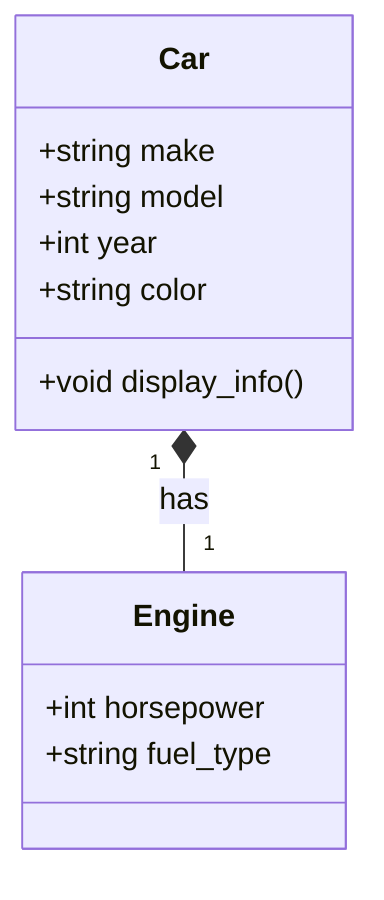
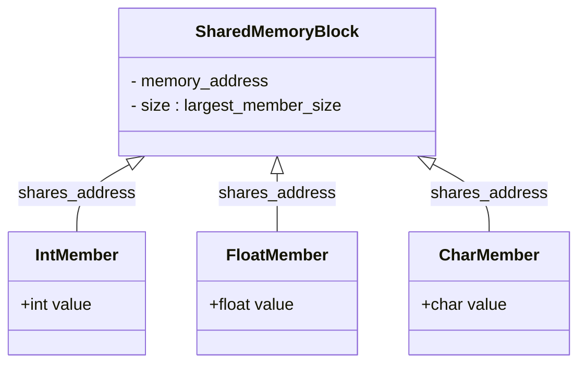

# 6 User Defined Data Types

Comprehensive resource for 6 User Defined Data Types.


---

## 6 User Defined Data Types Hub


## Overview
This unit dives into the fascinating world of **User_Defined_Data_Types** in C++, empowering you to move beyond primitive types and create custom data structures tailored to specific needs. By mastering `struct`s, `enum`s, and `union`s, you'll gain the ability to model complex real-world entities and organize your code more effectively, leading to more readable, maintainable, and robust software. Think of it as upgrading from using only basic shapes (like squares and circles) to designing your own specialized tools with unique functionalities and characteristics.

## Learning Objectives
*   Understand the purpose and benefits of user-defined data types in C++.
*   Define and utilize `struct`s to group related data members into a single unit.
*   Distinguish between `struct`s and classes, recognizing their fundamental similarities and differences.
*   Apply the `typedef` keyword to create aliases for existing data types, enhancing code clarity.
*   Define and use `enum`s and `enum class` to create sets of named integer constants for improved readability and type safety.
*   Understand the concept of memory sharing with `union`s and their practical applications.
*   Identify appropriate scenarios for employing each user-defined data type effectively.

## Unit Applications & Real-World Relevance
**User_Defined_Data_Types** are the bedrock of object-oriented programming and fundamental to building any sophisticated software system. In game development, `struct`s might define player attributes (health, position, score). In embedded systems, `enum`s could represent device states (ON, OFF, STANDBY). In network programming, `union`s might be used to interpret different message formats sharing the same memory buffer. From operating systems to web browsers, the ability to create and manipulate custom data types is essential for structuring data, managing complexity, and writing efficient code that mirrors real-world concepts.

## Active Learning Prompts
*   Consider a real-world object (e.g., a car, a book, a student). How would you represent its various characteristics using `struct`s, `enum`s, and possibly `union`s?
*   Design a simple program that simulates a traffic light. Which user-defined data type would be most appropriate to represent the different states of the traffic light, and why?
*   Reflect on a scenario where `typedef` could significantly improve the readability of complex type declarations.
*   Imagine you need to store data that could be either an integer, a floating-point number, or a character, but never all at the same time, to conserve memory. How would `union`s address this challenge?

## Unit Challenges & Common Misconceptions
A common challenge is understanding the fundamental differences between `struct`s and classes in C++, especially regarding default access specifiers. Misusing `union`s, particularly accessing an inactive member, can lead to undefined behavior and subtle bugs that are hard to track down. Another pitfall is the implicit conversion behavior of plain `enum`s, which `enum class` addresses for improved type safety. Grasping when to use `typedef` versus other aliasing mechanisms also requires careful consideration of scope and semantics.

## Connections
  - [[Structures_Struct]]
    - [[The_Typedef_Keyword]]
  - [[Enumerated_Types_Enum]]
  - [[Unions_in_C++]]

## Next Steps for Deeper Understanding
To further solidify your understanding, explore how `struct`s are used within data structures like linked lists, trees, and graphs. Investigate the concept of encapsulation and how it applies to user-defined types. Delve into the advanced features of `enum class`, such as specifying the underlying type. Consider real-world C++ libraries and frameworks to see how they leverage custom data types to create powerful and flexible APIs.

## Possible Questions
[[CS1220_6_User_Defined_Data_Types_Possible_Questions]]

---

---

## Enumerated Types Enum


## Definition
Before proceeding, ensure you master Variables_And_Data_Types and Constants because enumerated types provide a structured way to define a set of named integer constants, improving readability and self-documentation beyond raw integer values.
An `enum` (short for enumeration) in C++ is a **user-defined data type** that consists of a set of named integer constants. It allows you to assign meaningful names to integral values, making your code more readable and less prone to errors compared to using "magic numbers" (unnamed, literal integer values). Think of an `enum` like a predefined menu for a specific choice: instead of remembering that `1` means "Red" and `2` means "Green" for a traffic light, an `enum` lets you directly use `TrafficLight::Red` and `TrafficLight::Green`. This makes the code self-documenting and easier to understand.

## The Mental Model
Imagine you're building a robot that needs to respond to different commands: "Walk," "Run," "Jump," "Stop." Instead of having to remember that `0` means "Walk," `1` means "Run," etc., you can create an `enum` called `RobotCommand` with these descriptive names. Now, your code can say `if (command == RobotCommand::Walk)` which is much clearer than `if (command == 0)`. It's like having a coded message where each number has a specific, clear word assigned to it.

## Context & Framework
#### Opening the Hood: What's Inside?
Underneath the hood, each named constant in an `enum` is assigned an underlying integer value. By default, the first enumerator is `0`, and subsequent enumerators are incremented by `1`. However, you can explicitly assign values to enumerators. For example, `enum Direction { North = 1, East, South, West };` would assign `1` to `North`, `2` to `East`, `3` to `South`, and `4` to `West`. This allows for a flexible mapping of descriptive names to specific integer values, which can be useful when interfacing with hardware or specific protocols that require particular numeric codes.

## The Mastery Deep Dive
#### How the Parts Talk to Each Other
In traditional C++ `enum`s (also known as "unscoped" enums), enumerators (the named constants) are implicitly converted to integers and are injected directly into the surrounding scope. This means you can often compare an `enum` value directly with an `int`, or even compare enumerators from different `enum`s if their underlying integer values match, which can lead to unexpected behavior and subtle bugs (scope pollution and lack of type safety).

However, C++11 introduced **`enum class`** (also known as "scoped" enums). With `enum class`, enumerators are strongly typed and local to the enumeration, meaning they don't implicitly convert to integers and require explicit qualification (e.g., `Color::Red`). This provides much stronger type safety and prevents name collisions.

#### The Translator: From "Lego" to "Jargon"
Think of an `enum` as a specialized set of labeled "buttons." Each button (`Red`, `Green`, `Blue`) corresponds to a unique hidden number (`0`, `1`, `2`). The "Lego" idea is that you're building a specific set of choices for a variable. The "Jargon" is that you are defining an **enumerated type**, where the enumerators (the choices) are **named integer constants** that enhance code clarity and restrict the possible values a variable of that type can hold. `enum class` further refines this by providing **strong type safety** and **scope encapsulation**, making the "buttons" self-contained and preventing accidental interaction with other "button sets."

## Constraints & Limitations
Traditional `enum`s suffer from a few key limitations:
1.  **Scope Pollution**: Enumerator names are injected into the surrounding scope, potentially causing name collisions if two `enum`s define the same enumerator name.
2.  **Implicit Conversion**: Enumerators implicitly convert to `int`, which can lead to type safety issues. For example, you could accidentally assign an `enum Color` value to an `int` variable, or compare an `enum Color` to an `enum State` if their underlying `int` values happen to be the same, even if they represent fundamentally different concepts.

`enum class` addresses these limitations by introducing strong typing and scope. However, `enum class` enumerators do not implicitly convert to integers, requiring an explicit cast if their integer value is needed.

## Significance & Application
`enum`s are invaluable for representing fixed sets of choices or states in a clear and expressive manner. They are commonly used for:
*   **State Machines**: Representing different states of an object or system (e.g., `Processing`, `Completed`, `Failed`).
*   **Options/Flags**: Defining a set of options or flags (though bitmasks with `enum class` require explicit handling).
*   **Menu Choices**: Providing clear choices in user interfaces.
*   **Readability**: Replacing "magic numbers" with descriptive names makes code far easier to understand and maintain.
`enum class` is the preferred choice in modern C++ due to its enhanced type safety and prevention of scope pollution, leading to more robust and less error-prone code.

## The Worked Example
Let's illustrate the differences between a traditional `enum` and `enum class` in C++, focusing on scope and type safety.

```cpp
##include <iostream>
##include <string>

// Traditional (unscoped) enum
enum Color {
    Red,    // Default value 0
    Green,  // Default value 1
    Blue    // Default value 2
};

// Another unscoped enum, demonstrating scope pollution
enum Status {
    Ok,     // Default value 0 - conflicts with Color::Red if both are in global scope
    Error
};

// Scoped enum (enum class)
enum class CarColor {
    Red,
    Green,
    Blue
};

// Another scoped enum, no conflict with CarColor::Red
enum class CarStatus {
    Ok,
    Fault
};

// Function demonstrating traditional enum issues
void processColor(Color c) {
    switch (c) {
        case Red: std::cout << "Processing traditional Red." << std::endl; break;
        case Green: std::cout << "Processing traditional Green." << std::endl; break;
        case Blue: std::cout << "Processing traditional Blue." << std::endl; break;
        default: std::cout << "Unknown traditional color." << std::endl; break;
    }
}

// Function demonstrating scoped enum usage
void processCarColor(CarColor cc) {
    switch (cc) {
        case CarColor::Red: std::cout << "Processing scoped Red car color." << std::endl; break;
        case CarColor::Green: std::cout << "Processing scoped Green car color." << std::endl; break;
        case CarColor::Blue: std::cout << "Processing scoped Blue car color." << std::endl; break;
        default: std::cout << "Unknown scoped car color." << std::endl; break;
    }
}

int main() {
    // Traditional enum usage
    Color myColor = Red; // No explicit scope needed
    std::cout << "Traditional color value (Red): " << myColor << std::endl; // Implicitly converts to int
    processColor(myColor);

    // Demonstrating implicit conversion and potential issues with unscoped enums
    int some_int = Green;
    std::cout << "Traditional Green converted to int: " << some_int << std::endl;

    // This would lead to a compile error with 'enum class' but works with traditional 'enum'
    // Status myStatus = Red; // Compile error: 'Red' is ambiguous between Color::Red and Status::Red if both are defined
                               // Here, assuming Status::Ok is 0 and Color::Red is 0.
                               // If Status::Red was defined, it would cause an ambiguity error.

    // Scoped enum usage
    CarColor myCarColor = CarColor::Green; // Explicit scope required
    // std::cout << "Scoped car color value (Green): " << myCarColor << std::endl; // Compile error: no implicit conversion to int
    std::cout << "Scoped car color value (Green) (explicit cast): " << static_cast<int>(myCarColor) << std::endl;
    processCarColor(myCarColor);

    // This would NOT compile due to strong type safety
    // int another_int = CarColor::Blue;

    // No ambiguity with CarStatus::Ok even if CarColor::Red has same underlying value
    CarStatus myCarStatus = CarStatus::Ok;
    // CarColor anotherCarColor = CarStatus::Ok; // Compile error: cannot convert 'CarStatus' to 'CarColor'
                                             // This shows strong type safety.

    return 0;
}
```
```text
// Scenario 1: Program execution (traditional enum behavior)
// Output:
// Traditional color value (Red): 0
// Processing traditional Red.
// Traditional Green converted to int: 1
// Scoped car color value (Green) (explicit cast): 1
// Processing scoped Green car color.
//
// Explanation of compiler behavior (not shown in direct output but critical for understanding):
// - The `Status` enum `Ok` and `Color` enum `Red` both default to 0. If `Status::Red` was defined, it would conflict with `Color::Red`.
// - `myColor` (type `Color`) implicitly converts to `int` when printed.
// - `some_int = Green;` works due to implicit conversion.

// Scenario 2: Program execution (scoped enum behavior and compiler errors)
// Output:
// (As above for scoped enums)
//
// Compiler Errors (expected if uncommenting problematic lines):
// - `std::cout << "Scoped car color value (Green): " << myCarColor << std::endl;` (error: cannot convert 'CarColor' to 'int' in 'operator<<')
// - `int another_int = CarColor::Blue;` (error: cannot convert 'CarColor' to 'int' in initialization)
// - `CarColor anotherCarColor = CarStatus::Ok;` (error: cannot convert 'CarStatus' to 'CarColor' in initialization)
//
// This demonstrates how `enum class` prevents implicit conversions and ensures strong type safety, requiring explicit casts and disallowing cross-enum assignments.
```
This example vividly demonstrates the traditional `enum`'s implicit integer conversion and potential for scope pollution, alongside the `enum class`'s stricter type safety and requirement for explicit scope qualification. This distinction is crucial for writing robust and error-free C++ code, especially in larger projects.

## The Proving Ground
*Test your mastery. Cover the solutions below to test yourself first.*

#### Level 1: Understanding (The Basics)
**The Component Check:** What is the fundamental advantage of using an `enum` over plain integer constants (e.g., `#define`) for representing a fixed set of choices or states in C++?
> **Solution:** The fundamental advantage of using an `enum` is that it provides a set of named, self-documenting integer constants, making the code more readable and maintainable. It also introduces a distinct type, allowing the compiler to perform type-checking, which is not possible with simple `#define` macros, thus reducing the likelihood of errors.

#### Level 2: Competence (Application)
**The Clean Build:** Define an `enum class` named `LogLevel` with constants `Debug`, `Info`, `Warning`, and `Error`. Then, write a function `logMessage` that takes a `LogLevel` and a `std::string` message as arguments and prints the message prefixed with the appropriate log level (e.g., "INFO: User logged in.").
```cpp
##include <iostream>
##include <string>

// Define enum class LogLevel
enum class LogLevel {
    Debug,
    Info,
    Warning,
    Error
};

// Function to log messages
void logMessage(LogLevel level, const std::string& message) {
    switch (level) {
        case LogLevel::Debug:
            std::cout << "DEBUG: " << message << std::endl;
            break;
        case LogLevel::Info:
            std::cout << "INFO: " << message << std::endl;
            break;
        case LogLevel::Warning:
            std::cout << "WARNING: " << message << std::endl;
            break;
        case LogLevel::Error:
            std::cout << "ERROR: " << message << std::endl;
            break;
        default:
            std::cout << "UNKNOWN_LEVEL: " << message << std::endl;
            break;
    }
}

int main() {
    logMessage(LogLevel::Info, "Application started successfully.");
    logMessage(LogLevel::Warning, "Disk space low.");
    logMessage(LogLevel::Error, "Database connection failed.");
    logMessage(LogLevel::Debug, "Variable x = 10.");

    return 0;
}
```
```text
// Scenario 1: Program execution
// Output:
// INFO: Application started successfully.
// WARNING: Disk space low.
// ERROR: Database connection failed.
// DEBUG: Variable x = 10.
```
> **Solution:** (See code above)

#### Level 3: Mastery (The Crucible)
**The Broken System:** You are upgrading an old C++ codebase. You encounter several traditional `enum`s that are causing ambiguity errors and implicit conversion bugs. The following snippet illustrates a simplified version of these issues. Identify the specific problems (ambiguity and implicit conversion) and then refactor the code using `enum class` to resolve them, explaining how `enum class` ensures better type safety and prevents name collisions.
```cpp
##include <iostream>

// Old C-style enums
enum FileAccess {
    READ,
    WRITE,
    APPEND
};

enum NetworkStatus {
    DISCONNECTED,
    CONNECTED,
    READ // Name conflict here with FileAccess::READ
};

void processFileOperation(int access_mode) { // Takes int, allowing any int value
    if (access_mode == READ) { // Ambiguous if both enums are in scope
        std::cout << "Processing file read operation." << std::endl;
    }
}

int main() {
    FileAccess fa = READ; // Ambiguous: which READ?
    NetworkStatus ns = CONNECTED;

    // This compiles due to implicit conversion, but is logically incorrect
    if (fa == CONNECTED) {
        std::cout << "FileAccess is unexpectedly connected!" << std::endl;
    }

    processFileOperation(WRITE); // Implicitly converts WRITE to int

    return 0;
}
```
```text
// Scenario 1: Code compilation (problematic)
// Output:
// This code will likely produce a compile-time error for ambiguity of 'READ'.
// Even if it compiles (e.g., due to specific compiler rules or order of definition),
// the logical error `fa == CONNECTED` could lead to unexpected runtime behavior.
// If compiled successfully, output would be:
// Processing file read operation. (if READ from FileAccess is used)

// Scenario 2: Explanation of issues
// - **Ambiguity:** The `READ` enumerator exists in both `FileAccess` and `NetworkStatus` enums. When `FileAccess fa = READ;` is written, the compiler doesn't know which `READ` is intended, leading to an ambiguity error.
// - **Implicit Conversion & Type Safety:** Traditional enums implicitly convert to integers. This allows `if (fa == CONNECTED)` to compile, even though `FileAccess` and `NetworkStatus` represent entirely different concepts. If `FileAccess::READ` and `NetworkStatus::CONNECTED` happen to have the same underlying integer value, this comparison could unexpectedly evaluate to true, leading to logical errors.
// - `processFileOperation(int)` taking an `int` means it can accept any integer, not just valid `FileAccess` enumerators, reducing type safety.
```
> **Solution:**
> **Problems:**
> 1.  **Ambiguity Error:** The `READ` enumerator exists in both `FileAccess` and `NetworkStatus` enums. The compiler cannot determine which `READ` is being referenced, leading to an ambiguity error.
> 2.  **Implicit Conversion & Type Safety:** Traditional enums implicitly convert to integers. This allows the comparison `fa == CONNECTED` to compile, even though `FileAccess` and `NetworkStatus` are conceptually distinct. If `FileAccess::READ` and `NetworkStatus::CONNECTED` have the same underlying integer value (e.g., both 0 if `READ` is the first element in `FileAccess` and `DISCONNECTED` is the first in `NetworkStatus`, and `CONNECTED` is 1), the comparison might unexpectedly evaluate to `true`. This loss of type safety can lead to logical errors.
> 3.  **Scope Pollution:** Enumerators are injected into the global namespace, causing the `READ` conflict.
>
> **Refactored Code using `enum class`:**
> --- START_CODE:cpp ---
> #include <iostream>
>
> // Modern C++ enum classes
> enum class FileAccess {
>     READ,
>     WRITE,
>     APPEND
> };
>
> enum class NetworkStatus {
>     DISCONNECTED,
>     CONNECTED,
>     READING // Renamed to avoid conceptual confusion, though not strictly necessary with enum class scope
> };
>
> // Function now takes a specific enum class type for type safety
> void processFileOperation(FileAccess access_mode) {
>     if (access_mode == FileAccess::READ) { // Explicit scope required
>         std::cout << "Processing file read operation." << std::endl;
>     } else if (access_mode == FileAccess::WRITE) {
>         std::cout << "Processing file write operation." << std::endl;
>     } else if (access_mode == FileAccess::APPEND) {
>         std::cout << "Processing file append operation." << std::endl;
>     }
> }
>
> int main() {
>     FileAccess fa = FileAccess::READ; // Explicit scope, no ambiguity
>     NetworkStatus ns = NetworkStatus::CONNECTED;
>
>     // This now produces a compile-time error, preventing logical mistakes
>     // if (fa == ns) { // ERROR: cannot compare FileAccess and NetworkStatus
>     //     std::cout << "This will not compile!" << std::endl;
>     // }
>
>     // Correct comparison with explicit values
>     if (fa == FileAccess::READ) {
>         std::cout << "FileAccess is READ." << std::endl;
>     }
>
>     processFileOperation(FileAccess::WRITE); // Type-safe, only accepts FileAccess
>
>     // This would cause a compile-time error, preventing accidental passing of wrong type
>     // processFileOperation(NetworkStatus::CONNECTED); // ERROR: cannot convert NetworkStatus to FileAccess
>
>     return 0;
> }
> --- END_CODE:cpp ---
> --- START_CODE:text ---
> // Scenario 1: Program execution (refactored code)
> // Output:
> // FileAccess is READ.
> // Processing file write operation.
> //
> // Explanation of compiler behavior (critical for understanding):
> // - The `FileAccess fa = FileAccess::READ;` and `NetworkStatus ns = NetworkStatus::CONNECTED;` declarations are no longer ambiguous because `enum class` enumerators are scoped.
> // - The comparison `if (fa == ns)` (if uncommented) would result in a compile-time error, preventing the type safety issue seen with traditional enums. This is because `enum class` prevents implicit conversion between different enum types or to `int`.
> // - The `processFileOperation` function now strictly expects a `FileAccess` type, preventing incorrect `NetworkStatus` values from being passed.
> --- END_CODE:text ---
> **Explanation:** The `enum class` solution resolves all problems:
> 1.  **No Ambiguity:** `FileAccess::READ` and `NetworkStatus::READING` (or `NetworkStatus::READ` if not renamed) are distinct due to their explicit scope, preventing name collisions.
> 2.  **Strong Type Safety:** `enum class` enumerators do not implicitly convert to integers or to other enum types. Comparisons or assignments between different `enum class` types (or between `enum class` and `int`) require explicit casting, making logical errors immediately apparent at compile time.
> 3.  **No Scope Pollution:** The enumerators are contained within their respective `enum class` scopes, keeping the global namespace clean.

## Key Takeaways
*   `enum` (enumerated type) in C++ allows defining a set of named integer constants, enhancing code readability and expressiveness by replacing "magic numbers."
*   Traditional (unscoped) `enum`s can suffer from scope pollution and implicit conversion to `int`, leading to potential ambiguity and type safety issues.
*   `enum class` (scoped enum, introduced in C++11) provides strong type safety and prevents name collisions by encapsulating enumerators within their own scope, making it the preferred choice for modern C++ development.

## Knowledge Graph Connections
| Concept                     | Connection / Relationship                                                                   |
| :
-------------------------- | :
------------------------------------------------------------------------------------------ |
| Constants               | `enum`s provide a way to define a collection of related symbolic constants.                |
| Type_Safety             | `enum class` significantly enhances type safety compared to traditional enums.             |
| Readability_And_Maintainability | Using `enum`s makes code more self-documenting and easier to understand.                 |
---

---

## Structures Struct


## Definition
Before proceeding, ensure you master Data_Structures and Variables_And_Data_Types because `struct`s fundamentally allow you to create custom, composite data structures from existing variables, acting as building blocks for more complex data organization.
A `struct` (short for structure) in C++ is a **user-defined data type** that allows you to group different types of related data items under a single name. It's essentially a blueprint for creating objects that can hold diverse pieces of information. A simpler way to think about it is like a filing cabinet: instead of having loose papers (individual variables) scattered around, a `struct` provides a designated folder where all related documents (data members) are neatly organized together. This makes it easier to manage and refer to a collection of related data as one coherent unit.

## The Mental Model
Imagine you're trying to describe a car. You wouldn't just list its color, year, and model as separate, unconnected pieces of information. Instead, you'd think of it as a single "car" entity with these attributes. A `struct` works similarly: it lets you define a "Car" type that encapsulates its `color`, `year`, and `model` together.


```text
// Scenario 1: A conceptual representation of a Car
// Output:
// (A visual representation of the class diagram showing a Car class with its attributes and a method,
// and its composition relationship with an Engine class.)
// This diagram visually organizes the attributes (make, model, year, color) and a behavior (display_info)
// associated with a 'Car', and how a Car 'has' an Engine. It represents how a struct logically groups related data.
```
*Note: This `classDiagram` illustrates how data (attributes) and even related components (like Engine) can be conceptually grouped together, similar to how a `struct` aggregates data members.*

## Context & Framework
#### Opening the Hood: What's Inside?
At its core, a `struct` acts as a container. Inside this container, you define various "members," which are essentially variables of different data types (e.g., `int`, `double`, `string`, or even other `struct`s). Each member occupies its own memory space within the `struct` instance. When you create an object (an instance) of a `struct`, you're allocating memory for all of its defined members at once, under a single, unified name. This allows for logical grouping and efficient handling of related data.

## The Mastery Deep Dive
#### How the Parts Talk to Each Other
Accessing the individual data members within a `struct` instance is straightforward using the **dot operator (`.`)**. If you have a `struct` instance named `myCar` and it has a member `model`, you would access it as `myCar.model`. For pointers to `struct`s, you use the **arrow operator (`->`)**. For example, if `carPtr` is a pointer to a `Car` `struct`, `carPtr->model` would access the `model` member. This clear syntax ensures that you can manipulate each piece of data independently while still recognizing its association with the larger `struct` unit.

#### The Translator: From "Lego" to "Jargon"
Imagine building with LEGOs: each brick is an individual variable (like an `int` or `char`). A `struct` is like a pre-designed LEGO model that groups specific bricks together to form a recognizable object, such as a "House" model composed of "Wall" bricks, "Roof" bricks, and "Window" bricks. In C++ jargon, `struct`s allow us to create **composite data types** by aggregating **heterogeneous data members**. This elevates our programming from dealing with individual pieces of data to managing complex, real-world entities.

#### The "Vulnerable vs. Secure" Pattern
While `struct`s provide a powerful way to group data, they inherently offer public access to all their members by default. This means any part of your code can directly read or modify a `struct`'s members.
```cpp
##include <iostream>
##include <string>

// Vulnerable struct design: direct public access
struct BankAccount {
    int account_number;
    double balance; // SECURITY RISK: direct modification possible
    std::string owner_name;
};

// Main function demonstrating potential vulnerability
int main() {
    BankAccount myAccount = {12345, 1000.0, "Alice"};

    std::cout << "Initial balance: " << myAccount.balance << std::endl;

    // Potential unauthorized modification - no checks
    myAccount.balance -= 5000.0; // Directly altering balance without validation

    std::cout << "Modified balance: " << myAccount.balance << std::endl;

    return 0;
}
```
```text
// Scenario 1: Initial balance
// Output:
// Initial balance: 1000
// Modified balance: -4000
// This illustrates how direct public access to `balance` allows it to be modified to a negative value without any validation, representing a security risk.
```
This direct access can be a **SECURITY RISK** if not managed carefully, as it bypasses any potential validation logic you might want to implement (e.g., ensuring a bank account balance doesn't go negative). For more robust and secure designs, classes (which offer default private access and methods for controlled access) are often preferred when behavior and data need to be tightly coupled with enforced integrity rules.

## Constraints & Limitations
The primary constraint of `struct`s, particularly in comparison to classes, is their default public member access. While convenient for simple data aggregation, this can lead to issues in larger, more complex systems where data integrity and encapsulation are paramount. Without explicit access control, it's easier to inadvertently corrupt data or violate business rules. Furthermore, `struct`s, by themselves, don't directly support advanced object-oriented features like inheritance or polymorphism without explicit design patterns, though C++ `struct`s are almost identical to `class`es except for default access.

## Significance & Application
`struct`s are foundational in C++ for defining custom data types, especially when the primary concern is merely grouping data. They are widely used in low-level programming, system programming, and whenever simple data records are needed (e.g., representing coordinates, dates, or small configuration settings). Their direct access and lack of overhead make them efficient for performance-critical applications. They are also essential building blocks for more complex data structures like linked lists, trees, and hash tables, where nodes often comprise `struct`s to hold data and pointers.

## The Worked Example
Let's define a `struct` to represent a student's basic information and demonstrate how to create instances, initialize them, and access their members.

```cpp
##include <iostream>
##include <string>

// Define a struct for Student information
struct Student {
    int id;                 // Student ID number
    std::string name;       // Student's full name
    double gpa;             // Grade Point Average
    bool is_enrolled;       // Enrollment status
};

int main() {
    // Create an instance of the Student struct
    Student student1;

    // Initialize the members of student1 using the dot operator
    student1.id = 1001;
    student1.name = "Alice Smith";
    student1.gpa = 3.85;
    student1.is_enrolled = true;

    // Access and print the information for student1
    std::cout << "Student 1 Information:" << std::endl;
    std::cout << "ID: " << student1.id << std::endl;
    std::cout << "Name: " << student1.name << std::endl;
    std::cout << "GPA: " << student1.gpa << std::endl;
    std::cout << "Enrolled: " << (student1.is_enrolled ? "Yes" : "No") << std::endl;
    std::cout << std::endl;

    // Create another instance and initialize using initializer list (C++11 and later)
    Student student2 = {1002, "Bob Johnson", 3.10, false};

    // Access and print the information for student2
    std::cout << "Student 2 Information:" << std::endl;
    std::cout << "ID: " << student2.id << std::endl;
    std::cout << "Name: " << student2.name << std::endl;
    std::cout << "GPA: " << student2.gpa << std::endl;
    std::cout << "Enrolled: " << (student2.is_enrolled ? "Yes" : "No") << std::endl;

    return 0;
}
```
```text
// Scenario 1: Demonstrating struct initialization and member access
// Output:
// Student 1 Information:
// ID: 1001
// Name: Alice Smith
// GPA: 3.85
// Enrolled: Yes
//
// Student 2 Information:
// ID: 1002
// Name: Bob Johnson
// GPA: 3.1
// Enrolled: No
```
This example clearly shows how to define a `Student` `struct`, create two different `Student` objects, assign values to their respective members using the dot operator, and then retrieve and print those values. This illustrates the fundamental mechanics of working with structures in C++.

## The Proving Ground
*Test your mastery. Cover the solutions below to test yourself first.*

#### Level 1: The Sanity Check (Verification)
**The Component Check:** What is the fundamental difference in purpose between a C++ `struct` and a standalone `int` variable? Provide a brief example to illustrate.
> **Solution:** A `struct` is a user-defined **composite** data type that groups **multiple, possibly heterogeneous** data items under a single name, representing a single logical entity. An `int` variable is a **primitive** data type that stores a single integer value.
> Example: `struct Point { int x; int y; };` groups two integers (`x`, `y`) into one `Point` entity, whereas `int score;` is a single integer.

#### Level 2: The Crucible (Mastery & Edge Cases)
**The Broken System:** You are debugging a C++ program and encounter the following `struct` and function. The program compiles, but when `displayInfo` is called with `ptr_book`, it crashes. Explain *why* it crashes and provide a corrected version of the `main` function to prevent the crash, without changing the `Book` `struct` definition or the `displayInfo` function signature.
```cpp
##include <iostream>
##include <string>

struct Book {
    std::string title;
    std::string author;
    int publication_year;
};

void displayInfo(Book* book_ptr) {
    std::cout << "Title: " << book_ptr->title << std::endl;
    std::cout << "Author: " << book_ptr->author << std::endl;
    std::cout << "Year: " << book_ptr->publication_year << std::endl;
}

int main() {
    Book* ptr_book = nullptr; // Pointer not initialized to a valid Book object
    displayInfo(ptr_book); // Dereferencing a nullptr causes a crash
    return 0;
}
```
```text
// Scenario 1: Program execution (problematic code)
// Output:
// Program crashes with a segmentation fault or access violation error.

// Scenario 2: Explanation of crash
// The program crashes because `ptr_book` is initialized to `nullptr`. When `displayInfo(ptr_book)` is called, the function attempts to dereference this `nullptr` (`book_ptr->title`, `book_ptr->author`, etc.) to access the members of a `Book` object. Dereferencing a null pointer leads to undefined behavior, which commonly manifests as a program crash or segmentation fault, as it tries to access memory it doesn't own.
```
> **Solution:** The crash occurs because `ptr_book` is a null pointer, and `displayInfo` attempts to dereference it. You cannot access members through a null pointer.
>
> **Corrected `main` function:**
> --- START_CODE:cpp ---
> #include <iostream>
> #include <string>
>
> struct Book {
>     std::string title;
>     std::string author;
>     int publication_year;
> };
>
> void displayInfo(Book* book_ptr) {
>     if (book_ptr == nullptr) { // Added check for nullptr
>         std::cout << "Error: Book pointer is null." << std::endl;
>         return;
>     }
>     std::cout << "Title: " << book_ptr->title << std::endl;
>     std::cout << "Author: " << book_ptr->author << std::endl;
>     std::cout << "Year: " << book_ptr->publication_year << std::endl;
> }
>
> int main() {
>     Book myBook = {"The Great C++", "Bjarne Stroustrup", 1985}; // Create a valid Book object
>     Book* ptr_book = &myBook; // Point to the valid object
>     displayInfo(ptr_book);
>
>     Book* another_ptr_book = new Book{"Effective C++", "Scott Meyers", 1991}; // Dynamically allocate
>     displayInfo(another_ptr_book);
>     delete another_ptr_book; // Clean up dynamically allocated memory
>
>     // Demonstrate the null pointer check
>     Book* null_book_ptr = nullptr;
>     displayInfo(null_book_ptr);
>
>     return 0;
> }
> --- END_CODE:cpp ---
> --- START_CODE:text ---
> // Scenario 1: Execution of corrected code with valid pointer
> // Output:
> // Title: The Great C++
> // Author: Bjarne Stroustrup
> // Year: 1985
> // Title: Effective C++
> // Author: Scott Meyers
> // Year: 1991
> // Error: Book pointer is null.
> --- END_CODE:text ---
> **Explanation:** The fix involves creating a valid `Book` object (either on the stack like `myBook` or dynamically on the heap using `new`). The pointer `ptr_book` then points to this valid object's memory address. The `displayInfo` function was also slightly modified to include a `nullptr` check, a crucial defensive programming practice to prevent dereferencing invalid pointers, as discussed in the 'How the Parts Talk to Each Other' section regarding pointer usage. This ensures that the program only attempts to access members if the pointer is valid.

## Key Takeaways
*   `struct`s are user-defined composite data types that group related data items of different types under a single name, acting as a blueprint for data organization.
*   Members of a `struct` are accessed using the dot operator (`.`) for instances and the arrow operator (`->`) for pointers to instances, providing a clear mechanism for data manipulation.
*   While efficient for simple data aggregation, the default public access of `struct` members can pose data integrity and security risks, making careful design essential.

## Knowledge Graph Connections
| Concept                     | Connection / Relationship                                                                   |
| :
-------------------------- | :
------------------------------------------------------------------------------------------ |
| Data_Structures         | `struct`s are fundamental building blocks for creating more complex data structures.       |
| Object_Oriented_Programming | `struct`s share similarities with classes and are a foundational concept in OOP.           |
| Memory_Management       | Understanding `struct`s is crucial for managing contiguous memory blocks for composite data. |
---

---

## Unions In C++


## Definition
Before proceeding, ensure you master Memory_Management and Data_Representation because `union`s directly interact with memory to allow different data types to share the same storage, which requires a deep understanding of how data is laid out and interpreted in memory.
A `union` in C++ is a **user-defined data type** that allows different data types to be stored in the **same memory location**. Unlike a `struct`, where each member has its own distinct memory space, all members of a `union` share the *starting address* of that single memory block. The size of the `union` is determined by its largest member. Think of a `union` like a single locker that can hold either a book, a backpack, or a laptop, but only one item at a time. You can put any of these items in, but if you put a backpack in and then try to retrieve a book, you'll get garbage because the "book" space is now occupied by the backpack's data. This mechanism is primarily used for memory optimization and type punning in specific scenarios.

## The Mental Model
Imagine you have a single whiteboard. You can write either a number, a word, or a simple diagram on it. You can't have all three at once; whatever you write last overwrites what was there before. A `union` is like that whiteboard: it's a single chunk of memory that can *interpret* its contents as one type (e.g., an `int`) or another (e.g., a `float`), but only one interpretation is valid at any given time.


```text
// Scenario 1: Conceptual view of shared memory in a union
// Output:
// (A visual representation of the class diagram showing a SharedMemoryBlock with its address and size,
// and how IntMember, FloatMember, and CharMember all share the same memory_address.)
// This diagram illustrates that all members of a union conceptually point to and utilize the same physical memory space.
```
*Note: This `classDiagram` visually represents how different members of a `union` conceptually point to and occupy the same underlying `SharedMemoryBlock`, highlighting the memory-sharing aspect.*

## Context & Framework
#### Opening the Hood: What's Inside?
When you define a `union`, the compiler allocates enough memory to hold the *largest* of its members. All other members will then use this same memory space. For example, if a `union` has an `int` (4 bytes) and a `double` (8 bytes), the `union` itself will be 8 bytes in size. When you assign a value to `union.int_member`, those 4 bytes are written to the beginning of the `union`'s memory. If you then assign a value to `union.double_member`, the full 8 bytes are written, potentially overwriting the `int_member`'s data. This behavior is key to understanding both the efficiency and the potential dangers of `union`s.

## The Mastery Deep Dive
#### How the Parts Talk to Each Other
Accessing members of a `union` is syntactically identical to `struct`s: use the **dot operator (`.`)** for direct instances and the **arrow operator (`->`)** for pointers. The crucial distinction lies in the semantics: after writing to one member of a `union`, you must only read from that *same member*. Reading from a different member after writing to another is known as **type punning** and leads to **undefined behavior (UB)** if the types are not layout-compatible (which is typically the case). The `union` itself does not store any information about which member is currently active. It's the programmer's responsibility to keep track of this.

#### The Translator: From "Lego" to "Jargon"
Imagine a single universal adapter (the `union`) that can be plugged into different devices (the `int`, `float`, or `char` members), but it can only operate *one device at a time*. You plug it into the `int` slot, it acts like an `int`. You pull it out and plug it into the `float` slot, now it acts like a `float`, overwriting the `int`'s "configuration." The "Jargon" is that `union`s provide **overlapping memory allocation** for **heterogeneous data types**, enabling **memory optimization** and controlled **type punning**, albeit with the significant caveat of **undefined behavior** if an inactive member is read.

#### The "Vulnerable vs. Secure" Pattern
Using `union`s carelessly can lead to significant vulnerabilities and bugs due to **undefined behavior**. If you write to one member and then read from another, the interpretation of the bits in memory will be incorrect, potentially leading to garbage values, crashes, or security exploits (e.g., if sensitive data is unintentionally exposed through an incorrect type interpretation).
```cpp
##include <iostream>

union ValueHolder {
    int i;
    float f;
};

int main() {
    ValueHolder vh;

    vh.i = 10; // Write to 'i'
    std::cout << "After vh.i = 10:" << std::endl;
    std::cout << "vh.i: " << vh.i << std::endl;
    // SECURITY RISK / UNDEFINED BEHAVIOR: Reading 'f' when 'i' was active
    std::cout << "vh.f (UNDEFINED BEHAVIOR): " << vh.f << std::endl;

    vh.f = 3.14f; // Write to 'f'
    std::cout << "\nAfter vh.f = 3.14f:" << std::endl;
    // SECURITY RISK / UNDEFINED BEHAVIOR: Reading 'i' when 'f' was active
    std::cout << "vh.i (UNDEFINED BEHAVIOR): " << vh.i << std::endl;
    std::cout << "vh.f: " << vh.f << std::endl;

    return 0;
}
```
```text
// Scenario 1: Program execution (output will vary due to undefined behavior)
// Output (example):
// After vh.i = 10:
// vh.i: 10
// vh.f (UNDEFINED BEHAVIOR): 1.4013e-44 (or some other float representation of the bits of 10)

// After vh.f = 3.14f:
// vh.i (UNDEFINED BEHAVIOR): 1078523331 (or some other int representation of the bits of 3.14f)
// vh.f: 3.14

// The security risk here is that if a union holds sensitive data and an attacker can force the program to read it using an incorrect type,
// they might gain access to raw memory representation that reveals partial information or leads to crashes.
```
A secure pattern for using `union`s involves pairing them with an **`enum` (or `enum class`) as a "tag" or "discriminator"** within a `struct`. This tag explicitly indicates which member of the `union` is currently active, allowing the program to safely access the correct member and avoid undefined behavior. This structured approach helps regain type safety lost by the `union`'s memory-sharing nature.

## Constraints & Limitations
The most significant limitation and danger of `union`s is the **lack of type safety** and the high risk of **undefined behavior**. As mentioned, reading from an inactive member of a `union` (i.e., a member that was not the last one written to) is typically undefined behavior, making `union`s notoriously difficult to debug if misused. They cannot hold objects with non-trivial constructors, destructors, or copy/move assignment operators (like `std::string` or custom classes with complex resource management) without careful manual management or C++11 `union` extensions (`placement new` and explicit destructor calls), making them unsuitable for general-purpose object storage.

## Significance & Application
Despite their dangers, `union`s are powerful tools for specific use cases:
*   **Memory Optimization**: In embedded systems or highly memory-constrained environments, `union`s can save significant memory by allowing different data to share the same storage, especially when only one type is active at a time.
*   **Interfacing with Hardware/Protocols**: They are often used when dealing with hardware registers or network packets where data can be interpreted in multiple ways (e.g., a byte array that can also be seen as an integer).
*   **Variant Types (pre-C++17)**: Before `std::variant` (C++17), `union`s were the primary way to implement a type that could hold one of several possible types, often wrapped in a `struct` with a discriminant `enum` for type tracking.
*   **Type Punning**: Though dangerous, they can be intentionally used for type punning (reinterpreting the bits of one type as another) in specific, carefully controlled low-level scenarios where performance is critical and undefined behavior is explicitly managed.

## The Worked Example
Let's demonstrate a safe and practical use of `union`s by combining it with a `struct` and an `enum` to create a simple `Variant` type that can hold either an `int` or a `float`.

```cpp
##include <iostream>
##include <string>

// Enum to indicate the active type in the union (discriminator)
enum class VariantType {
    INT,
    FLOAT
};

// Union to store either an int or a float in the same memory location
union ValueUnion {
    int i_val;
    float f_val;
};

// Struct to combine the discriminator and the union
struct Variant {
    VariantType type;
    ValueUnion data;

    // Constructors for safe initialization
    Variant(int val) : type(VariantType::INT) {
        data.i_val = val;
    }

    Variant(float val) : type(VariantType::FLOAT) {
        data.f_val = val;
    }

    // Function to safely print the value based on its type
    void print() const {
        switch (type) {
            case VariantType::INT:
                std::cout << "Variant (INT): " << data.i_val << std::endl;
                break;
            case VariantType::FLOAT:
                std::cout << "Variant (FLOAT): " << data.f_val << std::endl;
                break;
            default:
                std::cout << "Variant (UNKNOWN TYPE)" << std::endl;
                break;
        }
    }
};

int main() {
    // Create Variant instances
    Variant var1(10);        // Holds an integer
    Variant var2(3.14f);     // Holds a float

    // Safely print their values
    var1.print();
    var2.print();

    // Demonstrating (unsafe) direct union usage without discriminator (for contrast)
    // ValueUnion bad_union;
    // bad_union.i_val = 200;
    // std::cout << "Unsafe union read (as float): " << bad_union.f_val << std::endl; // Undefined behavior

    return 0;
}
```
```text
// Scenario 1: Program execution demonstrating a safe Variant type using union + enum + struct
// Output:
// Variant (INT): 10
// Variant (FLOAT): 3.14
//
// Explanation:
// The output correctly identifies and prints the stored type and value for each Variant instance.
// This is achieved by the `VariantType type` member in the `Variant` struct acting as a discriminator,
// which is used in the `print()` function's `switch` statement to access the correct member of the `ValueUnion`.
// This prevents undefined behavior by ensuring that the correct member of the union is always read after being written to.
```
This example showcases the secure pattern for using `union`s by embedding them within a `struct` alongside an `enum` discriminator. This approach, similar to `std::variant` from C++17, allows for type-safe manipulation of data stored in shared memory, effectively mitigating the dangers of undefined behavior inherent in raw `union` usage.

## The Proving Ground
*Test your mastery. Cover the solutions below to test yourself first.*

#### Level 1: The Sanity Check (Verification)
**The Component Check:** What is the primary difference in memory allocation between a C++ `struct` and a C++ `union`?
> **Solution:** In a `struct`, each member is allocated its own distinct memory space, and the total size of the `struct` is the sum of its members' sizes (plus any padding). In a `union`, all members share the *same memory location*, and the size of the `union` is determined by the size of its largest member.

#### Level 2: Competence (Application)
**The Clean Build:** Define a C++ `union` named `ConvertData` that can hold either an `int` (`i`), a `float` (`f`), or a `double` (`d`). Write a program that assigns a `double` value to the `d` member, then prints the value of `i`, `f`, and `d`. Explain why the values of `i` and `f` might appear as "garbage" or unexpected numbers.
```cpp
##include <iostream>

union ConvertData {
    int i;
    float f;
    double d;
};

int main() {
    ConvertData data;

    data.d = 123.456; // Assign a value to the double member

    std::cout << "Assigned data.d = 123.456" << std::endl;
    std::cout << "data.d: " << data.d << std::endl;
    std::cout << "data.i: " << data.i << std::endl; // Reading inactive member (int)
    std::cout << "data.f: " << data.f << std::endl; // Reading inactive member (float)

    return 0;
}
```
```text
// Scenario 1: Program execution (output will vary due to undefined behavior, but patterns will emerge)
// Output (example):
// Assigned data.d = 123.456
// data.d: 123.456
// data.i: -1234567890 (or any garbage integer value)
// data.f: -0.000000 (or any garbage float value)

// Explanation:
// The values for `data.i` and `data.f` will appear as "garbage" or unexpected numbers because after `data.d` was assigned,
// the *entire* memory block of the union (which is sized for a `double`) holds the bit representation of that `double`.
// When `data.i` or `data.f` are accessed, the program attempts to interpret these same bits as an `int` or a `float`, respectively.
// This is known as reading an inactive member, which leads to undefined behavior. The bits representing a double are generally not a valid or meaningful integer or float when directly reinterpreted.
```
> **Solution:** (See code above)
>
> The values of `data.i` and `data.f` will appear as "garbage" or unexpected numbers because when `data.d` (a `double`) is assigned a value, the entire memory block of the `union` is overwritten with the bit representation of that `double`. When `data.i` (an `int`) or `data.f` (a `float`) are then accessed, the program attempts to interpret these same bits as an `int` or a `float`. The bit patterns for a `double` are generally not a valid or meaningful representation for an `int` or a `float` when directly reinterpreted in this way, leading to undefined behavior and unexpected values.

#### Level 3: Mastery (The Crucible)
**The Broken System:** You are building a low-level network parser that receives data blocks. Each block starts with a `header` (an `int`) followed by a `payload` that could be an `int` (`msg_id`), a `char` array (`msg_text`), or a `float` (`msg_temp`). You decided to use a `union` for the `payload`. The current implementation lacks a way to determine the active payload type, leading to data corruption and crashes. Redesign the `DataBlock` structure to safely handle the different `payload` types using a combination of `struct`, `enum class`, and `union`, ensuring type safety when accessing payload data. Provide a C++ code snippet that demonstrates sending and receiving a data block with a text message.
```cpp
##include <iostream>
##include <string>
##include <cstring> // For strcpy

// Original problematic union (no discriminator)
union OldPayload {
    int msg_id;
    char msg_text;
    float msg_temp;
};

struct OldDataBlock {
    int header;
    OldPayload payload;
};

// Function to process an old data block (problematic)
void processOldDataBlock(const OldDataBlock& block) {
    // This is inherently unsafe, as we don't know the active type
    std::cout << "Header: " << block.header << ", Payload (as int): " << block.payload.msg_id << std::endl;
}

int main() {
    OldDataBlock block_text = {1, {"Hello Network!"}}; // Initialize as text
    processOldDataBlock(block_text); // Will try to read as int, leading to UB
    return 0;
}
```
```text
// Scenario 1: Program execution (problematic code)
// Output (example - will be garbage due to undefined behavior):
// Header: 1, Payload (as int): 1867623000 (garbage value for "Hello Network!")
//
// Explanation of the problem:
// The `OldDataBlock` struct with `OldPayload` union has no mechanism to identify *which* member of the union is currently active.
// The `processOldDataBlock` function blindly attempts to read `block.payload.msg_id` (an `int`), even when the payload was initialized with `msg_text` (a `char` array).
// This results in undefined behavior, as the bits stored for the `char` array are reinterpreted as an `int`, leading to nonsensical output or a program crash.
```
> **Solution:**
> The critical flaw in the `OldDataBlock` structure is the absence of a mechanism to determine which member of the `OldPayload` union is active. Accessing an inactive member leads to undefined behavior.
>
> **Redesigned `DataBlock` structure:**
> To safely handle different payload types, we combine a `struct`, an `enum class` (as a discriminator), and a `union`. The `enum class` will explicitly track the active type in the `union`.
>
> --- START_CODE:cpp ---
> #include <iostream>
> #include <string>
> #include <cstring> // For strcpy, strlen
>
> // Enum class to indicate the type of data currently stored in the payload
> enum class PayloadType {
>     NONE,
>     INT_MESSAGE,
>     TEXT_MESSAGE,
>     FLOAT_TEMP
> };
>
> // Union to store the actual payload data in shared memory
> union PacketPayload {
>     int msg_id;
>     char msg_text; // Max 49 chars + null terminator
>     float msg_temp;
> };
>
> // Struct to encapsulate the header, the payload type, and the union itself
> struct DataBlock {
>     int header;
>     PayloadType type; // Discriminator: tells us which union member is active
>     PacketPayload payload;
>
>     // Constructor for int messages
>     DataBlock(int h, int id) : header(h), type(PayloadType::INT_MESSAGE) {
>         payload.msg_id = id;
>     }
>
>     // Constructor for text messages
>     DataBlock(int h, const char* text) : header(h), type(PayloadType::TEXT_MESSAGE) {
>         strncpy(payload.msg_text, text, sizeof(payload.msg_text) - 1);
>         payload.msg_text[sizeof(payload.msg_text) - 1] = '\0'; // Ensure null termination
>     }
>
>     // Constructor for float messages
>     DataBlock(int h, float temp) : header(h), type(PayloadType::FLOAT_TEMP) {
>         payload.msg_temp = temp;
>     }
>
>     // Default constructor
>     DataBlock() : header(0), type(PayloadType::NONE) {}
> };
>
> // Function to safely process and print a DataBlock
> void processDataBlock(const DataBlock& block) {
>     std::cout << "Header: " << block.header << ", ";
>     switch (block.type) {
>         case PayloadType::INT_MESSAGE:
>             std::cout << "Type: INT_MESSAGE, Value: " << block.payload.msg_id << std::endl;
>             break;
>         case PayloadType::TEXT_MESSAGE:
>             std::cout << "Type: TEXT_MESSAGE, Value: \"" << block.payload.msg_text << "\"" << std::endl;
>             break;
>         case PayloadType::FLOAT_TEMP:
>             std::cout << "Type: FLOAT_TEMP, Value: " << block.payload.msg_temp << " F" << std::endl;
>             break;
>         case PayloadType::NONE:
>         default:
>             std::cout << "Type: UNKNOWN/NONE" << std::endl;
>             break;
>     }
> }
>
> int main() {
>     // Demonstrate sending and receiving a data block with a text message
>     DataBlock textBlock(101, "Hello from the network interface!");
>     processDataBlock(textBlock);
>
>     // Demonstrate other types
>     DataBlock intBlock(102, 42);
>     processDataBlock(intBlock);
>
>     DataBlock floatBlock(103, 98.6f);
>     processDataBlock(floatBlock);
>
>     return 0;
> }
> --- END_CODE:cpp ---
> --- START_CODE:text ---
> // Scenario 1: Program execution (refactored code)
> // Output:
> // Header: 101, Type: TEXT_MESSAGE, Value: "Hello from the network interface!"
> // Header: 102, Type: INT_MESSAGE, Value: 42
> // Header: 103, Type: FLOAT_TEMP, Value: 98.6 F
> --- END_CODE:text ---
> **Explanation:**
> 1.  **`PayloadType` (enum class):** This `enum class` acts as a **discriminator**, explicitly stating which type of data is currently stored in the `union`. This is crucial for maintaining type safety.
> 2.  **`PacketPayload` (union):** This `union` provides the memory optimization, allowing `msg_id`, `msg_text`, and `msg_temp` to share the same memory space. Its size is determined by the largest member (`msg_text`).
> 3.  **`DataBlock` (struct):** This `struct` brings everything together, containing the `header`, the `type` discriminator, and the `payload` `union`. The constructors ensure that when a `DataBlock` is created, its `type` is correctly set, and the appropriate `union` member is initialized.
> 4.  **`processDataBlock` function:** This function uses the `block.type` (the discriminator) in a `switch` statement to safely determine which member of `block.payload` to access, thus preventing undefined behavior and ensuring correct data interpretation. This pattern ensures that we always read the active member of the `union`.

## Key Takeaways
*   A `union` in C++ allows multiple data members to occupy the same memory location, with its size determined by the largest member, primarily for memory optimization.
*   The primary danger of `union`s is the lack of type safety and the risk of undefined behavior when reading from a member that was not the last one written to.
*   To use `union`s safely and avoid undefined behavior, they should be paired with a discriminator (`enum` or `enum class`) within a `struct`, explicitly indicating which member is currently active.

## Knowledge Graph Connections
| Concept                     | Connection / Relationship                                                                   |
| :
-------------------------- | :
------------------------------------------------------------------------------------------ |
| Memory_Management       | `union`s are a low-level tool for explicit memory optimization by overlapping data storage. |
| Data_Representation     | `union`s can be used to interpret the same block of memory as different data types.          |
| Low_Level_Programming   | `union`s are frequently found in low-level code, such as device drivers or network protocols. |
---

---

## The Typedef Keyword


## Definition
Before proceeding, ensure you master [[Structures_Struct]] and Variables_And_Data_Types because `typedef` is commonly used to create simpler aliases for complex type declarations, particularly those involving structures or pointers to functions, making the code more readable without altering the underlying type.
The `typedef` keyword in C++ (and C) is used to create an **alias (a new name)** for an existing data type. It doesn't create a new type; rather, it provides an alternative, often simpler or more descriptive, name for a type that already exists. Think of `typedef` like giving someone a nickname: the person is still the same individual, but they now have an additional, perhaps easier-to-remember, name that you can use to refer to them. This greatly enhances code readability and maintainability, especially for complex or lengthy type declarations.

## The Mental Model
Imagine you have a long, official title for someone, like "Professor of Theoretical Quantum Physics and Advanced Calculus." That's a mouthful! Instead, you decide to give them a nickname, "Prof. Q." Everyone knows "Prof. Q" refers to that specific professor, making communication much easier. `typedef` does the same for data types: it gives a complex type (`struct MyComplexDataStructure*`) a simple nickname (`MyDataPtr`) without changing what that type actually is.

## Context & Framework
#### Spot the Impostor (Don't be Fooled)
A common misconception is that `typedef` creates a *new* distinct type. This is incorrect; it merely provides a **synonym** or **alias** for an existing type. This distinction is crucial when considering type compatibility. For instance, if you `typedef int MyInt;`, `MyInt` is not a new type distinct from `int`; it is still an `int` and can be used interchangeably with `int` variables. This contrasts with `class` or `struct` definitions, which genuinely introduce new types.

## The Mastery Deep Dive
#### The "Kill Sheet"
The `typedef` keyword is often compared to `#define` and `using` for type aliasing. Understanding their differences is key to robust C++ programming.

| Feature / Keyword | `typedef`                                                | `#define` (macro)                                   | `using` (C++11 and later)                               | **The "Gotcha" Difference"**                                                                                                                                                                                                                                                                                                   |
| :
---------------- | :
------------------------------------------------------- | :
-------------------------------------------------- | :
------------------------------------------------------ | :
----------------------------------------------------------------------------------------------------------------------------------------------------------------------------------------------------------------------------------------------------------------------------------------------------------------------------- |
| **Nature**        | Creates a synonym/alias for an existing type.            | Textual substitution by preprocessor.               | Creates a type alias. More powerful for templates.      | `typedef` and `using` are handled by the compiler and respect scope, while `#define` is a dumb text replacement done *before* compilation, leading to potential unexpected side effects and debugging difficulties.                                                                                                                   |
| **Scope**         | Respects block scope and namespace scope.                | Global (no scope rules, unless `#undef` is used).   | Respects block scope, namespace scope, and template scope. | `typedef` and `using` prevent name collisions and allow for localized aliases. `#define` can unexpectedly replace text in unrelated parts of the code.                                                                                                                                                                        |
| **Pointers**      | Handles pointer declarations correctly (e.g., `typedef int* IntPtr; IntPtr a, b;` creates two pointers). | Can lead to incorrect pointer declarations (e.g., `#define IntPtr int*; IntPtr a, b;` often results in `int* a, b;` where `b` is an `int`, not a pointer). | Handles pointer declarations correctly.             | This is the **most significant "gotcha"** for `typedef` vs. `#define`. `typedef` correctly applies the alias to all variables in a declaration, ensuring consistency for pointer types. `#define` can create a single pointer type and then make the subsequent variables of the base type (e.g., `int`), which is a common and insidious bug. |
| **Generics**      | Cannot be used with template parameters directly.        | Can be used but prone to issues.                    | Can be used with templates to define template aliases (e.g., `template <typename T> using Vec = std::vector<T>;`). | `using` is the modern, type-safe, and flexible way to create aliases for complex template instantiations, a capability `typedef` lacks.                                                                                                                                                                                        |

#### The "Wikipedia One-Liner"
`typedef` provides a mechanism for assigning alternative names to existing types, which can include primitive types, `struct`s, `union`s, `enum`s, and even function pointers, to enhance code clarity and reduce complexity without introducing new type semantics.

## Constraints & Limitations
While `typedef` is powerful for basic type aliasing, it has limitations compared to `using` declarations (introduced in C++11). `typedef` cannot be used to create **template aliases**, meaning you can't alias a templated type directly to simplify its usage across different template arguments (e.g., `typedef std::vector<T> MyVector;` is not valid). This is a significant drawback when working with generic programming. Additionally, the syntax of `typedef` for function pointers can be cumbersome, a problem also addressed by `using` in a more readable way.

## Significance & Application
`typedef` is widely used in C and older C++ codebases for improving readability, especially when dealing with complex declarations involving pointers to functions, or when providing platform-independent names for integer types (e.g., `typedef unsigned long DWORD;`). It also helps in making code more maintainable by centralizing type definitions, so if the underlying type changes, only the `typedef` definition needs updating. For instance, in `struct`s, it's often used to avoid repeatedly writing `struct MyStructName` and instead just using `MyStructName`.

## The Worked Example
Let's demonstrate how `typedef` can be used to simplify the declaration of `struct`s and function pointers, improving code readability.

```cpp
##include <iostream>
##include <string>

// Original struct declaration (requires 'struct' keyword when declaring variables)
struct Person {
    std::string name;
    int age;
};

// 1. Using typedef to create an alias for a struct
// Now we can just use 'Student' instead of 'struct Student'
typedef struct Student {
    int id;
    std::string major;
} Student; // The second 'Student' is the alias name

// Another way to use typedef for structs (more common in C, but works in C++)
typedef Person Employee; // Alias 'Person' as 'Employee'

// Function that takes two integers and returns an int
int add(int a, int b) {
    return a + b;
}

// Function that takes two doubles and returns a double
double multiply(double a, double b) {
    return a * b;
}

// 2. Using typedef to create an alias for a function pointer type
// This makes declaring function pointers much cleaner.
// MyBinaryOp is now an alias for a pointer to a function that takes two ints and returns an int.
typedef int (*MyBinaryOp)(int, int);

// MyDoubleOp is an alias for a pointer to a function that takes two doubles and returns a double.
typedef double (*MyDoubleOp)(double, double);

int main() {
    // Using the struct alias 'Student'
    Student s1;
    s1.id = 1;
    s1.major = "Computer Science";
    std::cout << "Student ID: " << s1.id << ", Major: " << s1.major << std::endl;

    // Using the struct alias 'Employee'
    Employee emp1; // Same as Person emp1;
    emp1.name = "John Doe";
    emp1.age = 30;
    std::cout << "Employee Name: " << emp1.name << ", Age: " << emp1.age << std::endl;

    // Using the function pointer alias 'MyBinaryOp'
    MyBinaryOp op1 = &add; // 'op1' is a pointer to the 'add' function
    std::cout << "Result of add(5, 3) via MyBinaryOp: " << op1(5, 3) << std::endl;

    // Using the function pointer alias 'MyDoubleOp'
    MyDoubleOp op2 = &multiply; // 'op2' is a pointer to the 'multiply' function
    std::cout << "Result of multiply(2.5, 4.0) via MyDoubleOp: " << op2(2.5, 4.0) << std::endl;

    return 0;
}
```
```text
// Scenario 1: Program execution demonstrating typedef for structs and function pointers
// Output:
// Student ID: 1, Major: Computer Science
// Employee Name: John Doe, Age: 30
// Result of add(5, 3) via MyBinaryOp: 8
// Result of multiply(2.5, 4.0) via MyDoubleOp: 10
```
This example highlights how `typedef` transforms verbose type declarations, especially for `struct`s and function pointers, into more concise and understandable forms, significantly improving the readability of the `main` function.

## The Proving Ground
*Test your mastery. Cover the solutions below to test yourself first.*

#### Level 1: Understanding (The Basics)
**The Neighbor Check:** What is the primary benefit of using `typedef` for a type declaration, and what is its fundamental difference from a `#define` macro used for type substitution?
> **Solution:** The primary benefit of `typedef` is to improve code readability and maintainability by providing simpler, more descriptive aliases for complex type declarations. The fundamental difference from `#define` is that `typedef` is processed by the compiler and respects scope rules, whereas `#define` is a preprocessor directive that performs simple text substitution, which can lead to unexpected errors due to lack of scope awareness and incorrect handling of complex types like pointers.

#### Level 2: Competence (Application)
**The Sort:** Explain why the following `typedef` declaration for `StringPtr` is safe, while a hypothetical `#define StringPtr char*` would be problematic for `s1` and `s2` in the `main` function.
```cpp
##include <iostream>

typedef char* StringPtr;

int main() {
    StringPtr s1, s2; // Intended to declare two char pointers

    char str1[] = "Hello";
    char str2[] = "World";

    s1 = str1;
    s2 = str2;

    std::cout << "s1: " << s1 << std::endl;
    std::cout << "s2: " << s2 << std::endl;

    return 0;
}
```
```text
// Scenario 1: Program execution with typedef
// Output:
// s1: Hello
// s2: World
// Both s1 and s2 are correctly identified as char pointers.
```
> **Solution:**
> The `typedef char* StringPtr;` declaration is safe because `typedef` correctly applies the alias `StringPtr` to represent a `char*` type. Therefore, when `StringPtr s1, s2;` is declared, both `s1` and `s2` are correctly interpreted by the compiler as pointers to `char`.
>
> If `#define StringPtr char*` were used instead, the preprocessor would perform a simple text substitution. The declaration `StringPtr s1, s2;` would become `char* s1, s2;`. In C++, this is interpreted as `char* s1;` and `char s2;` (i.e., `s2` would be a single `char` variable, not a `char*`). This is a common and subtle pitfall of using `#define` for type aliasing, as it leads to incorrect type declarations for subsequent variables in the same statement, which `typedef` (and `using`) correctly prevent.

#### Level 3: Mastery (The Crucible)
**The Impostor:** You are tasked with aliasing a template type, specifically `std::vector<int>`, to `IntVector`. While `typedef std::vector<int> IntVector;` works, you also need to create a generic alias `MyVector<T>` for `std::vector<T>`. Explain why `typedef` cannot achieve `MyVector<T>` and demonstrate how the C++11 `using` declaration provides a superior and type-safe solution for both specific and generic template aliases.
> **Solution:**
> `typedef` cannot achieve the generic alias `MyVector<T>` because `typedef` is not designed to work directly with template parameters to create template aliases. It can only create an alias for a *fully instantiated* type (like `std::vector<int>`), not a partially specified template.
>
> The C++11 `using` declaration provides a superior solution because it extends type aliasing to templates, allowing for the creation of template aliases that are both readable and type-safe.
>
> **Demonstration with `using`:**
> --- START_CODE:cpp ---
> #include <vector>
> #include <string>
> #include <iostream>
>
> // Specific alias using 'typedef' (works)
> typedef std::vector<int> IntVectorTypedef;
>
> // Specific alias using 'using' (also works, preferred for consistency)
> using IntVectorUsing = std::vector<int>;
>
> // Template alias using 'using' (impossible with typedef)
> template <typename T>
> using MyVector = std::vector<T>;
>
> int main() {
>     IntVectorTypedef vec1 = {1, 2, 3};
>     IntVectorUsing vec2 = {4, 5, 6};
>
>     MyVector<double> doubleVec = {1.1, 2.2, 3.3}; // Using the template alias
>     MyVector<std::string> stringVec = {"Hello", "World"}; // Using with different type
>
>     std::cout << "IntVectorTypedef size: " << vec1.size() << std::endl;
>     std::cout << "IntVectorUsing size: " << vec2.size() << std::endl;
>     std::cout << "MyVector<double> size: " << doubleVec.size() << std::endl;
>     std::cout << "MyVector<string> size: " << stringVec.size() << std::endl;
>
>     return 0;
> }
> --- END_CODE:cpp ---
> --- START_CODE:text ---
> // Scenario 1: Program execution
> // Output:
> // IntVectorTypedef size: 3
> // IntVectorUsing size: 3
> // MyVector<double> size: 3
> // MyVector<string> size: 2
> --- END_CODE:text ---
> **Explanation:** The `using` declaration `template <typename T> using MyVector = std::vector<T>;` allows `MyVector` to be used as a generic alias, simplifying declarations like `MyVector<double>` and `MyVector<std::string>`. This capability is critical for modern C++ template metaprogramming and greatly enhances code clarity for complex generic types, offering a clean, type-safe alternative where `typedef` falls short.

## Key Takeaways
*   `typedef` creates a new name (an alias) for an existing data type, improving code readability and maintainability without creating a new distinct type.
*   It is particularly useful for simplifying complex type declarations, such as those involving `struct`s or function pointers.
*   While effective for basic type aliasing, `typedef` cannot be used to create template aliases, a limitation overcome by `using` declarations in modern C++.

## Knowledge Graph Connections
| Concept                     | Connection / Relationship                                                                   |
| :
-------------------------- | :
------------------------------------------------------------------------------------------ |
| [[Structures_Struct]]       | `typedef` is commonly used to create aliases for struct types, simplifying their declaration. |
| Type_System             | `typedef` operates within C++'s type system by providing alternative names for types.       |
| Readability_And_Maintainability | A core benefit of `typedef` is enhancing code clarity and easing future modifications. |
---

---

## CS1220 6 User Defined Data Types Possible Questions


## Part I: The Conceptual Mastery Ladder
*Progress through these levels for every atomic concept. Do not move to the next concept until you can answer Level 3.*

### [[Structures_Struct]]
#### Level 1: Understanding (The Basics)
1.  **The Component Check:** What is the primary purpose of a `struct` in C++, and how does it differ from a basic variable type like `int` or `double`?

#### Level 2: Competence (Application)
2.  **The Clean Build:** Write a C++ `struct` definition for a `Rectangle` that includes members for its `length` and `width` (both `double`). Then, declare a variable of this `Rectangle` type and initialize its members.

#### Level 3: Mastery (The Crucible)
3.  **The Broken System:** You are given the following C++ `struct` and a usage scenario. Identify the potential logical flaw or security risk in how the `Password` `struct` is designed and used, and suggest a better approach.
```cpp
    #include <iostream>
    #include <string>

    struct Password {
        std::string value;
        bool is_hashed;
    };

    int main() {
        Password user_pw;
        user_pw.value = "mySecretPassword123";
        user_pw.is_hashed = false;

        // Later in code...
        if (!user_pw.is_hashed) {
            std::cout << "Warning: Password is not hashed!" << std::endl;
            // Potentially use user_pw.value directly for comparison
        }
        return 0;
    }
```
```text
    // Scenario 1: Initial password assignment
    // Output:
    // A string "mySecretPassword123" is assigned to user_pw.value.
    // The flag is_hashed is set to false.

    // Scenario 2: Later check
    // Output:
    // "Warning: Password is not hashed!" is printed to console.
    // The unhashed password "mySecretPassword123" is readily available and could be misused if accessed by other parts of the program or after a security breach.
```

### [[The_Typedef_Keyword]]
#### Level 1: Understanding (The Basics)
4.  **The Neighbor Check:** In C++, what is the primary role of the `typedef` keyword, and which other keyword or mechanism is often confused with it for type aliasing?

#### Level 2: Competence (Application)
5.  **The Sort:** Given the following C++ code snippet, explain which lines demonstrate correct usage of `typedef` for type aliasing and which do not.
```cpp
    #include <iostream>

    struct Point {
        int x, y;
    };

    #define INTEGER_TYPE int
    typedef int IntAlias;
    typedef struct Point CartesianPoint;
    using DoubleAlias = double;

    int main() {
        INTEGER_TYPE a = 10;
        IntAlias b = 20;
        CartesianPoint p = {5, 8};
        DoubleAlias d = 3.14;

        std::cout << a << ", " << b << ", " << p.x << ", " << p.y << ", " << d << std::endl;

        return 0;
    }
```
```text
    // Scenario 1: Compilation and execution
    // Output:
    // 10, 20, 5, 8, 3.14
    // All lines compile and execute without error.
    // The question focuses on *correct usage of typedef* specifically, not just compilation success.
```

#### Level 3: Mastery (The Crucible)
6.  **The Impostor:** You encounter a situation where `typedef` is used to create an alias for a pointer type, like `typedef char* StringPtr;`. However, another developer argues that `using StringPtr = char*;` is strictly better. Explain why `using` is often preferred in modern C++ for aliasing, especially for complex types like function pointers, and how `typedef` can lead to subtle pitfalls when used with pointers.

### [[Enumerated_Types_Enum]]
#### Level 1: Understanding (The Basics)
7.  **The Component Check:** What problem do `enum`s solve in C++, and why are they generally preferred over using a series of `#define` directives for symbolic constants?

#### Level 2: Competence (Application)
8.  **The Clean Build:** Define an `enum` called `TrafficLightState` with the values `Red`, `Yellow`, and `Green`. Then, write a C++ function that takes a `TrafficLightState` as input and prints a corresponding message (e.g., "Stop", "Prepare to stop", "Go").

#### Level 3: Mastery (The Crucible)
9.  **The Broken System:** Consider the following C++ code. Identify the potential issues related to type safety and scope, and then refactor the code using `enum class` to address these problems. Explain why `enum class` is a safer and more modern alternative.
```cpp
    #include <iostream>

    enum Color {
        Red, Green, Blue
    };

    enum State {
        Off, On, Red // 'Red' conflicts with Color::Red
    };

    void processColor(int c) {
        if (c == Red) { // Implicit conversion from enum to int
            std::cout << "Processing Red color." << std::endl;
        }
    }

    int main() {
        Color myColor = Red;
        State myState = On;

        if (myColor == Off) { // Compiles due to implicit conversion and scope pollution
            std::cout << "Color is Off - unexpected!" << std::endl;
        }

        processColor(myColor); // Implicit conversion to int

        return 0;
    }
```
```text
    // Scenario 1: Code compilation
    // Output:
    // This code will compile, but with a warning for redefinition of 'Red' in the 'State' enum.
    // The comparison `myColor == Off` will evaluate to true if the underlying integer values match, which is unexpected behavior across different enum types.
    // "Processing Red color." will be printed.

    // Scenario 2: Semantic issues
    // Output:
    // The primary issue is the lack of type safety and scope pollution.
    // 'Red' in 'Color' and 'Red' in 'State' exist in the global scope, causing a naming conflict.
    // Implicit conversion allows comparing an 'enum Color' with an 'enum State' or an 'int', which can lead to logical errors.
```

### [[Unions_in_C++]]
#### Level 1: Understanding (The Basics)
10. **The Component Check:** Describe the primary characteristic of a `union` in C++ regarding memory allocation. How does this differ from a `struct`?

#### Level 2: Competence (Application)
11. **The Clean Build:** Define a C++ `union` called `DataStore` that can hold either an `int`, a `float`, or a `char`. Write a small program that assigns a value to each member of the `union` in sequence, printing the `sizeof` the `union` and the value of each member after each assignment.
```cpp
    #include <iostream>

    union DataStore {
        int i;
        float f;
        char c;
    };

    int main() {
        DataStore ds;

        std::cout << "Size of DataStore: " << sizeof(ds) << " bytes" << std::endl;

        ds.i = 123;
        std::cout << "After assigning ds.i = 123:" << std::endl;
        std::cout << "ds.i: " << ds.i << std::endl;
        std::cout << "ds.f (might be garbage): " << ds.f << std::endl; // Accessing inactive member
        std::cout << "ds.c (might be garbage): " << ds.c << std::endl; // Accessing inactive member

        ds.f = 45.67f;
        std::cout << "\nAfter assigning ds.f = 45.67f:" << std::endl;
        std::cout << "ds.i (might be garbage): " << ds.i << std::endl; // Accessing inactive member
        std::cout << "ds.f: " << ds.f << std::endl;
        std::cout << "ds.c (might be garbage): " << ds.c << std::endl; // Accessing inactive member

        ds.c = 'Z';
        std::cout << "\nAfter assigning ds.c = 'Z':" << std::endl;
        std::cout << "ds.i (might be garbage): " << ds.i << std::endl; // Accessing inactive member
        std::cout << "ds.f (might be garbage): " << ds.f << std::endl; // Accessing inactive member
        std::cout << "ds.c: " << ds.c << std::endl;

        return 0;
    }
```
```text
    // Scenario 1: Program execution (output might vary slightly depending on system architecture and padding)
    // Output (example):
    // Size of DataStore: 4 bytes (assuming int and float are 4 bytes, char 1 byte)
    // After assigning ds.i = 123:
    // ds.i: 123
    // ds.f (might be garbage): 0.000000 (or other value based on bit interpretation)
    // ds.c (might be garbage):  (or other character based on bit interpretation)

    // After assigning ds.f = 45.67f:
    // ds.i (might be garbage): 1122602854 (or other value)
    // ds.f: 45.670002
    // ds.c (might be garbage): v (or other character)

    // After assigning ds.c = 'Z':
    // ds.i (might be garbage): 90 (ASCII for 'Z')
    // ds.f (might be garbage): 1.26E-43 (or other value)
    // ds.c: Z
```

#### Level 3: Mastery (The Crucible)
12. **The Broken System:** You are working on a system that receives packets, where each packet can contain data of different types (integer, string, or a boolean flag). To optimize memory, you decide to use a `union` to store the packet's payload. Identify the critical flaw in the following `Packet` design that uses a `union` for its `payload`, and explain how you would redesign it using a `struct` and an `enum` to prevent undefined behavior and ensure type safety.
```cpp
    #include <iostream>
    #include <string>

    union PayloadData {
        int int_val;
        char char_array; // For string
        bool bool_flag;
    };

    struct Packet {
        int id;
        PayloadData payload;
        // No explicit way to know what type is currently active in payload
    };

    void processPacket(Packet p) {
        // How do we know what type to read from p.payload?
        // Let's assume for simplicity we try to read an int
        std::cout << "Packet ID: " << p.id << ", Payload Int: " << p.payload.int_val << std::endl;
        // This is dangerous if the active member isn't int_val
    }

    int main() {
        Packet int_packet = {1, {100}}; // Initialize int_val
        Packet string_packet = {2, {"Hello C++"}} ; // Initialize char_array
        Packet bool_packet = {3, {true}}; // Initialize bool_flag

        processPacket(int_packet);
        processPacket(string_packet); // Will print garbage or crash
        processPacket(bool_packet);   // Will print garbage or crash

        return 0;
    }
```
```text
    // Scenario 1: Program execution
    // Output (example, will vary due to undefined behavior):
    // Packet ID: 1, Payload Int: 100
    // Packet ID: 2, Payload Int: 1196443208 (garbage, interpreting "Hello C++" as int)
    // Packet ID: 3, Payload Int: 1 (interpreting true as int, might be okay here, but generally UB)

    // Scenario 2: Critical flaw explanation
    // The critical flaw is that there is no mechanism to track *which* member of the `PayloadData` union is currently active.
    // When `processPacket` tries to read `p.payload.int_val`, it's attempting to interpret the memory allocated for the union as an integer, regardless of whether an integer was last written to it.
    // This leads to undefined behavior if `int_val` is not the active member, as seen with `string_packet` and `bool_packet`.
```

## Part II: Unit Synthesis (The Final Boss)
*These questions require combining multiple concepts from the unit to solve a complex problem.*

#### Integrated Scenario: Sensor Data Logger
**The Setup:** You are tasked with developing a C++ program for a compact embedded system that logs data from various sensors. The system needs to efficiently store different types of sensor readings—temperature (integer), humidity (float), and a status code (an enumerated type representing `OK`, `WARNING`, `CRITICAL`). Due to strict memory constraints, you must optimize storage. The system should also provide a clear, user-friendly way to display the logged data.
**The Constraints:**
*   You must use **user-defined data types (`struct`, `enum`, `union`)** to represent the sensor readings and their storage.
*   Memory usage for each sensor reading record should be minimized.
*   The system must correctly identify and display the *type* of sensor data being stored at any given moment.
**The Challenge:**
(a) Design the C++ data structures (`struct`, `enum`, `union` as appropriate) to efficiently store a single sensor reading while adhering to the memory constraint.
(b) Write a C++ code snippet that demonstrates:
    1.  Initializing a sensor reading record with a `Temperature` value.
    2.  Initializing another record with a `Humidity` value.
    3.  Initializing a third record with a `StatusCode`.
    4.  A function that takes a sensor reading record and correctly prints its type and value, avoiding undefined behavior.
(c) Explain the trade-offs you made in choosing between `struct`s and `union`s for the sensor data storage, particularly in the context of memory efficiency versus type safety.
```cpp
// Example structure for part (a) and (b)
##include <iostream>
##include <string>

// (a) Design the C++ data structures
// Enum for sensor data types
enum class SensorDataType {
    TEMPERATURE,
    HUMIDITY,
    STATUS_CODE
};

// Enum for status codes
enum class StatusCode {
    OK,
    WARNING,
    CRITICAL
};

// Union for efficient memory storage
union SensorValue {
    int temperature_val;
    float humidity_val;
    StatusCode status_code_val; // Stores the enum class directly
};

// Struct to combine the type and the value
struct SensorReading {
    int id;
    SensorDataType type;
    SensorValue value;
};

// (b) and (c) - function to print and discussion of tradeoffs
// Function to print sensor data correctly
void printSensorReading(const SensorReading& reading) {
    std::cout << "Sensor ID: " << reading.id << ", ";
    switch (reading.type) {
        case SensorDataType::TEMPERATURE:
            std::cout << "Type: Temperature, Value: " << reading.value.temperature_val << " C" << std::endl;
            break;
        case SensorDataType::HUMIDITY:
            std::cout << "Type: Humidity, Value: " << reading.value.humidity_val << " %" << std::endl;
            break;
        case SensorDataType::STATUS_CODE:
            std::cout << "Type: Status Code, Value: ";
            switch (reading.value.status_code_val) {
                case StatusCode::OK: std::cout << "OK"; break;
                case StatusCode::WARNING: std::cout << "WARNING"; break;
                case StatusCode::CRITICAL: std::cout << "CRITICAL"; break;
            }
            std::cout << std::endl;
            break;
    }
}

int main() {
    // 1. Initializing with a Temperature value
    SensorReading temp_reading;
    temp_reading.id = 101;
    temp_reading.type = SensorDataType::TEMPERATURE;
    temp_reading.value.temperature_val = 25;
    printSensorReading(temp_reading);

    // 2. Initializing with a Humidity value
    SensorReading hum_reading;
    hum_reading.id = 102;
    hum_reading.type = SensorDataType::HUMIDITY;
    hum_reading.value.humidity_val = 60.5f;
    printSensorReading(hum_reading);

    // 3. Initializing with a StatusCode
    SensorReading status_reading;
    status_reading.id = 103;
    status_reading.type = SensorDataType::STATUS_CODE;
    status_reading.value.status_code_val = StatusCode::CRITICAL;
    printSensorReading(status_reading);

    return 0;
}
```
```text
// Scenario 1: Program execution (part b)
// Output:
// Sensor ID: 101, Type: Temperature, Value: 25 C
// Sensor ID: 102, Type: Humidity, Value: 60.5 %
// Sensor ID: 103, Type: Status Code, Value: CRITICAL

// Scenario 2: Explanation of trade-offs (part c)
// Output:
// The primary trade-off is between memory efficiency (union) and compile-time type safety (struct, typically with distinct members).
// Using a `union` (`SensorValue`) allows all different sensor readings (int, float, enum) to occupy the *same* memory location, thus minimizing the size of each `SensorReading` record to the size of its largest member. This is crucial for systems with strict memory constraints.
// However, `union`s inherently lack type safety; the programmer is responsible for knowing which member is active to avoid undefined behavior. This is addressed by pairing the `union` with an `enum class` (`SensorDataType`) within a `struct` (`SensorReading`), which acts as a "tag" or "discriminator" to explicitly indicate the currently active type.
// This design effectively leverages the memory efficiency of `union`s while regaining type safety through explicit runtime checks (like the `switch` statement in `printSensorReading`), allowing the system to correctly interpret the shared memory.
```