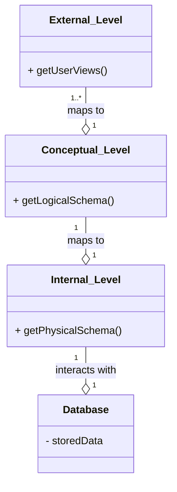

# Definition
Before proceeding, ensure you master [[Data_Independence]] and [[Database_Management_System]].
The ANSI-SPARC Three-Level Architecture is a **standardized framework for organizing and describing database systems, separating the way users view data from the way data is physically stored**. It defines three distinct levels of abstraction: External, Conceptual, and Internal. This architecture is crucial for achieving **data independence**, allowing changes at one level to occur without affecting other levels. Imagine it as a skyscraper: users see their individual office (External), the building manager sees the floor plan of all offices (Conceptual), and the engineers see the foundations and structural beams (Internal). Each has a different view, but all relate to the same physical building.

# The Mental Model
Think of a large online retail store's inventory.
*   **External Level (Customer's View):** A customer sees a product page with name, price, description, and "In Stock." They don't need to know where it's stored or how many warehouses exist.
*   **Conceptual Level (Store Manager's View):** The store manager sees all products, their total quantities, supplier information, and where they are categorized. They see the overall logical inventory, but not the physical layout of the warehouse.
*   **Internal Level (Warehouse Robot's View):** The warehouse robot sees exact shelf locations (Aisle 5, Row 10, Bin 2), physical pallet IDs, and the specific database file where this information is recorded. This is the physical storage detail.


*Note: This `classDiagram` illustrates the three levels of the ANSI-SPARC architecture as distinct components and their relationships. `o--` represents optionality in mapping, while `1` and `*` indicate cardinality.*

# Context & Framework
### How the Parts Talk to Each Other
The levels of the ANSI-SPARC architecture communicate through predefined mappings, enabling data independence. The DBMS is responsible for managing these mappings:
*   **External/Conceptual Mapping:** Translates user-specific views to the overall conceptual schema.
*   **Conceptual/Internal Mapping:** Translates the conceptual schema into the physical storage representation defined by the internal schema.
These mappings allow changes at one level (e.g., reorganizing physical storage) to be absorbed by the mapping, preventing them from propagating to higher levels (e.g., user applications), which is the essence of [[Data_Independence]].

# The Mastery Deep Dive
### Opening the Hood: What's Inside?
The ANSI-SPARC architecture defines three distinct levels:
1.  **External Level:**
    *   This is the **users' view of the database**.
    *   It describes only that part of the database that is **relevant to a particular user or group of users**. Different users can have different external views, tailored to their specific needs and access privileges. For example, a student might see their grades and courses, while a faculty member sees the courses they teach and their students' grades.
2.  **Conceptual Level:**
    *   This represents the **community view of the database** for the entire organization.
    *   It describes **what data is stored in the database** and the **relationships among the data**, independent of any specific DBMS or physical storage details. This level provides a global, logical schema of the entire database, integrating all external views.
3.  **Internal Level:**
    *   This describes the **physical representation of the database on the computer**.
    *   It details **how the data is stored in the database**, including file organization, indexing structures, and storage allocation. This is the view that the operating system and the DBMS itself use to interact with the physical data.

### Component Interactions
The ANSI-SPARC architecture facilitates interaction by using a DBMS to manage the mappings between these three levels. For example, when a user makes a request at the External Level, the DBMS uses the External/Conceptual mapping to translate it into an operation on the Conceptual Schema. This Conceptual operation is then translated into physical operations on the Internal Schema via the Conceptual/Internal mapping. This layered approach ensures that users and applications do not need to be aware of the underlying physical storage details, greatly simplifying development and maintenance.

# Constraints & Limitations
### The Engineering Trade-off
While the ANSI-SPARC architecture offers significant benefits in terms of data independence and modularity, it also introduces engineering trade-offs. The multiple layers of abstraction and the need for the DBMS to manage complex mappings between schemas add overhead, which can sometimes impact performance. The initial design and implementation of these schemas and mappings require careful planning and expertise. Over-designing the levels of abstraction can lead to unnecessary complexity, while insufficient abstraction can compromise data independence.

# Significance & Application
The [[ANSI_SPARC_Three_Level_Architecture]] is a cornerstone of modern database system design. It provides a robust framework for achieving **data independence**, allowing changes to the logical or physical structure of the database without affecting application programs or user views. This significantly reduces maintenance costs, enhances flexibility, and improves the overall robustness of database systems. Its principles are applied in virtually all commercial database management systems, ensuring that data can be managed in complex, evolving environments.

# The Worked Example
Consider a database storing employee information. We'll examine how "age" might be viewed at different levels.

```text
**1. External Level (View for HR Manager):**
*   The HR manager needs to see employee details including `staffNo`, `fName`, `lName`, and `age`.
*   Their view is specific and might omit sensitive data like salary or detailed home addresses.
*   Example: `(sNo: SL41, fName: Julie, lName: Lee, age: 40)`

**2. Conceptual Level (Overall Company View):**
*   This schema defines the entire `Staff` entity with all its attributes: `staffNo`, `fName`, `lName`, `DOB` (Date of Birth), `salary`, `branchNo`, etc.
*   Crucially, `age` is *not* stored directly. Instead, `DOB` is stored, and `age` is derived from `DOB` using a calculation.
*   Example: `Staff(staffNo, fName, lName, DOB, salary, branchNo)`

**3. Internal Level (Physical Storage View):**
*   This describes how the `Staff` data is physically stored on disk.
*   `DOB` might be stored as a `DATE` data type, using a specific byte format.
*   The entire `Staff` record might be stored as a `struct` in C/C++ or a similar low-level representation.
*   Example:
    ```c
    struct STAFF {
        int staffNo;
        char fName[15];
        char lName[15];
        struct date dateOfBirth; // Stored physically
        float salary;
        int branchNo;
        // ... other physical storage details like pointer to next record
    };
    ```
    *   `age` is *never* physically stored at this level; it's a computation.

**Outcome:** The HR manager (External) sees `age`, the conceptual model stores `DOB` and derives `age`, and the internal model stores `DOB` in a raw format. Changes to how `age` is *derived* (e.g., using current date vs. year end) would only affect the conceptual-to-external mapping, not the physical storage of `DOB`, illustrating `Logical_Data_Independence`.

```
*Note: This text block demonstrates how the `age` attribute is represented and handled across the three levels, highlighting data derivation and independence.*

# The Proving Ground
*Test your mastery. Cover the solutions below to test yourself first.*

### Level 1: The Sanity Check (Verification)
**The Component Check:** List the three levels of the [[ANSI_SPARC_Three_Level_Architecture]].
> **Solution:** The three levels are the External Level, Conceptual Level, and Internal Level.

### Level 2: The Crucible (Mastery & Edge Cases)
**The Broken System:** A new regulation requires adding a sensitive data field to the internal physical storage of a database. Explain which levels of the [[ANSI_SPARC_Three_Level_Architecture]] should *ideally* remain unaffected by this change to physical storage, and why.
> **Solution:** Ideally, both the **External Level** (user views) and the **Conceptual Level** (overall logical view) should remain unaffected by a change to the internal physical storage (Internal Level). This is the principle of [[Physical_Data_Independence]]. The DBMS, through its Conceptual/Internal mapping, should absorb the physical storage changes, translating the conceptual schema's needs into the new physical representation without requiring changes to application programs or user views. This ensures that the logical perception of the data remains stable even when its physical implementation evolves, as detailed in `# The Mastery Deep Dive` and `# Context & Framework`.

# Key Takeaways
*   ANSI-SPARC defines External (user view), Conceptual (logical view), and Internal (physical storage) levels.
*   It separates user perception from physical data storage for flexibility.
*   Mappings between levels are managed by the DBMS to achieve data independence.

# Knowledge Graph Connections
| Concept | Connection / Relationship |
| :
-------------------------- | :
------------------------------------------------------------------------------------------ |
| [[Data_Independence]]       | The ANSI-SPARC architecture is the primary framework for achieving data independence.      |
| [[Database_Management_System]] | Modern DBMSs are designed following the principles of this three-level architecture.      |
| [[Data_Models]]             | Each level corresponds to a specific type of data model (External, Conceptual, Internal).  |
| [[Schema_Mapping]]          | The mappings between these levels are crucial for the architecture's functionality.        |
---