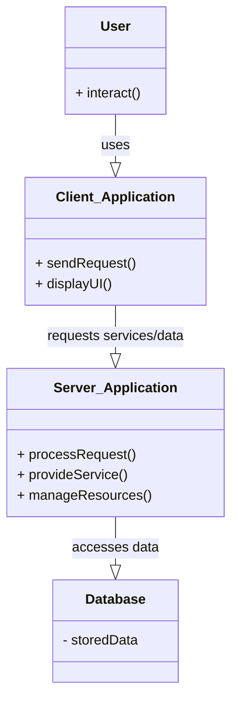

# Definition
Before proceeding, ensure you master [[Multi_User_DBMS_Architectures]] and [[Database_Management_System]].
Client-Server Architecture is a distributed computing model where **client processes request resources or services from a server process, which provides those resources or services**. This architecture was developed to overcome the disadvantages of earlier multi-user approaches like teleprocessing and file-server systems, enabling a more decentralized and scalable business environment. It's like a restaurant: the client is a customer ordering food, and the server is the chef preparing and delivering it, allowing specialization and efficient service. There is no requirement that the client and server must reside on the same machine.

# The Mental Model
Imagine a bustling restaurant.
*   **Client (Customer):** You sit at your table (your device) and tell the waiter what you want (send a request). You don't know how the food is cooked.
*   **Server (Chef/Kitchen):** The kitchen (server) receives many orders, prepares them (processes data), and sends the finished food back to the waiters. It handles all the complex cooking logic and resource management.
*   **Waiter (Network):** Facilitates communication between you and the kitchen.

The key is the clear division of labor and trust in the kitchen to handle the complex work.


*Note: This `classDiagram` illustrates the key components of a Client-Server Architecture and their primary interactions. Arrows indicate relationships between components.*

# Context & Framework
### How the Parts Talk to Each Other
In [[Client_Server_Architecture]], the client and server communicate via network protocols. The client sends requests (e.g., an SQL query, a web page request) to the server. The server processes these requests, often interacting with a database or other backend services, and then sends a response back to the client. This interaction model ensures that tasks are distributed, allowing clients to focus on user interface and presentation, while servers handle data management, business logic, and security.

# The Mastery Deep Dive
### Opening the Hood: What's Inside?
[[Client_Server_Architecture]] inherently involves two distinct processes:
1.  **Client Process:** This is the service requester. It typically runs on the user's device (e.g., a desktop, laptop, smartphone) and is responsible for the **user interface and presentation logic**. Clients initiate requests for resources or services from the server.
2.  **Server Process:** This is the service provider. It runs on a dedicated, more powerful machine and is responsible for **managing resources, performing business logic, and controlling access to shared data** (the database). Servers passively wait for client requests, process them, and return the results.

This clear separation of concerns allows for specialization: clients are optimized for user interaction, while servers are optimized for data processing, security, and scalability. Unlike older architectures, there's no requirement for the client and server to reside on the same physical machine, enabling distributed and flexible deployments.

### Component Interactions
The primary interaction in a [[Client_Server_Architecture]] is request-response. A client application initiates a request to the server, specifying the desired service or data. The server, which houses the DBMS and often the application logic, receives this request, processes it (which may involve accessing the database), and then sends a response back to the client. This model minimizes network traffic (only requests and results are sent, not entire data files) and centralizes critical database management functions like concurrency control and data integrity on the server, significantly improving robustness and scalability compared to file-server systems.

# Constraints & Limitations
### The Engineering Trade-off
While offering significant advantages, [[Client_Server_Architecture]] also involves engineering trade-offs. It introduces a dependency on network reliability; if the network connection fails, the client cannot communicate with the server. Server scalability can become a bottleneck if not properly managed, as a single server might struggle to handle a very high volume of client requests. The initial setup and configuration can be more complex than simpler architectures. These factors require careful design and resource allocation to ensure optimal performance and availability.

# Significance & Application
[[Client_Server_Architecture]] is the dominant paradigm for modern software development, forming the basis for virtually all internet-based applications, enterprise systems, and distributed computing environments. Its ability to support large numbers of users, enhance data security, and centralize data management logic has made it indispensable. Understanding this architecture is fundamental for anyone involved in developing, deploying, or managing networked applications and databases.

# The Worked Example
This example shows how a web browser (client) interacts with a web server (server) to retrieve a webpage and dynamically load data.

```text
**Scenario:** A user wants to view their online banking statement.

**1. Client (Web Browser):**
    *   User types `mybank.com` into the browser.
    *   Browser sends an HTTP `GET` request for the homepage to the bank's web server.

**2. Server (Web Server / Application Server):**
    *   Web server receives the request.
    *   Application server processes the request, authenticates the user.
    *   Application server then sends an SQL query to the database (which also runs on a server, potentially the same machine or a different one) to retrieve the user's account balance and recent transactions.
    *   Database processes the query and returns the data to the application server.
    *   Application server formats the data into an HTML page.

**3. Client (Web Browser):**
    *   Browser receives the HTML page and renders it, displaying the user's banking statement.

**Outcome:** The client (browser) focuses on presentation, while the server handles authentication, business logic, database access, and data formatting. Only the request and the final rendered page (or data) are sent over the network, making it efficient.

```
*Note: This text block illustrates the request-response cycle in a client-server web application.*

# The Proving Ground
*Test your mastery. Cover the solutions below to test yourself first.*

### Level 1: The Sanity Check (Verification)
**The Component Check:** What are the two core processes or roles in a [[Client_Server_Architecture]]?
> **Solution:** The two core processes are the client process (requester) and the server process (provider).

### Level 2: The Crucible (Mastery & Edge Cases)
**The Broken System:** A [[Client_Server_Architecture]] is implemented, but the client application performs all data validation and business logic. The server only handles raw data storage and retrieval. Explain why this setup, while technically client-server, introduces significant scalability and security vulnerabilities.
> **Solution:** This setup, despite being technically client-server, introduces significant **scalability and security vulnerabilities**. If the client performs all data validation and business logic, then:
1.  **Scalability:** Each client must be "fat" (resource-heavy), processing complex logic, and if business rules change, every client application needs updating. This is inefficient for large numbers of users.
2.  **Security:** Malicious users can bypass client-side validation by directly manipulating requests sent to the server. If the server only provides raw data, it cannot enforce data integrity or access controls effectively, making the database vulnerable to corruption or unauthorized access.

This violates the principle of centralizing business logic and security on the server for shared, controlled access, as described in `# The Mastery Deep Dive` about `Client_Server_Architecture`. The server should be actively involved in processing and validating requests, not just storing data.

# Key Takeaways
*   Client-server architecture distributes tasks between service-requesting clients and service-providing servers.
*   It overcomes limitations of older architectures by centralizing data management and business logic on the server.
*   This model enhances scalability, security, and reduces network traffic.

# Knowledge Graph Connections
| Concept | Connection / Relationship |
| :
-------------------------- | :
------------------------------------------------------------------------------------------ |
| [[Multi_User_DBMS_Architectures]] | Client-server is a prominent and advanced type of multi-user DBMS architecture.          |
| [[Database_Management_System]] | Client-server architecture is a common deployment model for DBMSs.                         |
| [[Two_Tier_Architecture]]   | Two-tier architecture is a specific implementation of the client-server model.             |
| [[Three_Tier_Architecture]] | Three-tier architecture is an evolution of client-server, adding an application server layer. |
| [[DBMS_Benefits_and_Drawbacks]] | Client-server architecture aims to maximize benefits and minimize drawbacks of DBMS usage. |
---