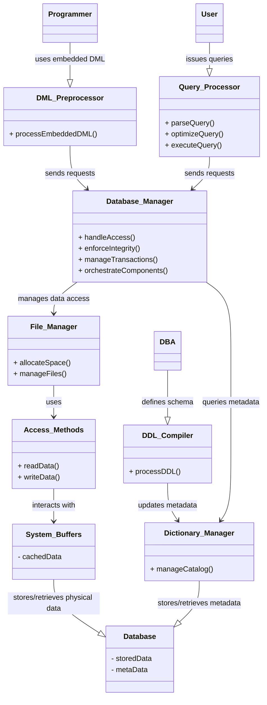

# Definition
Before proceeding, ensure you master [[Database_Management_System]] and [[Database_Languages]].
The Components of a DBMS refer to the interconnected software modules and physical structures that collectively form a Database Management System, enabling it to define, create, maintain, and control database access. These components interact seamlessly to process user requests, manage data storage, enforce security, and ensure data integrity. Think of a DBMS as a complex machine, like a car: it has an engine (database manager), a steering wheel (query processor), a fuel tank (database), and a manual (system catalog) – all working together to get you from point A to point B (data management).

# The Mental Model
Imagine a bustling airport control tower (the DBMS) managing flights (data operations).
*   **Users/Programmers/DBA:** The people giving instructions (pilots, ground crew, air traffic controllers).
*   **DDL Compiler:** The team that designs and updates the runways and airport layout (database schema).
*   **Query Processor:** The dispatch team that takes a flight request and plans the optimal route.
*   **Database Manager:** The main air traffic controller, coordinating all movements and ensuring safety.
*   **File Manager:** The hangar management team, storing and retrieving planes from their physical spots.
*   **System Catalog:** The airport's master database of all flights, planes, crew, and rules.
*   **Database:** The actual planes on the ground or in the air (the stored data).


*Note: This `classDiagram` illustrates the key software components of a DBMS and their relationships. Arrows indicate interaction or dependency.*

# Context & Framework
### How the Parts Talk to Each Other
The overall architecture of a DBMS demonstrates a sophisticated division of labor. Different users (programmers, end-users, DBAs) interact with specialized components designed to handle their specific requests. These components then communicate internally, often through the **Database Manager**, to access and manipulate the data stored in the database. This modular approach ensures efficient processing, allows for optimization, and isolates different functionalities, making the system more robust and maintainable.

# The Mastery Deep Dive
### Opening the Hood: What's Inside?
A DBMS typically consists of several interacting components:
1.  **DDL Compiler:** Processes DDL (Data Definition Language) statements, which define the database schema. It translates these definitions into internal formats that are stored in the System_Catalog.
2.  **DML Preprocessor:** For DML (Data Manipulation Language) statements embedded in application programs, this component converts them into common function calls (e.g., C++ functions) within the host language.
3.  **Query Processor:** Handles interactive queries (e.g., SQL `SELECT` statements). It parses the query, optimizes it to find the most efficient execution plan, and then executes the plan.
4.  **Database Manager (DM):** This is the core component of the DBMS. It acts as an interface between low-level data and application programs/queries. Its responsibilities include:
    *   **Authorization Control:** Verifies user permissions for requested operations.
    *   **Integrity Checker:** Ensures data adheres to defined integrity constraints.
    *   **Transaction Manager:** Guarantees atomicity, consistency, isolation, and durability (ACID properties) for transactions.
    *   **Scheduler:** Manages the order of concurrent operations to prevent conflicts.
    *   **Buffer Manager:** Manages the main memory (buffer pool) for database data, minimizing disk I/O.
    *   **Recovery Manager:** Handles database recovery after failures.
5.  **Dictionary Manager:** Manages the System_Catalog, which is the repository of metadata (data about data) for the database.
6.  **File Manager:** Manages the allocation of disk space and the file structures used to store the actual database data.
7.  **Access Methods:** Low-level routines that provide ways to read and write data to disk, often utilizing indexes for efficient retrieval.
8.  **System Buffers:** Areas in main memory used to cache data blocks retrieved from disk, speeding up subsequent access.
9.  **Database and System Catalog:** The physical storage where the actual data and metadata (from the System Catalog) reside.

# Constraints & Limitations
### The Engineering Trade-off
The intricate design of DBMS components, while powerful, introduces significant engineering trade-offs. The complexity of managing these interactions for optimal performance, concurrency, and fault tolerance is substantial. Each component must be highly optimized, and their seamless integration is critical. For instance, the **Query Processor** needs advanced algorithms for optimization, which can be computationally intensive. The **Transaction Manager** and **Concurrency Control Services** must balance strong consistency guarantees with high throughput, often involving complex locking mechanisms that can lead to contention. These trade-offs highlight the continuous challenge in building high-performance, reliable, and scalable database systems.

# Significance & Application
Understanding the [[Components_of_a_DBMS]] is crucial for database administrators (DBAs) to tune performance, diagnose issues, and ensure data integrity and security. For developers, it provides insight into how their applications interact with the database and helps in writing efficient queries. In academic contexts, it forms the foundation for studying database internals, distributed databases, and data warehousing. The modular nature of these components allows for specialized development and optimization, contributing to the robustness and efficiency of modern DBMSs.

# The Worked Example
This example traces a simple `INSERT` statement through the relevant DBMS components to illustrate their interaction.

```text
**Scenario:** A user wants to insert a new student record: `INSERT INTO Students (StudentID, Name) VALUES (123, 'Alice');`

1.  **User/Application Program:** Issues the `INSERT` statement.
2.  **Query Processor (or DML Preprocessor if from app):**
    *   **Parser:** Checks the syntax of the `INSERT` statement.
    *   **Optimizer:** May perform basic optimization, though `INSERT` is typically straightforward.
3.  **Database Manager:**
    *   **Authorization Control:** Checks if the user has permission to insert into the `Students` table.
    *   **Integrity Checker:** Verifies if `StudentID` 123 is unique (if it's a primary key) and if 'Alice' adheres to any `Name` constraints.
    *   **Transaction Manager:** Initiates a transaction for this `INSERT` operation.
4.  **File Manager:** Determines where in the physical storage the new student record should be placed.
5.  **Access Methods:** Writes the new record data to the appropriate disk blocks.
6.  **System Buffers:** Data might be written to buffers first, then flushed to disk.
7.  **Database (Physical Storage):** The new record is physically added.
8.  **Dictionary Manager (and System Catalog):** If this `INSERT` changes schema-level statistics (e.g., number of rows), the catalog is updated.
9.  **Database Manager:** Commits the transaction if successful, making the change permanent.

```
*Note: This text block illustrates the flow of an `INSERT` operation through the DBMS components.*

# The Proving Ground
*Test your mastery. Cover the solutions below to test yourself first.*

### Level 1: The Sanity Check (Verification)
**The Component Check:** Name three primary components of a typical DBMS architecture.
> **Solution:** Three primary components are the DDL Compiler, Query Processor, and Database Manager.

### Level 2: The Crucible (Mastery & Edge Cases)
**The Broken System:** A database administrator observes that despite highly optimized SQL queries, the system's performance is consistently poor. Investigation reveals a bottleneck in the "File Manager" component. Explain what the File Manager is responsible for and how a failure in this component could cause widespread performance degradation.
> **Solution:** The **File Manager** component of a DBMS is responsible for **managing the allocation of disk space and the file structures** used to store the actual database data. It handles the physical organization of data on storage devices. A bottleneck or failure in the File_Manager_Architecture would cause widespread performance degradation because it is the gatekeeper for all physical data access. Even with optimized queries from the Query Processor, if the File Manager cannot efficiently locate, read, or write data blocks on disk, every data retrieval or update operation will be severely slowed down. This directly impacts the overall throughput and responsiveness of the entire DBMS, as explained in `# Opening the Hood: What's Inside?`.

# Key Takeaways
*   DBMS comprises modules for DDL compilation, DML processing, and query execution.
*   The Database Manager is the core, handling authorization, integrity, transactions, and recovery.
*   The System Catalog (managed by Dictionary Manager) stores metadata about the database.

# Knowledge Graph Connections
| Concept | Connection / Relationship |
| :
-------------------------- | :
------------------------------------------------------------------------------------------ |
| [[Database_Management_System]] | These are the constituent parts that make up a DBMS and enable its functionality.          |
| [[Database_Languages]]      | The DDL Compiler and DML Preprocessor components directly handle database languages.      |
| System_Catalog          | The System Catalog is a fundamental component, managed by the Dictionary Manager.          |
| [[Functions_of_a_DBMS]]     | Each function of a DBMS is implemented by these various interacting components.            |
| [[Multi_User_DBMS_Architectures]] | The arrangement and interaction of these components vary across different architectures.   |
---