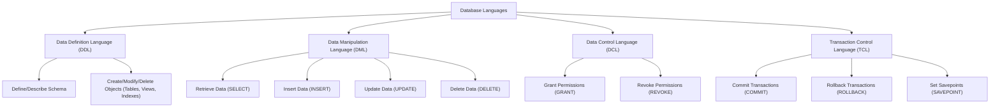

# Definition
Before proceeding, ensure you master [[Database_Management_System]] and [[Data_Models]].
Database Languages are specialized programming languages used to **define, manipulate, and control access to data within a database management system (DBMS)**. They provide the interface through which users and applications interact with the database, allowing for tasks ranging from creating table structures to querying specific information and managing user permissions. Think of database languages as the specific dialects you use to "talk" to the database, each serving a distinct purpose in managing the digital library.

# The Mental Model
Imagine you're building a house. You have two main tools:
1.  **Blueprints and Specifications (DDL):** This is how you define the structure of the house—the number of rooms, where the walls go, the foundation. You're creating the *framework*.
2.  **Tools to Move Things Around (DML):** Once the house is built, these are the tools you use to put furniture in rooms, paint walls, or rearrange items. You're *interacting with the contents* within the existing structure.


*Note: This `graph TD` diagram illustrates the different categories of database languages and their primary functions.*

# Context & Framework
### The Family Tree
Database languages can be broadly categorized, creating a hierarchy of purpose and function. At the top level are languages for defining the structure (DDL) and manipulating the data (DML). These categories further branch into more specialized types, reflecting increasing levels of abstraction and automation over time. Understanding this hierarchy is key to grasping how different language elements contribute to the overall database management process.

# The Mastery Deep Dive
### The Translator: Converting English to Math
Database languages allow users to communicate with the DBMS in a structured, formal way.
**Data Definition Language (DDL)** is used by the Database Administrator (DBA) or users to **describe and name the entities, attributes, and relationships** required for the application, along with any associated integrity and security constraints. Examples include `CREATE TABLE`, `ALTER TABLE`, and `DROP TABLE`. Its purpose is to define the database schema.

**Data Manipulation Language (DML)** provides the basic operations for **manipulating data** held in the database. This includes retrieving, inserting, updating, and deleting data. DMLs can be further classified:
*   **Procedural DML** requires the user to tell the system *exactly how* to manipulate data (e.g., specifying file paths and record sequences). This is common in older systems or low-level programming.
*   **Non-Procedural DML** allows the user to state *what data is needed* rather than *how it is to be retrieved*. SQL's `SELECT` statement is a prime example, where the user specifies criteria, and the DBMS handles the optimization of data retrieval. This provides greater data independence.

**Fourth Generation Languages (4GLs)** are a step above traditional DMLs, often incorporating automated tools (like **Automated CASE tools**) and higher-level constructs to simplify database application development. They aim to be even more user-friendly and declarative, reducing programming effort.

### Component Interactions
Database languages are the primary interface between users, application programs, and the DBMS. When a DDL statement is issued, a DDL compiler processes it to update the system catalog. DML statements are processed by a query processor, which optimizes and executes the data manipulation requests. This interaction ensures that language commands are correctly interpreted and executed against the database, adhering to its defined schema and constraints.

# Constraints & Limitations
### The Engineering Trade-off
The choice and application of database languages involve inherent engineering trade-offs. While powerful, DDL requires careful planning to define robust schemas, as changes can impact dependent applications. DMLs, especially non-procedural ones, offer flexibility but rely heavily on the DBMS's query optimizer for efficient execution. Procedural DMLs offer fine-grained control but sacrifice data independence. The use of 4GLs can accelerate development but might introduce limitations in terms of customization or performance for highly specialized tasks.

# Significance & Application
Database languages are fundamental to the operation and development of any database system. They are essential tools for DBAs, developers, and data analysts to manage database structures, query and update information, and ensure data security and integrity. Proficiency in these languages, especially SQL (a blend of DDL and DML), is a core skill in the field of data management and software development.

# The Worked Example
This example demonstrates both DDL and DML statements, showing how they define structure and manipulate data.

```sql
-- DDL Example: Creating a new table for 'Courses'
CREATE TABLE Courses (
    courseID      VARCHAR(10) PRIMARY KEY,
    courseName    VARCHAR(50) NOT NULL,
    credits       INT CHECK (credits > 0)
);
-- This defines the structure of the Courses table.

-- DML Example: Inserting data into the 'Courses' table
INSERT INTO Courses (courseID, courseName, credits)
VALUES ('CS101', 'Introduction to Programming', 3);
-- This manipulates (adds) data within the defined structure.

-- DML Example: Updating data in the 'Courses' table
UPDATE Courses
SET credits = 4
WHERE courseID = 'CS101';
-- This manipulates (modifies) existing data.

-- DML Example: Retrieving data from the 'Courses' table (Non-Procedural DML)
SELECT *
FROM Courses
WHERE credits > 3;
-- This asks for *what* data is needed (courses with >3 credits), not *how* to find it.
```
*Note: This SQL code showcases examples of DDL (CREATE TABLE) and DML (INSERT, UPDATE, SELECT) statements, demonstrating their distinct roles.*

# The Proving Ground
*Test your mastery. Cover the solutions below to test yourself first.*

### Level 1: The Sanity Check (Verification)
**The Neighbor Check:** List the two primary categories of database languages and their main purpose.
> **Solution:** The two primary categories are Data Definition Language (DDL) for defining schema, and Data Manipulation Language (DML) for manipulating data.

### Level 2: The Crucible (Mastery & Edge Cases)
**The Impostor:** A database administrator issues a command `ALTER TABLE Employees ADD COLUMN hire_date DATE;`. This command looks like it belongs to DML due to "manipulation," but it's actually DDL. Explain why this command is DDL and not DML, highlighting the core difference in what DDL affects.
> **Solution:** The command `ALTER TABLE Employees ADD COLUMN hire_date DATE;` is DDL because it **modifies the schema (structure) of the database table**, not the actual data content within the rows. DDL commands (like `CREATE`, `ALTER`, `DROP`) define or change the database's blueprint. DML commands (like `INSERT`, `UPDATE`, `DELETE`, `SELECT`) operate on the *data instances* (records/tuples) that exist *within* that defined structure, as clarified in `# The Translator: Converting English to Math`. The key difference is that DDL changes the *rules* for the data, while DML changes the *data itself* according to those rules.

# Key Takeaways
*   Database languages define (DDL) and manipulate (DML) data in a DBMS.
*   DDL defines the database schema and constraints (e.g., `CREATE TABLE`).
*   DML performs data operations like retrieval, insertion, update, and deletion (`SELECT`, `INSERT`).
*   DML can be procedural (how to) or non-procedural (what is needed).

# Knowledge Graph Connections
| Concept | Connection / Relationship |
| :
-------------------------- | :
------------------------------------------------------------------------------------------ |
| [[Database_Management_System]] | Database languages are the primary interface for interacting with a DBMS.                 |
| [[Data_Models]]             | DDL is used to implement the structural components of a chosen data model.                 |
| [[Relational_Data_Model]]   | SQL, a prominent database language, is primarily used with the relational data model.      |
| [[ANSI_SPARC_Three_Level_Architecture]] | Database languages are used to define and manage schemas at different levels of this architecture. |
---