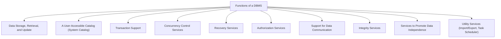

# Definition
Before proceeding, ensure you master [[Database_Management_System]] and System_Catalog.
The Functions of a DBMS refer to the diverse set of capabilities and services provided by a Database Management System to effectively manage and control data. These functions extend beyond simple storage, encompassing everything from defining data structures and ensuring data integrity to supporting multiple users concurrently and recovering from failures. Think of a DBMS as a highly specialized digital city manager: it's not just about building houses (storing data), but also about setting zoning laws (data definition), managing traffic (concurrency), providing utility services (recovery), and keeping a city directory (system catalog).

# The Mental Model
Imagine you are managing a large, constantly changing library:
*   **Data Storage, Retrieval, Update:** The core task of getting books in and out, and changing their records.
*   **User-Accessible Catalog:** The library's public index, telling you what books are available and where.
*   **Transaction Support:** Ensuring that if someone checks out a book, it's either fully checked out or not at all (no half-checked-out books).
*   **Concurrency Control:** Managing multiple people checking out books simultaneously without conflicts.
*   **Recovery Services:** If the library burns down, having a backup plan to restore all the books and records.
*   **Authorization Services:** Deciding who can access which books (e.g., restricted section).
*   **Integrity Services:** Ensuring all books are properly categorized and follow library rules.
*   **Data Independence:** Changing how books are physically shelved without affecting how users search for them.
*   **Utility Services:** Tasks like importing new books in bulk or archiving old ones.


*Note: This `graph TD` diagram enumerates the key functions provided by a DBMS.*

# Context & Framework
### The Family Tree
The functions of a DBMS can be broadly grouped into categories that reflect its core responsibilities: managing data itself, managing interactions with data, and managing the overall system health. This multi-faceted role ensures that a DBMS is not merely a storage container but an intelligent system capable of intricate data governance and robust operational support. Each function is critical to achieving the overarching goals of data integrity, security, and availability.

# The Mastery Deep Dive
### Opening the Hood: What's Inside?
The capabilities of a DBMS are comprehensive, spanning several key areas:
*   **Data Storage, Retrieval, and Update:** This is the most fundamental function, allowing users to store new data, fetch existing data, and modify information efficiently.
*   **A User-Accessible Catalog (System Catalog):** The System_Catalog is a repository of metadata, storing information *about the data* in the database (e.g., table names, column types, relationships, user permissions). It's essentially the DBMS's "data about data," making the system self-describing.
*   **Transaction Support:** Ensures that a sequence of database operations is treated as a single, atomic unit. This means either all operations in the transaction complete successfully, or none of them do, maintaining data consistency.
*   **Concurrency Control Services:** Manages simultaneous access by multiple users to prevent conflicts and ensure that data remains consistent, even when many operations are happening at once.
*   **Recovery Services:** Provides mechanisms to restore the database to a consistent state after hardware or software failures, protecting against data loss.
*   **Authorization Services:** Manages user permissions, allowing the DBA to define who can access what data and what operations they can perform, enforcing data security.
*   **Support for Data Communication:** Handles interactions with various client applications and network protocols to facilitate data exchange.
*   **Integrity Services:** Enforces a set of rules and constraints (e.g., primary key uniqueness, referential integrity) to ensure the accuracy and consistency of data.
*   **Services to Promote Data Independence:** Enables changes to the database schema at one level (e.g., physical storage) without affecting other levels (e.g., user views).
*   **Utility Services:** Includes a range of tools for tasks like importing/exporting data, monitoring performance, and scheduling maintenance tasks.

# Constraints & Limitations
### The Engineering Trade-off
The extensive functionality of a DBMS, while highly beneficial, comes with engineering trade-offs. Implementing robust concurrency control and recovery mechanisms adds significant complexity and resource overhead. Balancing strict data integrity rules with the need for high performance can be a challenge. Providing data independence requires multiple layers of schema mapping, which can introduce processing costs. Designers must carefully weigh these factors, selecting features and configurations that align with the specific requirements and constraints of their application.

# Significance & Application
The various functions of a DBMS collectively contribute to its role as a powerful and indispensable tool for modern data management. They ensure that data is not only stored but also protected, made reliable, and accessible in a controlled and efficient manner. These functions are critical for maintaining the operational integrity of businesses, supporting decision-making processes, and enabling the development of complex, data-intensive applications across all sectors.

# The Worked Example
This example demonstrates how a DBMS's transaction and recovery services work together during a simple bank transfer to ensure data integrity.

```text
**Scenario:** Transfer $100 from Account A to Account B.

**Without DBMS Transaction/Recovery:**
1.  Debit $100 from Account A.
2.  System crashes *before* crediting Account B.
3.  Result: $100 is lost from Account A, never reaching Account B. **Data Inconsistency.**

**With DBMS Transaction/Recovery:**
1.  **BEGIN TRANSACTION;**
2.  Debit $100 from Account A. (Temporary change)
3.  If successful: Credit $100 to Account B. (Temporary change)
4.  If both successful: **COMMIT;** (All changes become permanent)
5.  If any step fails (e.g., system crash after step 2): **ROLLBACK;** (All temporary changes are undone, Account A is restored to its original state).

**Outcome:** The DBMS treats the debit and credit as an **atomic unit**. If anything goes wrong, the entire transaction is rolled back, guaranteeing that the database remains in a consistent state. This is a core part of its `Transaction Support` and `Recovery Services` functions.

```
*Note: This text block illustrates the atomic nature of transactions and the role of recovery in maintaining consistency.*

# The Proving Ground
*Test your mastery. Cover the solutions below to test yourself first.*

### Level 1: The Sanity Check (Verification)
**The Neighbor Check:** List three core functions that a DBMS performs.
> **Solution:** Three core functions are Data Storage, Retrieval, and Update; a User-Accessible Catalog; and Transaction Support.

### Level 2: The Crucible (Mastery & Edge Cases)
**The Impostor:** A database system advertises "built-in reporting tools" as its primary strength. While useful, explain why these reporting tools are *not* considered a fundamental function of the DBMS itself, but rather a utility or application layer feature.
> **Solution:** While built-in reporting tools are valuable, they are **utility services** or application-level features, not fundamental functions of the DBMS core. The core `Functions_of_a_DBMS` are those absolutely essential for managing the database's integrity, security, and basic operations (like storage, retrieval, transaction management, concurrency control, and recovery). Reporting tools typically *use* the data managed by these core functions to present information, but they are not directly involved in the low-level management and preservation of the data itself. A DBMS can operate perfectly well without integrated reporting, as discussed in `# Opening the Hood: What's Inside?`.

# Key Takeaways
*   DBMS functions include data storage/retrieval, transaction/concurrency control, and recovery.
*   The System Catalog provides metadata, making the database self-describing.
*   Authorization, integrity, data communication, and data independence are also key functions.

# Knowledge Graph Connections
| Concept | Connection / Relationship |
| :
-------------------------- | :
------------------------------------------------------------------------------------------ |
| [[Database_Management_System]] | These functions define the capabilities and services provided by a DBMS.                   |
| System_Catalog          | The System Catalog is a specific function of a DBMS, storing metadata about the database.  |
| [[Components_of_a_DBMS]]    | Each function is implemented by one or more components within the DBMS architecture.       |
| [[DBMS_Benefits_and_Drawbacks]] | The provision of these functions explains the advantages of using a DBMS.                  |
---