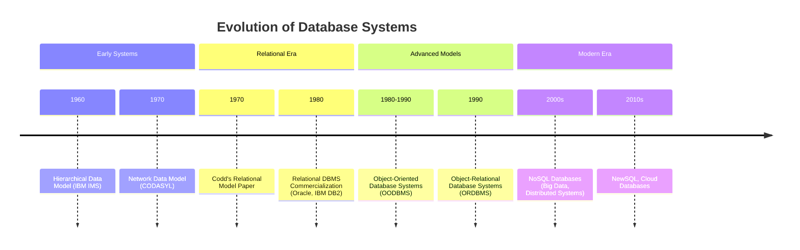

# Definition
Before proceeding, ensure you master [[Database_Management_System]] and [[Data_Models]].
The History of Database Systems traces the evolution of methods for storing, organizing, and retrieving data over several decades, driven by increasing data volumes and the need for more complex data relationships. This journey from early file processing to modern distributed databases reflects continuous innovation to address limitations in data independence, flexibility, and query capabilities. Imagine the history of databases like the evolution of transportation: from simple carts (file systems) to trains (hierarchical/network), then cars (relational), and finally complex air traffic control systems (object-oriented/distributed).

# The Mental Model
Think of the evolution of filing cabinets:
*   **1st Gen (Hierarchical/Network):** Like a rigid, single-topic filing cabinet. You can only put a file in one specific drawer, and if you want to find something related to it, you have to follow a very specific path. Very fast if you know the exact path, but hard to reorganize or find unexpected connections.
*   **2nd Gen (Relational):** Like a highly organized library with index cards (tables). Each card (record) has unique identifiers, and you can cross-reference any card with any other, making it very flexible. You don't care *where* the book is, just *what* it is and its category.
*   **3rd Gen (Object-Orientational/Relational):** Imagine the library now having smart books that not only contain information but also know how to perform actions (methods) related to their content.


*Note: `timeline` diagrams display chronological events to illustrate evolution.*

# Context & Framework
### The Problem: Why Did We Invent This?
The evolution of database systems has been a direct response to the inherent limitations of earlier data storage methods, primarily file processing systems. These older systems suffered from issues like **data redundancy**, **inconsistency**, difficulty in **data sharing**, and **poor data independence**. Each generation of database models introduced innovations to address these problems, seeking to provide more flexible, robust, and efficient ways to manage increasingly complex data.

# The Mastery Deep Dive
### Version 1.0 vs. Today
The journey of database systems began with **First-Generation Data Models**, which include the **Hierarchical Data Model** and the **Network Data Model**. These models represented data in tree-like structures (hierarchical) or more complex graph structures (network), allowing for defined relationships. However, they were characterized by a "navigational" and "procedural" approach, meaning users needed to know the physical database structure to access data, and operations were record-at-a-time. Adding new record types or relationships often required database redefinition.

The **Second-Generation Data Model** introduced the revolutionary **Relational Data Model**, primarily conceptualized by Dr. Edgar F. Codd. This model views data as a collection of two-dimensional tables (relations), where rows are tuples and columns are attributes. Relationships are established by shared data values between fields. The key innovation was its "declarative" approach, allowing users to state *what* data they needed rather than *how* to retrieve it, providing greater data independence and flexibility.

The **Third-Generation Data Models** emerged to address the limitations of relational models in handling complex, multimedia, or object-oriented data. This includes **Object-Relational Data Models** (ORDBMS), which extend relational systems with object-oriented features, and **Object-Oriented Data Models** (OODBMS), which directly store data as objects, incorporating both data and behavior. These generations sought to integrate the strengths of object-oriented programming with database capabilities, offering richer data types and more complex structures.

### The "Same Story, Different Setting"
The fundamental challenges driving database evolution – managing complexity, ensuring data integrity, and providing flexible access – are echoed in many other areas of computer science, such as the development of programming languages (from procedural to object-oriented) or operating system architectures. Each iteration seeks to abstract away underlying complexities and provide a more powerful, user-friendly interface for managing resources.

# Constraints & Limitations
### The Engineering Trade-off
Each generation of database systems, while addressing previous limitations, introduced its own set of engineering trade-offs. First-generation models offered high performance for specific queries but lacked flexibility. The relational model provided unparalleled flexibility and data independence but sometimes at the cost of performance for very complex relationships. Third-generation models aimed to bridge the gap but often struggled with standardization and adoption. These trade-offs highlight the continuous struggle to balance efficiency, flexibility, and ease of use in data management.

# Significance & Application
Understanding the history of database systems is crucial for appreciating the design principles and challenges of modern databases. It provides context for why certain architectural choices were made and helps in selecting the most appropriate database technology for a given application. The progression from rigid, navigation-based systems to flexible, declarative, and object-aware models reflects the increasing demands for complex data handling and distributed computing in various industries.

# The Worked Example
This example traces a simple query through the conceptual differences of a Hierarchical model versus a Relational model to demonstrate the shift in data access.

```text
**Scenario:** Find the salary of "John White" who works in "London".

**1. Hierarchical Data Model (Conceptual Trace):**
*   **Challenge:** You must navigate a predefined path.
*   **Path:** Start at "Branch (London)" -> Find "Staff (John White)" -> Get "Salary".
*   **Constraint:** If John White was in a different branch, the query path would change. If you wanted all staff in London, you'd navigate the branch and then list all its children. The structure dictates access.

**2. Relational Data Model (Conceptual Trace):**
*   **Challenge:** You don't need to know the physical links.
*   **Query (SQL-like):** `SELECT salary FROM Staff WHERE fName = 'John' AND IName = 'White' AND branchNo IN (SELECT branchNo FROM Branch WHERE city = 'London');`
*   **Flexibility:** The query declares *what* data is needed. The DBMS optimizer determines the *how* (e.g., using indexes, joining tables). John White could be in any branch, and the query structure remains largely the same, making it robust to changes in underlying data storage.

**Outcome:** The Relational model provides greater logical independence, allowing more flexible queries without needing to know the "physical" navigation paths, which was a significant improvement over the hierarchical and network models.

```
*Note: This text block illustrates a comparison of access methods between data models.*

# The Proving Ground
*Test your mastery. Cover the solutions below to test yourself first.*

### Level 1: The Sanity Check (Verification)
**The Fact Check:** Name the three main generations of database systems.
> **Solution:** The three main generations are First-generation (Hierarchical and Network), Second-generation (Relational), and Third-generation (Object-Relational and Object-Oriented).

### Level 2: The Crucible (Mastery & Edge Cases)
**The Lose-Lose Scenario:** A legacy system uses a first-generation Hierarchical_Data_Model. A new requirement emerges for complex many-to-many relationships that are cumbersome to implement. Discuss the fundamental limitations of the Hierarchical_Data_Model that lead to this difficulty, and why an immediate migration might not be feasible, creating a difficult choice between maintaining legacy complexity or undergoing a costly overhaul.
> **Solution:** The Hierarchical_Data_Model inherently supports **one-to-many relationships** (a parent can have many children, but a child only one parent). Implementing many-to-many relationships requires complex workarounds (e.g., duplicating data, creating junction records with redundant pointers), which lead to **increased data redundancy, inconsistency, and complex navigational logic**. An immediate migration is often not feasible due to **high conversion costs**, **application rewrites**, and potential **business disruption**. This creates a "lose-lose" scenario where maintaining the legacy system incurs ongoing technical debt and inefficiency, while migrating requires significant upfront investment and risk, highlighting the strategic trade-offs in database evolution discussed in `# The Problem: Why Did We Invent This?` and `# Constraints & Limitations`.

# Key Takeaways
*   Database systems evolved through three generations to address limitations of prior models.
*   First-generation (Hierarchical, Network) offered rigid, procedural access.
*   Second-generation (Relational) introduced flexible, declarative, table-based data management.
*   Third-generation (Object-Relational, Object-Oriented) integrated object-oriented concepts for complex data.

# Knowledge Graph Connections
| Concept | Connection / Relationship |
| :
-------------------------- | :
------------------------------------------------------------------------------------------ |
| [[Database_Management_System]] | The evolution of data models is central to the development of DBMS capabilities.           |
| [[Relational_Data_Model]]   | The relational model is a key innovation from the second generation of databases.          |
| [[Data_Models]]             | The different generations represent distinct approaches to data modeling.                  |
| [[DBMS_Benefits_and_Drawbacks]] | Historical shifts were driven by attempts to maximize benefits and minimize drawbacks.     |
---