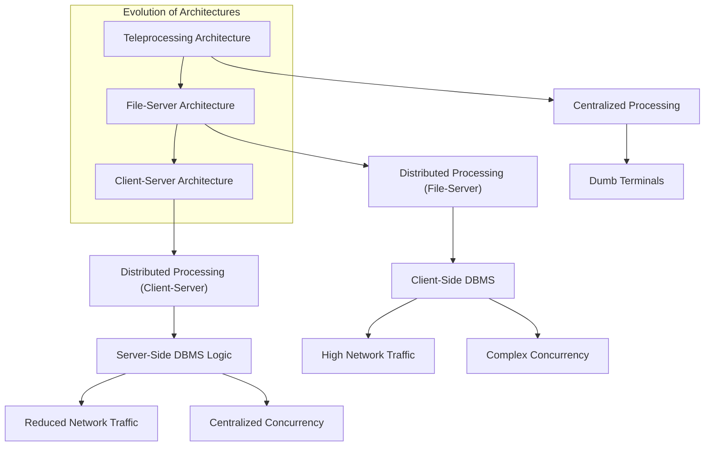

# Definition
Before proceeding, ensure you master [[Database_Management_System]] and [[Client_Server_Architecture]].
Multi-User DBMS Architectures refer to the various structural designs used to implement Database Management Systems that support simultaneous access and interaction by multiple users. These architectures define how application processing, database management, and data storage functions are distributed across a network. They evolved from centralized 'dumb' terminal systems to increasingly distributed and flexible models to meet the demands of modern business environments. Imagine designing a city's water supply: from a single well with buckets (teleprocessing) to a central reservoir with pipes to each house (file-server), and then a sophisticated network of local pumps and purification plants (client-server).

# The Mental Model
Think of different ways a group of people might share a complex puzzle.
*   **Teleprocessing (The "Boss" Does It All):** One person is the "puzzle master." Everyone else just tells the puzzle master what piece they want, and the master finds and places it. All the work happens in one central brain.
*   **File-Server (The "Shared Box"):** Everyone gets a copy of the puzzle *pieces* (the database files), but each person has their own small table to work on (their workstation running the DBMS). If someone places a piece, they have to shout across the room to see if anyone else has a conflicting piece. It's easy to create chaos.
*   **Client-Server (The "Collaborative Team"):** Each person has their own small board (client) to visualize their part, but there's a dedicated "puzzle coordinator" (server) who ensures pieces are correctly placed, handles all conflicts, and maintains the master puzzle board. Everyone trusts the coordinator.


*Note: This `graph TD` diagram illustrates the evolution and key characteristics of multi-user DBMS architectures. Arrows indicate progression or relationship.*

# Context & Framework
### Opening the Hood: What's Inside?
The choice of a multi-user DBMS architecture profoundly impacts system performance, scalability, and maintainability. Each architecture distributes the "intelligence" and workload differently across the network. Understanding these distributions is key to grasping their advantages and disadvantages. From early centralized processing to modern distributed models, the aim has always been to optimize resource utilization and user experience for multiple simultaneous interactions with a shared database.

# The Mastery Deep Dive
### Follow the Ball: A Slow-Motion Trace
Multi-User DBMS Architectures have evolved significantly:

1.  **Teleprocessing:**
    *   **Architecture:** The traditional model where there is a **single central processing unit (CPU)** that runs the application programs and the DBMS. A number of 'dumb' terminals are cabled to this main computer. These terminals are incapable of functioning on their own.
    *   **Processing Flow:** User input from a terminal is sent to the central CPU, processed, and the output is sent back for display. The central computer carries out all the work, including formatting data for display.
    *   **Disadvantage:** Places a **tremendous burden on the central computer**, leading to performance bottlenecks as the number of users increases. It also lacks flexibility and resilience.

2.  **File-Server Architecture:**
    *   **Architecture:** The processing is distributed across a network, typically a Local Area Network (LAN). The **file-server holds the database files**, but the **applications and the DBMS run on each individual workstation** requesting those files.
    *   **Processing Flow:** A workstation runs the DBMS, which sends requests for data files to the file-server. The file-server acts simply as a shared hard disk drive, returning entire data files or blocks of files. The workstation then processes this data locally.
    *   **Disadvantages:**
        *   **Large amount of network traffic:** Entire files or large blocks are transferred, even for small data requests.
        *   **Full copy of the DBMS required on each workstation:** Increases resource consumption on client machines.
        *   **Complex concurrency, recovery, and integrity control:** Multiple DBMS instances on different workstations accessing the same files simultaneously lead to complex coordination issues and higher risk of data corruption.

These architectures laid the groundwork for the more advanced [[Client_Server_Architecture]], which addressed many of their limitations by intelligently distributing processing tasks.

### Component Interactions
In multi-user architectures, components like user terminals, workstations, and servers interact by sending requests and responses across a network. The way these interactions are structured (e.g., whether the DBMS runs on the client or a dedicated server) defines the architecture's characteristics. This influences where processing logic resides, the volume of network traffic, and how data integrity and concurrency are managed for shared access.

# Constraints & Limitations
### The Engineering Trade-off
The choice of a multi-user DBMS architecture involves critical engineering trade-offs between cost, performance, scalability, and manageability. Teleprocessing, while simple in its early form, quickly hits scalability limits. File-server architectures offer some distribution but introduce massive network overhead and complex concurrency problems. These limitations highlight the continuous challenge of designing systems that can efficiently serve many users accessing shared data reliably, pushing the evolution towards more sophisticated models.

# Significance & Application
Understanding different [[Multi_User_DBMS_Architectures]] is essential for designing and implementing database systems that can effectively support collaborative work and large user bases. From the historical context of teleprocessing and file-server models, one can appreciate the innovations that led to modern client-server and tiered architectures, which are ubiquitous in today's networked applications, from corporate intranets to global web services.

# The Worked Example
This example illustrates the difference in network traffic between a file-server architecture and a more optimized approach for a simple data request.

```text
**Scenario:** A user wants to retrieve the name of a single customer from a large `Customers` table (10,000 records, 1MB total size).

**1. File-Server Architecture:**
*   **User Action:** Runs an application on their workstation that issues a `SELECT` query.
*   **DBMS (on Workstation):** Needs to process the query. To do this, it requests the entire `Customers` data file from the file-server.
*   **File-Server Action:** Sends the entire 1MB `Customers` file over the network to the workstation.
*   **Workstation Action:** Receives the 1MB file, loads it, processes the `SELECT` query locally, and extracts the customer name (e.g., 20 bytes).
*   **Network Traffic:** High (1MB for 20 bytes of actual data needed).

**2. More Optimized Architecture (e.g., Client-Server):**
*   **User Action:** Runs a client application that sends a `SELECT` query to a database server.
*   **Client Application Action:** Sends the query string (e.g., "SELECT Name FROM Customers WHERE CustomerID = 'C123'") over the network (a few KB).
*   **Database Server Action (running DBMS):** Receives the query, processes it directly on the server where the data resides, and extracts only the relevant customer name.
*   **Database Server Action:** Sends *only the customer name* (e.g., 20 bytes) back to the client.
*   **Network Traffic:** Low (a few KB for the query, 20 bytes for the result).

**Outcome:** The file-server architecture generates significantly more network traffic because the DBMS processing is client-side, requiring large data transfers. This highlights a key disadvantage and why more intelligent architectures evolved.

```
*Note: This text block demonstrates the network traffic implications of different multi-user architectures.*

# The Proving Ground
*Test your mastery. Cover the solutions below to test yourself first.*

### Level 1: The Sanity Check (Verification)
**The Component Check:** Name two common architectures used to implement multi-user database management systems.
> **Solution:** Two common architectures are Teleprocessing and File-Server.

### Level 2: The Crucible (Mastery & Edge Cases)
**The Broken System:** A small office uses a file-server architecture for its database. As the number of users grows, they experience severe network slowdowns and data corruption issues. Explain the fundamental disadvantages of the File_Server_Architecture that lead to these problems, particularly regarding network traffic and concurrency control.
> **Solution:** The File_Server_Architecture inherently leads to severe network slowdowns because a full copy of the DBMS runs on each workstation, requiring **entire database files or large blocks of data to be transferred across the network** for almost every operation. This generates a **large amount of network traffic**. Data corruption issues arise due to complex **concurrency control**; with multiple independent DBMS instances simultaneously accessing and modifying the same physical files, coordinating updates and ensuring data consistency becomes extremely difficult, leading to conflicts and potential data loss, as detailed in `# The Mastery Deep Dive`. This architectural flaw makes it unscalable for growing user bases.

# Key Takeaways
*   Multi-user architectures define how DBMS functions are distributed across a network.
*   Teleprocessing is a centralized model with dumb terminals, prone to bottlenecks.
*   File-server architectures distribute processing to workstations but cause high network traffic and complex concurrency.

# Knowledge Graph Connections
| Concept | Connection / Relationship |
| :
-------------------------- | :
------------------------------------------------------------------------------------------ |
| [[Database_Management_System]] | These architectures describe different ways a DBMS can be deployed to serve multiple users. |
| [[Client_Server_Architecture]] | Client-server architecture evolved to address the limitations of teleprocessing and file-server models. |
| [[DBMS_Benefits_and_Drawbacks]] | Architectural choices directly impact the advantages and disadvantages experienced by users. |
| [[Components_of_a_DBMS]]    | The distribution of DBMS components defines the nature of these multi-user architectures.   |
---