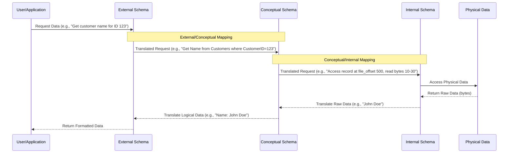

# Definition
Before proceeding, ensure you master [[Data_Independence]] and [[ANSI_SPARC_Three_Level_Architecture]].
Schema Mapping refers to the **process of transforming requests and data between different levels of the ANSI-SPARC three-level architecture**, primarily between external views, the conceptual schema, and the internal schema. These mappings are the mechanisms that make **data independence** possible, allowing changes at one level to be absorbed without affecting others. The DBMS is solely responsible for managing these transformations. Imagine schema mapping as a universal translator that allows different departments in a company to speak their own jargon while still sharing and understanding core information, all handled by a central language expert (the DBMS).

# The Mental Model
Think of a postal service.
*   **External View (Your Address):** You know your personal mailing address.
*   **Conceptual Schema (City Map):** The city has a comprehensive map of all streets and house numbers.
*   **Internal Schema (GPS Coordinates/Delivery Route):** The postal worker's GPS or internal routing system translates your address into precise coordinates and an optimized delivery path.

**Schema Mapping** is the process by which:
1.  Your friend uses your mailing address (External) which the postal service translates to a point on the city map (Conceptual).
2.  The city map address (Conceptual) is then translated by the postal service's internal system into an exact delivery route (Internal) for the mail carrier.
Changes to the postal worker's internal routing (Internal) don't change your mailing address (External) or the city map (Conceptual).


*Note: This `sequenceDiagram` illustrates the flow of a data request from a user through the three schema levels, with the DBMS managing the mappings at each step.*

# Context & Framework
### How the Parts Talk to Each Other
[[Schema_Mapping]] is the explicit mechanism that allows the different levels of the [[ANSI_SPARC_Three_Level_Architecture]] to communicate and interact effectively. These mappings translate data definitions and requests from one level to another, ensuring that each level can operate independently while still contributing to a coherent, unified database system. The DBMS acts as the central orchestrator, using these mappings to perform the necessary transformations seamlessly.

# The Mastery Deep Dive
### Follow the Ball: A Slow-Motion Trace
[[Schema_Mapping]] is the provision within a DBMS for achieving [[Data_Independence]] by defining how different schema levels relate. The DBMS is fully responsible for managing these mappings. There are two primary types:

1.  **External/Conceptual Mapping:**
    *   This mapping enables the DBMS to **translate data requests and definitions between an external schema (a user's view) and the conceptual schema (the overall logical view)**.
    *   It allows the DBMS to map names and structures in the user's view onto the relevant part of the conceptual schema. For example, if a user's external view has a column `Customer_Age`, but the conceptual schema stores `Customer_DateOfBirth`, the external/conceptual mapping defines how `Customer_Age` is derived from `Customer_DateOfBirth`.
    *   This mapping is crucial for [[Logical_Data_Independence]], ensuring that changes to the conceptual schema do not affect existing external views or application programs.

2.  **Conceptual/Internal Mapping:**
    *   This mapping enables the DBMS to **translate data requests and definitions between the conceptual schema and the internal schema (the physical storage representation)**.
    *   It defines how the logical records and relationships in the conceptual schema are represented in terms of physical storage. This involves mapping logical data types to physical data types, specifying file organizations, and defining indexing strategies.
    *   This mapping is essential for [[Physical_Data_Independence]], allowing changes to physical storage structures (e.g., using different file organizations, moving data to new devices) without affecting the conceptual schema. The DBMS uses this mapping to find the actual records or combinations of records in physical storage that constitute a logical record in the conceptual schema.

### Component Interactions
When a user or application issues a query through an external schema, the DBMS first uses the **External/Conceptual Mapping** to translate this request into terms understood by the conceptual schema. Then, the **Conceptual/Internal Mapping** takes this conceptual request and translates it into specific physical operations (e.g., file reads, index lookups) on the internal schema. This multi-stage translation process, entirely managed by the DBMS, ensures that data can be accessed and manipulated efficiently while maintaining the separation and independence of the different schema levels.

# Constraints & Limitations
### The Engineering Trade-off
While [[Schema_Mapping]] is vital for data independence, it comes with engineering trade-offs. The mappings themselves add a layer of indirection, which can introduce a performance overhead as the DBMS performs translations for every data request. Designing and maintaining these mappings, especially in complex database systems with numerous external views and evolving physical storage strategies, can be a significant administrative task. Achieving perfect transparency for all changes across all levels is a continuous challenge, often requiring careful balancing between flexibility and performance.

# Significance & Application
[[Schema_Mapping]] is the technical backbone that underpins data independence, a critical feature for the flexibility and longevity of database systems. By providing clear rules for translation between schema levels, it allows for independent evolution of data views, logical models, and physical storage. This enables database administrators to optimize storage and performance without breaking applications, and allows developers to build applications without needing to know the intricate physical details of data storage.

# The Worked Example
This example shows how schema mappings handle a query from an external view, translating it through the conceptual and internal levels.

```text
**Scenario:** An application `ReportGenerator` (using an external schema) requests "Get all employees earning over $50,000".

**1. External View's Request:** `SELECT EmployeeName, EmployeeSalary FROM MyEmployeesView WHERE EmployeeSalary > 50000;`
    *   `EmployeeName` is perceived as one field.
    *   `EmployeeSalary` is perceived as one field.

**2. External/Conceptual Mapping (DBMS translates):**
    *   The conceptual schema has `Staff` table with `fName`, `lName`, `salary`.
    *   The mapping translates `EmployeeName` to `fName || ' ' || lName` (concatenation).
    *   The mapping translates `EmployeeSalary` to `salary`.
    *   Conceptual Query: `SELECT fName || ' ' || lName, salary FROM Staff WHERE salary > 50000;`

**3. Conceptual/Internal Mapping (DBMS translates):**
    *   The internal schema describes `Staff` records on disk, where `fName` is `char[15]`, `lName` is `char[15]`, `salary` is `float`.
    *   The mapping translates the logical `Staff` table to specific file names, record structures, and access methods for these `char` and `float` fields.
    *   Internal Operations: Access `STAFF_FILE`, read bytes for `fName`, `lName`, `salary` fields, apply comparison, return matching records.

**Outcome:** The `ReportGenerator` application (External) remains completely unaware of how `EmployeeName` is constructed or how `salary` is physically stored. The DBMS handles all the complex transformations through schema mappings, ensuring that the application can function independently.

```
*Note: This text block illustrates a query's journey through external, conceptual, and internal schemas via schema mappings.*

# The Proving Ground
*Test your mastery. Cover the solutions below to test yourself first.*

### Level 1: The Sanity Check (Verification)
**The Transformation: Before and After:** What is the primary role of [[Schema_Mapping]] in a DBMS architecture?
> **Solution:** The primary role of Schema Mapping is to transform requests and data between different levels of the ANSI-SPARC three-level architecture, enabling data independence.

### Level 2: The Crucible (Mastery & Edge Cases)
**The Reality Check: Theory vs. Real Life:** A new database application is being developed where the external view directly exposes physical storage details (e.g., specific table files, disk blocks) to the user. Explain how this design choice completely undermines the purpose of [[Schema_Mapping]] and [[Data_Independence]].
> **Solution:** This design choice completely undermines the purpose of [[Schema_Mapping]] and [[Data_Independence]] because it **bypasses the abstraction layers** that these concepts are designed to provide. If an external view directly exposes physical storage details, then any change to the internal schema (e.g., reorganizing disk blocks, changing file names, migrating to new storage hardware) would directly break the external view and any applications using it. This eliminates both [[Logical_Data_Independence]] and [[Physical_Data_Independence]], making the system incredibly brittle, expensive to maintain, and resistant to any performance optimizations or architectural evolutions, as explained in `# The Mastery Deep Dive` about `External/Conceptual Mapping` and `Conceptual/Internal Mapping`.

# Key Takeaways
*   Schema mapping transforms data requests and definitions between schema levels.
*   External/Conceptual mapping links user views to the logical conceptual schema.
*   Conceptual/Internal mapping links the conceptual schema to physical storage.
*   The DBMS manages these mappings to enable data independence.

# Knowledge Graph Connections
| Concept | Connection / Relationship |
| :
-------------------------- | :
------------------------------------------------------------------------------------------ |
| [[Data_Independence]]       | Schema mappings are the core mechanisms that facilitate both logical and physical data independence. |
| [[ANSI_SPARC_Three_Level_Architecture]] | Schema mappings operate between the three defined levels of this architecture.             |
| [[Logical_Data_Independence]] | External/Conceptual mapping directly supports logical data independence.                   |
| [[Physical_Data_Independence]] | Conceptual/Internal mapping directly supports physical data independence.                  |
| [[Database_Management_System]] | The DBMS is responsible for implementing and managing all schema mappings.                 |
---