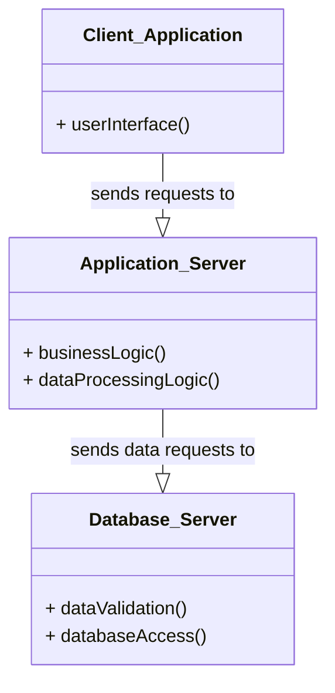

# Definition
Before proceeding, ensure you master [[Client_Server_Architecture]] and [[Two_Tier_Architecture]].
Three-Tier Architecture is an evolution of the [[Client_Server_Architecture]] that introduces an intermediary "Application Server" tier between the client and the database server. This architecture partitions the application's workload into three logical tiers: the Presentation Tier (Client), the Application Tier (Business Logic), and the Data Tier (Database Server). It was developed to address the scalability and maintenance challenges of [[Two_Tier_Architecture]], particularly for large, complex, and highly distributed business environments. Imagine a modern restaurant: the customer (Client) orders from the waiter (Application Server), who communicates with the kitchen (Database Server) to fulfill the order, allowing each role to specialize and scale independently.

# The Mental Model
Think of a large online banking system.
*   **First Tier (Client):** Your web browser or mobile app. It's "thin" – primarily responsible for the user interface and sending requests. It doesn't store business logic or directly access the database.
*   **Second Tier (Application Server):** This is a powerful server (or cluster of servers) running the core banking application. It handles all the "business logic" (e.g., calculating interest, verifying transaction rules). It receives requests from clients, processes them, and then communicates with the database.
*   **Third Tier (Database Server):** This is the dedicated database system. Its sole job is to store and retrieve data reliably, and enforce data integrity rules. It doesn't contain business logic.

This separation means the client is lightweight, business logic is centralized, and the database focuses on data.


*Note: This `classDiagram` illustrates the three distinct tiers (`Client_Application`, `Application_Server`, `Database_Server`) and their relationships.*

# Context & Framework
### How the Parts Talk to Each Other
In a [[Three_Tier_Architecture]], the client communicates with the application server, and the application server, in turn, communicates with the database server. The client (Presentation Tier) sends user requests to the Application Server (Business Logic Tier). The Application Server processes these requests, applies business rules, and then sends data-specific commands (e.g., SQL queries) to the Database Server (Data Tier). The Database Server executes these commands and returns results to the Application Server, which then formats them and sends them back to the client. This tiered communication enforces a clear separation of concerns, crucial for scalability and maintainability.

# The Mastery Deep Dive
### Opening the Hood: What's Inside?
[[Three_Tier_Architecture]] partitions the system into three distinct layers, each typically running on separate hardware for optimal performance and scalability:
1.  **First Tier: Client (Presentation Tier):**
    *   This is the user's interface, typically a web browser or a "thin client" application.
    *   Its sole responsibility is to handle the **user interface** and presentation.
    *   It contains **no business logic or direct database access**. It simply sends requests to the application server and displays the responses. This makes clients very lightweight and easy to deploy and update.
2.  **Second Tier: Application Server (Business Logic Tier):**
    *   This is the intermediary layer between the client and the database.
    *   It contains all the **business logic** and **data processing logic**. This centralizes complex operations like calculations, workflow management, and applying business rules.
    *   It receives requests from clients, processes them, and translates them into appropriate database operations. It then communicates with the database server.
3.  **Third Tier: Database Server (Data Tier):**
    *   This is the backend system running the DBMS.
    *   Its responsibilities are limited to **data validation** (enforcing database integrity constraints) and **database access** (storing, retrieving, updating data).
    *   It holds the actual database and focuses purely on efficient and reliable data management, isolated from complex business rules.

This clear separation enhances modularity, scalability, and security.

### Component Interactions
Interaction in a [[Three_Tier_Architecture]] is sequential and hierarchical. A client initiates a request, which first goes to the application server. The application server acts as a broker, executing business logic and then translating the request into database commands (if necessary) to send to the database server. The database server processes these commands and returns the results to the application server, which then formats the final response for the client. This structured flow ensures that data integrity and business rules are consistently applied at a central point, improving overall system robustness.

# Constraints & Limitations
### The Engineering Trade-off
While offering significant advantages, [[Three_Tier_Architecture]] also involves engineering trade-offs. The increased number of layers adds complexity to the system's design, development, and deployment, requiring more sophisticated infrastructure. Communication overhead between tiers can introduce latency if not carefully managed and optimized. Debugging issues can also be more challenging due to the distributed nature of the application. These factors necessitate robust monitoring, logging, and experienced development teams.

# Significance & Application
[[Three_Tier_Architecture]] is the standard for modern enterprise applications, web applications, and large-scale distributed systems. Its ability to provide superior scalability, flexibility, security, and maintainability (by allowing independent development and scaling of each tier) makes it ideal for environments with high user loads and complex business requirements. It overcomes the limitations of two-tier systems by centralizing business logic and enabling the use of thin clients, dramatically reducing client-side administration overhead.

# The Worked Example
This example shows how a user's request for an item from an e-commerce website is processed through a three-tier system.

```text
**Scenario:** A customer wants to add an item to their shopping cart on an e-commerce website.

**1. First Tier (Client - Web Browser):**
    *   Customer clicks "Add to Cart" button.
    *   Browser sends a request (e.g., `POST /addToCart?itemId=X&quantity=1`) to the Application Server.

**2. Second Tier (Application Server):**
    *   Receives the `addToCart` request.
    *   Executes business logic:
        *   Checks if `itemId` is valid.
        *   Verifies if `quantity` is in stock by querying the Database Server: `SELECT stock FROM Products WHERE ItemID = X;`
        *   Updates the customer's shopping cart in the database by sending an `INSERT` or `UPDATE` command to the Database Server.
        *   Calculates new total price.
    *   Sends a response (e.g., "Item added to cart") back to the client.

**3. Third Tier (Database Server):**
    *   Receives `SELECT` and `INSERT`/`UPDATE` queries from the Application Server.
    *   Executes these queries on the actual database tables (e.g., `Products`, `ShoppingCarts`).
    *   Ensures data integrity (e.g., no negative stock, valid item IDs).
    *   Returns results (e.g., `stock = 50`) to the Application Server.

**Outcome:** The client is lightweight, the business logic is centralized on the Application Server, and the Database Server focuses purely on data management. This allows the application server to scale independently of the database, handling many concurrent user requests efficiently.

```
*Note: This text block illustrates the flow of an e-commerce transaction through a three-tier architecture.*

# The Proving Ground
*Test your mastery. Cover the solutions below to test yourself first.*

### Level 1: The Sanity Check (Verification)
**The Component Check:** What are the three main tiers in a [[Three_Tier_Architecture]]?
> **Solution:** The three main tiers are the Client (Presentation Tier), the Application Server (Business Logic Tier), and the Database Server (Data Tier).

### Level 2: The Crucible (Mastery & Edge Cases)
**The Broken System:** In a [[Three_Tier_Architecture]], a developer mistakenly places critical business logic directly within the "Database Server" tier, bypassing the "Application Server." Explain how this subverts the benefits of the three-tier model, leading to reduced flexibility and potential performance bottlenecks.
> **Solution:** Placing critical business logic directly within the "Database Server" tier in a [[Three_Tier_Architecture]] fundamentally **subverts the benefits** of this model. It reintroduces the "fat server" problem that three-tier architecture was designed to solve. This leads to:
1.  **Reduced Flexibility:** Business logic becomes tightly coupled with the database, making it harder to change or reuse the logic without impacting the database schema or requiring complex stored procedures.
2.  **Performance Bottlenecks:** The database server becomes overloaded with both data management and complex business computations, leading to a single point of failure and hindering its ability to scale efficiently under heavy load. The Application Server, designed for this logic, is bypassed, wasting its resources.

This essentially reverts some of the advantages gained over [[Two_Tier_Architecture]], making the system less scalable and harder to maintain, as explained in `# Opening the Hood: What's Inside?` and `# Constraints & Limitations`.

# Key Takeaways
*   Three-tier architecture adds an Application Server between the client and database server.
*   Tiers: Client (UI), Application Server (business logic), Database Server (data management).
*   It improves scalability, flexibility, security, and reduces client-side administration.

# Knowledge Graph Connections
| Concept | Connection / Relationship |
| :
-------------------------- | :
------------------------------------------------------------------------------------------ |
| [[Client_Server_Architecture]] | Three-tier architecture is an advanced and more scalable form of client-server architecture. |
| [[Two_Tier_Architecture]]   | It evolved to address the scalability and maintenance limitations of two-tier systems.      |
| [[Database_Management_System]] | The database server in a three-tier architecture runs the DBMS.                            |
| [[Multi_User_DBMS_Architectures]] | It is the standard architecture for high-scale multi-user database applications.           |
---