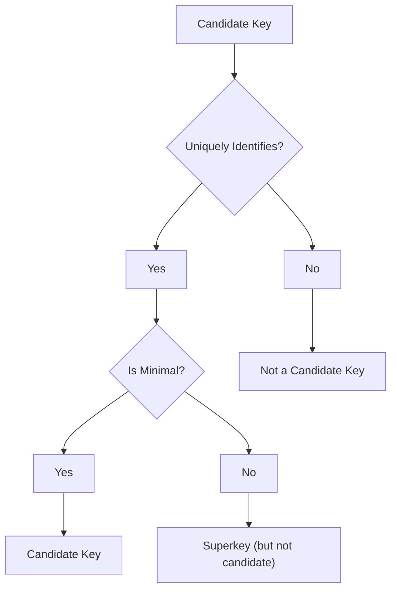

# Definition
Before proceeding, ensure you master [[Primary_Key]] and [[Composite_Key]].
A **Candidate Key** is a minimal set of [[Attributes_in_ER_Model]] that **uniquely identifies** each occurrence of an [[Entity_Types]]. "Minimal" means that if any attribute is removed from the set, the remaining attributes are no longer sufficient to guarantee uniqueness. An entity type can have one or more candidate keys. For example, for a `Student` entity, `StudentID` could be a candidate key, and `(Social_Security_Number)` could be another. Think of a candidate key as any distinct identifier that could, theoretically, be used as the primary way to refer to a specific item without confusion.

# The Mental Model
Imagine you have a class roster. Both `Student_ID` and a combination of `(First_Name, Last_Name, Date_Of_Birth)` might be unique for each student. Both of these are **Candidate Keys** because they can uniquely identify a student, and if you remove any part of them, they might lose their uniqueness (e.g., just `First_Name` isn't unique).

*Note: This `graph TD` illustrates the criteria for an attribute set to be classified as a Candidate Key, focusing on uniqueness and minimality.*

# Context & Framework
### The Family Tree
[[Candidate_Key]]s are the foundational concept within [[Keys_in_ER_Model]]. They represent all potential unique identifiers for an [[Entity_Types]]. From the pool of candidate keys, one is chosen to be the [[Primary_Key]], which then becomes the main identifier for the entity. Any candidate key that consists of more than one attribute is specifically referred to as a [[Composite_Key]]. Understanding candidate keys is crucial because it ensures that all potential avenues for unique identification are considered before a definitive primary key is selected, impacting data integrity and query efficiency.

# The Mastery Deep Dive
### Opening the Hood: What's Inside?
The two defining characteristics of a candidate key are:
*   **Uniqueness**: Each value of the candidate key must uniquely identify a single occurrence of the entity. No two instances of the entity can have the same value for that candidate key.
*   **Minimality**: No proper subset of the attributes in the candidate key can be used to uniquely identify the entity. If a candidate key has multiple attributes, removing any one of them would break the uniqueness property.
For example, for a `Car` entity:
*   `VIN` (Vehicle Identification Number) is a candidate key (unique and minimal).
*   `(License_Plate_Number, State)` is a candidate key (unique and minimal).
*   `(Model, Year)` is likely *not* unique.
*   `(VIN, Make)` is unique but *not minimal* because `VIN` alone is unique.
This rigorous definition ensures that the chosen key is both effective and efficient.

### Spot the Impostor: Clarifying that a candidate key is any minimal set of attributes that can uniquely identify an entity.
A common "impostor" scenario involves identifying a `Superkey` as a `Candidate_Key`. A superkey is any attribute or set of attributes that uniquely identifies an entity, but it doesn't necessarily have to be minimal. For example, if `StudentID` is a candidate key, then `(StudentID, FirstName)` is a superkey but *not* a candidate key because `FirstName` is not needed for uniqueness (it's not minimal). The "minimal" aspect is critical for a candidate key. Confusing these leads to inefficient database designs with redundant unique constraints.

# Constraints & Limitations
### The Devil's Advocate: Why might this be wrong?
Identifying all possible candidate keys, especially for entities with many attributes, can be a complex and sometimes subjective task, relying heavily on accurate understanding of business rules. What appears unique in one context might not be in another (e.g., `(FirstName, LastName)` might be unique in a small class but not across an entire university). The trade-off is between **exhaustive identification** (to prevent future collisions) and **practicality/overhead** (too many complex candidate keys can complicate design and maintenance). Over-analyzing every possible combination can lead to analysis paralysis.

# Significance & Application
Understanding Candidate Keys is academically significant as it introduces the concept of unique identification and lays the groundwork for selecting the most appropriate primary key. In the real world, it's a fundamental skill for **Database Designers** and **Data Architects**. It is applied during the initial data modeling phases to identify all attributes or combinations of attributes that could serve as unique identifiers for entities. This ensures that the chosen [[Primary_Key]] is indeed the best fit, leading to robust data integrity and efficient database operations.

# The Worked Example
*Test your mastery. Cover the solutions below to test yourself first.*

Consider a `Book` entity in a bookstore database. It has the following attributes: `ISBN`, `Title`, `Author`, `Publication_Year`, `Publisher`. Assume `ISBN` is unique. Assume `(Title, Author, Publication_Year)` together are also unique.

### Level 1: The Sanity Check (Verification)
**The Question:** Identify two distinct **Candidate_Key**s for the `Book` entity from the given attributes.
> **Solution:** Two distinct Candidate Keys are: `ISBN` and `(Title, Author, Publication_Year)`.

### Level 2: The Crucible (Mastery & Edge Cases)
**The Scenario:** A designer identifies `(ISBN, Title)` as a candidate key. They argue that both `ISBN` and `Title` are necessary because `Title` provides more descriptive information.
**The Challenge:**
(a) Based on the definition of a **Candidate_Key**, explain why `(ISBN, Title)` is **not** a valid candidate key in this context.
(b) What term would correctly describe `(ISBN, Title)` in this situation?
(c) Discuss the potential negative consequences of choosing `(ISBN, Title)` as a primary key, despite its uniqueness.
> **Solution:**
> (a) `(ISBN, Title)` is **not** a valid [[Candidate_Key]] in this context because it violates the **minimality** property. Since `ISBN` alone is stated to be unique, including `Title` is redundant for the purpose of unique identification. If `Title` can be removed and `ISBN` still uniquely identifies the book, then `(ISBN, Title)` is not minimal.
> (b) In this situation, `(ISBN, Title)` would correctly be described as a **Superkey** (a set of attributes that uniquely identifies an entity, but is not necessarily minimal).
> (c) Choosing `(ISBN, Title)` as a primary key, despite its uniqueness, would have potential negative consequences:
>    *   **Increased Storage Overhead:** Storing a longer, redundant key takes up more space in the table and any indexes built on it.
>    *   **Reduced Performance:** Longer keys can slightly slow down key comparisons during searches, joins, and indexing operations.
>    *   **Unnecessary Complexity:** It introduces an unnecessary attribute into the key, making the schema less elegant and potentially confusing for developers.
>    *   **Violation of Normalization Principles:** Specifically, it would violate principles aimed at reducing redundancy if `Title` is already present as a non-key attribute and not strictly needed for identification.

# Key Takeaways
*   A candidate key is a minimal set of attributes that uniquely identifies each occurrence of an entity type, guaranteeing both uniqueness and minimality.
*   An entity can have multiple candidate keys, from which one is chosen as the primary key.
*   Correctly identifying candidate keys is crucial for ensuring robust data integrity, preventing redundancy, and making informed decisions about primary key selection in database design.

# Knowledge Graph Connections
| Concept                     | Connection / Relationship                                                                   |
| :
-------------------------- | :
------------------------------------------------------------------------------------------ |
| [[Keys_in_ER_Model]]        | This is the foundational concept for any set of attributes that can uniquely identify an entity. |
| [[Primary_Key]]             | This is the chosen key, selected from the set of candidate keys, to be the main identifier. |
| [[Composite_Key]]           | If a candidate key consists of multiple attributes, it is specifically referred to as this.   |
| [[Attributes_in_ER_Model]] | Candidate keys are composed of these properties, or a subset of them.                         |
| [[Entity_Relationship_ER_Model]] | Candidate keys are essential for logical correctness and data integrity within the ER model. |
---