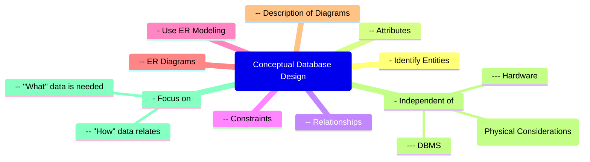

# Definition
Before proceeding, ensure you master [[Entity_Relationship_ER_Model]] and [[Structural_Constraints_in_ER_Model]].
Conceptual Database Design is the initial phase in the Database Development Life Cycle where a high-level model of the data requirements for an enterprise is constructed, entirely **independent of any physical considerations** such as the specific Database Management System (DBMS) or hardware. Its primary goal is to capture what data is needed and how different data elements relate to each other, using tools like the Entity-Relationship (ER) model. Think of it as creating an abstract blueprint of a building, focusing on rooms, their sizes, and how they connect, without worrying about the type of concrete or wiring to be used.

# The Mental Model
Imagine you're planning a trip. **Conceptual Database Design** is like sketching out the itinerary: where you want to go, who you'll travel with, and the key activities you want to do. You're not worrying about booking flights or hotels yet (those are physical details), just the overarching plan and relationships between destinations and activities. It’s about the *what*, not the *how*.

*Note: This `mindmap` visualizes Conceptual Database Design at its core, branching out into its key activities and the fundamental principles of independence and focus.*

# Context & Framework
### How the Parts Talk to Each Other
In the broader context of the Database Development Methodology, conceptual database design acts as the crucial bridge between user requirements and the technical implementation phases. It translates the often ambiguous and informal descriptions of an organization's data needs into a structured and formal representation, typically using an [[Entity_Relationship_ER_Model]]. This model then serves as the foundation for the subsequent [[Logical_Database_Design]] and [[Physical_Database_Design]] phases, ensuring that all later technical decisions are aligned with the original business requirements.

# The Mastery Deep Dive
### The "Duh!" Moment (Intuitive Proof)
The independence from physical considerations in conceptual database design is intuitively logical. Before you decide what kind of engine (DBMS) to put in a car, you first need to design the car itself – its chassis, passenger capacity, and basic functions. If you start designing the car around a specific engine too early, you might limit your design choices or make it difficult to switch engines later. Similarly, focusing solely on the data requirements and their interconnections at the conceptual stage ensures a flexible and adaptable model that can be mapped to various DBMS platforms later without significant overhaul.

### Spot the Impostor: Clarifying common misunderstandings about the boundaries and objectives of conceptual design.
A common misunderstanding is confusing conceptual design with either the requirements analysis phase or the logical design phase. While it builds upon requirements, conceptual design moves beyond raw descriptions to form a structured, model-based representation. Unlike logical design, it deliberately *avoids* specific data model constructs (like tables and columns) and, most importantly, any DBMS-specific features. Its boundary is defined by its universal, abstract nature, focusing purely on the "what" of the data, not the "how" of its storage or retrieval.

# Constraints & Limitations
### The Devil's Advocate: Why might this be wrong?
While conceptual database design's independence from physical considerations is a strength, it can also be a point of contention. Critics might argue that a purely abstract model, detached from real-world DBMS constraints, could be overly idealistic or impractical, potentially leading to designs that are difficult or inefficient to implement in a chosen system. The challenge lies in ensuring that the conceptual model, while abstract, remains grounded enough in the underlying business reality that its translation to logical and physical designs is feasible and performant.

# Significance & Application
Conceptual Database Design is academically significant as it introduces the fundamental principles of data modeling and the power of abstraction in system design. In the real world, it is a critical skill for **Database Architects**, **Business Analysts**, and **System Designers**. It is applied in virtually every industry, from designing databases for complex financial systems to simple contact management applications. A well-executed conceptual design is the bedrock of a successful database system, directly impacting data quality, system maintainability, and the ability to adapt to future business changes.

# The Worked Example
*Test your mastery. Cover the solutions below to test yourself first.*

Consider a small online book rental service. The initial requirements indicate that the system needs to keep track of `Books`, `Customers`, and `Rentals`.

### Level 1: The Sanity Check (Verification)
**The Question:** For the online book rental service, identify the primary entities that would be identified during the conceptual database design phase.
> **Solution:** The primary entities would be `Book`, `Customer`, and `Rental`.

### Level 2: The Crucible (Mastery & Edge Cases)
**The Scenario:** During the conceptual design for this book rental service, a junior designer proposes including fields like `book_table_index` and `customer_shard_id` in the ER diagram, arguing they are important for performance.
**The Challenge:**
(a) Identify which core principle of conceptual database design this proposal violates.
(b) Explain why including such fields at this stage is problematic.
(c) Describe the correct approach for handling performance-related concerns like indexing and sharding within the Database Development Life Cycle.
> **Solution:**
> (a) This proposal violates the core principle that **conceptual database design should be independent of all physical considerations**.
> (b) Including `book_table_index` and `customer_shard_id` at this stage is problematic because these are **physical implementation details** related to database performance optimization and data distribution. Introducing them prematurely binds the conceptual model to specific physical choices, limiting flexibility, potentially overcomplicating the model, and making it harder to adapt the design if the underlying DBMS or hardware changes.
> (c) The correct approach is to defer such performance-related concerns to the **physical database design phase**. At that stage, after the logical model is established for a specific DBMS, decisions about indexing, sharding, file organizations, and other physical optimizations are made to achieve efficient access to data, based on the chosen DBMS and expected usage patterns.

# Key Takeaways
*   Conceptual database design is the first phase in the DDLC, focusing on creating a high-level, DBMS-independent data model.
*   Its primary activities involve identifying entities, attributes, relationships, and constraints, often using the Entity-Relationship (ER) model.
*   The phase is strictly independent of physical considerations (like specific DBMS or hardware) to ensure a flexible and adaptable design that accurately reflects real-world data requirements.

# Knowledge Graph Connections
| Concept                     | Connection / Relationship                                                                   |
| :
-------------------------- | :
------------------------------------------------------------------------------------------ |
| [[Database_Development_Methodology]] | This is the initial, abstract phase within the overall database development process.         |
| [[Logical_Database_Design]]   | This design phase follows conceptual design, translating its abstract model into a specific data model. |
| [[Physical_Database_Design]]  | This design phase implements the database on secondary storage, based on the logical design. |
| [[Entity_Relationship_ER_Model]] | This is the primary modeling tool used to represent conceptual database designs.            |
| Requirements_Collection_And_Analysis | The preceding phase that provides the input for conceptual database design.                  |
---