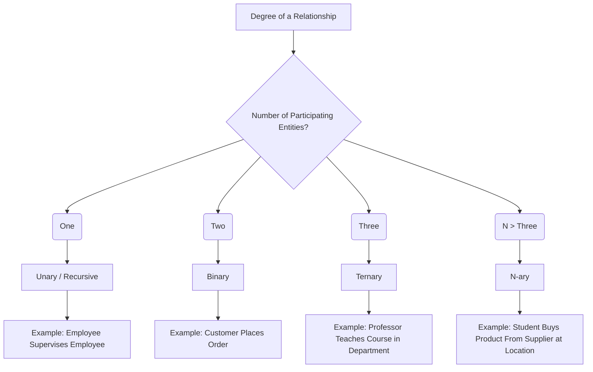

# Definition
Before proceeding, ensure you master [[Relationship_Types]] and [[Recursive_Relationship]].
The **Degree of a Relationship** refers to the number of [[Entity_Types]] that participate in a particular [[Relationship_Types]]. It is a fundamental characteristic used to classify relationships in the Entity-Relationship (ER) Model. Common degrees include:
*   **Unary (or Recursive)**: Involves one entity type.
*   **Binary**: Involves two entity types.
*   **Ternary**: Involves three entity types.
*   **N-ary**: Involves 'n' entity types.
Think of it like counting the number of "players" involved in a specific "game" (relationship). A one-player game is unary, a two-player game is binary, and so on.

# The Mental Model
Imagine you're choreographing a dance. The **Degree of a Relationship** is like counting how many distinct *types* of dancers are involved in a specific dance move. If a dancer is performing a solo (unary), two dancers are pairing up (binary), or three are forming a trio (ternary), the "degree" tells you the count of unique participant types.

*Note: This `graph TD` illustrates the classification of relationship degrees: Unary, Binary, Ternary, and N-ary, with examples for each.*

# Context & Framework
### The Family Tree
The concept of [[Degree_of_a_Relationship]] is a core classifier within the broader category of [[Relationship_Types]]. It provides a structural understanding of how many distinct [[Entity_Types]] are involved in a given association. While binary relationships are the most common, recognizing and correctly modeling unary (or [[Recursive_Relationship]]s), ternary, and n-ary relationships is crucial for accurately representing complex business interactions and avoiding design flaws in the [[Entity_Relationship_ER_Model]].

# The Mastery Deep Dive
### Opening the Hood: What's Inside?
Let's break down the common degrees:
*   **Unary Relationship**: Involves a single entity type. This entity type relates to itself. A classic example is `Employee Supervises Employee`, where both the supervisor and the supervisee are instances of the `Employee` entity type. These are also known as [[Recursive_Relationship]]s.
*   **Binary Relationship**: The most common type, involving two distinct entity types. For instance, `Student Enrolls_In Course` involves the `Student` entity type and the `Course` entity type.
*   **Ternary Relationship**: Involves three distinct entity types. An example might be `Supplier Supplies Part To Project`, where `Supplier`, `Part`, and `Project` are all involved in a single relationship. This is often used when a binary relationship between two entities is not sufficient to fully describe a dependency involving a third entity.
While less common, relationships involving four or more entity types are called **N-ary** or **Quaternary** (for four) relationships.

### The Translator: Converting English to Math
The human language description of how objects interact (e.g., "A student takes a course") needs to be translated into the formal, quantifiable language of ER modeling. The "Degree of a Relationship" is that mathematical translation:
*   "A single entity relates to itself" $\implies$ Unary (Degree 1)
*   "Two distinct entities relate to each other" $\implies$ Binary (Degree 2)
*   "Three distinct entities relate simultaneously" $\implies$ Ternary (Degree 3)
This conversion ensures unambiguous representation in the ER diagram.

# Constraints & Limitations
### The Hard Choice: Option A or Option B?
A common design dilemma involves deciding whether a complex interaction among three or more entities should be modeled as a single **ternary (or n-ary) relationship** or decomposed into multiple **binary relationships**. The trade-off is between representing the inherent simultaneity of an interaction (ternary) versus potentially simpler, more decomposable binary links. Often, a ternary relationship is appropriate only if the association among all three entities *simultaneously* has its own unique meaning or attributes that cannot be adequately captured by combining multiple binary relationships. Misusing a ternary relationship can sometimes lead to redundancy or incorrect constraints.

# Significance & Application
Understanding the Degree of a Relationship is academically significant as it provides the structural grammar for composing complex data models. In the real world, it's a crucial skill for **Database Designers** and **System Architects**. It is applied when translating complex business rules into an ER model, ensuring that the number of entities involved in an interaction is correctly represented. For instance, in an e-commerce system, understanding the degree helps model `Customer` `Orders` `Product` (binary) versus `Customer` `Registers` `Product` `At` `Store` (ternary or quaternary), ensuring the most accurate and efficient data representation.

# The Worked Example
*Test your mastery. Cover the solutions below to test yourself first.*

Consider different scenarios for a small business's database.

### Level 1: The Sanity Check (Verification)
**The Question:** What is the degree of the relationship `Employee Manages Department`?
> **Solution:** The degree of the relationship `Employee Manages Department` is **Binary** (two participating entity types: `Employee` and `Department`).

### Level 2: The Crucible (Mastery & Edge Cases)
**The Scenario:** A business tracks `Students` who `Register_For` `Courses`. The registration process also involves a `Semester`. A designer models this as two binary relationships: `Student Registers_For Course` and `Course Offered_In Semester`.
**The Challenge:**
(a) Explain why combining these two binary relationships might not fully capture the business rule if a specific student's registration for a specific course is only valid for a specific semester.
(b) How would this scenario be more accurately modeled using a single relationship type, and what would be its degree?
(c) Describe a limitation of using a binary decomposition if a specific attribute, like `Final_Grade`, is tied to the `Student`'s performance in a `Course` during a particular `Semester`.
> **Solution:**
> (a) Combining these two binary relationships (`Student Registers_For Course` and `Course Offered_In Semester`) might not fully capture the business rule because it doesn't explicitly state that a student's registration for a course is *bound to a specific semester*. It would allow a student to register for a course, and that course to be offered in a semester, but wouldn't guarantee that *that specific student's registration* is for `Course A` in `Semester X`. You could have a `Student` registered for `Course A` and `Course A` offered in `Semester X`, but the model wouldn't confirm that *this student's registration* is for `Course A` in `Semester X`.
> (b) This scenario would be more accurately modeled using a **Ternary relationship** (degree 3) called `Registers` among `Student`, `Course`, and `Semester`. This explicitly represents the simultaneous association of a student taking a particular course in a given semester.
> (c) A limitation of using a binary decomposition is that an attribute like `Final_Grade` is intrinsically tied to the *combination* of `Student`, `Course`, and `Semester`. If only binary relationships are used, placing `Final_Grade` would be ambiguous. Attaching it to `Student Registers_For Course` would imply a student has one grade per course across all semesters, which is incorrect. Attaching it to `Course Offered_In Semester` would be even more ambiguous as it doesn't involve the `Student`. The ternary relationship `Registers` naturally accommodates `Final_Grade` as an attribute of the combined association.

# Key Takeaways
*   The degree of a relationship specifies the number of participating entity types in an association (unary, binary, ternary, n-ary).
*   Unary relationships involve a single entity type relating to itself (recursive), while binary involves two, and ternary involves three.
*   Correctly identifying the degree is crucial for accurately translating complex business rules into the structural representation of an ER model, ensuring semantic integrity.

# Knowledge Graph Connections
| Concept                     | Connection / Relationship                                                                   |
| :
-------------------------- | :
------------------------------------------------------------------------------------------ |
| [[Relationship_Types]]      | This is a key characteristic used to classify and understand various types of relationships.  |
| [[Entity_Types]]            | The degree is determined by counting the number of these participating in the relationship. |
| [[Recursive_Relationship]]  | This is a specific type of relationship that has a unary degree.                              |
| [[Structural_Constraints_in_ER_Model]] | The degree of a relationship influences how structural constraints like multiplicity are applied. |
| [[Entity_Relationship_ER_Model]] | The degree is a fundamental aspect of representing associations within the ER model.          |
---