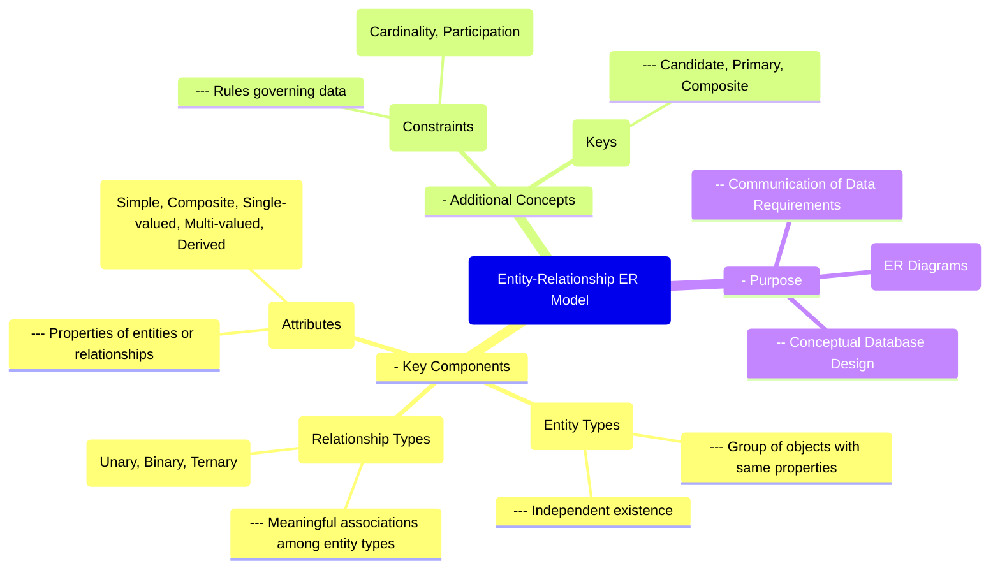

# Definition
Before proceeding, ensure you master [[Entity_Types]] and [[Relationship_Types]].
The Entity-Relationship (ER) Model is a high-level conceptual data model that describes the structure of a database in terms of entities, attributes, and relationships. It provides a graphical representation of the logical structure of a database using an ER Diagram (ERD), which serves as a blueprint for database design. The ER model helps in understanding and communicating the data requirements of an organization by illustrating how different pieces of information (entities) are categorized, what properties they possess (attributes), and how they are interconnected (relationships). Think of it as drawing a family tree, where each person is an entity, their characteristics (like age or profession) are attributes, and the lines connecting them represent relationships (like 'parent of' or 'married to').

# The Mental Model
Imagine you're an archaeologist creating a map of an ancient city. The **Entity-Relationship (ER) Model** is your system for drawing this map. Each type of building (temple, house, market) is an **Entity**. The unique features of each building (size, purpose, owner) are its **Attributes**. The roads and pathways connecting these buildings, or the relationships between different social classes, are your **Relationships**. This map helps you understand the entire structure and how everything fits together.

*Note: This `mindmap` visually centers the Entity-Relationship Model, branching out to its key components (Entity Types, Relationship Types, Attributes) and additional concepts like Constraints and Keys, along with its overall purpose.*

# Context & Framework
### Where Does it Live? (The Map)
The Entity-Relationship Model resides firmly within the [[Conceptual_Database_Design]] phase of the Database Development Life Cycle. It is the primary tool used to capture and represent an organization's data requirements at a high level, independent of any specific DBMS or physical implementation details. Its output, the ER Diagram, serves as the critical input for the subsequent [[Logical_Database_Design]] phase, where the conceptual model is translated into a specific data model (e.g., relational model) ready for implementation.

# The Mastery Deep Dive
### Opening the Hood: What's Inside?
The ER model is primarily composed of three core building blocks:
*   **Entities**: These are the "nouns" of the database, representing real-world objects or concepts that have independent existence and are identifiable, such as `Student`, `Course`, or `Department`. They are typically represented as rectangles in an ER Diagram.
*   **Attributes**: These are the "adjectives" or properties that describe an entity or a relationship. For example, a `Student` entity might have attributes like `StudentID`, `StudentName`, and `DateOfBirth`. Attributes are often represented as ovals connected to entities.
*   **Relationships**: These are the "verbs" or associations between two or more entities. For instance, a `Student` `enrolls in` a `Course`. Relationships are typically represented as diamonds connecting entities.
These components work together to provide a comprehensive, structured view of the data landscape.

### The Translator: From "Lego" to "Jargon"
The ER model provides an intuitive, graphical "Lego-like" way to build a database concept, which is then formally translated into academic jargon. For example:
*   An "object of interest" (Lego) becomes an `Entity` (Jargon).
*   "Characteristics of an object" (Lego) become `Attributes` (Jargon).
*   "How objects are connected" (Lego) becomes `Relationships` (Jargon).
*   "Rules for connections" (Lego) becomes `Structural Constraints` like `Multiplicity` (Jargon).
This translation is crucial for moving from an understandable, high-level design to a precise, formal specification required for database implementation.

# Constraints & Limitations
### The Hard Choice: Option A or Option B?
While powerful, the ER Model has limitations, particularly when dealing with complex data types or intricate business rules that don't easily map to simple entity-relationship constructs. For instance, modeling hierarchies with multiple inheritance or time-varying data can become cumbersome. A key trade-off might be between maintaining a purely conceptual model (which can become overly complex for certain scenarios) versus introducing some pragmatic [[Logical_Database_Design]] considerations earlier to simplify the ER diagram. Designers must choose a balance, potentially supplementing ERDs with other modeling techniques for specific complexities.

# Significance & Application
The Entity-Relationship Model is academically significant as it forms the bedrock of conceptual data modeling, providing a universal language for database design. In the real world, it is an essential tool for **Database Architects**, **Data Analysts**, and **Business Process Modelers**. It is widely used in **system analysis and design**, helping to visualize and document data requirements for applications ranging from inventory management to social networks. By providing a clear and unambiguous representation of data, the ER model facilitates communication between technical developers and non-technical stakeholders, ensuring that the database accurately reflects business needs.

# The Worked Example
*Test your mastery. Cover the solutions below to test yourself first.*

Consider a simplified online university system that needs to track `Students`, `Courses`, and the act of `Enrollment`.

### Level 1: The Sanity Check (Verification)
**The Question:** For the university system, identify which of the following would be represented as an **entity** in an ER Model: `Student_ID`, `Student_Name`, `Takes_Course`, `Course_Code`, `Professor`.
> **Solution:** `Professor` would be represented as an entity. `Student_ID`, `Student_Name`, and `Course_Code` are attributes. `Takes_Course` is a relationship.

### Level 2: The Crucible (Mastery & Edge Cases)
**The Scenario:** A designer creates an ER diagram for this university system. Instead of creating a `Course` entity and an `Enrollment` relationship between `Student` and `Course`, they create a `Course_Enrollment` entity that has attributes for `Course_Code` and `Student_ID`, directly linking it to `Student`.
**The Challenge:**
(a) Identify a conceptual modeling principle that this design might implicitly violate or complicate.
(b) Explain why `Course_Enrollment` might be better represented as a **relationship type** rather than a pure entity in this simple scenario.
(c) Describe a scenario where `Course_Enrollment` *would* legitimately be treated as an entity in an ER diagram.
> **Solution:**
> (a) This design implicitly complicates the principle of **representing relationships as first-class citizens** and might lead to an overly entity-centric view, potentially blurring the distinction between entities and the associations between them. It might also complicate the identification of unique courses if `Course_Code` is only an attribute of `Course_Enrollment`.
> (b) `Course_Enrollment` might be better represented as a **relationship type** because it intrinsically describes an association or action (`enrolls in`) between two distinct entities (`Student` and `Course`). Its existence is dependent on both a student and a course, making it a natural fit for a relationship type.
> (c) `Course_Enrollment` *would* legitimately be treated as an **entity** if it possessed its own **independent attributes** beyond just the keys of the participating entities, or if it participated in further relationships. For example, if `Course_Enrollment` had attributes like `Enrollment_Date`, `Grade`, `Status` (e.g., 'Completed', 'Dropped'), or if an `Enrollment` could have an associated `Payment` entity, then it gains enough independent significance to be modeled as an entity itself (often called an associative entity or composite entity).

# Key Takeaways
*   The Entity-Relationship (ER) Model is a high-level conceptual data model using entities, attributes, and relationships to describe database structure.
*   ER Diagrams (ERDs) provide a graphical blueprint for database design, facilitating understanding and communication of data requirements.
*   It serves as the foundation for the conceptual database design phase, translating real-world concepts into a structured model before physical implementation.

# Knowledge Graph Connections
| Concept                     | Connection / Relationship                                                                   |
| :
-------------------------- | :
------------------------------------------------------------------------------------------ |
| [[Conceptual_Database_Design]] | This is the primary modeling tool utilized during the initial phase of database design.      |
| [[Entity_Types]]            | A fundamental building block of the ER model, representing real-world objects or concepts.    |
| [[Relationship_Types]]      | A fundamental building block of the ER model, describing associations between entities.       |
| [[Attributes_in_ER_Model]]  | A fundamental building block of the ER model, representing properties of entities or relationships. |
| [[Structural_Constraints_in_ER_Model]] | These define the rules governing relationships within the ER model, often visually represented. |
---