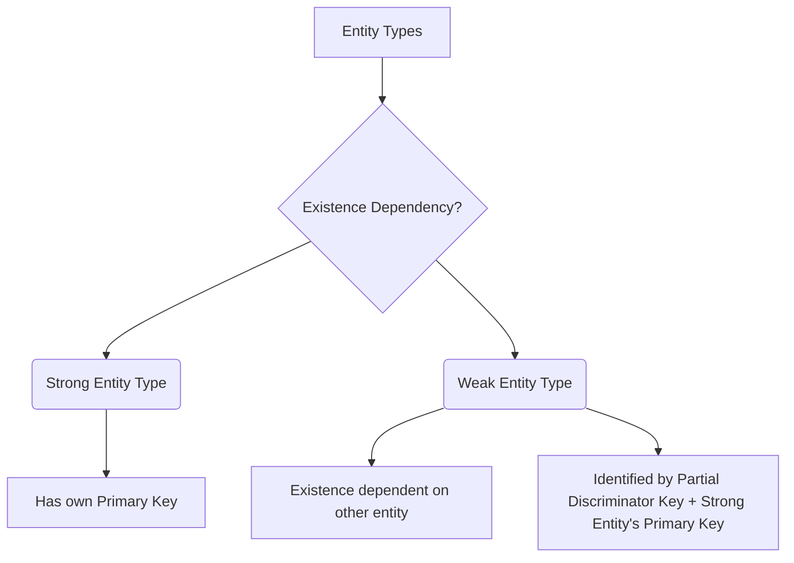

# Definition
Before proceeding, ensure you master [[Strong_Entity_Type]] and [[Weak_Entity_Type]].
In the Entity-Relationship (ER) Model, an **Entity Type** is a classification or a template for a group of objects that share the same properties and are identified by an enterprise as having an independent existence. It represents a concept or object in the real world that is distinguishable from other objects. An **Entity Occurrence** (or instance) is a uniquely identifiable object of an entity type. For example, `Student` is an entity type, while "John Doe, ID 12345" is an entity occurrence of the `Student` entity type. Think of an `Entity Type` as the blueprint for a car (e.g., "Sedan"), and an `Entity Occurrence` as a specific car produced from that blueprint (e.g., "My 2023 Honda Civic, VIN XYZ").

# The Mental Model
Imagine you're sorting toys into different bins. Each bin represents an **Entity Type** (e.g., "Action Figures," "Building Blocks," "Stuffed Animals"). Every individual toy you put into a bin is an **Entity Occurrence** (e.g., your specific "Captain America" action figure goes into the "Action Figures" bin). The bins define the common characteristics, and the individual toys are the actual items.

*Note: This `graph TD` illustrates the classification of Entity Types into Strong and Weak based on their existence dependency and key characteristics.*

# Context & Framework
### The Family Tree
Within the [[Entity_Relationship_ER_Model]], entity types form the core "nodes" of the data structure. They are fundamental for categorizing and organizing information. The primary distinction among entity types is based on their **existence dependency**, leading to the classification of [[Strong_Entity_Type]]s and [[Weak_Entity_Type]]s. Strong entities can exist independently, possessing their own unique identifiers, while weak entities rely on another entity for their existence and part of their identification, creating a hierarchical relationship in the overall data model.

# The Mastery Deep Dive
### Opening the Hood: What's Inside?
At a high level, entity types can be broadly categorized by their independence:
*   **Strong Entity Types**: These are robust and self-sufficient. They can exist without being dependent on another entity type for their identification. Think of a `Customer` or a `Product`. Each customer or product has its own unique identifier (a primary key) that doesn't rely on any other entity.
*   **Weak Entity Types**: These are fragile and dependent. They cannot exist meaningfully on their own and require a relationship with another (strong) entity type for their full identification. An example might be `Dependent` (of an employee) or `Room` (within a building). A dependent's identity might rely on the employee they're associated with, and a room's number is only unique within a specific building.
Understanding this distinction is crucial for correctly modeling relationships and keys within the ER diagram.

### The Translator: From "Lego" to "Jargon"
The simple idea of "things we want to track" (Lego) gets formalized into `Entity Types` (Jargon). When we differentiate between "things that can exist on their own" and "things that need something else to exist" (Lego), we are translating that into `Strong Entity Type` and `Weak Entity Type` (Jargon) respectively. This formal language ensures precision and consistency in database design.

# Constraints & Limitations
### The Hard Choice: Option A or Option B?
Deciding whether a concept should be modeled as an attribute or an entity can be a subtle but critical design choice. For instance, is `Phone_Number` an attribute of a `Person` entity, or should `Phone_Number` be its own entity related to `Person`? The trade-off lies in **granularity and future flexibility**. Treating it as an attribute is simpler but limits future expansion (e.g., if a phone number needs its own type or multiple owners). Treating it as an entity is more complex upfront but allows for greater flexibility (e.g., recording phone type, service provider, or multiple numbers per person). The decision depends on how much detail and independence the "thing" requires in the system.

# Significance & Application
Understanding Entity Types is academically significant as it's the first step in abstracting real-world concepts into a structured data model. In the real world, it's a fundamental skill for **Data Modelers** and **System Analysts**. It is applied in designing any database, from small business inventory systems to large-scale enterprise resource planning (ERP) systems. Correctly identifying entity types ensures that the database captures all essential information and that the schema is logically sound, laying a robust foundation for all subsequent database operations.

# The Worked Example
*Test your mastery. Cover the solutions below to test yourself first.*

Consider a simplified online ordering system where customers can place orders, and each order can have multiple items.

### Level 1: The Sanity Check (Verification)
**The Question:** For this online ordering system, identify two distinct entity types.
> **Solution:** Two distinct entity types are `Customer` and `Order`. (Another could be `Product` or `Order_Item`).

### Level 2: The Crucible (Mastery & Edge Cases)
**The Scenario:** A designer models `Order_Item` (representing a specific product within an order, e.g., "3 apples in Order #123") as an entity type. They include `Quantity` and `UnitPrice` as attributes. However, they struggle to define a unique primary key for `Order_Item` without referencing the `Order` it belongs to and the `Product` it represents.
**The Challenge:**
(a) Based on the struggle to define a primary key, what specific type of entity is `Order_Item` most likely to be in this context?
(b) Explain why `Order_Item` cannot have an independent primary key in this scenario.
(c) Describe how the primary key of `Order_Item` would typically be composed, involving its related entities.
> **Solution:**
> (a) Based on the struggle to define an independent primary key and its inherent dependency, `Order_Item` is most likely a [[Weak_Entity_Type]].
> (b) `Order_Item` cannot have an independent primary key because its existence and identity are **existence-dependent** on both an `Order` and a `Product`. A specific `Order_Item` (e.g., "3 apples") only makes sense in the context of a particular `Order` (e.g., Order #123) and a specific `Product` (e.g., 'Apple'). Without this context, `Quantity` and `UnitPrice` alone cannot uniquely identify it globally.
> (c) The primary key of `Order_Item` would typically be composed of a **combination of the primary key of the `Order` entity (e.g., `OrderID`), the primary key of the `Product` entity (e.g., `ProductID`), and potentially a partial discriminator key from `Order_Item` itself (e.g., `LineItemNumber`)** if multiple distinct `Order_Item`s could exist for the same `Product` within the same `Order`. This composite key ensures unique identification within the context of its owning entities.

# Key Takeaways
*   An Entity Type is a classification for objects sharing properties, possessing independent existence, while an Entity Occurrence is a unique instance of that type.
*   Entity types are categorized into Strong (independent, with own primary key) and Weak (existence-dependent, identified via relationship with strong entity).
*   Correctly identifying and classifying entity types is foundational for accurate data modeling and ensuring the logical integrity of a database design.

# Knowledge Graph Connections
| Concept                     | Connection / Relationship                                                                   |
| :
-------------------------- | :
------------------------------------------------------------------------------------------ |
| [[Entity_Relationship_ER_Model]] | This is a fundamental component of the ER model, representing real-world objects or concepts. |
| [[Strong_Entity_Type]]      | This is a sub-classification of entity types, characterized by independent existence.           |
| [[Weak_Entity_Type]]        | This is a sub-classification of entity types, characterized by existence dependence on another entity. |
| [[Attributes_in_ER_Model]]  | These are properties that describe an entity type.                                            |
| [[Keys_in_ER_Model]]        | These are used to uniquely identify occurrences of an entity type.                            |
---