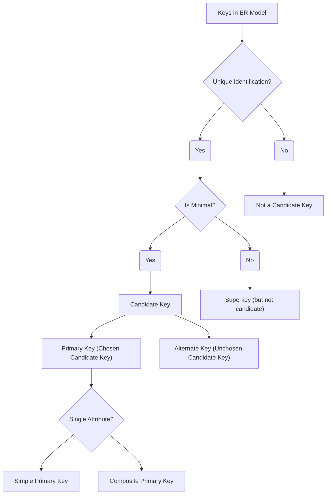

# Definition
Before proceeding, ensure you master [[Candidate_Key]] and [[Primary_Key]].
In the Entity-Relationship (ER) Model, **Keys** are a special type of [[Attributes_in_ER_Model]] (or a set of attributes) that uniquely identify each occurrence of an [[Entity_Types]]. They are crucial for maintaining data integrity, establishing relationships between entities, and ensuring efficient data retrieval. The three main types of keys in ER modeling are [[Candidate_Key]]s, [[Primary_Key]]s, and [[Composite_Key]]s. Think of keys as unique identifiers, like a fingerprint or a social security number, that allow you to distinguish one individual (entity occurrence) from all others.

# The Mental Model
Imagine a large filing cabinet filled with folders. The **Keys** are the unique labels on each folder that allow you to quickly find exactly the right one, without confusing it with any other. They are your system for organization and retrieval.

*Note: This `graph TD` illustrates the classification of Keys in the ER Model, starting from Candidate Keys and branching into Primary and Composite Keys based on their role and composition.*

# Context & Framework
### The Family Tree
[[Keys_in_ER_Model]] are a specialized subset of [[Attributes_in_ER_Model]] that serve a critical role in [[Entity_Relationship_ER_Model]] by providing unique identification for [[Entity_Types]]. They are foundational for establishing integrity constraints and are indispensable during the translation to [[Logical_Database_Design]]. The hierarchy begins with [[Candidate_Key]]s, which are all possible minimal sets of attributes that can uniquely identify an entity. From these, one is selected as the [[Primary_Key]], and if this primary key consists of multiple attributes, it is known as a [[Composite_Key]].

# The Mastery Deep Dive
### Opening the Hood: What's Inside?
The concept of keys revolves around ensuring that every record in a database can be uniquely identified.
*   **Candidate Key**: This is any attribute (or combination of attributes) that can uniquely identify a tuple (record) in a relation (table) and is minimal (no subset of the attributes can uniquely identify the tuple). For a `Student` entity, `StudentID` might be a candidate key, and `(FirstName, LastName, DateOfBirth)` might also be a candidate key if no two students have the exact same name and birthdate.
*   **Primary Key**: From the set of candidate keys, one is chosen by the database designer to be the primary key. This is the main identifier for the entity and is often used to establish relationships with other entities. It must be unique and non-null.
*   **Composite Key**: If a candidate key (and thus potentially the primary key) consists of two or more attributes, it is called a composite key. For example, `(Course_Number, Semester_Year)` might be a composite primary key for a `Course_Offering` entity.
These distinctions are vital for precision in database design.

### The Translator: Converting English to Math
The informal idea of "a unique tag for each item" (English) is translated into `Keys` (Exam Term). When we talk about "any combination of tags that uniquely identifies an item, without any extra tags" (English), that's a `Candidate_Key` (Exam Term). The "chosen best tag" becomes the `Primary_Key` (Exam Term). If this "chosen tag" is actually "multiple tags together" (English), it's a `Composite_Key` (Exam Term). This rigorous terminology ensures unambiguous identification.

# Constraints & Limitations
### The Devil's Advocate: Why might this be wrong?
Choosing the "best" primary key, especially when multiple [[Candidate_Key]]s exist, can be subjective and sometimes problematic, relying heavily on accurate understanding of business rules. For example, a `Social_Security_Number` might seem like a good primary key for a `Person` entity due to its uniqueness. However, it raises privacy concerns, might not be universally available (e.g., for foreign nationals), and can be cumbersome to use. Using a system-generated, auto-incrementing `Person_ID` as a primary key is often preferred, but then `Social_Security_Number` must still be maintained as a unique (alternate) key. The trade-off is between **natural identifiers** (which often carry semantic meaning but can be problematic) and **surrogate keys** (which are simple and stable but lack inherent meaning).

# Significance & Application
Understanding Keys is academically significant as it introduces the foundational concepts of unique identification and data integrity in database systems. In the real world, it's an indispensable skill for **Database Designers**, **Developers**, and **Data Architects**. It is applied in every database system to:
*   **Uniquely identify records**: Ensuring that each entity occurrence can be distinguished.
*   **Establish relationships**: Foreign keys (which reference primary keys) link tables together.
*   **Enforce data integrity**: Ensuring that no two records have the same primary key value.
*   **Optimize performance**: Indexes are often built on keys to speed up data retrieval.
Correctly defining keys is fundamental for building robust, reliable, and efficient database systems.

# The Worked Example
*Test your mastery. Cover the solutions below to test yourself first.*

Consider a university database for managing `Courses`. Each course has a `Course_Code` (e.g., "CS1241"), a `Course_Title` (e.g., "Database Systems"), and is `Offered_In_Semester` (e.g., "Fall 2025"). Assume `Course_Code` is globally unique.

### Level 1: The Sanity Check (Verification)
**The Question:** For the `Course` entity, which attribute would be the most suitable **Primary_Key**?
> **Solution:** `Course_Code` would be the most suitable **Primary_Key**.

### Level 2: The Crucible (Mastery & Edge Cases)
**The Scenario:** A designer is considering two candidate keys for a `Student` entity: `StudentID` (a system-generated unique number) and `(FirstName, LastName, DateOfBirth)` (assuming this combination is unique). They choose `StudentID` as the primary key.
**The Challenge:**
(a) Explain why `(FirstName, LastName, DateOfBirth)` is still considered a **Candidate_Key** even if it's not chosen as the primary key.
(b) What term is used for a candidate key that is not selected as the primary key?
(c) Discuss a potential benefit of having `(FirstName, LastName, DateOfBirth)` as an unchosen candidate key, particularly for querying purposes.
> **Solution:**
> (a) `(FirstName, LastName, DateOfBirth)` is still considered a [[Candidate_Key]] because it is a minimal set of attributes that can uniquely identify each occurrence of the `Student` entity, even though another candidate key (`StudentID`) was chosen as the primary key. Its uniqueness property remains valid.
> (b) A candidate key that is not selected as the primary key is often referred to as an **Alternate Key** (or secondary key).
> (c) A potential benefit of having `(FirstName, LastName, DateOfBirth)` as an unchosen candidate key is that it can still be used to **efficiently query or identify students based on these natural attributes**, even if `StudentID` is the primary identifier. For instance, a user might remember a student's name and birthdate but not their ID. Having this as a unique key (often with an index) can speed up searches based on these natural identifiers without having to scan the entire table.

# Key Takeaways
*   Keys in the ER Model are special attributes (or sets of attributes) that uniquely identify each entity occurrence, ensuring data integrity.
*   Candidate keys are minimal sets of attributes that can uniquely identify an entity, from which one is chosen as the primary key.
*   A composite key consists of two or more attributes that together form a candidate or primary key, crucial for identifying entities with multiple determining properties.

# Knowledge Graph Connections
| Concept                     | Connection / Relationship                                                                   |
| :
-------------------------- | :
------------------------------------------------------------------------------------------ |
| [[Attributes_in_ER_Model]] | Keys are a specific type of attribute (or combination of attributes) that serve a unique identification role. |
| [[Entity_Types]]            | Keys are used to uniquely identify individual occurrences within these classifications.        |
| [[Candidate_Key]]           | This is the foundational concept for any set of attributes that can uniquely identify an entity. |
| [[Primary_Key]]             | This is the chosen, definitive unique identifier for an entity, selected from its candidate keys. |
| [[Composite_Key]]           | This specifies that a primary or candidate key is composed of multiple attributes.           |
| [[Entity_Relationship_ER_Model]] | Keys are essential for the structural integrity and relational modeling within the ER model.  |
---