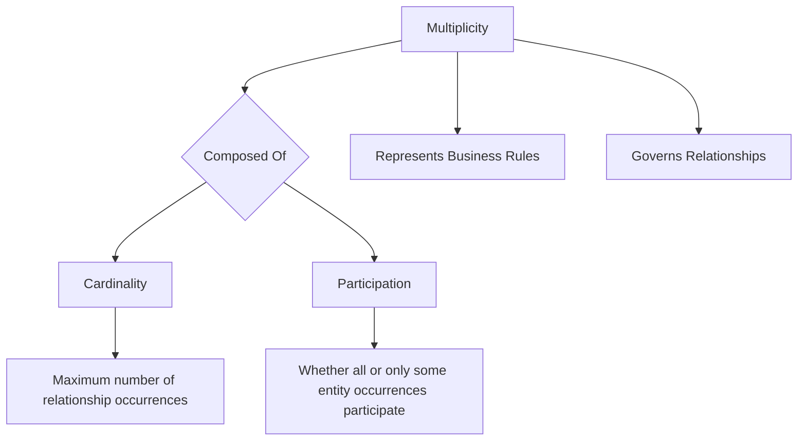

# Definition
Before proceeding, ensure you master [[Cardinality_in_ER_Model]] and [[Participation_in_ER_Model]].
**Multiplicity** in the Entity-Relationship (ER) Model is a [[Structural_Constraints_in_ER_Model]] that specifies the **number (or range)** of possible occurrences of an [[Entity_Types]] that may relate to a single occurrence of an associated entity type through a particular [[Relationship_Types]]. It essentially describes the "how many" aspect of a relationship and directly represents the **business rules** governing those connections. Multiplicity is composed of two fundamental types of restrictions: [[Cardinality_in_ER_Model]] (the maximum number of relationships) and [[Participation_in_ER_Model]] (whether participation is mandatory or optional). Think of it as the numerical limit and requirement for engagement in any interaction between two groups.

# The Mental Model
Imagine a rule at a concert venue: "Each ticket holder (Entity A) can bring exactly one guest (Entity B)." Here, **Multiplicity** defines that `1` ticket holder relates to `1` guest. If the rule was "Each performer (Entity A) can have many fans (Entity B)," then `1` performer relates to `*` (many) fans.

*Note: This `graph TD` illustrates the composition of Multiplicity into Cardinality and Participation, highlighting its role in representing business rules within relationships.*

# Context & Framework
### The Family Tree
[[Multiplicity_in_ER_Model]] is the overarching concept within [[Structural_Constraints_in_ER_Model]] that quantifies relationship limits. It provides a detailed specification of how [[Entity_Types]] interact through [[Relationship_Types]]. This fundamental concept is further delineated into two critical components: [[Cardinality_in_ER_Model]], which defines the *maximum* number of related occurrences, and [[Participation_in_ER_Model]], which specifies whether an entity's involvement in a relationship is *mandatory* or *optional*. Understanding multiplicity is paramount for accurately translating complex business rules into a precise and unambiguous [[Entity_Relationship_ER_Model]].

# The Mastery Deep Dive
### Opening the Hood: What's Inside?
Multiplicity is often expressed using notations like `(min..max)`, where `min` is the minimum number of relationship occurrences and `max` is the maximum.
*   `1..1`: Exactly one (e.g., a `Department` `Is_Managed_By` `1..1` `Employee`).
*   `0..1`: Zero or one (optional, e.g., a `Manager` `Manages` `0..1` `Department`).
*   `1..*`: One or many (mandatory, e.g., an `Employee` `Works_For` `1..*` `Projects`).
*   `0..*`: Zero or many (optional, e.g., a `Customer` `Places` `0..*` `Orders`).
These notations combine both cardinality (the 'max' part) and participation (the 'min' part) into a single, comprehensive statement about the relationship's quantitative constraints. This precision is essential for preventing invalid data from being stored in the database.

### The Translator: Hacker Slang to Exam Terms
When a business describes a rule as "each student *can* take *many* courses, but *must* take *at least one*" (Hacker Slang), this directly translates to a multiplicity constraint. For the `Student` entity participating in the `Enrolls_In` relationship with `Course`, the constraint from `Student` to `Course` would be `1..*` (Exam Term). From `Course` to `Student`, it would typically be `0..*` or `1..*` depending on whether a course must have students. This translation captures the precise numerical requirements of the business rule.

# Constraints & Limitations
### The Devil's Advocate: Why might this be wrong?
Sometimes, business rules are interpreted too rigidly when defining multiplicity, leading to an inflexible database design. For example, if a rule states "a product must belong to exactly one category," this would be modeled as `1..1` from `Product` to `Category`. However, if the business later decides a product can belong to *multiple* categories, the `1..1` constraint would require a schema change, potentially incurring significant rework. The trade-off is between **strict enforcement of current business rules** (precise multiplicity) and **future adaptability** (looser constraints or more flexible modeling patterns if ambiguity is anticipated). A designer needs to foresee potential changes and design for appropriate flexibility.

# Significance & Application
Understanding Multiplicity is academically significant as it provides the quantitative foundation for defining precise relationship semantics in the ER Model. In the real world, it's an indispensable skill for **Database Designers**, **Business Analysts**, and **System Architects**. It is applied whenever entities interact in a database, ensuring that the number of related occurrences aligns with business logic. For instance:
*   `Customer` `Places` `1..*` `Orders` (a customer must place at least one order).
*   `Employee` `Manages` `0..1` `Department` (an employee may or may not manage a department).
*   `Doctor` `Treats` `1..*` `Patient` (a doctor treats one or more patients).
Correctly specifying multiplicity is critical for enforcing data integrity, validating relationships, and building a database that accurately models the complexities of an organization's operations.

# The Worked Example
*Test your mastery. Cover the solutions below to test yourself first.*

Consider a simplified database for a company that tracks `Employees` and `Projects`.

### Level 1: The Sanity Check (Verification)
**The Question:** For the relationship `Employee Works_On Project`, if an employee can work on many projects, and a project can have many employees, what is the multiplicity for this relationship?
> **Solution:** The multiplicity for this relationship is **Many-to-Many (*:*)** (or `0..*` to `0..*` if optional, or `1..*` to `1..*` if mandatory).

### Level 2: The Crucible (Mastery & Edge Cases)
**The Scenario:** A designer models the `Department` `Manages` `Employee` relationship with a multiplicity of `(1..1)` from `Department` to `Employee`. This means each department must be managed by exactly one employee. However, the business rule states that an employee can *optionally* manage a department, and a department *must* be managed by exactly one employee.
**The Challenge:**
(a) Explain why the multiplicity `(1..1)` from `Department` to `Employee` correctly captures the department's side of the business rule.
(b) Identify the correct multiplicity for the `Employee` entity in the `Manages` relationship (from `Employee` to `Department`), considering an employee can *optionally* manage a department.
(c) Discuss a potential issue that could arise if an employee's participation in managing a department was incorrectly set as mandatory (`1..1`) when it should be optional.
> **Solution:**
> (a) The multiplicity `(1..1)` from `Department` to `Employee` correctly captures the department's side of the business rule because it signifies that for every `Department` occurrence, there *must be at least one* (`min=1`) and *at most one* (`max=1`) `Employee` managing it. This perfectly matches "each department must be managed by exactly one employee."
> (b) The correct multiplicity for the `Employee` entity in the `Manages` relationship (from `Employee` to `Department`) would be `(0..1)`. This means an `Employee` occurrence may participate in managing zero (`min=0`) or one (`max=1`) `Department`.
> (c) If an employee's participation in managing a department was incorrectly set as mandatory (`1..1`) when it should be optional, a potential issue is that **you would not be able to store any employee in the database who does *not* currently manage a department**. This would lead to data entry errors, force the creation of dummy departments or employees, or simply make the database unable to accurately represent the real-world scenario where many employees are not managers. It violates data integrity and flexibility.

# Key Takeaways
*   Multiplicity in the ER Model defines the number or range of possible related entity occurrences in a relationship, directly representing business rules.
*   It combines cardinality (maximum count) and participation (mandatory/optional involvement) into a single constraint, often expressed as `(min..max)`.
*   Precisely defining multiplicity is essential for enforcing data integrity, ensuring that relationships accurately reflect real-world constraints, and preventing the storage of inconsistent data.

# Knowledge Graph Connections
| Concept                     | Connection / Relationship                                                                   |
| :
-------------------------- | :
------------------------------------------------------------------------------------------ |
| [[Structural_Constraints_in_ER_Model]] | This is the primary type of structural constraint that quantifies relationship limits.    |
| [[Cardinality_in_ER_Model]] | This is a component of multiplicity, specifying the maximum number of relationship occurrences. |
| [[Participation_in_ER_Model]] | This is a component of multiplicity, determining whether entity involvement is mandatory or optional. |
| [[Entity_Relationship_ER_Model]] | Multiplicity is a core concept for representing business rules and quantitative aspects of relationships within the ER model. |
| [[Relationship_Types]]      | Multiplicity explicitly governs how entity occurrences interact through these associations.    |
| [[Entity_Types]]            | Multiplicity specifies the numerical limits for how these classifications relate to each other. |
---