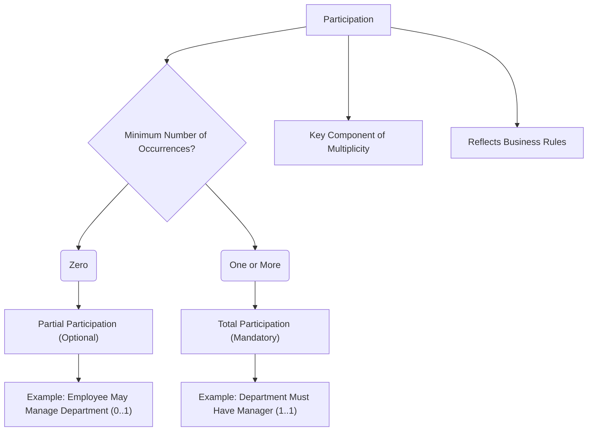

# Definition
Before proceeding, ensure you master [[Multiplicity_in_ER_Model]] and [[Cardinality_in_ER_Model]].
**Participation** in the Entity-Relationship (ER) Model determines whether **all or only some** occurrences of an [[Entity_Types]] must (or may) participate in a particular [[Relationship_Types]]. It represents the "lower limit" of how many times an entity instance *must* be associated with instances of another entity type. Participation is a key component of [[Multiplicity_in_ER_Model]], which specifies the full range of involvement. The two types of participation are **total (mandatory)** and **partial (optional)**. Think of it like a rule for a sports team: "Every player *must* play at least one game" (total participation), or "Players *may* attend practice" (partial participation).

# The Mental Model
Imagine a school play casting call. If "Every student *must* audition," that's **Total Participation**. If "Students *may* audition," that's **Partial Participation**. It defines the minimum requirement for an entity to be involved in a relationship.

*Note: This `graph TD` illustrates the two types of Participation (Partial and Total) based on the minimum number of relationship occurrences, with examples.*

# Context & Framework
### The Family Tree
[[Participation_in_ER_Model]] is a critical component of [[Multiplicity_in_ER_Model]], which falls under the broader category of [[Structural_Constraints_in_ER_Model]]. It works hand-in-hand with [[Cardinality_in_ER_Model]] to provide a complete quantitative description of [[Relationship_Types]] between [[Entity_Types]]. Understanding participation is essential for accurately enforcing business rules that dictate whether an entity's involvement in a relationship is a requirement or an option, directly impacting data integrity in the [[Entity_Relationship_ER_Model]].

# The Mastery Deep Dive
### Opening the Hood: What's Inside?
Participation focuses on the "minimum" number of relationship occurrences:
*   **Total Participation (Mandatory)**: Every occurrence of an entity type *must* participate in the relationship. This is typically represented by a double line connecting the entity rectangle to the relationship diamond in an ER diagram, or a minimum multiplicity of '1' (e.g., `1..1`, `1..*`). For example, if every `Employee` `Must_Work_For` a `Department`, then `Employee` has total participation in `Works_For`.
*   **Partial Participation (Optional)**: An occurrence of an entity type *may or may not* participate in the relationship. This is typically represented by a single line connecting the entity rectangle to the relationship diamond, or a minimum multiplicity of '0' (e.g., `0..1`, `0..*`). For example, a `Professor` `May_Teach` a `Course` (they might be on sabbatical), so `Professor` has partial participation in `Teaches`.
These define the minimum requirements for an entity's involvement in a relationship.

### Spot the Impostor: Addressing whether participation in a relationship is total (mandatory) or partial (optional).
A common "impostor" is confusing total participation with a 1:1 cardinality. While a 1:1 relationship often involves mandatory participation on both sides, mandatory participation simply means the *minimum* number of connections is one. For example, `Department` `Has` `1:*` `Employees`. If a `Department` *must* have at least one employee, then `Department` has total participation, even though the cardinality is "many" for employees. The impostor incorrectly assumes "many" automatically implies optional. The distinction is between *minimum quantity* (participation) and *maximum quantity* (cardinality).

# Constraints & Limitations
### The Devil's Advocate: Why might this be wrong?
Overly strict mandatory participation constraints (`min=1`) can sometimes lead to practical problems if the business rules aren't perfectly understood or if data is created out of order. For example, if `Employee` `Must_Work_For` `Department` (total participation), you cannot create an `Employee` record until a `Department` record exists and is assigned. If the order of data entry is inverted, or if an employee temporarily doesn't have a department (e.g., during onboarding), the database will reject the entry. The trade-off is between **strong data integrity enforcement** (mandatory participation) and **operational flexibility/ease of data entry** (optional participation). Sometimes, a softer constraint is needed, with business logic in the application layer enforcing the "should be" rather than the database enforcing the "must be."

# Significance & Application
Understanding Participation is academically significant as it provides the mechanism for defining mandatory or optional involvement in relationships, crucial for accurate business rule modeling. In the real world, it's an indispensable skill for **Database Designers** and **Application Developers**. It is applied whenever the existence or validity of an entity depends on its connection to another. For instance:
*   An `Order_Item` `Must_Belong_To` an `Order` (total participation of `Order_Item` in `Belongs_To`).
*   A `Student` `May_Enroll_In` a `Club` (partial participation of `Student` in `Enrolls_In`).
*   A `Course` `Must_Have` `Professor` (total participation of `Course` in `Has`).
Correctly specifying participation is vital for preventing orphaned records, enforcing referential integrity, and ensuring that the database accurately reflects the business logic.

# The Worked Example
*Test your mastery. Cover the solutions below to test yourself first.*

Consider a database for an online forum that tracks `Users` and `Posts`.

### Level 1: The Sanity Check (Verification)
**The Question:** For the relationship `User Creates Post`, if a user *must* create at least one post to be registered, what is the participation of the `User` entity in the `Creates` relationship?
> **Solution:** The participation of the `User` entity is **Total Participation (Mandatory)**.

### Level 2: The Crucible (Mastery & Edge Cases)
**The Scenario:** A designer models the relationship `Forum Has Moderator` with total participation from `Forum` to `Moderator` (meaning every forum must have at least one moderator) and partial participation from `Moderator` to `Forum` (meaning a moderator may or may not be assigned to a forum). However, the business rule for new forums states that a forum can be created *without* an assigned moderator initially, but one must be assigned within 24 hours.
**The Challenge:**
(a) Explain why the initial modeling of total participation from `Forum` to `Moderator` is problematic for the business rule of creating forums without immediate moderators.
(b) Describe the correct participation constraint for `Forum` in the `Has` relationship to accommodate the temporary lack of a moderator.
(c) Discuss how the business rule "one must be assigned within 24 hours" would typically be enforced if the database design allows for initial optional participation.
> **Solution:**
> (a) The initial modeling of total participation from `Forum` to `Moderator` is problematic because it implies that a `Forum` record **cannot be created in the database without immediately being linked to a `Moderator`**. This directly contradicts the business rule allowing a forum to be created *without* an assigned moderator initially. The database would enforce this as a hard constraint, preventing the creation of new forums as per the new business process.
> (b) To accommodate the temporary lack of a moderator, the correct participation constraint for `Forum` in the `Has` relationship should be **Partial Participation (Optional)**. This would allow a `Forum` entity to exist in the database without being immediately linked to a `Moderator`.
> (c) The business rule "one must be assigned within 24 hours" would typically be enforced through **application-level logic or a scheduled job**, rather than a direct database constraint. For example:
>    *   **Application Logic:** The application code would, upon forum creation, set a `creation_timestamp` and then enforce that a moderator must be linked if the current time exceeds `creation_timestamp + 24 hours`.
>    *   **Scheduled Job:** A daily or hourly database job could identify `Forum` records older than 24 hours that still lack a `Moderator` and flag them for attention, or even trigger an alert to administrators.
>    This approach separates the immediate structural integrity (database allows null) from the temporal business logic (application enforces within 24 hours).

# Key Takeaways
*   Participation determines whether all (total/mandatory) or only some (partial/optional) entity occurrences must be involved in a relationship.
*   It defines the minimum number of relationship occurrences, complementing cardinality to specify the full range of multiplicity.
*   Correctly defining participation is vital for enforcing business rules related to mandatory existence or optional involvement, preventing orphaned records, and ensuring data integrity.

# Knowledge Graph Connections
| Concept                     | Connection / Relationship                                                                   |
| :
-------------------------- | :
------------------------------------------------------------------------------------------ |
| [[Multiplicity_in_ER_Model]] | This is a fundamental component of multiplicity, specifying the minimum number of occurrences. |
| [[Cardinality_in_ER_Model]] | This works in conjunction with participation to define the full range of multiplicity.        |
| [[Structural_Constraints_in_ER_Model]] | Participation is a type of structural constraint that imposes mandatory or optional involvement limits. |
| [[Relationship_Types]]      | Participation explicitly dictates the required involvement of entities in these associations. |
| [[Entity_Types]]            | Participation describes whether instances of these classifications must relate or may relate. |
| [[Entity_Relationship_ER_Model]] | Participation is essential for representing existence dependencies and business rules within the ER model. |
---