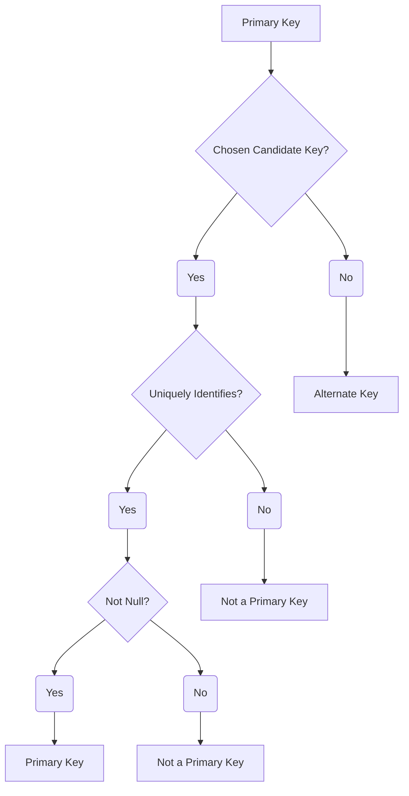

# Definition
Before proceeding, ensure you master [[Candidate_Key]] and [[Composite_Key]].
A **Primary Key** is a [[Candidate_Key]] that is **chosen by the database designer** to uniquely identify each occurrence of an [[Entity_Types]]. It is the main, single identifier for an entity and is used to enforce entity integrity, which states that no primary key value can be null, and all values must be unique. In an Entity-Relationship (ER) Diagram, the attribute(s) forming the primary key are typically underlined. Think of it as the single, official identification number (like a `Passport_Number` or `StudentID`) that is designated to uniquely identify a person or item, even if other forms of identification exist.

# The Mental Model
Imagine a library system where every book has a unique call number. That call number is the **Primary Key**. While books also have titles and authors, the call number is the *chosen*, definitive way the library uses to uniquely identify and locate each specific book.

*Note: This `graph TD` illustrates the criteria for an attribute (or set of attributes) to be designated as a Primary Key, emphasizing its uniqueness, non-nullability, and selection from candidate keys.*

# Context & Framework
### The Family Tree
The [[Primary_Key]] is the cornerstone of unique identification within [[Keys_in_ER_Model]]. It is selected from the set of one or more [[Candidate_Key]]s available for an [[Entity_Types]]. The primary key's importance extends beyond merely identifying records; it also serves as the target for Foreign_Keys (not explicitly in ER but critical in logical design), which are used to establish relationships between different entities. If the primary key comprises multiple attributes, it is known as a [[Composite_Key]]. The decision of which candidate key to elevate to primary key status is a critical design choice, impacting both data integrity and system performance.

# The Mastery Deep Dive
### Opening the Hood: What's Inside?
The selection of a primary key is a crucial design decision due to its implications for data integrity and system functionality. A primary key must adhere to two main rules:
*   **Uniqueness**: Each value for the primary key must be distinct for every occurrence of the entity. No two rows can have the same primary key value.
*   **Non-Nullability (Entity Integrity)**: The primary key cannot contain null values. Every entity occurrence must have a defined primary key value.
These rules ensure that every record is always uniquely identifiable and consistently referenced. For example, in a `Customer` table, `CustomerID` is typically chosen as the primary key. It's unique for each customer, and no customer can exist without a `CustomerID`.

### Spot the Impostor: Addressing its specific selection among candidate keys to be the main identifier.
A common "impostor" scenario involves confusing any unique identifier with the *chosen* primary key. An entity might have several [[Candidate_Key]]s (e.g., `StudentID`, `Social_Security_Number`, `(Email, DateOfBirth)`). While all are unique, only one can be designated as the `Primary_Key`. The others become `Alternate Keys`. The "impostor" is claiming all unique identifiers are primary keys. The critical distinction is the designer's explicit choice for the *main* identifier, which often considers stability, simplicity, and business relevance.

# Constraints & Limitations
### The Devil's Advocate: Why might this be wrong?
While a primary key is vital for unique identification, the choice can sometimes be controversial. Using "natural" primary keys (like `ISBN` for a `Book`) might seem intuitive but can be problematic if the definition of uniqueness changes or if the value is long and complex. Conversely, using "surrogate" primary keys (system-generated IDs like `CustomerID`) is simpler and more stable but lacks inherent meaning. The trade-off is between **semantic meaning and stability**. A natural key offers immediate context but might be prone to business rule changes, while a surrogate key is stable but requires an additional unique index on the natural attribute(s) if unique access by those is needed.

# Significance & Application
Understanding Primary Keys is academically significant as it is a cornerstone of relational database theory and a fundamental concept in data integrity. In the real world, it's an indispensable skill for **Database Designers**, **Developers**, and **Data Modelers**. It is applied in virtually every database to:
*   **Enforce unique identification**: Guarantees that each record is distinct.
*   **Establish relationships**: Forms the target for foreign keys in other tables.
*   **Maintain data integrity**: Ensures non-null and unique values.
*   **Optimize performance**: Often the basis for clustering indexes, speeding up data access.
Correctly defining primary keys is paramount for building robust, consistent, and efficient database systems that accurately reflect business realities.

# The Worked Example
*Test your mastery. Cover the solutions below to test yourself first.*

Consider a simplified online ordering system. The `Order` entity has `OrderID` (a unique system-generated number) and `Order_Date`. The `Customer` entity has `CustomerID` and `Customer_Email` (which is unique for each customer).

### Level 1: The Sanity Check (Verification)
**The Question:** For the `Customer` entity, which attribute would be the most appropriate **Primary_Key**?
> **Solution:** `CustomerID` would be the most appropriate **Primary_Key**.

### Level 2: The Crucible (Mastery & Edge Cases)
**The Scenario:** For the `Order` entity, the designer decides to use `(Order_Date, CustomerID)` as the primary key, assuming a customer will never place more than one order on the same day. However, later, the business rules change, and customers are now allowed to place multiple orders on the same day.
**The Challenge:**
(a) Explain how the original choice of `(Order_Date, CustomerID)` as the primary key for `Order` becomes problematic with the changed business rule.
(b) What type of key is `(Order_Date, CustomerID)` in this problematic scenario?
(c) Propose a more robust primary key for the `Order` entity that can accommodate the new business rule, justifying your choice.
> **Solution:**
> (a) The original choice of `(Order_Date, CustomerID)` as the primary key becomes problematic because it **violates the uniqueness property** of a primary key. With the new business rule allowing customers to place multiple orders on the same day, `(Order_Date, CustomerID)` would no longer uniquely identify each order, as a customer could have two orders with the same date.
> (b) In this problematic scenario, `(Order_Date, CustomerID)` would still be a [[Composite_Key]], but it would no longer be a valid [[Primary_Key]] because it fails the uniqueness constraint.
> (c) A more robust primary key for the `Order` entity would be `OrderID`.
>    *   **Justification:** `OrderID` is described as a "unique system-generated number," which inherently guarantees uniqueness regardless of `Order_Date` or `CustomerID` combinations. It provides a stable, simple, and unambiguous identifier for each order, effectively accommodating the new business rule without modification.

# Key Takeaways
*   A primary key is the chosen candidate key that uniquely identifies each entity occurrence, enforcing entity integrity (unique and non-null values).
*   It serves as the main identifier for an entity, foundational for establishing relationships and maintaining data consistency.
*   The selection of a primary key is a critical design decision, balancing uniqueness, stability, and business relevance, with significant implications for database integrity and performance.

# Knowledge Graph Connections
| Concept                     | Connection / Relationship                                                                   |
| :
-------------------------- | :
------------------------------------------------------------------------------------------ |
| [[Keys_in_ER_Model]]        | This is the chosen, definitive unique identifier for an entity.                               |
| [[Candidate_Key]]           | The primary key is selected from the set of these potential unique identifiers.             |
| [[Composite_Key]]           | If the primary key consists of multiple attributes, it is referred to as this.              |
| [[Entity_Types]]            | The primary key uniquely identifies individual occurrences within these classifications.      |
| Data_Integrity          | The primary key is fundamental for enforcing this crucial database property.                  |
| [[Entity_Relationship_ER_Model]] | The primary key is a cornerstone of representing entity identity within the ER model.         |
---