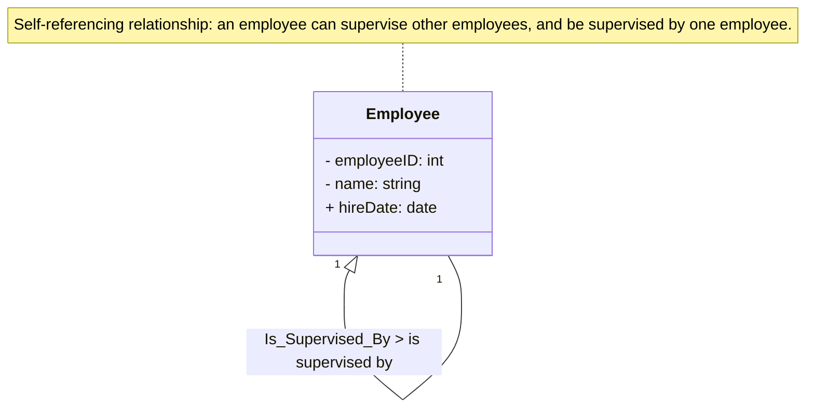

# Definition
Before proceeding, ensure you master [[Relationship_Types]] and [[Degree_of_a_Relationship]].
A **Recursive Relationship** is a special type of [[Relationship_Types]] where the **same [[Entity_Types]] participates more than once** in the relationship, playing different roles. It's essentially a unary relationship (degree one) because only one entity type is involved, but occurrences of that entity type relate to other occurrences of the *same* entity type. To clarify the meaning of each participation, **role names** are often assigned. A classic example is `Employee Supervises Employee`, where one employee acts as the `Supervisor` and another as the `Supervisee`. Think of a single person having a "best friend" relationship with another person: both are "persons," but one is the "best friend" and the other is "their best friend."

# The Mental Model
Imagine a mirror reflecting the same person, but in two different hats – one person is the "boss," and the other is the "employee." The **Recursive Relationship** is that mirror, showing the same entity type (`Person`) in two distinct roles (`Boss`, `Employee`) within a single relationship.

*Note: This `classDiagram` illustrates a recursive relationship for the `Employee` entity, showing how employees can supervise other employees and be supervised themselves. The role names `Supervises` and `Is_Supervised_By` clarify the direction and context of the self-association.*

# Context & Framework
### How the Parts Talk to Each Other
Within the realm of [[Relationship_Types]], recursive relationships demonstrate a sophisticated form of self-referential interaction. They are a specific instance of a **unary relationship**, meaning their [[Degree_of_a_Relationship]] is one. The crucial aspect is the assignment of **role names** (e.g., `Supervisor`, `Supervisee`) to each participation, which explicitly defines the distinct function an entity occurrence plays when relating to another occurrence of the same entity type. This mechanism ensures clarity and avoids ambiguity in modeling hierarchical or network-like structures within a single entity set.

# The Mastery Deep Dive
### The Exploded View
A recursive relationship, despite involving only one entity type, can be viewed as having two distinct "sides" or "participations," each playing a different role.
*   **Role 1 (e.g., Supervisor)**: The entity instance initiating the relationship or acting in a primary capacity.
*   **Role 2 (e.g., Supervisee)**: The entity instance receiving the relationship or acting in a secondary capacity.
For the `Employee Supervises Employee` example, `Employee A` (playing the `Supervisor` role) relates to `Employee B` (playing the `Supervisee` role). Both `Employee A` and `Employee B` are instances of the `Employee` entity type, but their roles define their interaction within that specific relationship occurrence. The relationship itself has its own multiplicity constraints, just like any other relationship.

### The Translator: Hacker Slang to Exam Terms
When you're describing a hierarchical structure where "someone is above someone else" (Hacker Slang), in the context of database design, this translates to a `Recursive Relationship` (Exam Term). The "someone above" becomes the `Supervisor` (Role Name), and the "someone else" becomes the `Supervisee` (Role Name). This formalization ensures that the hierarchy is clearly understood and correctly implemented in the database schema.

# Constraints & Limitations
### The Hard Choice: Option A or Option B?
When modeling hierarchies, a designer might face the choice between a recursive relationship (using a foreign key that references the primary key of the same table) or an alternative approach like a separate "parent-child" table or even path enumeration techniques (for very deep hierarchies). The trade-off is between **simplicity for direct relationships** (recursive foreign key) versus **ease of querying complex paths** (separate tables or path enumeration). Simple hierarchies are best with recursive relationships. Very deep or frequently traversed hierarchies might benefit from more complex, but optimized, alternatives to avoid performance issues with self-joins.

# Significance & Application
Recursive Relationships are academically significant as they demonstrate the flexibility of the ER model in representing complex, self-referential data structures. In the real world, it's a critical skill for **Database Designers** and **Application Developers** working with hierarchical data. Common applications include modeling:
*   **Organizational hierarchies**: `Employee Supervises Employee`.
*   **Bill-of-materials**: `Part Comprises Part` (e.g., a car consists of engines, and an engine consists of cylinders).
*   **Family trees**: `Person Is_Child_Of Person`.
Correctly implementing recursive relationships ensures that hierarchical data is stored efficiently and can be queried effectively, supporting features like reporting lines or product breakdowns.

# The Worked Example
*Test your mastery. Cover the solutions below to test yourself first.*

Consider a social media platform where users can follow other users. A user can follow many others, and be followed by many others.

### Level 1: The Sanity Check (Verification)
**The Question:** For the social media platform, if we model `User` as an entity, would the `Follows` relationship (where a user follows another user) be a recursive relationship?
> **Solution:** Yes, the `Follows` relationship would be a recursive relationship.

### Level 2: The Crucible (Mastery & Edge Cases)
**The Scenario:** A designer wants to model a `Friend` relationship between `Person` entities. They define a recursive relationship named `Friend_Of` where one `Person` plays the `Initiator` role and the other plays the `Recipient` role. However, `Friend` relationships are generally symmetric (if A is a friend of B, B is a friend of A).
**The Challenge:**
(a) Explain why using distinct `Initiator` and `Recipient` role names for a symmetric relationship like `Friend` might be conceptually redundant or problematic.
(b) Describe how a symmetric recursive relationship (like `Friend_Of`) should ideally be modeled in an ER diagram to reflect its nature.
(c) Suggest a scenario where distinct role names *would* be appropriate for a recursive relationship between `Person` entities.
> **Solution:**
> (a) Using distinct `Initiator` and `Recipient` role names for a symmetric relationship like `Friend` is conceptually redundant because the relationship inherently implies mutual participation without a directional bias. If A is a friend of B, the `Initiator` (`A`) and `Recipient` (`B`) roles are interchangeable, and forcing a distinction adds unnecessary complexity and potential for misinterpretation without capturing additional semantic meaning.
> (b) A symmetric recursive relationship should ideally be modeled by simply defining the relationship type (`Friend_Of`) between the `Person` entity and itself, often **without explicit role names** if the roles are truly interchangeable. The multiplicity would reflect the many-to-many nature (e.g., `Person` `*--*` `Friend_Of` `Person`).
> (c) Distinct role names *would* be appropriate for a recursive relationship between `Person` entities in an **asymmetric** context, such as `Mentors` (where `Person A` plays `Mentor` and `Person B` plays `Mentee`), or `Is_Sibling_Of` (where `Person A` plays `Older_Sibling` and `Person B` plays `Younger_Sibling`), if such a distinction is meaningful for the database.

# Key Takeaways
*   A recursive relationship is a unary relationship where the same entity type participates multiple times, playing different roles.
*   Role names are crucial for clarifying the specific function each entity occurrence plays within the self-referential association.
*   They are essential for modeling hierarchical or network-like structures within a single entity set, ensuring accurate representation of complex relationships.

# Knowledge Graph Connections
| Concept                     | Connection / Relationship                                                                   |
| :
-------------------------- | :
------------------------------------------------------------------------------------------ |
| [[Relationship_Types]]      | This is a specific type of relationship that involves a single entity type.                   |
| [[Degree_of_a_Relationship]] | This type of relationship inherently has a degree of one (unary).                             |
| [[Entity_Types]]            | The same entity type participates multiple times in this self-referential relationship.       |
| [[Structural_Constraints_in_ER_Model]] | Multiplicity constraints apply to each role within a recursive relationship.                |
| [[Entity_Relationship_ER_Model]] | This is a key construct within the ER model for representing hierarchies and self-associations. |
---